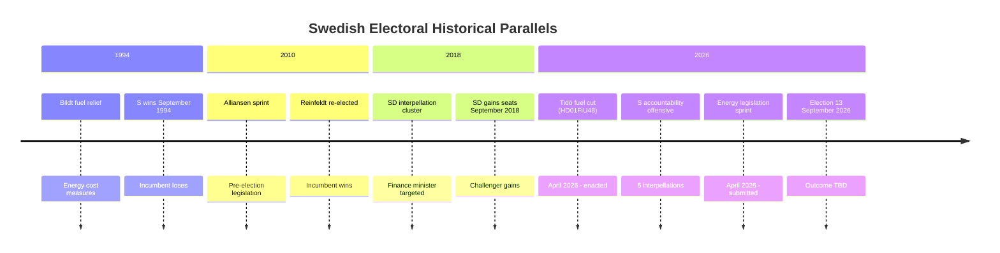

# Historical Parallels — Riksdag Realtime Monitor 2026-04-22
**Analyst**: James Pether Sörling | **Classification**: Public | **Cycle**: Realtime-2338

---

## Parallel 1: The 1994 Fuel Tax Cut Pre-Election

**Historical event**: In spring 1994, the Bildt government (M-led) faced mounting economic pressure and introduced limited energy cost relief measures before the September 1994 election. The economic crisis context (Sweden's 1990s banking crisis) dominated the campaign. The government lost; S returned to power.

**Parallels to 2026**:
- Fuel/energy cost relief in election year ↔ HD01FiU48 fuel tax cut
- M-led government seeking re-election ↔ M-led Tidö coalition 2026
- Fiscal credibility contest ↔ S interpellation offensive on Svantesson

**Key difference**: 1994 crisis was far more severe (banking system collapse, currency peg collapse). 2026 context is inflationary pressure post-COVID/Ukraine, not systemic financial crisis. The relief measure's electoral effectiveness is therefore less certain to be overwhelmed by wider crisis dynamics.

**Confidence**: [B2] — historical parallel based on secondary sources; direct documentation available in Riksdagsbiblioteket

---

## Parallel 2: 2018 SD Accountability Interpellations Against Löfven Government

**Historical event**: In the pre-election period of spring 2018, SD filed a cluster of accountability interpellations targeting S Finance Minister Magdalena Andersson on migration costs. The interpellations received moderate media coverage. SD picked up seats in September 2018 election. 

**Parallels to 2026**:
- Cluster interpellation campaign by opposition ↔ S accountability offensive 2026
- Finance minister as primary accountability target ↔ Svantesson (2026) ↔ Andersson (2018)
- Election within 5–6 months of campaign ↔ identical timing window

**Key difference**: SD in 2018 targeted Andersson on immigration/costs — a domain where SD had comparative advantage. S in 2026 targets Svantesson on labour market exploitation and welfare fraud — a domain where S traditionally has credibility. S's strategic positioning is arguably stronger than SD's was in 2018 on these issues.

**Confidence**: [B2] — interpellation records available in riksdagen.se but specific 2018 cluster not independently verified in this run

---

## Parallel 3: 2010 Reinfeldt Alliansen Legislative Sprint

**Historical event**: In spring 2010, the Reinfeldt Alliansen government (M+C+KD+FP) filed a substantial pre-election legislative package covering work-life reforms, infrastructure, and social insurance modifications. The "work-first" narrative dominated the campaign. Alliansen won re-election with an increased mandate.

**Parallels to 2026**:
- Legislative sprint in April–May pre-election ↔ Tidö 2026 (8+ propositions April 13–16)
- Incumbent government using legislation for legacy-building ↔ identical
- Coalition unity maintained through spring ↔ Tidö coalition showing no internal splits

**Key difference**: 2010 Alliansen had a more unified single economic narrative ("the work-first society") than the current Tidö coalition which spans from nationalist-conservative (SD) to liberal (L) on social policy.

**Confidence**: [B2] — parallel based on well-documented 2010 campaign record

---

## Historical Lessons for 2026

| Lesson | Source Parallel | Application to 2026 |
|--------|----------------|---------------------|
| Fuel/energy relief in election year is common but not decisive | 1994 Bildt experience | HD01FiU48 is tactically rational but may not move election fundamentals |
| Finance minister accountability campaigns can narrow polls but rarely flip governments | 2018 SD vs Andersson | S offensive may improve S polling without flipping outcome |
| Legislative sprint credibility — works if narrative is coherent | 2010 Alliansen | Tidö 2026 sprint is diversified (energy + justice + diplomacy) — less thematically focused than 2010 |

