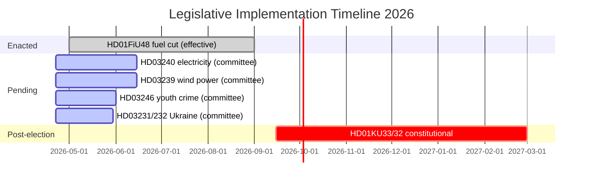

# Implementation Feasibility Analysis — Riksdag Realtime Monitor 2026-04-22
**Analyst**: James Pether Sörling | **Classification**: Public | **Cycle**: Realtime-2338

---

## Feasibility Assessments

### 1. HD01FiU48 — Extra Budget / Fuel Tax Cut (Effective 2026-05-01)

**Implementation status**: ENACTED (Riksdag vote 2026-04-21) [A1]
**Technical feasibility**: HIGH — fuel tax adjustment via Energiskattelagen. Skatteverket has existing mechanisms for overnight tax rate change.
**Operational risk**: LOW — logistics pre-notified to fuel retailers; automatic pump price adjustment follows normal supplier pricing cycle
**Timeline risk**: VERY LOW — law takes effect 2026-05-01, 10 days after enactment
**Political risk**: LOW for implementation; HIGH for attribution (opposition will challenge whether fuel prices actually drop at pump)
**GDPR/legal risk**: NONE — straightforward tax law amendment
**Residual risk**: Pump price lag (retailers adjust prices weekly not daily; 82 öre saving may be invisible in first week post-May 1) → media expectation management needed

### 2. HD03240 — Nya lagar om elsystemet (Electricity System Reform)

**Implementation status**: SUBMITTED to Riksdag 2026-04-14; awaiting committee report [A1]
**Technical feasibility**: MODERATE — systemic reform of electricity market regulation requires Energimyndigheten implementation framework
**Operational risk**: MODERATE — new market rules require grid operator coordination (Svenska kraftnät)
**Timeline risk**: MODERATE — committee report needed by June 2026; Riksdag vote before summer recess; if deferred to autumn, implementation begins after election under (possibly different) government
**Political risk**: LOW-MODERATE — energy system reform has broad support; SD's nuclear preference adds complexity but does not block passage
**Residual risk**: Election calendar risk — reform adopted May/June but implemented September+ means a different government may administer it

### 3. HD10444–HD10446 Interpellation Accountability Chain

**Implementation feasibility**: N/A — interpellations are accountability instruments, not legislation
**Response feasibility**: Svantesson must provide substantive answers to all 3 within the standard interpellation debate window (approximately 2026-04-28 to 2026-05-05)
**Preparation risk**: HIGH — three separate domains (employer contributions, social dumping, false death records) require cross-ministry briefing in 6 days
**Procedural timeline**: Interpellation filed → speaker schedules debate → minister answers → follow-up questions → debate ends
**Risk of non-answer**: LOW — Swedish parliamentary convention requires minister to engage substantively; refusal to answer is a political cost signal

### 4. HD03246 — Unga lagöverträdare (Youth Offender Sentencing Reform)

**Implementation status**: SUBMITTED to Riksdag 2026-04-16 [A1]
**Technical feasibility**: HIGH — judicial reform with clear Domstolsverket implementation pathway
**Timeline risk**: MODERATE — committee review Justitieutskottet; expected vote May/June 2026
**Social risk**: MODERATE — reforms to juvenile justice generate civil society pushback; youth rights organisations active

---

## Feasibility Risk Summary

| Legislation | Feasibility | Timeline Risk | Political Risk | Overall |
|-----------|------------|--------------|---------------|---------|
| HD01FiU48 fuel cut | HIGH | VERY LOW | LOW | 🟢 Green |
| HD03240 electricity | MODERATE | MODERATE | LOW | 🟡 Amber |
| HD03239 wind power | MODERATE | MODERATE | LOW-MOD | 🟡 Amber |
| HD03246 youth crime | HIGH | MODERATE | MODERATE | 🟡 Amber |
| HD03231/232 Ukraine | HIGH | LOW | LOW | 🟢 Green |
| HD01KU33/32 constitutional | N/A (2nd reading post-election) | HIGH | LOW-MOD | 🔵 Deferred |

