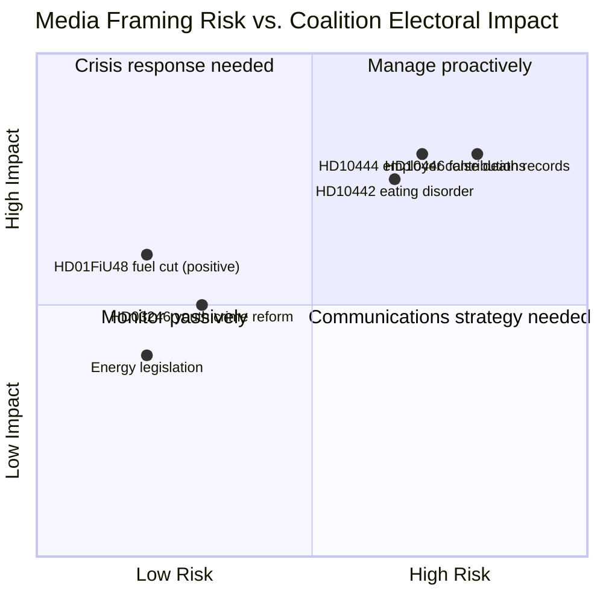

# Media Framing Analysis — Riksdag Realtime Monitor 2026-04-22
**Analyst**: James Pether Sörling | **Classification**: Public | **Cycle**: Realtime-2338

---

## Expected Framing by Political Actor

### Government/Coalition Framing
**Primary frame**: "Delivery-focused government protecting Swedish households" — HD01FiU48 fuel cut as headline, energy legislation as long-term security
**Supporting narrative**: "S is engaging in pre-election theatre while we govern"
**Vulnerability**: HD10444 employer contributions to social dumping — if Svantesson cannot provide factual rebuttal, "government enables wage exploitation" frame becomes credible
**Tone**: "Responsible fiscal management, record delivery"
**Expected media vehicles**: Moderate sympathetic outlets (Expressen, SvD), governmental press conferences

### S (Socialdemokraterna) Framing
**Primary frame**: "Coalition ministers fail to protect Swedish workers and vulnerable citizens"
**Sub-frames**:
- HD10444: "Svantesson enables tax-funded social dumping" (employer contribution angle)
- HD10445: "Slottner allows municipal social dumping of Sweden's most vulnerable"
- HD10446: "Carlson's ministry falsely declares citizens dead" (HD10446 — death record scandal)
- HD10442: "Svantesson ignores eating disorder court case costing women their lives"
**Tone**: Accountability, moral outrage (carefully calibrated to avoid "too strident")
**Expected media vehicles**: Aftonbladet, LO-Tidningen, S-aligned regional press

### SD (Sverigedemokraterna) Framing
**Primary frame**: Unlikely to prominently cover S interpellations (different accountability axis). Will focus on fuel tax cut SUCCESS (populist energy nationalism) and youth crime reform (HD03246).
**Expected media vehicles**: Avpixlat-adjacent outlets, social media

### MP (Miljöpartiet) Framing
**Primary frame**: "Fuel tax cut is climate regression; coalition abandons Sweden's climate commitments"
**Sub-frame**: Energy legislation (HD03239 vindkraft) as insufficient half-measure
**Expected media vehicles**: Miljömagasinet, urban progressive press

### V (Vänsterpartiet) Framing
**Primary frame**: "Government cuts fuel tax instead of investing in public transport — wrong priorities for working class"
**Sub-frame**: Social dumping (aligns with HD10443/HD10444) — V's traditional labour market accountability frame
**Expected media vehicles**: Flamman, Proletären, social media

---

## Expected Mainstream Media Framing (Swedish Press Outlets)

| Outlet | Expected Frame | Based on past coverage patterns |
|--------|---------------|--------------------------------|
| Aftonbladet | Accountability-first: Svantesson interpellations lead | S-sympathetic tabloid; likely HD10444/10442 double spread [B2] |
| Expressen | Balanced accountability with coalition defence | Centre-liberal; will examine both interpellations and coalition's fuel tax delivery [B2] |
| Dagens Nyheter (DN) | Analysis: "Is this a turning point?" | Quality broadsheet; likely scenario analysis rather than pure accountability [B2] |
| SVT Nyheter | Public interest neutral: all 4 interpellations reported | Public broadcaster; procedural coverage of all parties [B2] |
| SvD | Business-framing: HD01FiU48 economic analysis | Conservative-leaning; will examine fiscal impact of fuel cut [B2] |

---

## Framing Risk Matrix

