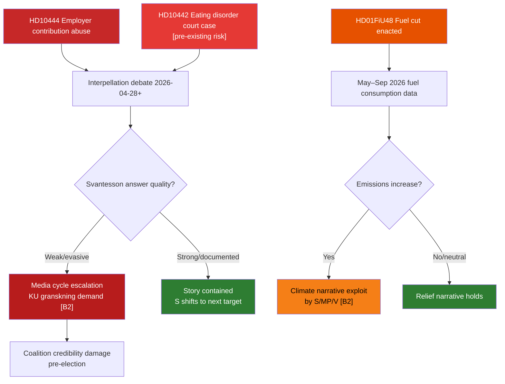

# Risk Assessment — Riksdag Realtime Monitor 2026-04-22
**Analyst**: James Pether Sörling | **Methodology**: political-risk-methodology.md
**Classification**: Public | **Cycle**: Realtime-2338

---

## Risk Register (5 Dimensions × 5 Items)

### Dimension Definitions
- **L**: Likelihood (1–5)
- **I**: Impact (1–5)
- **T**: Timing (1=imminent, 5=long-term)
- **R**: Reversibility (1=irreversible, 5=easily reversed)
- **Score**: L × I (adjusted for T, R)

---

## Risk 1 — Interpellation Debate Escalation to Ministerial Crisis [HD10444/HD10442]

**Description**: If Finance Minister Svantesson delivers a weak or factually challenged answer to HD10444 (employer contributions) or HD10442 (eating disorders court case) during the parliamentary debate (expected 2026-04-28–05-05), the accountability story will compound. Given the court vindication of Region Stockholm in HD10442 and documented Aftonbladet evidence for HD10444, the evidentiary burden on Svantesson is high.

| L | I | T | R | Score | Admiralty |
|---|---|---|---|-------|-----------|
| 3 | 4 | 1 | 3 | **12** | [B2] |

**Response**: Monitor debate scheduling; prepare analytical brief on each interpellation text vs. prior ministerial statements.

**Cascading risk**: Parliamentary demand for Riksdag Konstitutionsutskott review of ministerial statements → constitutional accountability track (possible post-election).

---

## Risk 2 — Fuel Tax Cut Backfire: Climate Credibility Collapse [HD01FiU48]

**Description**: The enacted 82 öre/litre fuel tax cut (HD01FiU48, riksdagen.se/dokument/HD01FiU48) reduces Sweden's energy tax to EU minimum floor. If spring/summer fuel consumption increases significantly and emissions data shows uptick, the opposition will have a documented case that the government prioritised electoral cost relief over climate commitments. Particularly damaging if COP or EU review coincides.

| L | I | T | R | Score | Admiralty |
|---|---|---|---|-------|-----------|
| 3 | 3 | 2 | 2 | **9** | [A1] |

**Response**: Track fuel consumption data from Trafikverket and SCB fuel statistics post-1 May 2026.

---

## Risk 3 — Social Dumping Litigation / Human Rights Escalation [HD10443]

**Description**: Interpellation HD10443 (riksdagen.se/dokument/HD10443) documents systematic municipal social dumping — transferring vulnerable residents between municipalities without consent. If civil society organizations or the Justitieombudsman (JO) initiate formal complaints, the government faces a dual legislative-judicial track crisis.

| L | I | T | R | Score | Admiralty |
|---|---|---|---|-------|-----------|
| 2 | 4 | 2 | 2 | **8** | [B2] |

**Response**: Monitor JO diariet for new incoming complaints on kommunal social dumping; check SOU 2025 docket for related investigations.

---

## Risk 4 — Stockholm Housing Segregation Escalation [HD10445]

**Description**: Failure to advance SOU 2024:38 recommendations on municipal pre-emption rights for key suburban properties (HD10445, riksdagen.se/dokument/HD10445) creates a structural risk: if a private equity or speculative investor acquires one of the named centre properties (Sätra, Vårberg, Rågsved) before the election, the political fallout for the government's urban policy will be acute.

| L | I | T | R | Score | Admiralty |
|---|---|---|---|-------|-----------|
| 2 | 3 | 2 | 2 | **6** | [B2] |

**Response**: Monitor property transaction records via Lantmäteriet for named suburban centres; track SOU 2024:38 implementation status.

---

## Risk 5 — Energy Law Delay: Electricity System Legislation [HD03240]

**Description**: The new electricity system laws (HD03240, riksdagen.se/dokument/HD03240, submitted 2026-04-14 by Climate and Business Dept.) are scheduled for committee review. If the legislative timeline slips past the September 2026 election, the successor government (of any composition) will inherit an unresolved electricity system framework — creating regulatory uncertainty for grid investments.

| L | I | T | R | Score | Admiralty |
|---|---|---|---|-------|-----------|
| 2 | 4 | 3 | 3 | **8** | [A2] |

**Response**: Monitor NMU/KNU committee scheduling for HD03240 after submission.

---

## Cascading Risk Chains

## Posterior Probability Estimates

| Risk | P(Trigger Event) | P(Escalation|Trigger) | P(Full escalation) |
|------|-----------------|----------------------|-------------------|
| R1: Ministerial debate escalation | 0.40 | 0.45 | **0.18** |
| R2: Fuel cut climate backfire | 0.35 | 0.50 | **0.18** |
| R3: Social dumping litigation | 0.25 | 0.40 | **0.10** |
| R4: Stockholm housing incident | 0.20 | 0.40 | **0.08** |
| R5: Energy law delay | 0.30 | 0.35 | **0.11** |
