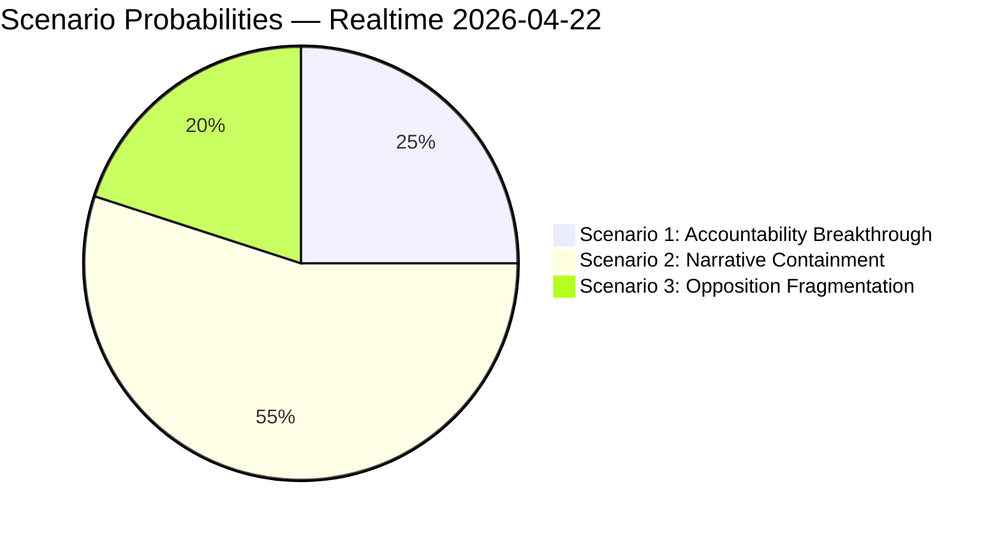

# Scenario Analysis — Riksdag Realtime Monitor 2026-04-22
**Analyst**: James Pether Sörling | **Methodology**: scenario-analysis.md
**Classification**: Public | **Cycle**: Realtime-2338

---

## Scenario Framework
Three scenarios for the political trajectory of the S accountability offensive and its impact on Election 2026, based on the interpellation cluster filed 2026-04-22.

---

## Scenario 1: "Accountability Breakthrough" (Probability: 25%)

**Description**: Finance Minister Svantesson provides a factually challenged or evasive answer to one or more of the three interpellations targeting her (HD10444 employer contributions, HD10442 eating disorder court case, HD10446 false death declarations). Media coverage escalates to a sustained news cycle over 10+ days. KU constitutional review petition filed by S group.

**Leading indicators**:
- Svantesson avoids direct factual answer on HD10442 court case [watch 2026-04-28+]
- Aftonbladet publishes follow-up investigation naming specific retailers (HD10444)
- JO receives new complaint on social dumping (HD10443)

**Election impact**: HIGH negative for M/coalition. Fiscal competence narrative damaged. S gains 1–3 percentage points in polls (within polling error but directionally significant).

**Cascade**: Coalition considers emergency response (press conference, Riksdag statement); possible M party executive communication strategy revision.

---

## Scenario 2: "Narrative Containment" (Probability: 55%)

**Description**: Finance Minister Svantesson delivers measured, factually defended answers to all three interpellations. Media coverage is routine (one news cycle, 3–5 days). The coalition successfully pivots to the fuel tax relief implementation (2026-05-01) and energy legislation agenda (HD03240, HD03239). The S accountability offensive scores tactical points but does not produce a sustained narrative advantage.

**Leading indicators**:
- Government prepares detailed written responses before debate
- Fuel prices visibly drop at pump post-May 1 (media focus shifts to consumer benefit)
- Energy legislation committee hearings begin (HD03240)

**Election impact**: NEUTRAL. Status quo maintained. Both S and coalition activate base supporters but neither gains net new voters from interpellation cycle.

**Cascade**: S shifts to next accountability target (possibly housing segregation HD10445, or education/healthcare domains).

---

## Scenario 3: "Opposition Fragmentation" (Probability: 20%)

**Description**: The S accountability offensive backfires. The government points to enacted legislation (HD01FiU48 fuel relief, HD03246 youth crime, HD03244 data interoperability) as proof of delivery. Media frames the interpellations as pre-election theatre. Centerpartiet (C) explicitly distances itself from S on deportation (HD024095 amending rather than rejecting prop. 2025/26:235) — fracturing the "alternative bloc" narrative.

**Leading indicators**:
- C publicly praises elements of government's deportation reform (HD03235) while seeking amendments
- Fuel price cut generates positive consumer media coverage post-May 1
- HD10444 answer cites Finansinspektionen/Tillväxtverket data contradicting Aftonbladet report

**Election impact**: POSITIVE for coalition. S bloc cohesion weakened. C positioned as responsible alternative, potentially in coalition talks regardless of who wins.

**Cascade**: S internal pressure to find stronger accountability angle; possible leadership communication tension within S parliamentary group.

---

## Scenario Probability Distribution

## Leading Indicator Matrix

| Indicator | Scenario 1 | Scenario 2 | Scenario 3 | Watch date |
|-----------|------------|------------|------------|------------|
| Svantesson interpellation answer quality | Weak/evasive | Measured | Strong + deflects | 2026-04-28 |
| Aftonbladet follow-up on HD10444 | Published + names retailers | No follow-up | Aftonbladet retracts/corrects | 2026-04-25–05-05 |
| Fuel prices at pump post-May 1 | No visible drop | Moderate drop | Significant drop, consumer praise | 2026-05-02 |
| C party statement on HD024095 | Aligns with S | Silent | Praises government approach | 2026-04-25 |
| Media framing (SVT/DN/Aftonbladet) | "Crisis" framing | "Politics as usual" | "S overreach" framing | Daily from 2026-04-28 |
