# Significance Scoring — Riksdag Realtime Monitor 2026-04-22 23:38
**Analyst**: James Pether Sörling | **Methodology**: ai-driven-analysis-guide.md, significance-scoring.md
**Classification**: Public | **Riksmöte**: 2025/26

---

## Scoring Framework
- **D** (Depth/Impact): 1–10 scale on policy substance and magnitude
- **I** (Intelligence Value): 1–10 scale on analytical/predictive utility
- **W** (Urgency/Timeliness): 1–10 scale on time-sensitivity
- **Tier**: L1 Surface / L2 Strategic / L2+ Priority / L3 Intelligence-grade

---

## 1. Ranked Significance Table

| Rank | dok_id | Title | D | I | W | **DIW** | Tier | Admiralty |
|------|--------|-------|---|---|---|---------|------|-----------|
| 1 | HD01FiU48 | Extra ändringsbudget 2026 — bränsle/el/gas (ENACTED) | 9 | 9 | 8 | **8.7** | L3 | [A1] |
| 2 | HD10444 | Arbetsgivaravgift abuse — Svantesson interpellation | 9 | 9 | 9 | **9.0** | L3 | [A2] |
| 3 | HD10443 | Social dumpning mellan kommuner — Slottner | 8 | 8 | 9 | **8.3** | L3 | [A2] |
| 4 | HD10445 | Kommunal förköpsrätt — housing pre-emption rights | 8 | 7 | 9 | **8.0** | L2+ | [A2] |
| 5 | HD03240 | Nya lagar om elsystemet | 8 | 8 | 7 | **7.7** | L2+ | [A1] |
| 6 | HD03232 | Sverige + Ukraine skadeståndskommission | 8 | 7 | 8 | **7.7** | L2+ | [A1] |
| 7 | HD03231 | Sverige + aggressionstribunalen för Ukraina | 8 | 7 | 8 | **7.7** | L2+ | [A1] |
| 8 | HD10446 | Felaktiga dödförklaringar — Svantesson | 7 | 7 | 7 | **7.0** | L2 | [A2] |
| 9 | HD03246 | Skärpta regler för unga lagöverträdare | 7 | 7 | 7 | **7.0** | L2 | [A1] |
| 10 | HD01KU33 | Insyn i handlingar vid husrannsakan (constitution, first reading) | 7 | 7 | 6 | **6.7** | L2 | [A1] |
| 11 | HD01KU32 | Tillgänglighetskrav för vissa medier (constitution, first reading) | 6 | 7 | 6 | **6.3** | L2 | [A1] |
| 12 | HD03242 | Aktivt skogsbruk — regulatory reform | 6 | 6 | 6 | **6.0** | L2 | [A1] |
| 13 | HD03244 | Datainteroperabilitet — public sector | 6 | 6 | 5 | **5.7** | L1 | [A1] |
| 14 | HD024090 | Utvisning — V motion (full rejection) | 6 | 6 | 5 | **5.7** | L1 | [A1] |
| 15 | HD024098 | Drivmedel — MP motion (reject fuel cut) | 6 | 6 | 5 | **5.7** | L1 | [A1] |

---

## 2. Sensitivity Analysis

**High-sensitivity items (DIW ≥ 8.0 with electoral impact)**:
- HD01FiU48 [A1]: Enacted — fiscal relief narrative is now law. Electoral impact: S/V/MP LOSE this battle in 2026 pre-election. Government gains summer relief narrative.
- HD10444 [A2]: Aftonbladet investigation on employer contribution abuse. If S obtains a weak or evasive Svantesson answer in the debate, this becomes a media cycle driver.
- HD10443 [A2]: Social dumping — municipal transfer of vulnerable populations. Human rights framing by S could generate media traction.

**Uncertainty flags**:
- HD10442 (eating disorder court case) present in interpellations sibling but NOT yet in today's new filings — it was filed 2026-04-21. Admiralty [A1-confirmed by sibling analysis] but excluded from today's new documents list.

---

## 3. DIW Rank Diagram

```mermaid
gantt
    title DIW Scores — Realtime Monitor 2026-04-22
    dateFormat X
    axisFormat %s
    section L3 Intelligence-grade
    HD10444 S attacks Svantesson/arbetsgivaravgift [A2] :done, 0, 9
    HD01FiU48 Extra budget enacted [A1] :done, 0, 87
    section L2+ Priority
    HD10443 Social dumpning [A2] :active, 0, 83
    HD10445 Housing pre-emption [A2] :active, 0, 80
    HD03240 Nya lagar om elsystemet [A1] :active, 0, 77
    HD03232 Ukraine skadeståndskomm. [A1] :active, 0, 77
    HD03231 Aggressionstribunalen [A1] :active, 0, 77
    section L2 Strategic
    HD10446 False death declarations [A2] :crit, 0, 70
    HD03246 Unga lagöverträdare [A1] :crit, 0, 70
    HD01KU33 Husrannsakan secrecy [A1] :crit, 0, 67

```

---

## 4. Top Forward Triggers (Significance Decay)

| dok_id | Significance Decay Date | Trigger Event |
|--------|------------------------|---------------|
| HD10444 | 2026-04-28 | Interpellation debate — Svantesson answer |
| HD10443 | 2026-04-29 | Interpellation debate — Slottner answer |
| HD10445 | 2026-04-30 | Interpellation debate — Carlson answer |
| HD01FiU48 | 2026-05-01 | Fuel tax cut takes effect — petrol prices at pump |
| HD03240 | 2026-06-01 | El-system law enters parliamentary committee |
