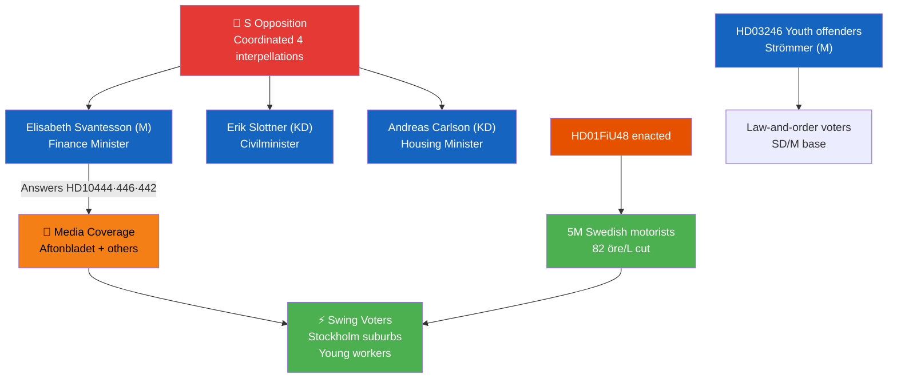

# Stakeholder Perspectives — Riksdag Realtime Monitor 2026-04-22
**Analyst**: James Pether Sörling | **Methodology**: stakeholder-impact.md
**Classification**: Public | **Cycle**: Realtime-2338

---

## 6-Lens Stakeholder Matrix

### Lens 1: Government Coalition (Tidö Bloc)

| Actor | Role | Impact | Position |
|-------|------|--------|----------|
| Elisabeth Svantesson (M) | Finance Minister | HIGH NEGATIVE | Defending three simultaneous interpellations; managing fiscal + accountability narrative |
| Andreas Carlson (KD) | Infrastructure/Housing Minister | MEDIUM NEGATIVE | HD10445 forces public accounting on SOU 2024:38 non-implementation |
| Erik Slottner (KD) | Civilminister | MEDIUM NEGATIVE | HD10443 forces answer on municipal social dumping practices |
| Gunnar Strömmer (M) | Justice Minister | NEUTRAL-POSITIVE | HD03246 (youth offenders) strengthens his law-and-order record |
| Johan Britz (KD/L) | Climate & Energy Minister | MEDIUM | HD03240 (electricity laws), HD03239 (wind power) are his core delivery |
| Lotta Edholm (L) | Acting PM (April) | NEUTRAL | Signed HD03240 — positioned as energy competence |

### Lens 2: Opposition Parties

| Actor | Role | Impact | Position |
|-------|------|--------|----------|
| Magdalena Andersson (S) | Opposition Leader | POSITIVE | S accountability strategy generates election material |
| Jonathan Svensson (S) | MP, HD10444 author | ACTIVE | Executing employer contribution investigation angle |
| Markus Kallifatides (S) | MP, HD10445/HD10442 | ACTIVE | Two-pronged housing + healthcare accountability attack |
| Peder Björk (S) | MP, HD10443 author | ACTIVE | Social welfare accountability angle |
| Nooshi Dadgostar (V) | V leader | POSITIVE | V motion HD024092 positions V as climate-social alternative |
| Janine Alm Ericson (MP) | MP HD024098 | POSITIVE | MP framing fuel cut as climate retreat |

### Lens 3: Directly Affected Citizens/Groups

| Group | Impact | Admiralty |
|-------|--------|-----------|
| Swedish motorists (~5 million) | POSITIVE (82 öre/L fuel cut from May 1) | [A1] HD01FiU48 enacted |
| Stockholm suburban residents (Sätra, Vårberg, Rågsved) | NEGATIVE (pre-emption rights not advanced) | [B2] HD10445 |
| Young workers (employer contribution reduction beneficiaries) | NEGATIVE if exploitation confirmed | [B2] HD10444 |
| Municipal welfare recipients (social dumping victims) | NEGATIVE (transferral without consent documented) | [B2] HD10443 |
| ~30 citizens/year wrongly declared dead | NEGATIVE (Skatteverket failure ongoing) | [A2] HD10446 |

### Lens 4: Institutional Actors

| Institution | Position | Stakes |
|-------------|----------|--------|
| Skatteverket | Under scrutiny | HD10446 false death declarations (~30/year admitted by Svantesson) |
| Kommunförbundet (SKR) | Watching closely | HD10443 social dumping creates inter-municipal tension |
| Riksrevisionen | Active | HD01MJU21 (agriculture climate audit) ongoing; HD01CU42 (dödsbon) laid to table |
| JO (Justitieombudsman) | Potential | Social dumping (HD10443) could attract JO complaint if interpellation reveals systematic violations |
| Lantmäteriet | Active | HD01CU27 (identity at land registration) strengthens registration controls |

### Lens 5: Business/Employer Sector

| Sector | Impact | Admiralty |
|--------|--------|-----------|
| Swedish retailers (named in Aftonbladet investigation) | NEGATIVE (HD10444 accountability pressure) | [B2] |
| Energy sector (electricity producers) | POSITIVE (HD03240 new framework) | [A1] |
| Wind power developers | POSITIVE/MIXED (HD03239 revenue sharing mandates) | [A1] |
| Forestry/Timber sector | POSITIVE (HD03242 clearer active forestry rules) | [A1] |
| Arms manufacturers | MONITORING (HD024091/096 motions; policy not changed) | [B2] |

### Lens 6: International/EU Context

| Actor | Impact | Admiralty |
|-------|--------|-----------|
| Ukraine government | POSITIVE (HD03231 + HD03232 Sweden joins tribunals/commission) | [A1] |
| EU Commission | MONITORING (fuel tax cut at EU minimum floor; HD01FiU48) | [B2] |
| NATO partners | NEUTRAL-POSITIVE (Ukraine solidarity strengthens security partnership) | [A2] |

---

## Influence Network Map

