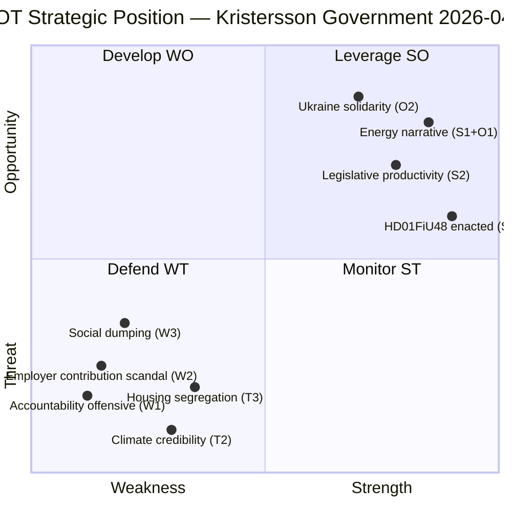

# SWOT Analysis — Riksdag Realtime Monitor 2026-04-22
**Analyst**: James Pether Sörling | **Framework**: political-swot-framework.md
**Classification**: Public | **Cycle**: Realtime-2338 | **Date**: 2026-04-22

---

## Context
This SWOT analyses the **political position of the Kristersson coalition government** as revealed by the 2026-04-22 realtime parliamentary intelligence picture — specifically assessing governmental strengths, weaknesses, opposition opportunities, and external threats visible in today's documents.

---

## Strengths

### S1 — Budget Enacted: Fiscal Relief Narrative Active [A1]
The extra supplementary budget (HD01FiU48, riksdagen.se/dokument/HD01FiU48) passed on 2026-04-21 despite cross-party opposition from S, V and MP. The government now holds a concrete "we cut your fuel costs" narrative deliverable for the summer campaign: 82 öre/litre petrol cut from 1 May 2026. The cross-party majority (M+SD+KD+L+C) demonstrates the Tidö coalition's legislative operability even in contentious fiscal territory.

| Evidence | Admiralty | Weight |
|----------|-----------|--------|
| HD01FiU48 enacted 2026-04-21; 82 öre/L cut; 4.1 GSEK fiscal impact | [A1] | 9 |

### S2 — Legislative Sprint Delivering on Agenda [A1]
Five major propositions submitted April 14–16 (HD03240 electricity, HD03242 forestry, HD03246 youth offenders, HD03232/231 Ukraine tribunals) demonstrate legislative productivity. This counters opposition narratives of a "do-nothing government" ahead of the election. Each proposition touches a key constituency: rural (forestry), security (crime), energy (electricity/housing), international (Ukraine).

| Evidence | Admiralty | Weight |
|----------|-----------|--------|
| HD03240 (data.riksdagen.se/dokument/HD03240), HD03242, HD03246, HD03231, HD03232 submitted Apr 14–16 | [A1] | 7 |

---

## Weaknesses

### W1 — Finance Minister Svantesson: Three Simultaneous Accountability Vectors [A2]
On 2026-04-22 alone, the S opposition filed three separate interpellations targeting Finance Minister Svantesson (HD10444 employer contributions, HD10446 false deaths, HD10442 eating disorder court case). Each targets a documented past ministerial statement that is either contested or contradicted by subsequent events. The concentration of fire on a single minister signals S has research files ready for a coordinated debate campaign.

| Evidence | Admiralty | Weight |
|----------|-----------|--------|
| HD10444 (riksdagen.se/dokument/HD10444), HD10446 (riksdagen.se/dokument/HD10446) filed 2026-04-22; HD10442 filed 2026-04-21 | [A2] | 9 |

### W2 — Employer Contribution Exploitation Scandal [B2]
The HD10444 interpellation cites an Aftonbladet investigation showing major retailers diverted the youth employment tax relief (10.9% reduction from April 2026) into profit margins rather than new jobs. Riksdagen's own legislative intent was youth job creation. If confirmed, this undermines the flagship labour market reform narrative.

| Evidence | Admiralty | Weight |
|----------|-----------|--------|
| HD10444 text citing Aftonbladet investigation (riksdagen.se/dokument/HD10444); employer contribution reduction enacted April 2026 | [B2] | 8 |

### W3 — Social Dumping Unaddressed [B2]
Interpellation HD10443 (Peder Björk/S → Civilminister Slottner/KD) documents that vulnerable persons — social welfare recipients, asylum seekers — are being transferred between municipalities without consent, violating their right to self-determination and established residence. This represents a structural failure in the government's social welfare coordination model.

| Evidence | Admiralty | Weight |
|----------|-----------|--------|
| HD10443 (riksdagen.se/dokument/HD10443); municipalities: informal transfer practices documented | [B2] | 8 |

---

## Opportunities

### O1 — Energy Security Narrative Ownership [A1]
The combined passage of HD01FiU48 (fuel cut) and submission of HD03240 (new electricity system laws) and HD03239 (wind power revenue sharing) gives the government a coherent "energy security + household relief" narrative going into the election. If electricity prices remain elevated through summer 2026, the government's proactive measures will be politically valuable. Source: HD01FiU48 (riksdagen.se/dokument/HD01FiU48).

### O2 — Ukraine Solidarity Positioning [A1]
The dual Ukraine propositions (HD03231 aggression tribunal + HD03232 damage commission; riksdagen.se/dokument/HD03231, riksdagen.se/dokument/HD03232) position Sweden in the front rank of European Ukraine support. Given Sweden's new NATO membership context, this carries strong cross-party consensus value and foreign policy credibility heading into the election.

### O3 — Law and Order Narrative: Youth Offenders [A1]
HD03246 (Skärpta regler för unga lagöverträdare, Gunnar Strömmer, Justitiedept.; riksdagen.se/dokument/HD03246) strengthens the government's law-and-order credentials. Youth crime is a high-salience electoral topic where the Tidö bloc has historically polled strongly, particularly among SD voters.

---

## Threats

### T1 — Coordinated S Accountability Offensive Could Dominate News Cycle [B2]
The four interpellations filed today (HD10444, HD10443, HD10445, HD10446) are structured to generate debate material over the next 7–10 days. If any ministerial answer is factually challenged or contradicted by subsequent evidence, the accountability story will compound. The eating disorder court case (HD10442, where Region Stockholm won 67 MSEK and vindicated its earlier statements) is the pre-existing live risk. Source: interpellations sibling analysis for HD10442.

### T2 — Fuel Tax Cut: Climate Policy Credibility Damage [B2]
The 82 öre/litre fuel tax cut (HD01FiU48) aligns Sweden with EU minimum levels but is widely framed as a retreat from climate commitments. Opposition motions from MP (HD024098) and V (HD024092) have created a documented record that the government prioritised cost relief over emissions reduction. Ahead of the 2026 election, this may reduce support among climate-sensitive voters (green-conservative segment that traditionally splits between M, C, L, and MP). Source: HD024098, HD024092 (riksdagen.se).

### T3 — Housing Segregation Backlash in Stockholm [B2]
Interpellation HD10445 (Markus Kallifatides/S → Andreas Carlson/KD) documents the government's failure to act on SOU 2024:38 recommendations for municipal pre-emption rights over key suburban properties. The affected suburbs (Sätra, Vårberg, Rågsved) are densely populated Stockholm districts with high immigrant-background populations — this story has the potential to intersect housing policy, segregation, and social cohesion debates in a city where swing voters matter for election outcomes. Source: HD10445 (riksdagen.se/dokument/HD10445).

---

## TOWS Matrix

| | Strengths | Weaknesses |
|---|-----------|------------|
| **Opportunities** | **SO**: Energy narrative (S2+O1) — leverage legislative productivity + relief measures as pre-election fiscal competence proof | **WO**: Redirect accountability to reform (W1+O3) — use HD03246 law-and-order delivery to shift debate away from Svantesson accountability |
| **Threats** | **ST**: Lead with Ukraine solidarity (S2+T1) — keep foreign policy and security narrative active to counter domestic accountability media cycle | **WT**: Climate credibility repair (W1+T2) — acknowledge climate trade-off in HD01FiU48 explicitly; commit to compensating measure before election |

---

## Cross-SWOT Pattern
The dominant cross-SWOT pattern is **W1/T1 convergence**: the S accountability offensive (W1) directly fuels the media-dominance threat (T1). The single most important risk management action for the coalition is **preparing airtight answers** to the HD10444 employer contribution question and the HD10442 eating disorder case before the interpellation debates scheduled 2026-04-28–05-05.

