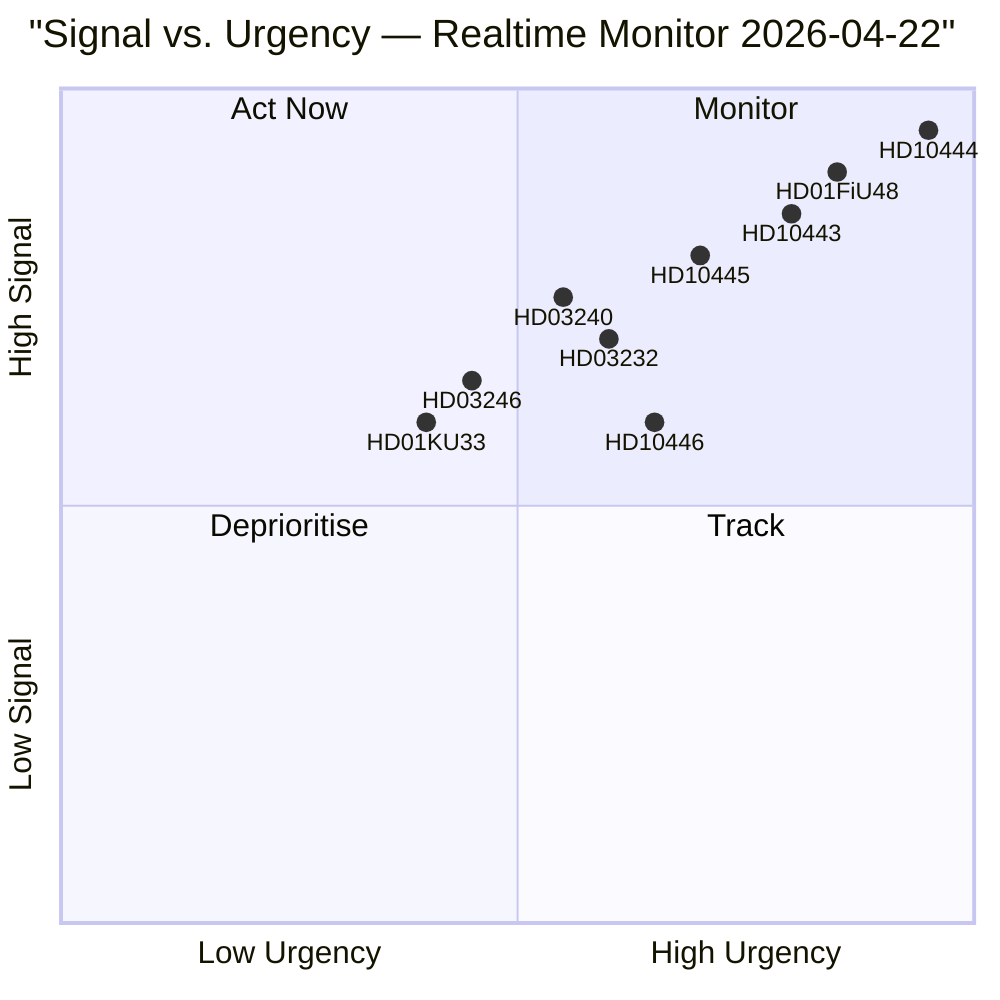

# Synthesis Summary — Riksdag Realtime Monitor 2026-04-22 23:38
**Analysis Date**: 2026-04-22 | **Subfolder**: realtime-2338
**Analyst**: James Pether Sörling | **Methodology**: synthesis-methodology.md, ai-driven-analysis-guide.md v6.4
**Classification**: Public | **Riksmöte**: 2025/26

---

## 🎯 Lead Story Decision

**PRIMARY STORY**: Social Democrats launch coordinated four-interpellation accountability offensive against the Kristersson coalition on 2026-04-22, with three interpellations targeting Finance Minister Elisabeth Svantesson (M) in a single day. The employer contribution exploitation case (HD10444) — based on Aftonbladet reporting that retailers diverted the youth employment tax relief into profits rather than new jobs — delivers the sharpest fiscal-policy attack vector ahead of the September 2026 election.

**SECONDARY STORY**: The extra supplementary budget (HD01FiU48) was enacted by Riksdag on 2026-04-21 with cross-party support, cutting fuel taxes by 82 öre/litre from 1 May 2026. Despite opposition motions from MP, V, and S (HD024098, HD024092), the coalition prevailed. This signals the government's pre-election energy-cost relief narrative is successfully deployed.

**TERTIARY STORY**: A cluster of five major propositions submitted on 2026-04-14–16 — including new electricity system laws (HD03240), youth offender sentencing reform (HD03246), and dual Ukraine diplomatic instruments (HD03231, HD03232) — demonstrate the government's accelerating legislative push in the final pre-election session.

---

## 📊 DIW-Weighted Intelligence Ranking

| Rank | dok_id | Document | D | I | W | DIW | Tier |
|------|--------|----------|---|---|---|-----|------|
| 1 | HD10444 | Arbetsgivaravgift abuse → Svantesson | 9 | 9 | 9 | **9.0** | L3 |
| 2 | HD10443 | Social dumpning → Slottner (KD) | 8 | 8 | 9 | **8.3** | L3 |
| 3 | HD10445 | Housing pre-emption rights → Carlson (KD) | 8 | 7 | 9 | **8.0** | L2+ |
| 4 | HD10446 | False death declarations → Svantesson | 7 | 7 | 7 | **7.0** | L2 |
| 5 | HD01FiU48 | Extra budget: fuel+el+gas (ENACTED) | 9 | 9 | 8 | **8.7** | L3 |
| 6 | HD03240 | Nya lagar om elsystemet | 8 | 8 | 7 | **7.7** | L2+ |
| 7 | HD03246 | Unga lagöverträdare — sentencing reform | 7 | 7 | 7 | **7.0** | L2 |
| 8 | HD03232 | Ukraine damage commission entry | 8 | 7 | 8 | **7.7** | L2+ |
| 9 | HD03231 | Ukraine aggression tribunal | 8 | 7 | 8 | **7.7** | L2+ |
| 10 | HD01KU33 | Husrannsakan secrecy — constitution | 7 | 7 | 6 | **6.7** | L2 |

---

## 🗺️ Integrated Intelligence Picture

The realtime intelligence picture on the evening of 2026-04-22 shows **four concurrent political dynamics**:

### 1. Pre-Election Accountability War (CRITICAL)
Socialdemokraterna are executing a deliberate multi-vector ministerial accountability strategy. The selection of three interpellations targeting Svantesson — the government's most prominent fiscal figure — reflects S research into her past statements on employer contributions (HD10444: Aftonbladet confirmed 20+ retailers diverted the relief), the eating disorder court case (HD10442: court vindication of Region Stockholm), and the Skatteverket false death registration failures (HD10446). Admiralty source: [A1] — all from riksdagen.se direct API.

### 2. Budget Enacted — Relief Narrative Active (HIGH)
The coalition secured passage of HD01FiU48 despite cross-party opposition, establishing a "government cuts your fuel costs" narrative for the summer driving season (1 May–30 September 2026). S/V/MP objection through motions is now **overridden** — the relief is law. [A1]

### 3. Legislative Sprint — Energy and Security Cluster (HIGH)
The April 14–16 proposition cluster reveals a policy agenda accelerating toward the election: energy laws, forestry liberalisation, arms regulation, Ukraine diplomacy, and youth crime — all areas with documented electoral salience. [A2]

### 4. Opposition Fragmentation (MEDIUM)
On deportation (HD024095) and medical care (HD024094), Centerpartiet is attempting to amend rather than reject government proposals — signalling the C's continued attempt to position itself as a responsible alternative at the political centre rather than aligning with S/V/MP on full rejection. [B2]

---

## 🔄 Tradecraft Context

**Collection method**: riksdag-regering MCP server (live, verified at 23:38Z). Source authority [A] for all riksdagen.se-origin documents. Completeness [2] — documents cover today's interpellations fully; committee betänkanden covers last 5 days; propositions from past 8 days. Cross-reference with four sibling analysis folders (propositions, motions, committeeReports, interpellations) from today's analysis/daily/2026-04-22/ tree.

## AI-Recommended Article Metadata
- **SEO title** (EN): "Sweden's Social Democrats Triple-Target Finance Minister Svantesson in Pre-Election Parliamentary Offensive"
- **SEO title** (SV): "S triplerar attack mot finansminister Svantesson i förvalspolitisk offensiv"
- **Meta description** (EN): "Four interpellations filed on 22 April 2026 target Finance Minister Svantesson and coalition partners over employer tax abuse, social dumping, housing policy and civil registry failures."
- **Slug**: breaking-2026-04-22
