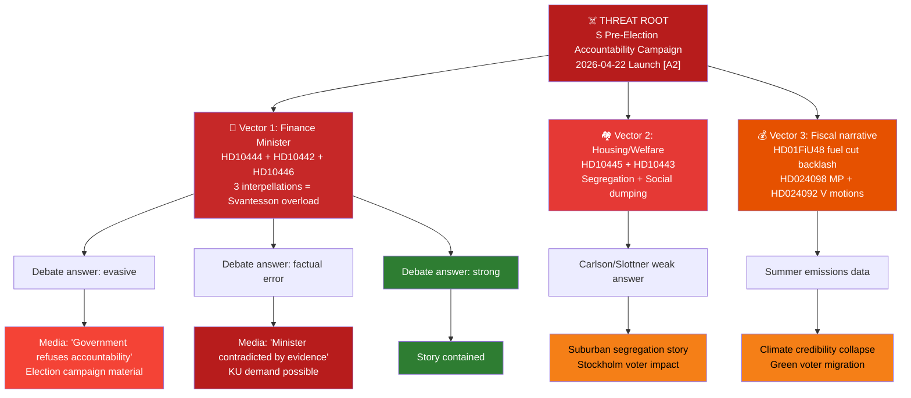

# Threat Analysis — Riksdag Realtime Monitor 2026-04-22
**Analyst**: James Pether Sörling | **Methodology**: political-threat-framework.md
**Classification**: Public | **Cycle**: Realtime-2338

---

## Political Threat Taxonomy (PTT)

| Threat Code | Category | Active | Severity |
|-------------|----------|--------|----------|
| PTT-1 | Ministerial Accountability (Interpellation-based) | YES | HIGH |
| PTT-2 | Legislative Agenda Disruption | MODERATE | MEDIUM |
| PTT-3 | Media Cycle Dominance (Opposition) | YES | HIGH |
| PTT-4 | Fiscal Policy Credibility Attack | YES | HIGH |
| PTT-5 | Social Policy Legitimacy Challenge | YES | MEDIUM-HIGH |
| PTT-6 | Coalition Stability Threat | LOW | LOW |
| PTT-7 | International/Diplomatic Risk | LOW | LOW |

---

## Active Threat Profiles

### PTT-1: Ministerial Accountability Offensive
**Actor**: Socialdemokraterna (S)
**Target**: Finance Minister Elisabeth Svantesson (M); Civilminister Erik Slottner (KD); Infrastructure Minister Andreas Carlson (KD)
**Method**: Simultaneous interpellations (HD10444, HD10443, HD10445, HD10446) filed 2026-04-22; pre-existing HD10442 from 2026-04-21
**Goal**: Force ministerial debate answers that can be exploited for election campaign material
**Capability**: [A2] — S parliamentary group has documented research capacity; prior interpellation pattern confirms coordinated approach
**Timing**: Activation window 2026-04-28 to 2026-05-10 (parliamentary debate scheduling)

### PTT-3: Media Cycle Dominance
**Actor**: S + sympathetic media (based on Aftonbladet reporting referenced in HD10444)
**Target**: Government economic management narrative
**Method**: Interpellation debates + concurrent Aftonbladet investigation provide a dual parliamentary-journalism combination
**Goal**: Establish "government serves corporations, not workers" counter-narrative to pre-election budget relief
**Capability**: [B2] — confirmed Aftonbladet investigation exists per HD10444 text; media cycle risk is high given political salience of employer contributions

### PTT-4: Fiscal Policy Credibility Attack
**Actor**: S, MP, V
**Target**: Svantesson; Kristersson government's fiscal management
**Method**: Three interpellations + opposition motions on prop. 2025/26:236 (HD024098, HD024092)
**Goal**: Create narrative that government fiscal policy benefits corporations and top earners, not working families
**Evidence**: HD10444 (riksdagen.se/dokument/HD10444); HD024098, HD024092 (riksdagen.se)

### PTT-5: Social Policy Legitimacy Challenge
**Actor**: S
**Target**: Civilminister Slottner (KD) + municipal welfare system
**Method**: HD10443 social dumping interpellation; HD10445 housing segregation interpellation
**Goal**: Frame government as failing to protect Sweden's welfare state guarantees
**Evidence**: HD10443, HD10445 (riksdagen.se)

---

## Attack Tree

---

## Kill Chain (Parliamentary Accountability)

| Stage | Action | Signal | Response |
|-------|--------|--------|----------|
| Reconnaissance | S research on minister's past statements | Published interpellation texts | Monitor interpellation content |
| Weaponisation | Aftonbladet/court evidence compiled | HD10442, HD10444 text cites evidence | Verify evidence strength |
| Deployment | Interpellations filed 2026-04-22 | 4 interpellations in one day | Escalation indicator |
| Exploitation | Parliamentary debate answers | Scheduled 2026-04-28–05-05 | Maximum monitoring |
| Persistence | Media coverage + KU petition | Post-debate coverage | Track narrative trajectory |

---

## MITRE-Style TTP Mapping (Parliamentary Tactics)

| TTP-Code | Tactic | Technique | Procedure |
|----------|--------|-----------|-----------|
| T001 | Accountability | Multi-interpellation cluster | File 3+ interpellations targeting one minister |
| T002 | Evidence anchoring | Court/media corroboration | Cite court decisions + investigative reporting in interpellation text |
| T003 | Minister targeting | Single-target overload | Force 3+ debate answers from one minister within 2 weeks |
| T004 | Temporal compression | Legislative session timing | File before summer recess to force answers before campaign starts |
| T005 | Cross-domain synchronisation | Housing+fiscal+welfare | Attack multiple policy domains simultaneously to prevent single-issue containment |
