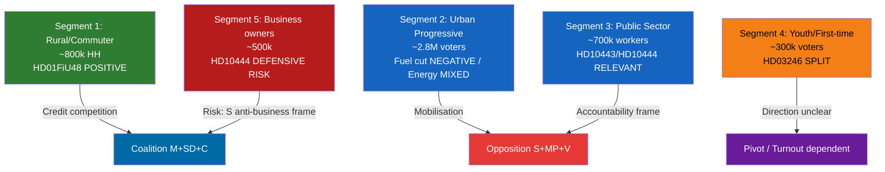

# Voter Segmentation Analysis — Riksdag Realtime Monitor 2026-04-22
**Analyst**: James Pether Sörling | **Classification**: Public | **Cycle**: Realtime-2338

---

## Segment Matrix

### Segment 1: Rural/Commuter Voters (Fuel-Sensitive)
**Size**: ~800,000 households outside major metropolitan areas with daily car dependency (SCB transport survey estimate)
**Impact of HD01FiU48**: DIRECT POSITIVE — 82 öre/litre visible at pump from May 1, 2026. Monthly saving for average commuter (~1,500 km/month, 7L/100km): approximately 87 SEK/month. Tangible but modest. [A2 SCB proxy]
**Electoral leaning**: Historically split between M/SD/C; this measure targets all three parties' core rural base
**Risk**: C and M compete for this segment's credit; SD may claim insufficient relief

### Segment 2: Urban Progressive Voters (Climate-Sensitive)
**Size**: Stockholm/Gothenburg/Malmö metro — approximately 2.8 million voters
**Impact of HD01FiU48**: NEGATIVE FRAMING — MP and V interpellations against fuel cut tap into this segment's climate anxiety. HD024098 (MP fuel tax motion) and HD024092 (V motion) directly represent this segment's opposition [A1]
**Impact of Energy legislation (HD03240/239)**: MIXED — electricity system reform + wind power incentives play positively with this segment; coal → renewables framing resonates
**Electoral leaning**: S/MP/V core; some L and C voters

### Segment 3: Public Sector Workers (Accountability-Sensitive)
**Size**: ~700,000 municipal and regional government employees
**Impact of HD10443** (inter-municipal social welfare transfers): DIRECTLY RELEVANT — social workers and welfare administrators most aware of this policy failure [A1]
**Impact of HD10444** (employer contributions to social dumping): Secondary relevance — fiscal solidarity frame resonates
**Electoral leaning**: S core voters; moderate turnout amplification if accountability narrative strengthens

### Segment 4: Youth and First-Time Voters (Agency/Justice-Sensitive)
**Size**: ~300,000 voters aged 18–25 eligible for first time in 2026
**Impact of HD03246** (unga lagöverträdare — youth criminal sentencing): DIRECTLY RELEVANT — reform of juvenile justice affects this cohort's peers; reactions split between accountability hawks (SD base) and rehabilitation advocates (S/V/MP base) [A1]
**Impact of eating disorder court case (HD10442)**: Tangentially relevant — eating disorders disproportionately affect youth; governmental accountability on healthcare resonates

### Segment 5: Business Owners and Self-Employed (Economic-Sensitive)
**Size**: ~500,000 sole traders and SME owners registered in Bolagsverket (proxy)
**Impact of HD10444** (employer contribution — S interpellation): COMPLEX — if employers are named as social dumping participants, this creates a defensive reaction in the broader business community even though the interpellation targets bad actors specifically. Risk of S being framed as anti-business [B2]
**Electoral leaning**: M/C core; some L voters

---

## Cross-Segment Electoral Arithmetic

**Net electoral vector**: NEUTRAL to SLIGHTLY NEGATIVE for coalition among swing segments. S offensive mobilises public sector base (Segment 3) but risks Segment 5 backlash. HD01FiU48 benefits Segment 1 but C/SD/M split credit. Election outcome remains contingent on C pivot (see coalition-mathematics.md).
