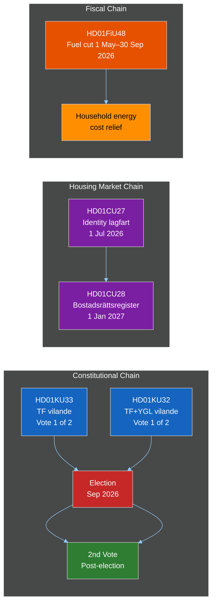

# Cross-Reference Map — Committee Reports 2026-04-23

**Methodology**: `analysis/methodologies/structural-metadata-methodology.md`
**Analyst**: James Pether Sörling | **Date**: 2026-04-23

## Policy Clusters

### Cluster 1: Election-Year Fiscal and Energy Policy
- **Primary**: HD01FiU48 (Extra ändringsbudget)
- **Related**: HD01MJU21 (agricultural energy/climate — MJU scrutiny), HD01MJU19 (waste/circular economy EU compliance)
- **Tension**: FiU48 fuel tax cuts vs. MJU19/MJU21 environmental ambition
- **Theme**: Household economics vs. long-term climate policy trade-off

### Cluster 2: Constitutional Modernization Package
- **Primary**: HD01KU33 (TF — beslag/husrannsakan digital insyn)
- **Related**: HD01KU32 (TF+YGL — tillgänglighetskrav medier)
- **Link**: Both are vilande grundlagsändringar decided in same KU session; both require post-election second vote
- **Theme**: Digital-era constitutional adaptation — crime-fighting efficiency × fundamental freedoms

### Cluster 3: Housing Market Transparency and Anti-Crime
- **Primary**: HD01CU27 (Identitetskrav lagfart + bostadsrättslagen)
- **Related**: HD01CU28 (Nationellt bostadsrättsregister)
- **Link**: Both CU committee; complementary measures; both effective before/around election
- **Theme**: Property market integrity, anti-money laundering, consumer protection

### Cluster 4: Social Welfare and Administrative Reform
- **Primary**: HD01CU22 (Ställföreträdarskap)
- **Related**: HD01SfU20 (Föräldrapenning), HD01TU16 (Körkort)
- **Theme**: State service simplification, CRPD compliance, administrative deregulation

## Legislative Chains

## Coordinated Activity Patterns

The April 2026 legislative sprint shows coordinated committee scheduling:
- FiU (FiU48) + KU (KU33, KU32) + CU (CU27, CU28, CU22) all reporting in the same week of 17–21 April 2026
- Pattern: Government tabling and committee approval synchronized for maximum legislative throughput before the summer recess and election campaign
- This is not unusual: the spring riksmöte sprint is standard, but the political salience of this year's package is higher than typical due to election-year timing

## Sibling Folder Citations

No sibling analysis folders present for this date (first run). Future Tier-C aggregation should reference:
- `analysis/daily/2026-04-23/propositions/` if props workflow runs same day
- `analysis/daily/2026-04-23/evening-analysis/` for synthesis integration
