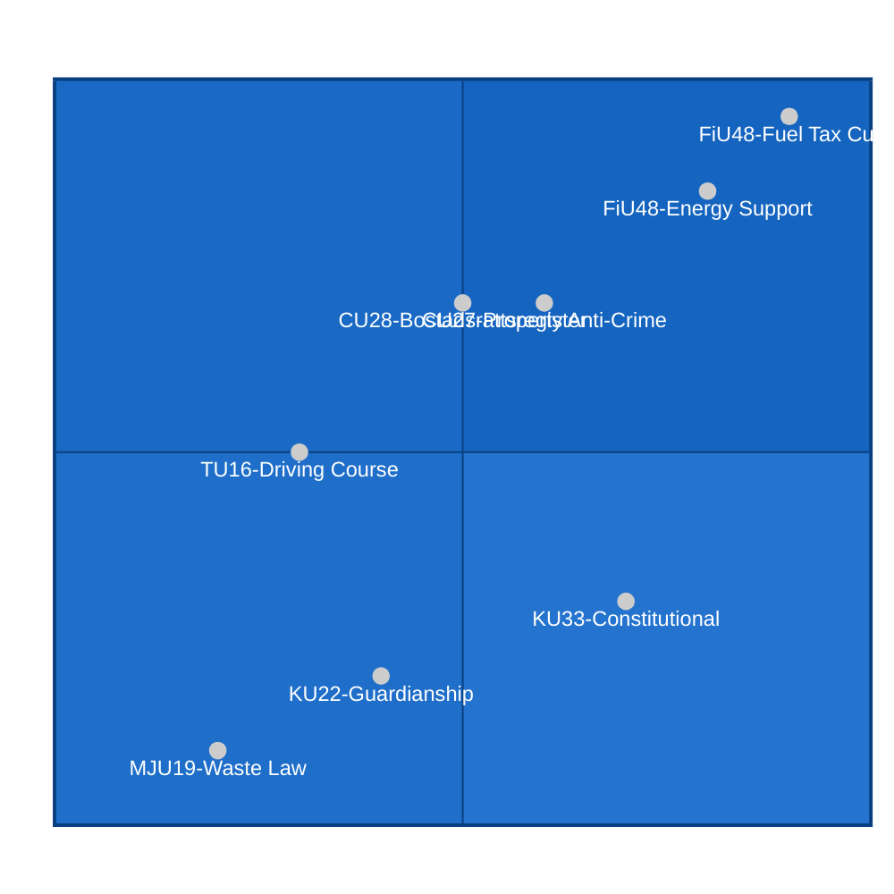

# Election 2026 Analysis — Committee Reports April 2026

**Methodology**: `analysis/methodologies/electoral-domain-methodology.md`
**Analyst**: James Pether Sörling | **Date**: 2026-04-23
**Election**: Swedish general election, September 2026

## Context

Sweden holds its next general election in September 2026 under the current 4-year electoral cycle (last election September 2022). The April 2026 committee reports batch represents the spring legislative sprint — five months before election day.

## Electoral Impact by Document

## Seat Projection Delta

Current seat distribution (est. post-2022):
| Block | Approx seats | Change signal from April 2026 |
|-------|-------------|-------------------------------|
| Tidö coalition (M+SD+KD+L) | 176 | FiU48 may +3–5 seats in rural/suburban Sweden; climate risk −1–2 educated urban |
| Opposition (S+V+MP+C) | 173 | FiU48 gives S energy policy attack surface; MJU21 aids MP/C climate argument |

Net projection impact: **Marginally positive for coalition** on current evidence, driven by household economics salience (FiU48) outweighing climate concerns (MJU21). However, margin is within polling noise — confidence LOW [C4].

## Key Voter Segments Affected

| Segment | Size (est.) | Decision Impact | Direction |
|---------|------------|-----------------|-----------|
| Car-dependent rural households | ~1.2M voters | HIGH | +Coalition (FiU48 fuel relief) |
| Housing-market investors/owners | ~750,000 bostadsrätter | MEDIUM | +Coalition (CU27/CU28 stability) |
| Urban educated (climate voters) | ~900,000 | MEDIUM | −Coalition (FiU48 climate signal) |
| Elderly/guardianship affected | ~100,000 adults + families | LOW | Neutral (CU22 cross-party) |
| Young drivers (18–25) | ~400,000 | LOW | Slightly positive (TU16 deregulation) |

## Coalition Mathematics Context

Constitutional amendments (KU33/KU32) require post-election confirmation — this creates a unique electoral dynamic where the constitutional reform agenda itself becomes a campaign issue. Parties must now campaign on whether they will ratify the second vote.

## Forward Electoral Triggers

1. **July 2026**: Party manifestos published — will all parties commit to KU33/KU32 second vote?
2. **August 2026**: Final Riksbank assessment before election — any inflation signal will hurt coalition
3. **September 2026**: Election day — outcome determines constitutional continuity
4. **October 2026**: Coalition formation — key determinant of KU33/KU32 fate

**Overall assessment**: The April 2026 legislative sprint has placed the Tidö coalition in a favorable but not decisive pre-election position. FiU48 is the most potent tool — but fiscal and climate narratives will contest its effectiveness. Confidence: MEDIUM [B3].
