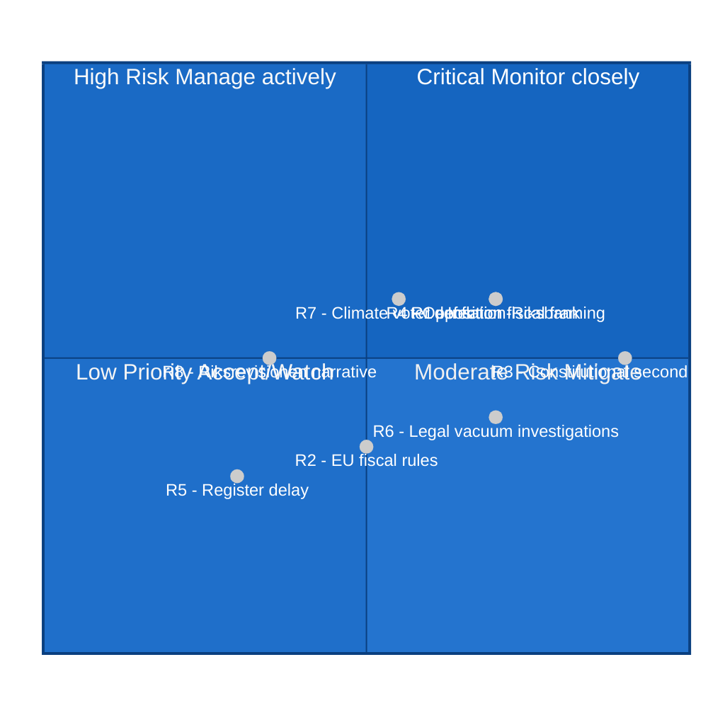

# Risk Assessment — Committee Reports 2026-04-23

**Methodology**: `analysis/methodologies/political-risk-methodology.md` — 5-dimension L×I matrix
**Analyst**: James Pether Sörling | **Date**: 2026-04-23

## Risk Register

| ID | Risk | Dimension | L | I | L×I | Cascade | Probability |
|----|------|-----------|---|---|-----|---------|-------------|
| R1 | Fuel subsidy fuels inflation; Riksbank forced to hold/raise rates longer | Fiscal-monetary | 3 | 4 | 12 | → R2, R4 | Likely [B3] |
| R2 | FiU48 fiscal expansion tested against EU fiscal rules (Stability & Growth Pact) | EU compliance | 2 | 3 | 6 | → R5 | Unlikely [C4] |
| R3 | KU33 second vote refused post-election — TF amendment dies | Constitutional | 3 | 5 | 15 | → R6 | Roughly even [B3] |
| R4 | Opposition frames FiU48 as fiscal irresponsibility; swing voters defect | Electoral | 3 | 4 | 12 | → R7 | Likely [B3] |
| R5 | CU28 bostadsrättsregister implementation delayed post-2027 | Administrative | 2 | 2 | 4 | isolated | Unlikely [C3] |
| R6 | Constitutional package collapse creates legal vacuum for digital investigations | Legal | 2 | 4 | 8 | isolated | Roughly even [C3] |
| R7 | Climate-minded voters (C, MP support) defect due to FiU48 fuel subsidy | Electoral | 3 | 3 | 9 | → R1 | Likely [B3] |
| R8 | Riksrevisionen MJU21 critique amplified into government negligence narrative | Reputational | 3 | 2 | 6 | → R4 | Roughly even [B3] |

## 5×5 L×I Matrix

## Cascading Risk Chains

**Primary chain**: R1 (inflation) → R4 (electoral framing) → R7 (climate voter defection)
- FiU48 fuel tax cut risks Riksbank concern → triggers S/MP criticism → splits rural vs. urban/educated voter coalitions
- Severity: HIGH if Riksbank makes public statement on FiU48 inflationary impact

**Secondary chain**: R3 (constitutional second vote) → R6 (legal vacuum)
- If KU33 dies post-election: digital investigation transparency rules revert to pre-reform state
- Practical impact: Polisen/Åklagarmyndigheten face legal uncertainty in major digital seizure cases
- Severity: MEDIUM — operational legal issue, not a political crisis

## Posterior Probabilities

| Scenario | Prior | Conditional update | Posterior |
|----------|-------|-------------------|-----------|
| Riksbank publicly critiques FiU48 on inflation | 20% | +15% if energy prices rise May–June 2026 | 35% |
| KU33 second vote passes post-election | 60% | +20% if Tidö coalition wins; −40% if S wins | 20–80% range |
| Opposition fiscal framing dominates campaign | 40% | +20% if public polling shows household debt rising | 60% |

## Evidence Sources

All risk assessments grounded in: HD01FiU48 [A1] (fiscal data); HD01KU33 [A1] (constitutional process); HD01MJU21 [A1] (climate audit); Structural analysis [B3] for electoral impacts.
