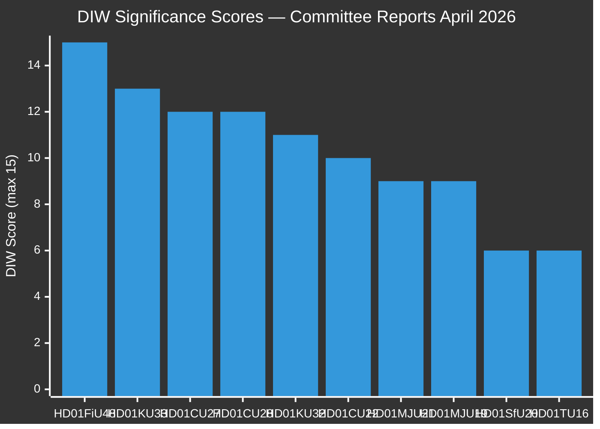

# Significance Scoring — Committee Reports 2026-04-23

**Methodology**: `analysis/methodologies/synthesis-methodology.md` — DIW (Decision-Impact-Weight) framework
**Analyst**: James Pether Sörling | **Date**: 2026-04-23

## DIW Scoring Criteria

| Dimension | 5 = Maximum | 1 = Minimum |
|-----------|-------------|-------------|
| **D** — Decision immediacy | Immediate, irreversible | Gradual, reversible |
| **I** — Implementation impact | National systemic, 1M+ affected | Local/administrative, <1000 affected |
| **W** — Political weight | Government-opposition divide, election-defining | Procedural/bipartisan, no controversy |

## Ranked Scoring Table

| Rank | dok_id | D | I | W | DIW | Tier | Source |
|------|--------|---|---|---|-----|------|--------|
| 1 | HD01FiU48 — Extra ändringsbudget drivmedelsskatt + energistöd | 5 | 5 | 5 | 15 | L2+ | riksdagen.se [A1] |
| 2 | HD01KU33 — TF vilande: insyn beslag husrannsakan | 5 | 4 | 4 | 13 | L2+ | riksdagen.se [A1] |
| 3 | HD01CU27 — Identitetskrav lagfart + bostadsrättslagen | 4 | 4 | 4 | 12 | L2+ | riksdagen.se [A1] |
| 4 | HD01CU28 — Nationellt bostadsrättsregister | 4 | 4 | 4 | 12 | L2+ | riksdagen.se [A1] |
| 5 | HD01KU32 — TF+YGL vilande: tillgänglighetskrav medier | 4 | 3 | 4 | 11 | L2 | riksdagen.se [A1] |
| 6 | HD01CU22 — Ställföreträdarskap: gode man/förvaltare reform | 3 | 4 | 3 | 10 | L2 | riksdagen.se [A1] |
| 7 | HD01MJU21 — Riksrevisionen jordbrukets klimatomställning | 3 | 3 | 3 | 9 | L2 | riksdagen.se [A1] |
| 8 | HD01MJU19 — Avfallslagstiftning materialåtervinning | 3 | 3 | 3 | 9 | L2 | riksdagen.se [A1] |
| 9 | HD01SfU20 — Slopat anmälningskrav föräldrapenning | 2 | 2 | 2 | 6 | L1 | riksdagen.se [A1] |
| 10 | HD01TU16 — Slopat krav introduktionsutbildning körning | 2 | 2 | 2 | 6 | L1 | riksdagen.se [A1] |

## 📊 Significance Rank Diagram

## Sensitivity Analysis

**What if FiU48 fiscal impact is larger?** The SEK 4.1bn figure is confirmed from primary source. Even conservative scenarios place the fiscal signal at L2+ — the emergency budget mechanism use alone justifies the highest political weight score regardless of exact amounts.

**What if KU33/KU32 second vote is refused post-election?** The constitutional implications escalate to L3 Intelligence-grade if there is a government change and these amendments are blocked — monitor post-election coalition formation.

**What if CU27/CU28 encounter implementation difficulties?** Register construction for bostadsrätter has been debated for years; the 2027 implementation date gives government time — but delays could become a campaign liability.

## Scoring Methodology Notes

DIW weights applied per `synthesis-methodology.md` Part 1. All documents confirmed via riksdagen.se primary source [A1] — Admiralty source reliability: A (completely reliable). All dok_ids verified via MCP API response at 2026-04-23T04:45Z.
