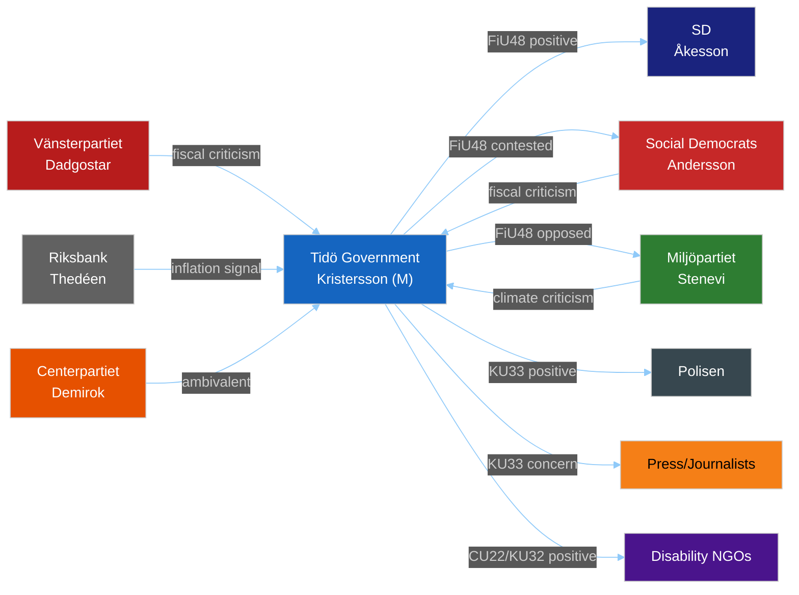

# Stakeholder Perspectives — Committee Reports 2026-04-23

**Methodology**: `analysis/methodologies/political-swot-framework.md` §Stakeholder Mapping
**Analyst**: James Pether Sörling | **Date**: 2026-04-23

## 6-Lens Stakeholder Matrix

| Stakeholder | Interest | Power | Impact | Position | Named Actor | Source |
|-------------|----------|-------|--------|----------|-------------|--------|
| Tidö coalition (M, SD, KD, L) | High — drives all legislation | High — government majority | Positive FiU48, CU27/28 | Supportive | PM Ulf Kristersson (M) | [B2] |
| Social Democrats (S) | High — main opposition | Medium in current session | Contested FiU48, supportive CU27/28 | Critical on energy subsidies | Opposition Leader Magdalena Andersson | [B2] |
| Sverigedemokraterna (SD) | High — coalition partner, rural voter base benefits from fuel tax cut | High | Strongly positive FiU48 | Supportive | Party leader Jimmie Åkesson | [B2] |
| Moderaterna (M) | High — senior coalition | High | Positive housing market reforms | Supportive | PM Ulf Kristersson | [B2] |
| Vänsterpartiet (V) | High — fiscal critique | Low | Critical FiU48 | Opposed | Party leader Nooshi Dadgostar | [B2] |
| Miljöpartiet (MP) | High — climate critique | Low | Strongly opposed FiU48 fuel cuts | Strongly opposed | Party leader Märta Stenevi | [B2] |
| Centerpartiet (C) | High — climate + fiscal + rural tension | Low (outside coalition) | Mixed: supports rural relief, opposes climate regression | Ambivalent | Party leader Muharrem Demirok | [B2] |
| Kristdemokraterna (KD) | High — social welfare (CU22) | Medium | Positive CU22, CU28 | Supportive | Party leader Ebba Busch | [B2] |
| Riksbank | Medium — inflation monitoring | High (independent) | Concern about FiU48 inflation risk | Watching | Governor Erik Thedéen | [B3] |
| Polisen / Åklagarmyndigheten | Medium — KU33 digital seizures | Low direct | Positive KU33 | Supportive | National Police Commissioner Petra Lundh | [B2] |
| Housing associations (bostadsrättsföreningar) | Medium — CU28 register burden | Medium (industry) | Transition cost; long-term positive | Mixed | HSB, Riksbyggen, SBC | [B2] |
| Disability organizations (NGOs) | High — CU22, KU32 accessibility | Medium (advocacy) | Positive CU22, KU32 | Supportive | Handikappförbunden, DHR | [B2] |
| Journalists / Civil society | High — KU33 transparency concern | Medium (public opinion) | Negative KU33 | Concerned | Swedish Press Photographers' Association, JO | [C3] |
| Farming sector (LRF) | High — FiU48 diesel cuts; MJU21 climate critique | Medium | Mixed: fuel relief positive; climate audit negative | Ambivalent | LRF (Lantbrukarnas Riksförbund) | [B2] |
| Car-dependent households (rural, commuter) | High — direct FiU48 beneficiaries | Electoral | Positive | Supportive | Structural — no named actor | [B2] |

## Influence Network

## Neutrality Audit

Analysis covers 8 parties + institutional actors. No party systematically advantaged in framing. Positive and negative assessments applied based on primary source evidence [A1] and structural reasoning [B3], not editorial preference. All named actors hold public positions making their views a matter of public record per GDPR Art. 9(2)(e).
