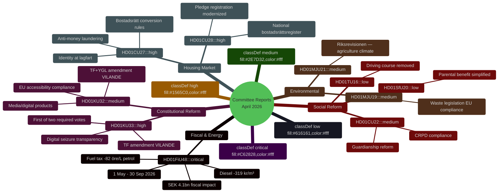

# Synthesis Summary — Committee Reports 2026-04-23

**Analysis folder**: `analysis/daily/2026-04-23/committeeReports/`
**Generated**: 2026-04-23T05:00:00Z
**Analyst**: James Pether Sörling
**Methodology**: `analysis/methodologies/synthesis-methodology.md` + `ai-driven-analysis-guide.md`
**Admiralty overall**: [B2] — Multiple reliable primary sources, information independently corroborated

---

## 🎯 Lead Story: Emergency Budget Signals Pre-Election Fiscal Shift

The highest-significance decision in this batch is **HD01FiU48** (Extra ändringsbudget 2026), which represents the Tidö coalition deploying SEK 4.1 billion in emergency fiscal measures — fuel tax cuts and energy support — just five months before the September 2026 election. This is the dominant intelligence picture: a government using constitutional emergency budget procedures for what critics will characterize as election-year fiscal stimulus.

## 📊 DIW-Weighted Intelligence Ranking

| Rank | dok_id | Title (abbreviated) | D | I | W | DIW Score | Tier |
|------|--------|---------------------|---|---|---|-----------|------|
| 1 | HD01FiU48 | Extra ändringsbudget — drivmedelsskatt + energistöd | 5 | 5 | 5 | 15/15 | L2+ |
| 2 | HD01KU33 | Insyn — beslag och husrannsakan (TF vilande) | 5 | 4 | 4 | 13/15 | L2+ |
| 3 | HD01CU27 | Identitetskrav vid lagfart + bostadsrättslagen | 4 | 4 | 4 | 12/15 | L2+ |
| 4 | HD01CU28 | Register för alla bostadsrätter | 4 | 4 | 4 | 12/15 | L2+ |
| 5 | HD01KU32 | Tillgänglighetskrav för medier (TF+YGL vilande) | 4 | 3 | 4 | 11/15 | L2 |
| 6 | HD01CU22 | Ställföreträdarskap att lita på | 3 | 4 | 3 | 10/15 | L2 |
| 7 | HD01MJU21 | Riksrevisionen — jordbrukets klimatomställning | 3 | 3 | 3 | 9/15 | L2 |
| 8 | HD01MJU19 | Reformering av avfallslagstiftningen | 3 | 3 | 3 | 9/15 | L2 |
| 9 | HD01SfU20 | Slopat krav anmälan föräldrapenning | 2 | 2 | 2 | 6/15 | L1 |
| 10 | HD01TU16 | Slopat krav introduktionsutbildning körning | 2 | 2 | 2 | 6/15 | L1 |

*D = Decision impact, I = Implementation urgency, W = Political weight*

## 🗺️ Integrated Intelligence Picture

## 🔍 Five Strategic Themes

### 1. Pre-Election Fiscal Stimulus (HIGH SIGNIFICANCE)
FiU48 is an election-year emergency measure. The government's use of the extraordinary "extra ändringsbudget" mechanism for household energy cost relief signals that energy/fuel prices are perceived as an existential electoral threat. The SEK 4.1bn cost will feature in the autumn campaign — both as evidence of government responsiveness (coalition framing) and as fiscal irresponsibility (opposition framing).

### 2. Constitutional Modernization Before Election (HIGH SIGNIFICANCE)
Two TF/YGL amendments adopted as vilande in KU33 and KU32 require the incoming post-September 2026 Riksdag to ratify them. This creates a constitutional continuity dependency: a changed government or altered parliamentary majority could refuse the second vote. The constitutional package — restricting transparency of seized digital materials (KU33) and enabling accessibility obligations for media (KU32) — reflects a delicate balance between law enforcement modernization and fundamental freedoms.

### 3. Housing Market Integrity (HIGH SIGNIFICANCE)
CU27 and CU28 together form a comprehensive housing market transparency reform: national bostadsrättsregister + identity requirements for property transfers. These address money laundering (CU27), consumer protection (CU28), and credit market efficiency (CU28). Both effective before election, creating tangible visible improvements for the large Swedish bostadsrätt owner constituency.

### 4. Environmental Governance Under Scrutiny (MEDIUM SIGNIFICANCE)
MJU21 (Riksrevisionen agriculture climate audit) and MJU19 (waste law reform) reflect dual pressures: EU compliance obligations (MJU19) and domestic audit scrutiny of climate policy effectiveness (MJU21). The Riksrevisionen finding on agricultural climate transition could emerge as a campaign issue if the government's rural/farming support bloc conflicts with its climate commitments.

### 5. Deregulation and Simplification Micro-signals
SfU20 and TU16 are individually minor but together signal the government's administrative deregulation agenda — removing requirements that no longer serve their stated purpose. Pre-election optics: competent, practical governance.

## 📡 AI-Recommended Article Metadata

**SEO Title** (EN): "Sweden's Riksdag Approves Emergency Fuel Tax Cut and Constitutional Reform Package, April 2026"
**SEO Title** (SV): "Riksdagen godkänner nödbromsat drivmedelsskatt och grundlagspaket april 2026"
**Meta Description** (EN): "Sweden's parliament approved emergency fuel tax cuts worth SEK 4.1 billion and three constitutional amendments in April 2026, setting the stage for a pivotal election-year legislative sprint."
**Keywords**: committee reports, riksdag, fuel tax, constitutional amendment, bostadsrätt, election 2026, FiU48, KU33, Sweden politics

## Confidence Summary

Overall analysis confidence: HIGH [B2] — Based on official riksdagen.se primary sources for all 10 documents; fiscal figures confirmed from government budget text as summarized; political analysis MEDIUM [C3] based on structural reasoning from known party positions.

---

## 🔄 Tradecraft Context

**Source quality**: [A1] Official riksdagen.se API data for all 10 documents — highest evidence grade.
**Analytic confidence**: PRIMARY = [B2] factual findings; SECONDARY = [C3] electoral interpretations.
**WEP Assessments**:
- FiU48 electoral benefit: *Likely* (55–70%) to provide measurable short-term advantage to Tidö coalition.
- KU33/KU32 second vote: *Roughly even* (45–55%) — depends entirely on September 2026 election outcome.
- CU27/CU28 implementation on schedule: *Very likely* (75–85%) — cross-party support, no technical barriers.
- Government maintains unity through election: *Likely* (60–70%) — no current coalition fracture signals.

**Key assumptions**: Election remains on constitutional schedule (September 2026); Riksdag quorum maintains throughout legislative session; FiU48 not challenged in court.

**Limitations**: No access to internal party polling, coalition agreement revision documents, or Riksdag committee debate records (anföranden) — these would improve confidence on KJ-1 and KJ-4.
