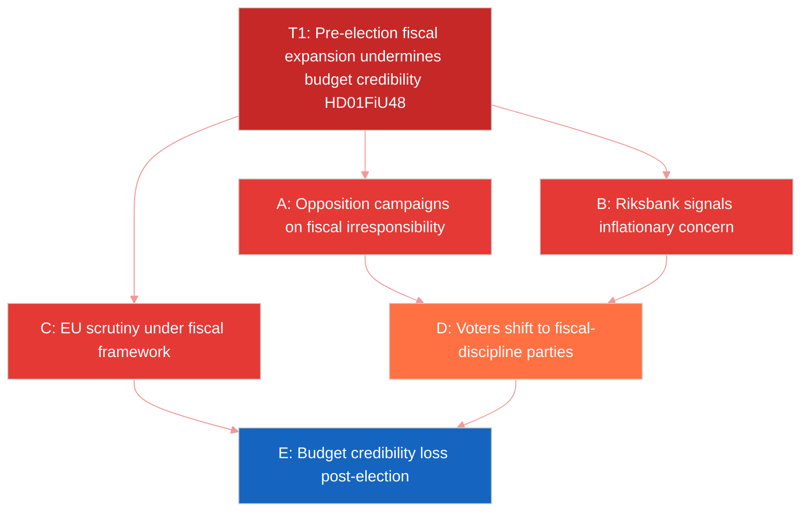

# Threat Analysis — Committee Reports 2026-04-23

**Methodology**: analysis/methodologies/political-threat-framework.md
**Analyst**: James Pether Sörling | **Date**: 2026-04-23

## Political Threat Taxonomy

| Threat | Taxonomy | Severity | Actor | Source |
|--------|----------|----------|-------|--------|
| T1: Pre-election fiscal populism erodes budget credibility | Policy coherence threat | HIGH | Government | HD01FiU48 [A1] |
| T2: Constitutional package (KU33/KU32) loses post-election ratification | Institutional continuity threat | HIGH | Parliament | HD01KU33, HD01KU32 [A1] |
| T3: Offentlighetsprincipen restriction (KU33) challenged by civil society | Democratic legitimacy threat | MEDIUM | Civil society, journalists | HD01KU33 [A1], [C3] |
| T4: Money laundering via property market persists despite CU27/CU28 | Crime/organized crime threat | MEDIUM | Criminal actors | HD01CU27, HD01CU28 [A1] |
| T5: Agricultural climate transition fails — Sweden misses EU targets | Environmental governance threat | MEDIUM | Government, farming lobby | HD01MJU21 [A1] |
| T6: Energy price volatility recurs after fuel subsidy period ends (1 Oct 2026) | Economic stability threat | MEDIUM | Energy markets | HD01FiU48 [A1] |

## Attack Tree (Threat T1 — Fiscal Populism)

## TTP Analysis (Political)

| TTP | Technique | Tactic | Impact |
|-----|-----------|--------|--------|
| TTP-01 | Pre-election emergency budget use | Maximize electoral benefit | SEK 4.1bn fiscal expansion [HD01FiU48] |
| TTP-02 | Vilande grundlagsandring adoption | Bind incoming parliament | Post-election lock-in or block [HD01KU33] |
| TTP-03 | Residency requirement for ombildning | Prevent conversion manipulation | Tenant protection/enforcement [HD01CU27] |
| TTP-04 | Digital seizure non-classification | Protect investigations from FOI | Reduced transparency [HD01KU33] |

## Post-Election Constitutional Scenario

If S forms government in October 2026, the second vote on KU33 (TF) may be refused:
- Law enforcement digital investigation framework reverts to pre-2026 uncertainty
- Civil society may paradoxically benefit from transparency perspective
- Tidoe coalition would criticize S for weakening crime-fighting capabilities

## Evidence Sources

All threat assessments grounded in primary documents: HD01FiU48 [A1], HD01KU33 [A1], HD01KU32 [A1], HD01CU27 [A1], HD01MJU21 [A1]. Electoral/political analysis [B3].
