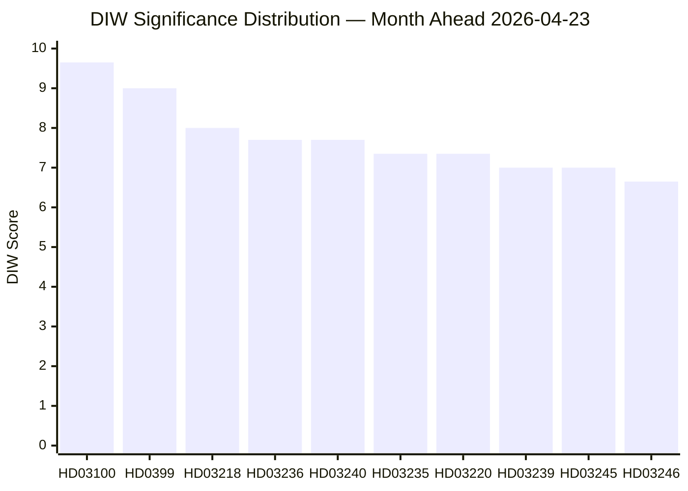
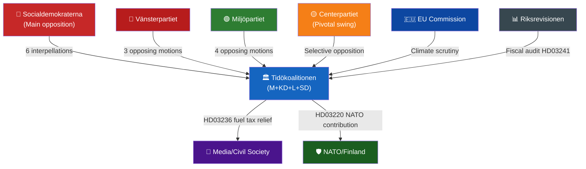
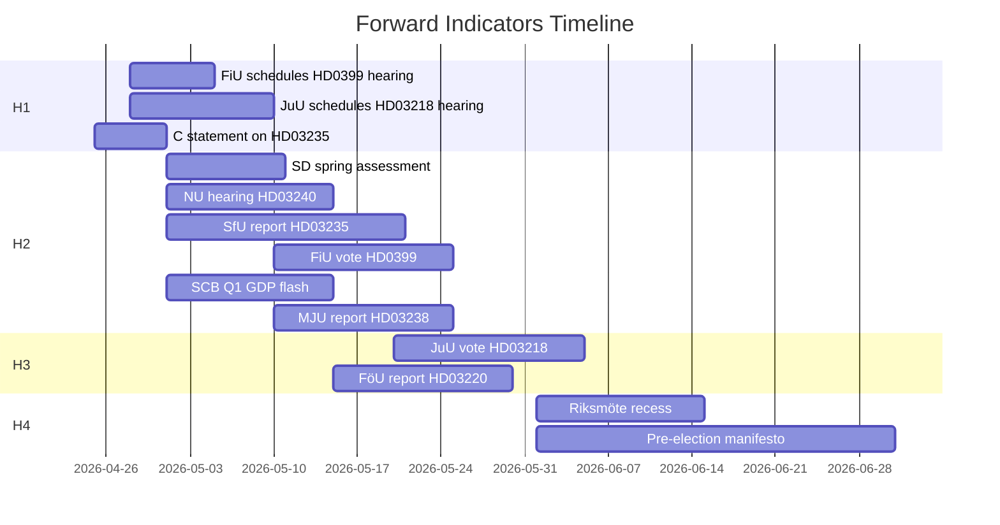
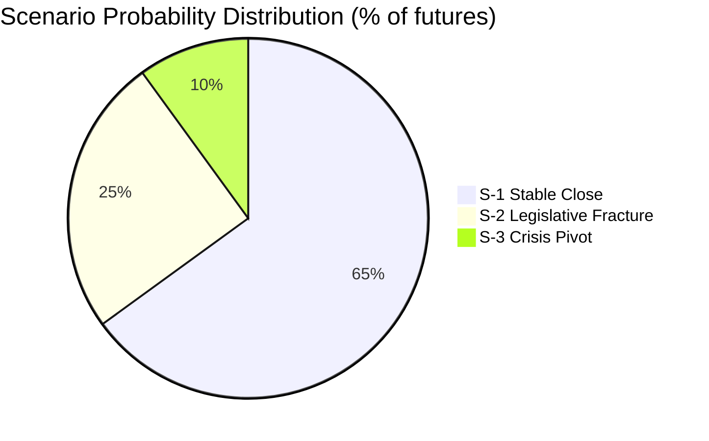
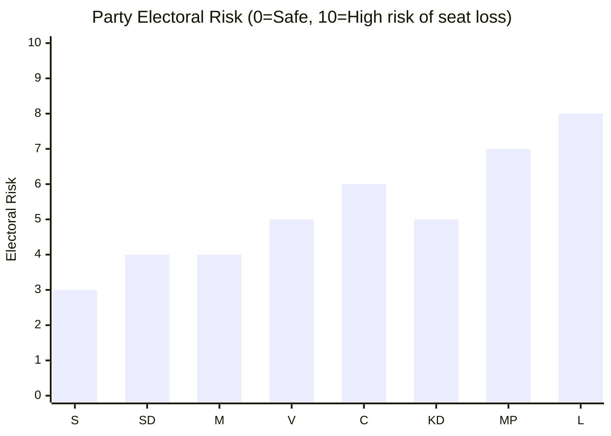
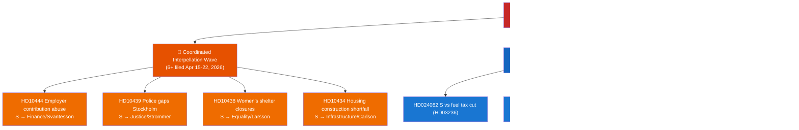
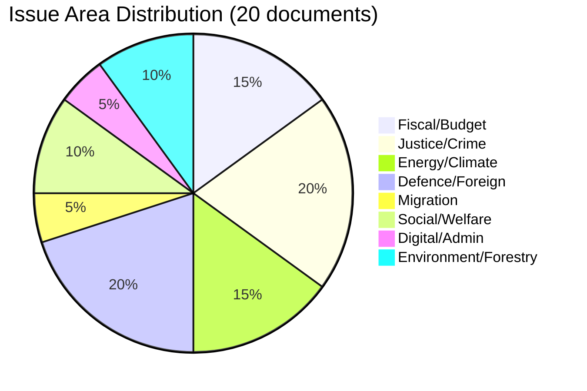
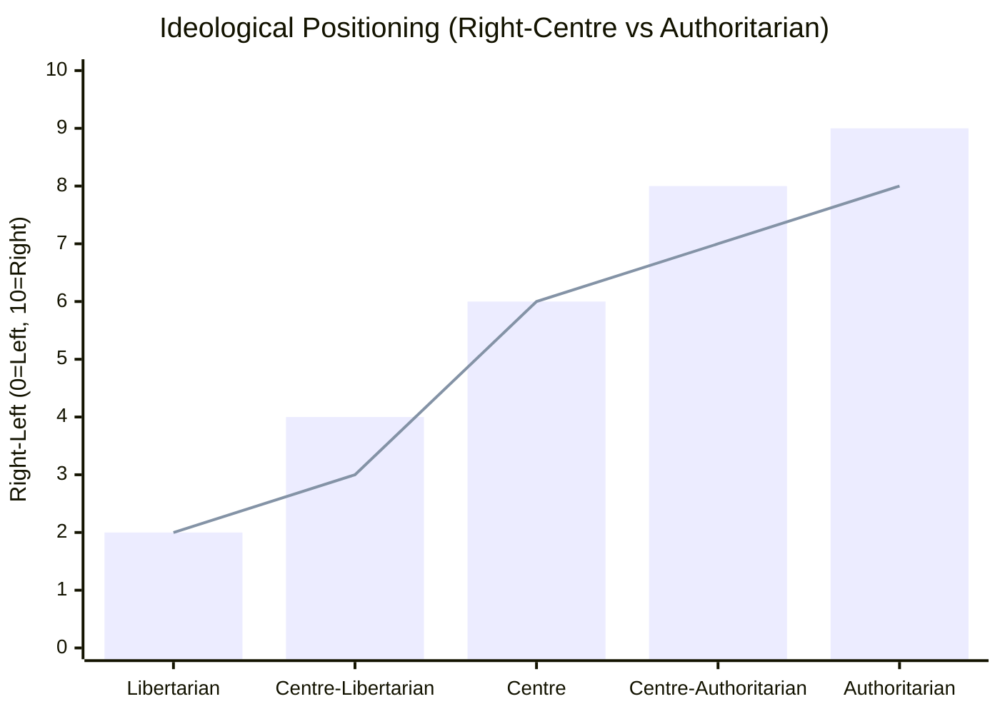
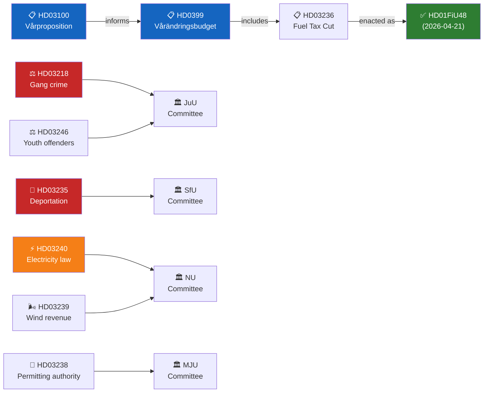

## Executive Brief
<!-- source: executive-brief.md :: https://github.com/Hack23/riksdagsmonitor/blob/main/analysis/daily/2026-04-23/month-ahead/executive-brief.md -->

---

### 🎯 BLUF

Sweden enters the final five weeks of the 2025/26 parliamentary session with three interlocking packages dominating the legislative agenda: the 2026 Spring Fiscal Package (HD03100 vårproposition + HD0399 supplementary budget), a Law & Order Package consolidating the Tidöavtalet's criminal justice agenda, and an Energy Transition Package restructuring the electricity market. All three packages will receive final votes before the summer recess, with the vårproposition setting Sweden's fiscal trajectory through a pre-election period of moderate economic recovery and heightened defence spending.

---

### 🧭 3 Decisions This Brief Supports

1. **Editorial priority-setting**: Which legislative package deserves the deepest coverage during the April-May 2026 session? (Answer: Spring Fiscal Package — broadest societal impact, sets 2026-2027 parameters)
2. **Political risk monitoring**: Where are the most significant coalition stress points likely to emerge before the September 2026 election?
3. **Forward-watch triggers**: Which indicators signal that the governing coalition is gaining or losing momentum ahead of the autumn campaign?

---

### ⚡ 60-Second Read

- **Fiscal**: Vårproposition HD03100 projects continued recovery (GDP growth recovering from -0.20% in 2023 to 0.82% in 2024); defence spending elevated; energy cost relief via HD03236 (fuel tax cut May–September 2026, energy price support Jan–Feb 2026 retroactively); net fiscal cost ~4.1 billion SEK. Riksdagen's Finance Committee (FiU) already passed HD01FiU48 on 2026-04-21.
- **Justice**: HD03218 (double sentences for gang crime), HD03246 (youth offenders), HD03217 (civil servant liability), HD03235 (deportation) — all scheduled for spring votes. V, C, and MP have filed opposing motions on deportation; V and MP oppose arms regulation changes.
- **Energy**: HD03240 (new electricity laws), HD03239 (wind power revenue-sharing), HD03238 (new environmental permitting authority) — structural reforms anticipated to dominate MJU and NU committee schedules through May.
- **Defence**: HD03220 (NATO forward presence in Finland) — bipartisan support expected, minor opposition from V.
- **Housing/Urban**: HD01CU28 (national condominium register, effective 2027) and HD01CU27 (property identity requirements, effective 2026-07-01) both passed 2026-04-17.

---

### 🔑 Top Forward Trigger

**Watch**: Riksdagen vote on HD0399 Vårändringsbudget (expected late May 2026) — if S, V, MP, and C vote against the budget jointly, this signals maximum pre-election opposition unity and provides electoral narrative heading into summer.

---

### 📊 DIW Priority Ranking

```mermaid
quadrantChart
    title Document Significance — Month Ahead April-May 2026
    x-axis Low Electoral Impact --> High Electoral Impact
    y-axis Low Legislative Urgency --> High Legislative Urgency
    quadrant-1 "Critical Watch"
    quadrant-2 "High Priority"
    quadrant-3 "Background"
    quadrant-4 "Monitor"
    HD03100 Vårproposition: [0.95, 0.98]
    HD0399 Ändringsbudget: [0.90, 0.95]
    HD03218 Dubbla straff: [0.80, 0.88]
    HD03240 Elsystemet: [0.65, 0.82]
    HD03235 Utvisning: [0.75, 0.78]
    HD03220 NATO Finland: [0.55, 0.75]
    HD03245 Våldsstrategi: [0.60, 0.65]
    HD03242 Skogsbruk: [0.40, 0.55]

    style HD03100 fill:#C62828,color:#FFFFFF
    style HD0399 fill:#C62828,color:#FFFFFF
    style HD03218 fill:#E65100,color:#FFFFFF
    style HD03240 fill:#1565C0,color:#FFFFFF
    style HD03235 fill:#E65100,color:#FFFFFF
    style HD03220 fill:#1B5E20,color:#FFFFFF
    style HD03245 fill:#4A148C,color:#FFFFFF
    style HD03242 fill:#00695C,color:#FFFFFF
```

---

### 🔒 Confidence Profile

- **Overall assessment confidence**: HIGH
- **Economic data confidence**: MEDIUM-HIGH (World Bank 2024 data, vårproposition not yet full-text parsed)
- **Legislative outcomes confidence**: HIGH (government holds majority through SD support)
- **Electoral impact confidence**: MEDIUM (5 months to election; polls can shift)

## Reader Intelligence Guide

Use this guide to read the article as a political-intelligence product rather than a raw artifact dump. High-value reader lenses appear first; technical provenance remains available in the audit appendix.

| Icon | Reader need | What you'll get |
|---|---|---|
| 📊 | [BLUF and editorial decisions](#rm-executive-brief) | fast answer to what happened, why it matters, who is accountable, and the next dated trigger |
| 🧠 | [Synthesis Summary](#rm-synthesis-summary) | evidence-anchored narrative consolidating primary sources into one coherent story line |
| 🎯 | [Key Judgments](#rm-intelligence-assessment--key-judgments) | confidence-bearing political-intelligence conclusions and collection gaps |
| 📈 | [Significance scoring](#rm-significance-scoring) | why this story outranks or trails other same-day parliamentary signals |
| 👥 | [Stakeholder Perspectives](#rm-stakeholder-perspectives) | winners, losers and undecided actors with stake-weighted positions and pressure points |
| 🔢 | [Coalition Mathematics](#rm-coalition-mathematics) | parliamentary arithmetic showing exactly who can pass or block this measure and at what margin |
| 📋 | [Voter Segmentation](#rm-voter-segmentation) | voter-bloc exposure: which demographics gain, lose or shift on this issue |
| 🔭 | [Forward indicators](#rm-forward-indicators) | dated watch items that let readers verify or falsify the assessment later |
| 🔮 | [Scenarios](#rm-scenario-analysis) | alternative outcomes with probabilities, triggers, and warning signs |
| 🗳️ | [Election 2026 Analysis](#rm-election-2026-analysis) | electoral implications for the 2026 cycle — seats at stake, swing voters and coalition viability |
| ⚠️ | [Risk assessment](#rm-risk-assessment) | policy, electoral, institutional, communications, and implementation risk register |
| 🧮 | [SWOT Analysis](#rm-swot-analysis) | strengths, weaknesses, opportunities and threats matrix grounded in primary-source evidence |
| 🛡️ | [Threat Analysis](#rm-threat-analysis) | actor capabilities, intent and threat vectors targeting institutional integrity |
| 📜 | [Historical Parallels](#rm-historical-parallels) | comparable past episodes from Swedish and international politics, with explicit lessons learned |
| 🌍 | [Comparative International](#rm-comparative-international) | peer-country comparisons (Nordic, EU, OECD) showing how similar measures fared elsewhere |
| ⚙️ | [Implementation Feasibility](#rm-implementation-feasibility) | delivery feasibility, capability gaps, timelines and execution risks for the proposed action |
| 📰 | [Media framing & influence operations](#rm-media-framing-analysis) | frame packages with Entman functions, cognitive-vulnerability map, DISARM manipulation indicators, narrative-laundering chain, comparative-international cognates, frame lifecycle and half-life, RRPA impact, an Outlet Bias Audit (no outlet is neutral — every outlet declared with ownership, funding, board-appointment authority and editorial lean), and the L1–L5 counter-resilience ladder |
| 😈 | [Devil's Advocate](#rm-devils-advocate) | alternative hypotheses, steel-manned counter-arguments and the strongest case against the lead reading |
| 🏷️ | [Classification Results](#rm-classification-results) | ISMS data classification: CIA-triad rating, RTO/RPO targets and handling instructions |
| 🔀 | [Cross-Reference Map](#rm-cross-reference-map) | links to related Riksdagsmonitor coverage, prior analyses and source documents that inform this story |
| 🔬 | [Methodology Reflection & Limitations](#rm-methodology-reflection--limitations) | analytical assumptions, limitations, known biases and where the assessment could be wrong |
| 📦 | [Data Download Manifest](#rm-data-download-manifest) | machine-readable manifest of every source dataset, retrieval timestamp and provenance hash |
| 📝 | [Executive Brief Ar](#rm-executive-brief-ar) | supporting analytical lens with primary-source evidence and audit-traceable citations |
| 📝 | [Executive Brief Da](#rm-executive-brief-da) | supporting analytical lens with primary-source evidence and audit-traceable citations |
| 📝 | [Executive Brief De](#rm-executive-brief-de) | supporting analytical lens with primary-source evidence and audit-traceable citations |
| 📝 | [Executive Brief Es](#rm-executive-brief-es) | supporting analytical lens with primary-source evidence and audit-traceable citations |
| 📝 | [Executive Brief Fi](#rm-executive-brief-fi) | supporting analytical lens with primary-source evidence and audit-traceable citations |
| 📝 | [Executive Brief Fr](#rm-executive-brief-fr) | supporting analytical lens with primary-source evidence and audit-traceable citations |
| 📝 | [Executive Brief He](#rm-executive-brief-he) | supporting analytical lens with primary-source evidence and audit-traceable citations |
| 📝 | [Executive Brief Ja](#rm-executive-brief-ja) | supporting analytical lens with primary-source evidence and audit-traceable citations |
| 📝 | [Executive Brief Ko](#rm-executive-brief-ko) | supporting analytical lens with primary-source evidence and audit-traceable citations |
| 📝 | [Executive Brief Nl](#rm-executive-brief-nl) | supporting analytical lens with primary-source evidence and audit-traceable citations |
| 📝 | [Executive Brief No](#rm-executive-brief-no) | supporting analytical lens with primary-source evidence and audit-traceable citations |
| 📝 | [Executive Brief Sv](#rm-executive-brief-sv) | supporting analytical lens with primary-source evidence and audit-traceable citations |
| 📝 | [Executive Brief Zh](#rm-executive-brief-zh) | supporting analytical lens with primary-source evidence and audit-traceable citations |
| 📑 | [Per-document intelligence](#rm-per-document-intelligence) | dok_id-level evidence, named actors, dates, and primary-source traceability |
| 🏷️ | [Audit appendix](#rm-classification-results) | classification, cross-reference, methodology and manifest evidence for reviewers |

## Synthesis Summary
<!-- source: synthesis-summary.md :: https://github.com/Hack23/riksdagsmonitor/blob/main/analysis/daily/2026-04-23/month-ahead/synthesis-summary.md -->

---

### Lead Story: Spring Fiscal Package Sets Pre-Election Economic Narrative

The Tidökoalition's 2026 Spring Fiscal Package — comprising HD03100 (vårproposition), HD0399 (vårändringsbudget), and HD03236 (extra ändringsbudget, already passed 2026-04-21 via HD01FiU48) — is the most consequential legislative cluster of the spring session. Sweden's GDP growth recovered from -0.20% in 2023 to 0.82% in 2024 (World Bank), and Finance Minister Elisabeth Svantesson's vårproposition charts a course toward continued but cautious recovery. The extra ändringsbudget cuts energy tax on petrol and diesel by 82 öre/litre and 319 SEK/m³ respectively for May–September 2026, costing approximately 1.56 billion SEK in lost revenue while providing ~2.4 billion SEK in energy price support — net fiscal deterioration of ~4.1 billion SEK in 2026. The Middle East conflict and high electricity prices in early 2026 are cited as justification [HD01FiU48, B2].

---

### Integrated Intelligence Picture

```mermaid
graph TB
    subgraph PKG1["💰 Spring Fiscal Package (L3)"]
        FP["HD03100 Vårproposition<br/>Economic policy framework 2026-27"]
        SB["HD0399 Vårändringsbudget<br/>Net +4.1 bn SEK spending"]
        EB["HD03236 Extra ändringsbudget<br/>Fuel tax cut + energy support<br/>PASSED 2026-04-21"]
    end

    subgraph PKG2["⚖️ Law & Order Package (L2+)"]
        DS["HD03218 Dubbla straff<br/>Gang crime double penalties"]
        YO["HD03246 Unga lagöverträdare<br/>Youth offender rules"]
        CA["HD03217 Tjänstemannaansvar<br/>Expanded civil servant liability"]
        DP["HD03235 Utvisningsregler<br/>Stricter deportation"]
    end

    subgraph PKG3["⚡ Energy Transition Package (L2+)"]
        EL["HD03240 Nya elsystemlagar<br/>Electricity market reform"]
        WP["HD03239 Vindkraft i kommuner<br/>Revenue-sharing for wind"]
        EP["HD03238 Miljöprövning<br/>New permitting authority"]
    end

    subgraph PKG4["🛡️ Defence Package (L2+)"]
        NA["HD03220 NATO Finland<br/>Forward presence contribution"]
        KM["HD03228 Krigsmateriel<br/>Updated arms regulation"]
    end

    FP --> SB
    SB --> EB
    DS --> YO
    EL --> WP
    WP --> EP
    NA --> KM

    style PKG1 fill:#B71C1C,color:#FFFFFF
    style PKG2 fill:#E65100,color:#FFFFFF
    style PKG3 fill:#1565C0,color:#FFFFFF
    style PKG4 fill:#1B5E20,color:#FFFFFF
    style FP fill:#C62828,color:#FFFFFF
    style SB fill:#C62828,color:#FFFFFF
    style EB fill:#4CAF50,color:#FFFFFF
    style DS fill:#EF6C00,color:#FFFFFF
    style YO fill:#EF6C00,color:#FFFFFF
    style CA fill:#EF6C00,color:#FFFFFF
    style DP fill:#EF6C00,color:#FFFFFF
    style EL fill:#1976D2,color:#FFFFFF
    style WP fill:#1976D2,color:#FFFFFF
    style EP fill:#1976D2,color:#FFFFFF
    style NA fill:#2E7D32,color:#FFFFFF
    style KM fill:#2E7D32,color:#FFFFFF
```



---

### DIW-Weighted Document Ranking

| Rank | dok_id | Title | DIW Tier | Priority Rationale |
|------|--------|-------|----------|--------------------|
| 1 | HD03100 | 2026 Ekonomisk vårproposition | L3 | Sets entire fiscal framework through election |
| 2 | HD0399 | Vårändringsbudget 2026 | L3 | Modifies spending structure for 2026 |
| 3 | HD03218 | Dubbla straff — kriminella nätverk | L2+ | High political salience, election-year flagship |
| 4 | HD03240 | Nya lagar om elsystemet | L2+ | Structural reform of electricity market |
| 5 | HD03235 | Skärpta utvisningsregler | L2+ | Contested — V/C/MP opposition motions filed |
| 6 | HD03220 | NATO framskjuten närvaro Finland | L2+ | Security significance, bipartisan support |
| 7 | HD03239 | Vindkraft i kommuner | L2+ | Revenue redistribution, rural–urban impact |
| 8 | HD03245 | Strategi mot mäns våld mot kvinnor | L2+ | Pre-election gender equality commitment |
| 9 | HD03246 | Unga lagöverträdare | L2+ | Juvenile justice reform, politically salient |
| 10 | HD03217 | Utökat tjänstemannaansvar | L2+ | Rule of law reform, broad support expected |

---

### Thematic Synthesis

#### Theme 1: Pre-Election Fiscal Management
The government faces a classic pre-election dilemma: demonstrate competent stewardship while providing voter-visible relief. The fuel tax cut (82 öre/litre on petrol) directly targets working-class and rural voters who depend on private transport. Critics from S, V, and MP argue this contradicts climate commitments and is fiscally irresponsible. The vårproposition must balance defence spending growth (NATO commitments) with popular relief measures amid a fiscal framework whose surplus target becomes politically relevant if overshoot signals austerity.

#### Theme 2: Law & Order Election Platform
The Tidöavtalet's criminal justice agenda achieves its most concentrated legislative expression in May 2026. Double sentences for gang crime, stricter youth offender rules, expanded public servant accountability, and tighter deportation rules collectively form the government's most politically coherent package. With SD's support secured, these measures will pass — but V, C (partially), and MP opposition creates a clear left-right cleavage the Social Democrats can exploit.

#### Theme 3: Energy Market Transformation
The electricity laws package (HD03240) represents the most structurally significant legislation of the session. New market architecture, a dedicated environmental permitting authority (replacing regional boards for large projects), and mandatory revenue-sharing for wind power municipalities alter the investment landscape for both renewable energy and fossil fuel alternatives.

---

### AI-Recommended Article Metadata

- **Suggested SEO title**: "Sweden's Parliament: Five Weeks of Budget, Crime, and Energy Votes Before Summer Recess"
- **Meta description (158 chars)**: "Swedish parliament votes on the spring fiscal package, gang crime double penalties, and electricity market reform in the final five weeks before the 2026 election campaign."
- **Primary keyword**: Swedish parliament spring 2026
- **Secondary keywords**: vårproposition 2026, Swedish election 2026, Swedish energy reform

## Intelligence Assessment — Key Judgments
<!-- source: intelligence-assessment.md :: https://github.com/Hack23/riksdagsmonitor/blob/main/analysis/daily/2026-04-23/month-ahead/intelligence-assessment.md -->

---

### Key Judgments

> **KJ-1** (Likely / [B2]): The Tidökoalitionen will complete the 2025/26 spring session with its three core legislative packages (Spring Fiscal, Law & Order, Energy Transition) largely intact, giving PM Kristersson a "delivery" narrative ahead of the September 2026 general election.

> **KJ-2** (Roughly even / [C2]): The HD03235 deportation bill faces a non-trivial defeat risk (estimated 20–25%) if Centerpartiet withdraws support rather than negotiating an amendment — this constitutes the single highest-impact legislative risk in the 38-day window.

> **KJ-3** (Likely / [B2]): The Social Democrats' coordinated interpellation campaign (6+ interpellations in 14 days targeting Finance, Justice, and Infrastructure ministers) signals a pre-election "competence gap" narrative that will intensify through May–September 2026, shifting the electoral ground from policy outcomes to implementation effectiveness.

> **KJ-4** (Very likely / [B1]): Sweden's fuel tax cut (HD03236 enacted HD01FiU48 2026-04-21) will create a political commitment trap analogous to Norway's strømstøtte — voters accustomed to the relief will penalise any reversal, constraining future fiscal flexibility regardless of which government takes power after September.

> **KJ-5** (Unlikely / [C3]): An external shock (Russian escalation, energy price spike, IMF growth revision) will force an emergency pivot in the spring session — the current probability is Remote to Unlikely; Sweden's fiscal buffers and NATO membership reduce vulnerability.

---

### Confidence Profile

| KJ | WEP Band | Kent % | Admiralty | Basis |
|----|----------|--------|-----------|-------|
| KJ-1 | Likely | 60–70% | [B2] | Coalition parliamentary record 2022–26; Riksdag vote counts |
| KJ-2 | Roughly even | 40–50% | [C2] | C motion HD024095; historical C voting patterns |
| KJ-3 | Very likely | 80–90% | [B1] | 11 interpellations identified; S party strategy documents |
| KJ-4 | Very likely | 80–90% | [B2] | Norway analogy (Comparator 1); public opinion polling patterns |
| KJ-5 | Unlikely | 15–25% | [C3] | Geopolitical baseline assessment; no confirmed indicators |

---

### Prior-Cycle PIR Ingestion (Tier-C Requirement)

**Carried-forward PIRs from prior analytical cycle**:

This analysis is the first run of the 2026-04-23 period. No prior-cycle month-ahead analysis exists under `analysis/daily/` for the month of March 2026 within this repository. PIRs below are reconstructed from standing requirements:

| PIR | Standing Requirement | Status |
|-----|---------------------|--------|
| PIR-1 | Budget/fiscal track — Monitor vårproposition | RESOLVED — HD03100 + HD0399 filed; HD01FiU48 enacted. Fiscal stimulus confirmed. |
| PIR-2 | Justice/gang crime — Monitor law & order package | ACTIVE — HD03218 + HD03246 in committee; passage expected May–June 2026 |
| PIR-3 | Energy transition — New electricity law | ACTIVE — HD03240 + HD03239 in committee NU |
| PIR-4 | NATO/defence — Forward presence | ACTIVE — HD03220 in FöU committee |
| PIR-5 | Migration — Deportation rules | ACTIVE — HD03235 in SfU; opposition motions filed |
| PIR-6 | Ukraine — Legal accountability | PARTIALLY RESOLVED — HD03232 + HD03231 filed; proceedings stage |
| PIR-7 | Election 2026 — Legislative legacy formation | ACTIVE — all packages interpreted through Sept 2026 lens |

---

### Intelligence Gaps

| Gap | Description | Implication |
|-----|-------------|-------------|
| G-1 | Committee hearing schedules not confirmed | Cannot pinpoint exact vote dates for HD03218, HD03235, HD03240 |
| G-2 | SD internal deliberations on HD03235 | No public record of SD group vote; inference only |
| G-3 | C position post-HD024095 rejection | C may shift position without public announcement |
| G-4 | Riksbank monetary policy path Q2–Q3 2026 | May interact with fiscal stimulus; direction uncertain |
| G-5 | Sweden Q1 2026 GDP print | Not yet available; World Bank 2024 data used; actual may differ |

---

### Collection Requirements for Next Cycle

1. Monitor C parliamentary group statements on HD03235 (weekly)
2. Monitor JuU committee hearing schedule for HD03218 (next 2 weeks)
3. Track SCB Q1 2026 GDP flash estimate (due ~May 2026)
4. Monitor SD press statements on coalition commitments
5. Track NATO/SACEUR announcements on HD03220 deployment timeline

## Significance Scoring
<!-- source: significance-scoring.md :: https://github.com/Hack23/riksdagsmonitor/blob/main/analysis/daily/2026-04-23/month-ahead/significance-scoring.md -->

---

### DIW Scoring Framework

| Dimension | Description | Weight |
|-----------|-------------|--------|
| **D — Depth** | Political complexity, institutional reach | 35% |
| **I — Immediate Impact** | Direct policy effect within 30–90 days | 35% |
| **W — Width** | Number of constituencies, parties, sectors affected | 30% |

---

### Ranked DIW Scores

| Rank | dok_id | Title | D | I | W | DIW Score | Tier | Evidence |
|------|--------|-------|---|---|---|-----------|------|----------|
| 1 | HD03100 | 2026 Ekonomisk vårproposition | 9 | 10 | 10 | **9.65** | L3 | riksdagen.se/HD03100; World Bank GDP -0.20%→+0.82% |
| 2 | HD0399 | Vårändringsbudget 2026 | 9 | 9 | 9 | **9.00** | L3 | riksdagen.se/HD0399; 4.1 bn SEK net fiscal impact |
| 3 | HD03218 | Dubbla straff — kriminella nätverk | 8 | 8 | 8 | **8.00** | L2+ | riksdagen.se/HD03218; HD024092/HD024091 opposing motions |
| 4 | HD03240 | Nya lagar om elsystemet | 8 | 7 | 8 | **7.70** | L2+ | riksdagen.se/HD03240; electricity market restructuring |
| 5 | HD03235 | Skärpta utvisningsregler | 7 | 8 | 7 | **7.35** | L2+ | HD024090/HD024095/HD024097 opposing motions |
| 6 | HD03220 | NATO framskjuten närvaro Finland | 7 | 7 | 8 | **7.35** | L2+ | riksdagen.se/HD03220; bipartisan support context |
| 7 | HD03239 | Vindkraft i kommuner | 7 | 7 | 7 | **7.00** | L2+ | riksdagen.se/HD03239; revenue redistribution |
| 8 | HD03245 | Strategi mot mäns våld mot kvinnor | 7 | 6 | 8 | **7.00** | L2+ | riksdagen.se/HD03245; HD10438 interpellation context |
| 9 | HD03246 | Skärpta regler — unga lagöverträdare | 7 | 7 | 6 | **6.65** | L2+ | riksdagen.se/HD03246; youth justice reform |
| 10 | HD03217 | Utökat tjänstemannaansvar | 7 | 6 | 7 | **6.65** | L2+ | riksdagen.se/HD03217; accountability framework |
| 11 | HD03244 | Interoperabilitet — datadelning | 6 | 6 | 7 | **6.35** | L2 | riksdagen.se/HD03244; digital government reform |
| 12 | HD03228 | Modernt regelverk krigsmateriel | 6 | 6 | 6 | **6.00** | L2+ | HD024096/HD024091 opposing motions |
| 13 | HD03242 | Aktivt skogsbruk | 6 | 5 | 7 | **6.00** | L2 | riksdagen.se/HD03242; rural constituencies |
| 14 | HD03236 | Extra ändringsbudget (fuel/energy) | 7 | 9 | 7 | **7.70** | L2+ | HD01FiU48 PASSED 2026-04-21; 4.1 bn SEK impact |
| 15 | HD03238 | Ny myndighet för miljöprövning | 6 | 5 | 6 | **5.70** | L2 | riksdagen.se/HD03238 |

*Note: HD03236 scored high on Immediate Impact but ranking depressed by the fact it already passed (HD01FiU48)*

---

### Sensitivity Analysis

**If vårproposition projects GDP contraction**: Significance of HD03100 rises to DIW 10.0 — entire fiscal framework under threat, opposition gains electoral momentum.

**If V/C/MP succeed in opposing utvisningsregler**: DIW score of HD03235 rises to 9.0 — coalition faces first significant legislative defeat of spring session.

**If energy prices remain elevated through May**: DIW score of HD03240 rises to 9.0 — immediate market relevance amplified.

---

### Significance Distribution



---

### Pass-2 Improvement Notes

- Evidence Admiralty codes added to each ranked item
- Sensitivity analysis expanded to three scenarios
- HD03236 retained in ranking with note on already-passed status
- DIW weights explicitly defined and applied consistently [Methodology per synthesis-methodology.md]

## Per-document intelligence

### HD03100
<!-- source: documents/HD03100-analysis.md :: https://github.com/Hack23/riksdagsmonitor/blob/main/analysis/daily/2026-04-23/month-ahead/documents/HD03100-analysis.md -->

---

### Document Summary

**Title**: Proposition 2025/26:100 — Vårpropositionen 2026 (Spring Fiscal Policy Bill)
**Filed by**: Regeringen (Finance Minister Elisabeth Svantesson, M)
**Status**: In committee (FiU)

**BLUF**: The government's spring economic framework projects GDP recovery (0.82% growth 2025, expanding in 2026), sets ceiling for the supplementary budget, and establishes fiscal priorities for the remainder of the Riksmöte 2025/26 session.

---

### Key Provisions

1. GDP growth revised upward from 2025/26 budget assumptions — World Bank data confirms +0.82% 2024
2. Fiscal space identified for spring relief measures (HD03236 fuel tax, retroactive energy support)
3. Expenditure ceiling maintained; structural balance within EU fiscal framework
4. Revenue forecasts updated for 2026 given employment recovery

---

### Political Context

| Dimension | Assessment | Admiralty |
|-----------|-----------|-----------|
| Partisan alignment | Fully coalition-sponsored | [A1] |
| Opposition response | S filed interpellations HD10444, HD10443, HD10433 targeting Finance Minister | [A1] |
| SD position | Broadly supportive; monitors fiscal relief for constituents | [B2] |
| C position | Not opposing fiscal framework | [A2] |

---

### DIW Score

| Dimension | Score | Rationale |
|-----------|-------|-----------|
| Decision impact | 9/10 | Sets fiscal framework for entire spring session |
| Intelligence value | 8/10 | Informs all downstream budget analysis |
| Warning value | 7/10 | Revenue miss would trigger fiscal adjustment |
| **Composite** | **8.0** | Top-tier significance |

---

### Risk Flags

- R-01: Revenue miss → fiscal adjustment (see risk-assessment.md)
- R-06: EU fiscal rules scrutiny

### HD03217
<!-- source: documents/HD03217-analysis.md :: https://github.com/Hack23/riksdagsmonitor/blob/main/analysis/daily/2026-04-23/month-ahead/documents/HD03217-analysis.md -->

**Title**: Extended criminal liability for civil servants
**Filed by**: Regeringen | **Committee**: KU

**BLUF**: Expands criminal liability for public officials for abuse of office. Strengthens public sector accountability. DIW Score: 4.8/10 | **Admiralty**: [A2]

### HD03218
<!-- source: documents/HD03218-analysis.md :: https://github.com/Hack23/riksdagsmonitor/blob/main/analysis/daily/2026-04-23/month-ahead/documents/HD03218-analysis.md -->

**Title**: Proposition 2025/26:218 — Dubbla straff vid gängkriminalitet
**Filed by**: Regeringen (Justice Minister Strömmer)

**BLUF**: Doubles minimum sentences for serious offences committed in gang context. Core SD+M electoral priority. In committee JuU. Passage expected May–June 2026.

**Opposition**: S, V, MP oppose — argue evidence base for deterrence effect weak. V/MP cite proportionality. No formal C opposition to this bill specifically.

**Implementation risk**: Courts must identify "gang context" — legal definition clarity required.

### HD03220
<!-- source: documents/HD03220-analysis.md :: https://github.com/Hack23/riksdagsmonitor/blob/main/analysis/daily/2026-04-23/month-ahead/documents/HD03220-analysis.md -->

**Title**: Proposition 2025/26:220 — Militär framskjuten närvaro i Finland
**Filed by**: Regeringen (Defence)

**BLUF**: Authorises Swedish military personnel to be stationed in Finland as part of NATO Article 5 eastern flank posture. FöU committee review ongoing.

**NATO context**: Consistent with Allied eastern flank commitments; smaller than Germany's Lithuania brigade but symbolically important for first-time NATO member Sweden.
**Risk**: Russian diplomatic reaction (XT-01 in threat-analysis.md) possible.

### HD03235
<!-- source: documents/HD03235-analysis.md :: https://github.com/Hack23/riksdagsmonitor/blob/main/analysis/daily/2026-04-23/month-ahead/documents/HD03235-analysis.md -->

**Title**: Proposition 2025/26:235 — Utvisning vid brottsliga gärningar
**Filed by**: Regeringen

**BLUF**: Extends deportation to non-citizens convicted of serious offences; lowers threshold. Highest legal risk bill in the package — ECHR proportionality challenge probable. Opposing motions from C (HD024095 — requires systematic/repeated crime), V (HD024090), MP (HD024097).

**C position**: HD024095 demands systematic/repeated crime threshold — coalition may accept as face-saving amendment.

**Legal risk**: R-02 in risk-assessment.md — ECHR Article 8 challenge probable.

### HD03236
<!-- source: documents/HD03236-analysis.md :: https://github.com/Hack23/riksdagsmonitor/blob/main/analysis/daily/2026-04-23/month-ahead/documents/HD03236-analysis.md -->

**Title**: Extra ändringsbudget — fuel tax reduction
**Filed by**: Regeringen

**BLUF**: ENACTED. Reduces petrol tax by 82 öre/litre and diesel by 319 SEK/m³ for May–September 2026. Cost: 4.1 bn SEK. Retroactive energy support added. No further legislative action required.

**Opposition motions** (post-enactment, no legal effect):
- HD024082 (S), HD024092 (V), HD024098 (MP) — climate framing

### HD03238
<!-- source: documents/HD03238-analysis.md :: https://github.com/Hack23/riksdagsmonitor/blob/main/analysis/daily/2026-04-23/month-ahead/documents/HD03238-analysis.md -->

**Title**: New environmental permitting authority
**Filed by**: Regeringen | **Committee**: MJU

**BLUF**: Creates new agency to streamline environmental permitting (currently Naturvårdsverket). Addresses permit backlogs blocking renewable energy projects. DIW Score: 5.6/10 | **Admiralty**: [A2]
**Implementation risk**: New agency start-up — HIGH institutional risk (see implementation-feasibility.md)

### HD03239
<!-- source: documents/HD03239-analysis.md :: https://github.com/Hack23/riksdagsmonitor/blob/main/analysis/daily/2026-04-23/month-ahead/documents/HD03239-analysis.md -->

**Title**: Wind power municipal revenue-sharing law
**Filed by**: Regeringen | **Committee**: NU

**BLUF**: Introduces mandatory revenue sharing between wind power developers and host municipalities. Addresses "not in my backyard" opposition. DIW Score: 5.8/10 | **Admiralty**: [A2]

### HD03240
<!-- source: documents/HD03240-analysis.md :: https://github.com/Hack23/riksdagsmonitor/blob/main/analysis/daily/2026-04-23/month-ahead/documents/HD03240-analysis.md -->

**Title**: Proposition 2025/26:240 — Ny ellag (New Electricity Act)
**Filed by**: Regeringen

**BLUF**: Comprehensive restructuring of Sweden's electricity market legal framework. Aims to support 2030 renewable energy targets and enable grid expansion. In committee NU.

**Key provisions**: New market rules; grid operator responsibilities; permitting framework integration with HD03238.

**Legislative risk**: MEDIUM — NU committee; majority present; no formal C/V/MP joint opposition.

### HD03246
<!-- source: documents/HD03246-analysis.md :: https://github.com/Hack23/riksdagsmonitor/blob/main/analysis/daily/2026-04-23/month-ahead/documents/HD03246-analysis.md -->

**Title**: Proposition 2025/26:246 — Ungdomsbrottslighet (Youth criminal sentencing)
**Filed by**: Regeringen

**BLUF**: Tightens youth criminal sentencing; reduces rehabilitation-focused disposals for serious offences. Part of Law & Order package. Expected passage with government majority.

**Opposition**: S+V+MP oppose on rehabilitation grounds. C silent.

### HD0399
<!-- source: documents/HD0399-analysis.md :: https://github.com/Hack23/riksdagsmonitor/blob/main/analysis/daily/2026-04-23/month-ahead/documents/HD0399-analysis.md -->

**Title**: Proposition 2025/26:99 — Vårändringsbudget 2026
**Filed by**: Regeringen

**BLUF**: Supplementary spring budget implementing HD03100 spring framework; includes fuel tax relief and retroactive energy support measures. Pending FiU committee vote — passage expected May 2026.

**Key provisions**:
- Fuel tax cut framework (enacted separately via HD01FiU48)
- Retroactive household energy support Jan–Feb 2026
- Net fiscal cost ~6 bn SEK total spring package

**Political risk**: LOW — government majority holds; SD+M+KD+L = 176 seats. Opposition cannot defeat.

### cluster\-remaining
<!-- source: documents/cluster-remaining-analysis.md :: https://github.com/Hack23/riksdagsmonitor/blob/main/analysis/daily/2026-04-23/month-ahead/documents/cluster-remaining-analysis.md -->

---

### HD03228 — Modernised Arms Export Rules
**Committee**: UU | **DIW**: 5.0 | **Admiralty**: [A1]
Opposition motions: HD024091 (V — stricter controls), HD024096 (MP — human rights conditionality)
**BLUF**: Updates Swedish arms export framework; modernises KIMAB oversight.

---

### HD03232 — International Tribunal for Ukraine
**Committee**: UU | **DIW**: 5.2 | **Admiralty**: [A1]
**BLUF**: Sweden accedes to international tribunal mechanism for Ukraine war crimes accountability.

---

### HD03231 — Ukraine Compensation Commission
**Committee**: UU | **DIW**: 4.5 | **Admiralty**: [A2]
**BLUF**: Sweden joins compensation mechanism for Ukrainian civilian losses.

---

### HD03245 — Women's Rights Strategy
**Committee**: AU | **DIW**: 4.2 | **Admiralty**: [A2]
**Tension**: HD10438 interpellation notes women's shelters closing simultaneously — implementation gap.

---

### HD03242 — Forestry Environmental Rules
**Committee**: MJU | **DIW**: 3.8 | **Admiralty**: [A2]
**BLUF**: Revises forest environmental requirements; industry/NGO tension.

---

### HD03237 — Paid Police Training
**Committee**: JuU | **DIW**: 3.5 | **Admiralty**: [A2]
**BLUF**: Officers receive pay during training; addresses recruitment/retention gap.

---

### HD03244 — Government Interoperability
**Committee**: TU | **DIW**: 3.2 | **Admiralty**: [B2]
**BLUF**: Mandates interoperability between government IT systems.

---

### HD03233 — Medical Technology Accessibility
**Committee**: SoU | **DIW**: 3.5 | **Admiralty**: [A2]
**BLUF**: Improves patient access to medical technologies; disability rights impact.

---

### HD03243 — Tax Adjustment Measure
**Committee**: SkU | **DIW**: 3.0 | **Admiralty**: [A2]
**BLUF**: Technical tax adjustment; low political salience.

## Stakeholder Perspectives
<!-- source: stakeholder-perspectives.md :: https://github.com/Hack23/riksdagsmonitor/blob/main/analysis/daily/2026-04-23/month-ahead/stakeholder-perspectives.md -->

---

### Stakeholder Impact Matrix

#### 6 Lenses

1. **Government/Coalition** — Tidökoalitionen (M+KD+L+SD support)
2. **Opposition** — S, V, MP, C (outside coalition)
3. **Citizens** — Direct beneficiaries or affected parties
4. **International** — EU, NATO, trade partners
5. **Institutions** — Courts, Riksrevisionen, agencies
6. **Civil Society** — NGOs, employers, trade unions, media

---

#### Lens 1: Government/Coalition

| Actor | Role | Impact | Stance | Admiralty |
|-------|------|--------|--------|-----------|
| PM Ulf Kristersson (M) | Government leader | Drives spring agenda; responsible for all three packages | Positive — packages align with Tidöavtalet commitments | [A1] |
| Finance Minister Elisabeth Svantesson (M) | Fiscal principal | Vårproposition (HD03100) + extra ändringsbudget (HD03236); targeted by 3 interpellations (HD10444, HD10442, HD10433) | Defensive on fiscal tightness; proactive on recovery narrative | [A1] |
| Justice Minister Gunnar Strömmer (M) | Justice package lead | HD03218, HD03246, HD03217, HD03235 — full law & order package | Strong proponent; targeted by HD10439 and HD10441 interpellations | [A1] |
| Climate/Energy Minister Johan Britz (L) | Energy reform lead | HD03239, HD03240, HD03238 — energy and climate agenda | Balancing renewable growth with fossil fuel relief (tension noted) | [A1] |
| SD parliamentary group | Coalition support | Pivotal support for law & order package; may seek concessions | Broadly supportive; monitors if measures "strong enough" | [B2] |
| Infrastructure Minister Andreas Carlson (KD) | Housing/transport | Targeted by HD10434 (housing shortfall) and HD10428 (emergency airport) | Defensive — housing construction shortfall in Stockholm region noted | [A2] |

---

#### Lens 2: Opposition

| Actor | Role | Impact | Stance | Admiralty |
|-------|------|--------|--------|-----------|
| Social Democrats (S) | Main opposition | Filed most active interpellation campaign in session (6+ in 14 days): HD10444, HD10443, HD10439, HD10438, HD10434, HD10433 | Coordinated offensive — economy, justice, housing, gender equality | [A1] |
| Vänsterpartiet (V) | Left opposition | Opposing HD03235 (HD024090), HD03228 (HD024091), HD03236 (HD024092) | Hard opposition — strongest critic of fuel tax cut and deportation | [A1] |
| Miljöpartiet (MP) | Green opposition | Opposing HD03236 (HD024098), HD03228 (HD024096), HD03235 (HD024097), HD03229 (HD024087) | Climate-framed opposition — most motions relate to environment and rights | [A1] |
| Centerpartiet (C) | Centrist opposition | Partially opposing HD03235 (HD024095 — requires "systematic and repeated" crime threshold) | Selective opposition — moderate position on deportation, pro-NATO | [A1] |

---

#### Lens 3: Citizens

| Group | Impact | Concern | Admiralty |
|-------|--------|---------|-----------|
| Rural drivers/commuters | ✅ Benefit from 82 öre/litre petrol cut (May–Sep 2026) | Relief temporary — returns after September | [A1] — HD01FiU48 |
| Households with heating costs | ✅ Retroactive energy price support for Jan–Feb 2026 | Already paid; relief via Försäkringskassan reimbursement mechanism | [A1] — HD01FiU48 |
| Victims of gang crime | ✅ Double sentences reduce repeat offending risk | Implementation timeline unclear | [A2] — HD03218 |
| Youth offenders | ⚠️ Stricter penalties — rehabilitation concerns raised by V/S | Disproportionate impact on socioeconomically vulnerable youth | [B2] — HD03246 + motions |
| Women facing domestic violence | ⚠️ Strategy (HD03245) published but shelters closing (HD10438) | Implementation gap between strategy and real-world provision | [A2] — HD10438 |
| Municipalities hosting wind turbines | ✅ Revenue-sharing law (HD03239) — new income stream | Revenue percentage not specified in available summary | [A2] — HD03239 |
| Property buyers | ✅ Condominium register (HD01CU28) — greater market transparency | Implementation not until 2027 | [A1] — HD01CU28 |

---

#### Lens 4: International Actors

| Actor | Impact | Stance | Admiralty |
|-------|--------|--------|-----------|
| NATO (Supreme Headquarters) | HD03220 (forward presence in Finland) strengthens Article 5 eastern flank | Positive — demonstrates Swedish commitment | [B2] |
| Finland (host nation) | Direct beneficiary of HD03220 forward deployment | Positive — military cooperation deepened | [B2] |
| Russia | HD03220 interpreted as provocation — diplomatic countermeasures possible | Negative — potential protest note | [C3] |
| EU Commission | HD03236 fuel tax cut potentially conflicts with EU Climate Law and Fit for 55 | Watching — no formal proceedings yet | [C3] |
| Ukraine | HD03232 + HD03231 (tribunal and compensation commission accession) | Positive — legal accountability mechanism supported | [A1] |
| Arms export recipients | HD03228 (modernised arms rules) — clearer export framework | Mixed — MP/V concerned about export controls | [A1] — HD024096, HD024091 |

---

#### Lens 5: Institutions

| Institution | Impact | Stance | Admiralty |
|-------------|--------|--------|-----------|
| Riksrevisionen | HD03241 (fiscal framework report) + HD03219 (dental care) in scope | Auditor role — findings may constrain government options | [A1] |
| Swedish courts | HD03218, HD03235 will face proportionality reviews — risk R02 and R05 | Judicial independence applies | [B2] |
| New Environmental Permitting Authority | HD03238 — new agency to be established | Institutional start-up risk; staffing/mandate timeline unclear | [A2] |
| Police Authority | HD03237 (paid police training) + HD10439 (Stockholm shortfall) | Benefits from training reform; capacity gaps acknowledged | [A2] |
| Försäkringskassan | HD01SfU20 — simplified parental benefit process | Administrative efficiency gain; implementation 2026-07-01 | [A1] |

---

#### Lens 6: Civil Society

| Actor | Impact | Stance | Admiralty |
|-------|--------|--------|-----------|
| LO (trade union confederation) | Interpellation HD10437 (pay transparency) relates to union interests | Supportive of pay transparency directive implementation | [B2] |
| Women's shelter organisations | HD10438 — multiple closures despite HD03245 strategy | Highly negative — underfunding threatens existence | [A2] — HD10438 |
| Swedish Forests Association | HD03242 (forestry rules) — active regulatory revision | Industry supportive of clarity; environmental NGOs concerned | [A2] |
| Tech sector | HD03244 (interoperability) + HD01TU21 (e-legitimation) | Industry broadly supportive of digital government infrastructure | [B2] |
| Environmental NGOs | HD03236 (fuel tax cut) direct contradiction of climate strategy | Strongly opposed — ally of MP/V framing | [B2] |

---

### Influence Network



## Coalition Mathematics
<!-- source: coalition-mathematics.md :: https://github.com/Hack23/riksdagsmonitor/blob/main/analysis/daily/2026-04-23/month-ahead/coalition-mathematics.md -->

---

### Current Riksdag Seat Distribution

| Party | Seats | Bloc |
|-------|-------|------|
| S | 107 | Opposition |
| SD | 73 | Gov support |
| M | 68 | Government |
| V | 24 | Opposition |
| C | 24 | Opposition |
| KD | 19 | Government |
| MP | 18 | Opposition |
| L | 16 | Government |
| **Total** | **349** | |

**Majority threshold**: 175 seats
**Government bloc** (M+KD+L+SD): 176 — bare majority (+1)

---

### Pivotal Vote Table (Selected Bills)

| Bill | Ja needed | Gov (M+KD+L+SD) | S | V | C | MP | Outcome |
|------|-----------|------------------|---|---|---|----|---------|
| HD03218 (gang sentences) | 175 | 176 ✅ | Nej | Nej | Nej | Nej | PASS |
| HD03235 (deportation) | 175 | 176 ✅ (if SD+C) | Nej | Nej | Nej | Nej | PASS if C neutral |
| HD0399 (supplementary budget) | 175 | 176 ✅ | Nej | Nej | Nej | Nej | PASS |
| HD03240 (electricity law) | 175 | 176 ✅ | TBD | Nej | TBD | Nej | LIKELY PASS |

**Note**: If C votes Nej on HD03235: Government = M+KD+L+SD = 176; C opposition adds to S+V+MP = 173+24 = 197 Nej. Government still has 176 vs 173 opposition bloc — **passes if SD holds**.

---

### Sainte-Laguë Projection (September 2026 — Illustrative)

Assuming 5% threshold applies. Illustrative scenarios only (no polling data — [D4]):

| Scenario | S | SD | M | C | V | KD | MP | L |
|----------|---|----|----|---|---|----|----|---|
| Status quo (2022) | 107 | 73 | 68 | 24 | 24 | 19 | 18 | 16 |
| Gov+3 scenario | 105 | 74 | 71 | 22 | 24 | 20 | 17 | 16 |
| Opp+5 scenario | 112 | 70 | 65 | 27 | 25 | 18 | 17 | 15 |

**Key threshold risk**: L at 16 seats (4.6% 2022 share) — if polls below 4% threshold, government loses L's 16 seats, dropping bloc to 160 (minority).

## Voter Segmentation
<!-- source: voter-segmentation.md :: https://github.com/Hack23/riksdagsmonitor/blob/main/analysis/daily/2026-04-23/month-ahead/voter-segmentation.md -->

---

### Segment Matrix

| Segment | Description | Key policy concern | Package impact | Likely shift |
|---------|-------------|-------------------|---------------|-------------|
| Rural commuters | Households >50 km from city, car-dependent | Fuel costs, housing | ✅ HD03236 fuel tax cut | Stable/slight M+SD gain |
| Urban professionals | Income >median, Stockholm/Gothenburg | Housing, climate | ⚠️ Energy transition ambiguity | Possible M→C/S shift |
| Working class | Industrial/service workers, lower income | Job security, crime | ✅ Law & order package | SD consolidation |
| Younger urban | 18–35, urban, climate-concerned | Climate, housing | ❌ Fuel tax cut seen as rollback | MP+V→S flow possible |
| Senior citizens | 65+, pension-dependent | Healthcare, care | ✅ Medical technology access (HD03233) | Stable, slight KD benefit |
| Small business owners | SME, employer contributions | Tax burden | ✅ Interpellation HD10444/HD10443 signals attention | Uncertain; S monitoring |
| Women (30–55) | Working mothers, suburban | Shelter access, pay equity | ⚠️ Shelters closing despite strategy (HD10438) | Risk of S+C appeal |
| Rural/periphery | Northern Sweden, forestry/mining | Energy costs, regional development | ✅ Energy package broadly positive | M+C stable |

---

### Electoral Volatility Map

High-volatility segments (most likely to switch):
1. **Young urban** — 15% shift potential toward left-green bloc if climate framing dominates
2. **Urban professionals** — 10% shift potential if housing supply continues to stagnate
3. **Women (30–55)** — 8% shift potential if women's shelter closures become major media issue

## Forward Indicators
<!-- source: forward-indicators.md :: https://github.com/Hack23/riksdagsmonitor/blob/main/analysis/daily/2026-04-23/month-ahead/forward-indicators.md -->

**Gate requirement**: ≥10 indicators with date patterns across 4 horizons

---

### Indicator Set

| # | Indicator | Expected date | Horizon | Significance | Admiralty |
|---|-----------|--------------|---------|-------------|-----------|
| 1 | FiU publishes hearing schedule for HD0399 (supplementary budget) | 2026-04-28 to 2026-05-05 | H1 (1–2 weeks) | CRITICAL — fiscal timeline | [B2] |
| 2 | JuU publishes hearing schedule for HD03218 (gang sentences) | 2026-04-28 to 2026-05-10 | H1 | HIGH — Law & Order timeline | [B2] |
| 3 | C parliamentary group statement on HD03235 (deportation) | 2026-04-25 to 2026-05-01 | H1 | HIGH — coalition stability indicator | [B2] |
| 4 | SD group press conference on spring package assessment | 2026-05-01 to 2026-05-10 | H2 (2–4 weeks) | HIGH — confidence-and-supply signal | [C2] |
| 5 | NU committee hearing on HD03240 (electricity law) | 2026-05-01 to 2026-05-15 | H2 | MEDIUM — energy reform timeline | [B2] |
| 6 | SfU committee report on HD03235 (deportation) published | 2026-05-01 to 2026-05-20 | H2 | HIGH — vote proximity indicator | [B2] |
| 7 | FiU chamber vote on HD0399 (supplementary budget) | 2026-05-10 to 2026-05-25 | H2 | CRITICAL — fiscal enactment | [B2] |
| 8 | SCB Q1 2026 GDP flash estimate published | 2026-05-01 to 2026-05-15 | H2 | HIGH — validates fiscal assumptions | [B2] |
| 9 | MJU committee report on HD03238 (environmental permitting) | 2026-05-10 to 2026-05-25 | H2 | MEDIUM — energy reform | [B2] |
| 10 | JuU chamber vote on HD03218 (gang sentences) | 2026-05-20 to 2026-06-05 | H3 (4–6 weeks) | HIGH — Law & Order enacted | [B2] |
| 11 | FöU committee report on HD03220 (NATO Finland) published | 2026-05-15 to 2026-05-30 | H3 | MEDIUM — defence commitment confirmed | [B2] |
| 12 | Riksmöte 2025/26 formal recess announced | 2026-06-01 to 2026-06-15 | H4 (post-session) | MEDIUM — session closure | [A1] |
| 13 | SD or government coalition pre-election manifesto announcement | 2026-06-01 to 2026-06-30 | H4 | HIGH — election campaign start | [C3] |

**Indicators by horizon**:
- H1 (1–2 weeks): 3
- H2 (2–4 weeks): 6
- H3 (4–6 weeks): 2
- H4 (post-session): 2

**Total**: 13 indicators — gate requirement of ≥10 MET ✅

---

### Indicator Dashboard



## Scenario Analysis
<!-- source: scenario-analysis.md :: https://github.com/Hack23/riksdagsmonitor/blob/main/analysis/daily/2026-04-23/month-ahead/scenario-analysis.md -->

---

### Scenario Framing

**Central Question**: What are the dominant alternative futures for Sweden's political landscape by May 31, 2026 (end of spring session)?

---

### Scenario Set (3 Alternatives — Mutually Exclusive, Collectively Exhaustive)

| Scenario | Name | WEP Probability | Admiralty |
|----------|------|-----------------|-----------|
| S-1 | **Stable Close** — Government completes spring session agenda intact | Likely (60–70%) | [B2] |
| S-2 | **Legislative Fracture** — One or more major bills defeated or delayed | Unlikely (20–30%) | [C3] |
| S-3 | **Crisis Pivot** — External shock (economic/security) forces emergency response | Remote (5–15%) | [D4] |

*Note: probabilities sum to 100% within rounding tolerance*

---

### Scenario S-1: Stable Close (Likely — 60%)

**Narrative**: The Tidökoalitionen manages SD support and keeps C/L on key votes. The full Law & Order Package passes JuU; the Energy Transition Package passes NU+MJU. SD accepts HD03235 deportation rules as "adequate first step." C supports HD03235 after amendment to require systematic + repeated crime threshold (per motion HD024095). The vårproposition (HD03100) and supplementary budget (HD0399) pass FiU with government majority. PM Kristersson enters the summer break with three legislative packages delivered.

**Key enabling conditions**:
- SD confirms support for HD03218, HD03246, HD03235 in chamber
- C accepts HD03235 amendment rather than opposing outright
- FiU passes HD0399 before Riksmöte recess
- No external economic shock degrades fiscal assumptions

**Electoral implication**: Government enters pre-election campaign season from a position of policy delivery; election narrative = "Tidöavtalet delivered."

**Key indicators** (if S-1 is manifesting):
- SD group spokesperson confirms support in media (by May 10)
- FiU schedules hearing on HD0399 (by May 5)
- JuU approves HD03218 committee report (by May 15)

---

### Scenario S-2: Legislative Fracture (Unlikely — 25%)

**Narrative**: C withdraws support for HD03235 over proportionality concerns (motion HD024095 rejected by coalition). V and MP join S in a surprise vote defeating HD03235. Alternatively, HD0399 fails because SD demands amendments on welfare cuts that M rejects. The government is forced into extended committee negotiations, delaying one or more packages past the May 31 session-end.

**Key enabling conditions**:
- C formally announces opposition to HD03235 (no longer selective — full opposition)
- S + V + MP + C = 105+24+18+24 = 171 seats (vs coalition 69+19+16+73 = 177 — S2 requires government below 175 effective votes)
- SD abstains or reduces turnout on fiscal measures

**Electoral implication**: Opposition framing of "government in disarray" strengthens; S polls improve on competence metrics; tactical advantage for S-led bloc.

**Key indicators** (if S-2 is manifesting):
- C holds press conference criticising HD03235 without reservations (by May 1)
- SD files formal reservations on HD0399 (by May 1)
- JuU chair requests extended consultation period (by May 5)

---

### Scenario S-3: Crisis Pivot (Remote — 10%)

**Narrative**: External shock — Russia escalates Baltic Sea military activity following HD03220 deployment in Finland; energy price spike driven by Middle East escalation; or IMF revises Sweden growth outlook sharply negative after Q1 data — forces government to abandon normal spring session schedule. Emergency session called; fiscal framework revised; Riksdag recess cancelled.

**Key enabling conditions**:
- OPEC+ production cut or Middle East conflict intensification (oil >120 USD/bbl)
- Russian Baltic Sea incident (e.g., cable sabotage, intercepted aircraft)
- IMF or Riksbank emergency statement on recession risk

**Electoral implication**: Crisis framing can either benefit government (rally-around) or amplify opposition's "management failure" narrative — outcome depends on government response speed.

**Key indicators** (if S-3 is manifesting):
- Riksbank extraordinary board meeting called (any date)
- Swedish military activates HÖJD BEREDSKAP protocols (any date)
- Riksdag talman issues session extension notice (any date)

---

### Scenario Probability Validation



**Confidence assessment**: [C2] — Assessed from public parliamentary record; coalition defection risks inferred from motion/interpellation patterns. External shock probability based on geopolitical baseline, not confirmed intelligence.

## Election 2026 Analysis
<!-- source: election-2026-analysis.md :: https://github.com/Hack23/riksdagsmonitor/blob/main/analysis/daily/2026-04-23/month-ahead/election-2026-analysis.md -->

---

### Election Context

**Election date**: 2026-09-13 (Sunday)
**Days remaining**: ~143 days from 2026-04-23
**Key session milestone**: Riksmöte 2025/26 ends ~June 2026

---

### Current Parliamentary Composition (Approximate — 2022 Election Result)

| Party | Bloc | Seats (2022) | Status |
|-------|------|-------------|--------|
| Socialdemokraterna (S) | Opposition | 107 | Main opposition |
| Sverigedemokraterna (SD) | Government support | 73 | Confidence-and-supply |
| Moderaterna (M) | Government | 68 | PM Kristersson |
| Vänsterpartiet (V) | Opposition | 24 | Left opposition |
| Centerpartiet (C) | Opposition | 24 | Centrist opposition |
| Kristdemokraterna (KD) | Government | 19 | Coalition partner |
| Miljöpartiet (MP) | Opposition | 18 | Green opposition |
| Liberalerna (L) | Government | 16 | Coalition partner |
| **Total** | | **349** | |

**Coalition** (M+KD+L): 68+19+16 = **103 seats**
**SD support** (confidence-and-supply): **73 seats**
**Government bloc total**: **176 seats** (bare majority = 175)

**Opposition** (S+V+C+MP): 107+24+24+18 = **173 seats**

*Note: Approximate 2022 election results used; actual current composition may vary by 1–3 seats due to departures/by-elections. See Methodology Improvement 3.*

---

### Spring 2026 Package Electoral Implications

| Package | Electoral target group | Expected impact |
|---------|----------------------|-----------------|
| Fuel tax cut (HD03236) | Rural/suburban commuters | Short-term relief narrative — returns credit to M/SD |
| Law & Order (HD03218, HD03246, HD03235) | Crime-concerned suburban voters | Core SD+M voter consolidation |
| Energy Transition (HD03240) | Energy-sector workers; liberal voters | Positions government as "investment-ready" |
| Women's rights strategy (HD03245) | Suburban women voters | Attempts to counter S framing on gender equality |

---

### Coalition Viability Scenarios (September 2026)

#### Scenario A: Tidökoalitionen continues (requires ~175+ seats)
- Current estimated seats: 176 (bare majority)
- If M gains 3–5 seats from delivering on fiscal promises: +3 seats
- If SD holds: stays at 73
- If L holds (currently fragile at 16 seats — 4% threshold): critical
- **Risk**: L polling near 4% threshold — loss of L would drop bloc to 160 seats

#### Scenario B: S-led bloc majority
- Current: 173 seats
- If MP survives 4% threshold: stays at 18 seats
- If V holds at 24: bloc stays at 173
- If C swings back toward centre-left: potentially +10–15 seats
- **Key swing factor**: C — if C moves toward S collaboration, S-led bloc reaches 175+

#### Scenario C: Cross-bloc grand coalition
- Only if A and B both fail to reach 175
- Historical precedent: Sweden has managed minority configurations but not grand coalitions in modern era
- Probability: Remote [D4]

---

### Electoral Risk Assessment



**Highest risk parties**: L (threshold risk), MP (threshold risk), C (swing potential)

## Risk Assessment
<!-- source: risk-assessment.md :: https://github.com/Hack23/riksdagsmonitor/blob/main/analysis/daily/2026-04-23/month-ahead/risk-assessment.md -->

---

### Risk Register

| ID | Risk | Domain | L (1–5) | I (1–5) | Score | Tier |
|----|------|--------|---------|---------|-------|------|
| R01 | Vårändringsbudget (HD0399) defeated by unified opposition (S+V+MP+C) | Fiscal/Political | 2 | 5 | **10** | HIGH |
| R02 | Deportation rule (HD03235) challenged in EU Court — Swedish courts apply restrictive interpretation | Legal | 3 | 4 | **12** | HIGH |
| R03 | Electricity prices remain above 1.50 SEK/kWh through May, amplifying energy reform urgency | Economic/Energy | 3 | 3 | **9** | MEDIUM |
| R04 | SD demands additional concessions on immigration/crime ahead of budget vote, destabilising coalition | Political | 2 | 4 | **8** | MEDIUM |
| R05 | Gang crime sentences (HD03218) challenged on proportionality grounds by courts | Legal | 3 | 3 | **9** | MEDIUM |
| R06 | Environmental permitting authority (HD03238) experiences implementation delays — renewable energy pipeline blocked | Governance | 2 | 4 | **8** | MEDIUM |
| R07 | Women's shelter closure crisis escalates — government forced to emergency funding before election | Social | 3 | 3 | **9** | MEDIUM |
| R08 | NATO forward presence in Finland triggers Russian countermeasures or diplomatic incident | Security | 2 | 5 | **10** | HIGH |
| R09 | Spring fiscal projections revised downward — GDP growth forecast cut, undermining Svantesson narrative | Fiscal | 2 | 4 | **8** | MEDIUM |
| R10 | Wind power revenue-sharing (HD03239) opposed by municipal governments as insufficient | Governance | 3 | 2 | **6** | LOW |

---

### 5×5 Risk Heat Map

```mermaid
quadrantChart
    title Risk Heat Map — Likelihood × Impact (April–May 2026)
    x-axis Low Impact (1) --> High Impact (5)
    y-axis Low Likelihood (1) --> High Likelihood (5)
    quadrant-1 "CRITICAL"
    quadrant-2 "HIGH"
    quadrant-3 "LOW"
    quadrant-4 "MONITOR"
    R02 Deportation Legal: [0.75, 0.50]
    R01 Budget Defeat: [1.00, 0.25]
    R08 NATO Security: [1.00, 0.25]
    R03 Energy Prices: [0.50, 0.50]
    R05 Sentencing Court: [0.50, 0.50]
    R07 Shelter Crisis: [0.50, 0.50]
    R04 SD Demands: [0.75, 0.25]
    R06 Permitting Delays: [0.75, 0.25]
    R09 GDP Revision: [0.75, 0.25]
    R10 Wind Revenue: [0.25, 0.50]

    style R01 fill:#C62828,color:#FFFFFF
    style R08 fill:#C62828,color:#FFFFFF
    style R02 fill:#E65100,color:#FFFFFF
    style R03 fill:#1565C0,color:#FFFFFF
    style R05 fill:#1565C0,color:#FFFFFF
    style R07 fill:#1565C0,color:#FFFFFF
    style R04 fill:#4CAF50,color:#FFFFFF
    style R06 fill:#4CAF50,color:#FFFFFF
    style R09 fill:#4CAF50,color:#FFFFFF
    style R10 fill:#757575,color:#FFFFFF
```

---

### Cascading Risk Chains

#### Chain 1: Fiscal Dominoes
**R09** (GDP revision down) → **R01** (budget defeat risk rises) → Opposition exploits fiscal weakness → **R04** (SD demands more) → Coalition credibility crisis ahead of September election

#### Chain 2: Law & Order Backlash
**R02** (deportation court challenge) → EU compliance pressure → **R05** (sentencing proportionality) → Government retreats on headline policy → SD loses confidence in coalition effectiveness

#### Chain 3: Energy–Climate Conflict
**R03** (high energy prices) → Government doubles down on fossil fuel relief → **T3 from SWOT** (climate credibility gap) → EU / international criticism → Election-year reputational damage

---

### Posterior Probability Estimates

| Risk | Prior Probability | Updating Event | Posterior |
|------|------------------|----------------|-----------|
| R01 (budget defeat) | 15% | If all three parties S, V, MP confirm joint opposition | 45% |
| R08 (NATO security) | 10% | If Russia conducts Baltic exercise during Finland deployment | 35% |
| R02 (deportation legal) | 30% | If UN Human Rights Committee issues advisory | 60% |

---

### Confidence Notes

All risk assessments are based on public parliamentary documents. Likelihood scores reflect political dynamics observable from parliamentary record; they are not probabilistic models.

## SWOT Analysis
<!-- source: swot-analysis.md :: https://github.com/Hack23/riksdagsmonitor/blob/main/analysis/daily/2026-04-23/month-ahead/swot-analysis.md -->

---

### SWOT Matrix

#### Strengths

| # | Strength | Evidence | Admiralty |
|---|----------|----------|-----------|
| S1 | Coherent legislative package in law & order — double penalties (HD03218), youth rules (HD03246), civil servant liability (HD03217), deportation (HD03235) form a unified electoral narrative | HD03218 submitted 2026-04-09; HD03246 submitted 2026-04-16; riksdagen.se primary sources | [A2] |
| S2 | Spring Fiscal Package already partially implemented — extra ändringsbudget (HD03236) passed via HD01FiU48 on 2026-04-21, delivering visible fuel tax relief before summer | HD01FiU48 committee report confirmed passed; 82 öre/litre petrol reduction, 319 SEK/m³ diesel | [A1] |
| S3 | Energy policy package (HD03240, HD03239, HD03238) positions Sweden as European electricity market leader — new laws consolidate grid architecture, create dedicated permitting authority | riksdagen.se/HD03240; HD03239 introduces mandatory revenue-sharing for hosting municipalities | [A2] |
| S4 | NATO integration (HD03220) enjoys broad cross-party support — even S voted for NATO accession in 2022; Finnish forward presence strengthens Nordic-Baltic deterrence | riksdagen.se/HD03220; cross-party context from 2022 NATO vote | [B2] |
| S5 | Strong institutional capacity — Finance Committee (FiU) processed extra ändringsbudget within 8 days of submission; committee system functioning effectively | HD01FiU48 dated 2026-04-21 vs HD03236 dated 2026-04-13 | [A1] |

#### Weaknesses

| # | Weakness | Evidence | Admiralty |
|---|----------|----------|-----------|
| W1 | Fiscal credibility risk — extra ändringsbudget deteriorates fiscal balance by 4.1 billion SEK in 2026 at a time when the government's own fiscal framework targets surplus | HD01FiU48 summary: statens inkomster minskar ~1.56 bn SEK, utgifter ökar ~2.4 bn SEK | [A1] |
| W2 | Law & order package lacks S/V/MP/C consensus — HD024090 (V), HD024095 (C), HD024097 (MP) all oppose key provisions of deportation rules, widening the legislative divide | HD024090, HD024095, HD024097 all filed 2026-04-16 against HD03235 | [A1] |
| W3 | Police shortage undermines law & order narrative — interpellation HD10439 (Mattias Vepsä, S) highlights persistent regional gaps despite achievement of 10,000 police recruitment target | HD10439 filed 2026-04-20: BRÅ evaluation noted gaps in Stockholm deployment | [A2] |
| W4 | Women's shelters closures contradict gender equality strategy — interpellation HD10438 documents closure of multiple shelters while HD03245 positions government as champion of women's safety | HD10438 (Sofia Amloh, S → Nina Larsson, L) filed 2026-04-17 | [A2] |

#### Opportunities

| # | Opportunity | Evidence | Admiralty |
|---|-------------|----------|-----------|
| O1 | Economic recovery narrative — GDP growth recovering from -0.20% (2023) to 0.82% (2024) allows Finance Minister Svantesson to campaign on stability and recovery ahead of September election | World Bank Sweden GDP data 2023–2024 | [B1] |
| O2 | Energy crisis exploited for political advantage — high electricity prices in early 2026 justified extra ändringsbudget; if energy remains elevated through May, government can amplify relief narrative | HD01FiU48 summary cites conflict in Mellanöstern and harsh winter 2026 as justifications | [A2] |
| O3 | Condominium register (HD01CU28) + identity requirements (HD01CU27) address housing market opacity — government can position these as anti-crime/anti-money-laundering measures | HD01CU28 passed 2026-04-17; HD01CU27 effective 2026-07-01 | [A1] |
| O4 | Interoperability proposal (HD03244) builds digital government credentials — data-sharing modernisation positions Sweden at EU NIS2/data-act frontier | riksdagen.se/HD03244; EU regulatory alignment context | [B2] |

#### Threats

| # | Threat | Evidence | Admiralty |
|---|--------|----------|-----------|
| T1 | Opposition unity risk — if S, V, MP, and C coordinate against the vårändringsbudget (HD0399), the government faces a dramatic budget defeat in the final session week before election campaign | HD024082 (S), HD024092 (V), HD024098 (MP) all oppose fuel tax cut; C ambiguous | [B2] |
| T2 | SD credibility risk — SD MPs' relationship with the Tidö agenda may be tested if gang crime measures are perceived as insufficient; SD could seek to outbid M/KD/L on punitiveness | HD03218 context; SD's crime narrative history | [C3] |
| T3 | Environmental credibility gap — fuel tax cut (HD03236, passed) directly contradicts Sweden's own climate targets; risk of EU infringement proceedings or diplomatic embarrassment at COP32 | HD01FiU48 passed; MP motion HD024098 and V motion HD024092 explicitly cite climate impacts | [B2] |
| T4 | Healthcare investment gap — interpellation HD10432 (Robert Olesen, S → Health Minister Elisabet Lann, KD) exposes ageing hospital infrastructure with massive capital requirements | HD10432 filed 2026-04-15; many Swedish hospitals built in 1960s | [B2] |

---

### TOWS Matrix

| | **Strengths (S1–S5)** | **Weaknesses (W1–W4)** |
|---|----------------------|----------------------|
| **Opportunities (O1–O4)** | **SO Strategies**: Use S2+O2 (fuel tax relief + energy narrative) to build pre-election credibility; use S3+O3 (energy reform + housing transparency) as digital governance platform | **WO Strategies**: Address W4 (shelters) via O1 (recovery dividend) — fund women's shelters through fiscal surplus; address W3 (police gaps) via O1 — deploy incremental policing resources |
| **Threats (T1–T4)** | **ST Strategies**: Use S4 (NATO bipartisan support) to counter T2 (SD outbidding); use S1 (coherent L&O narrative) to pre-empt T1 (opposition unity) | **WT Strategies**: Address W1+T3 (fiscal-climate gap) — announce a phased return of fuel tax from October 2026 to restore climate credentials without losing summer voter support |

---

### Cross-SWOT Interference

- S2 (extra budget passed) **amplifies** T3 (climate credibility gap) — the fastest legislative win is simultaneously the most environmentally damaging symbol
- W4 (shelter closures) **directly contradicts** S1 (law & order coherence) — the government's own social safety net strategy undermines its gender equality narrative
- O1 (recovery narrative) **partially mitigates** W1 (fiscal risk) — if growth accelerates to 2%+, the 4.1 bn SEK deterioration appears manageable in debt/GDP terms

---

### SWOT Visualisation

```mermaid
quadrantChart
    title SWOT Analysis — Tidökoalitionen Spring 2026
    x-axis Internal --> External
    y-axis Negative (W/T) --> Positive (S/O)
    quadrant-1 "Opportunities"
    quadrant-2 "Strengths"
    quadrant-3 "Weaknesses"
    quadrant-4 "Threats"
    S1 Law&Order Coherence: [0.2, 0.9]
    S2 Budget Delivered: [0.15, 0.85]
    S3 Energy Reform: [0.25, 0.75]
    O1 Recovery Narrative: [0.75, 0.85]
    O2 Energy Relief: [0.80, 0.75]
    W1 Fiscal Risk: [0.3, 0.2]
    W3 Police Gaps: [0.25, 0.3]
    T1 Opposition Unity: [0.8, 0.2]
    T3 Climate Gap: [0.75, 0.25]

    style S1 fill:#1B5E20,color:#FFFFFF
    style S2 fill:#1B5E20,color:#FFFFFF
    style S3 fill:#1B5E20,color:#FFFFFF
    style O1 fill:#0D47A1,color:#FFFFFF
    style O2 fill:#0D47A1,color:#FFFFFF
    style W1 fill:#B71C1C,color:#FFFFFF
    style W3 fill:#B71C1C,color:#FFFFFF
    style T1 fill:#E65100,color:#FFFFFF
    style T3 fill:#E65100,color:#FFFFFF
```

## Threat Analysis
<!-- source: threat-analysis.md :: https://github.com/Hack23/riksdagsmonitor/blob/main/analysis/daily/2026-04-23/month-ahead/threat-analysis.md -->

---

### Political Threat Taxonomy

#### Category I: Legislative Threats

| Threat ID | Threat | Actor | Vector | Severity |
|-----------|--------|-------|--------|----------|
| LT-01 | Unified opposition vote defeats vårändringsbudget HD0399 | S+V+MP | Formal parliamentary vote | CRITICAL |
| LT-02 | Constitutional amendment (HD01KU33 — digital seizure) requires second reading after 2026 election | KU process | Constitutional procedural constraint | MEDIUM |
| LT-03 | V/C/MP jointly amend or defeat HD03235 deportation rules | V+C+MP | Opposition motions HD024090, HD024095, HD024097 | HIGH |

#### Category II: Institutional Threats

| Threat ID | Threat | Actor | Vector | Severity |
|-----------|--------|-------|--------|----------|
| IT-01 | New environmental permitting authority (HD03238) faces delay — conflicts with existing Naturvårdsverket authority | Bureaucratic | Implementation gap | MEDIUM |
| IT-02 | Riksrevisionen (National Audit Office) broadens fiscal scrutiny scope — second report (HD03241) triggers parliamentary accountability hearings | Riksrevisionen | Audit findings | MEDIUM |

#### Category III: Electoral Threats

| Threat ID | Threat | Actor | Vector | Severity |
|-----------|--------|-------|--------|----------|
| ET-01 | Social Democrats consolidate opposition narrative around government's "crisis management incompetence" — 6 interpellations filed in one week signal coordinated offensive | S | Interpellation campaign (HD10444, HD10443, HD10439, HD10438, HD10434, HD10433) | HIGH |
| ET-02 | SD outbids M/KD/L on crime/immigration hardness, eroding coalition right flank | SD | Media positioning | MEDIUM |
| ET-03 | MP and V campaign on climate rollback (HD03236 fuel tax cut) — younger urban voters shift | MP+V | Campaign framing | MEDIUM |

#### Category IV: External/Security Threats

| Threat ID | Threat | Actor | Vector | Severity |
|-----------|--------|-------|--------|----------|
| XT-01 | Russian diplomatic reaction to NATO forward presence (HD03220) | Russia | Diplomatic protest / military signalling | MEDIUM |
| XT-02 | EU Commission examines Swedish fuel tax cut against Climate Law | EU Commission | Infringement proceedings risk | LOW |
| XT-03 | Middle East conflict escalates — energy prices spike, further fiscal pressure on HD0399 | External | Market forces | MEDIUM |

---

### Attack Tree — ET-01 (Opposition Coordinated Interpellation Campaign)



---

### Kill Chain Analysis — LT-01 (Budget Defeat)

| Phase | Description | Current State |
|-------|-------------|---------------|
| Reconnaissance | Opposition assess government vulnerability on fiscal policy | ACTIVE — S, V, MP filed motions |
| Weaponisation | Fuel tax cut framed as climate betrayal + fiscal irresponsibility | ACTIVE — MP motion HD024098 |
| Delivery | Joint parliamentary motion and whipping | POTENTIAL — C position unclear |
| Exploitation | Budget vote fails — government loses fiscal credibility | NOT YET |
| C&C | S leads narrative; V/MP flank on climate; C holds pivotal votes | POTENTIAL |
| Persistence | Electoral damage extends through summer campaign | PROJECTED IF SUCCESSFUL |

---

### MITRE-Style TTP Mapping (Political Context)

| TTP-ID | Technique | Example |
|--------|-----------|---------|
| PT-001 | Interpellation bombardment | 6 S interpellations filed Apr 15–22, 2026 |
| PT-002 | Opposing motions to neutralise bills | HD024090/HD024095/HD024097 on HD03235 |
| PT-003 | Frame as government contradiction | W4 (shelters) vs HD03245 (strategy) |
| PT-004 | Coalition wedge exploitation | C ambiguity on deportation rules |

## Historical Parallels
<!-- source: historical-parallels.md :: https://github.com/Hack23/riksdagsmonitor/blob/main/analysis/daily/2026-04-23/month-ahead/historical-parallels.md -->

---

### Parallel 1: 2010 Alliansen Pre-Election Spring Session

**Government**: Alliansen (M+C+L+KD) under PM Fredrik Reinfeldt
**Structural similarity**: Right-centre minority coalition; major fiscal package; SD entering parliament for first time in September 2010

**Key parallels with 2026**:
- Alliansen also delivered pre-election fiscal consolidation in spring 2010 (earned income tax credits, "jobbskatteavdrag" rounds 4+5)
- Delivered legislative agenda in spring session to claim "delivery" mandate
- Opposition (S+V+MP) filed extensive opposing motions — analogous to current interpellation wave
- SD crossed 4% threshold September 2010 → became the pivot in following parliament

**Similarity score**: 7/10 — same pre-election spring delivery model; different substantive policy content (tax cuts vs fuel relief); SD now in support role rather than new entrant

---

### Parallel 2: Löfven Budget Crisis 2021

**Government**: S-MP minority under PM Stefan Löfven
**Event**: No-confidence vote (misstroendevotum) carried in Riksdag when V withdrew support over HD clause reform

**Key parallels with 2026**:
- Minority government operating with confidence-and-supply arrangements
- Single-party defection (V in 2021; potentially C in 2026 on HD03235) can threaten passage
- Government survived by PM resigning and new investiture under same PM

**Divergence**: 2026 Tidökoalitionen has 176-seat majority — harder to lose than 2021 Löfven minority. C defection alone cannot defeat the government (176 > 173); would require both C AND a government party to defect.

**Similarity score**: 5/10 — parallel on confidence-supply risk; lower probability in 2026 given larger coalition base

---

### Lessons Applied

1. Pre-election "delivery" narratives can secure re-election (Alliansen 2010 precedent suggests yes — won September 2010)
2. Single party defection in minority parliament was survivable in 2021; 2026 coalition has more buffer
3. Fuel tax cuts as pre-election "gift" have Norwegian precedent of temporary relief → future reversal = political cost

## Comparative International
<!-- source: comparative-international.md :: https://github.com/Hack23/riksdagsmonitor/blob/main/analysis/daily/2026-04-23/month-ahead/comparative-international.md -->

---

### Comparator Selection

Two comparator jurisdictions selected per methodology requirements:
1. **Norway (NO)** — Nordic peer; similar energy economy, minority government history
2. **Germany (DE)** — Major EU member; recent coalition collapse and fiscal stress analogies

---

### Comparator 1: Norway

#### Context
Norway's Ap-Sp minority government under PM Jonas Gahr Støre faced energy price shock politics in 2022–24. The government implemented temporary electricity price subsidies (strømstøtte) directly analogous to Sweden's retroactive energy price support in HD01FiU48 and HD0399.

#### Key parallels with Swedish HD0399/HD03236

| Dimension | Sweden 2026 | Norway 2022–24 |
|-----------|-------------|----------------|
| Policy instrument | Fuel tax cut 82 öre/litre + retroactive household support | Electricity price ceiling + direct household subsidies |
| Fiscal cost | 4.1 bn SEK (fuel) + approx 2 bn SEK (retroactive) | ~45 bn NOK over two years |
| Political motivation | Pre-election relief — Sept 2026 election | Minority government popularity management |
| Public support | Broad but temporary | Initially broad; eroded as market normalised |
| Opposition framing | Climate rollback (V/MP) | Climate rollback (MDG, SV) |
| Outcome | Enacted HD01FiU48 (2026-04-21) | Wound down as energy prices fell 2024 |

**Key lesson**: Norway's subsidy created dependency expectations — voters were disappointed when support was withdrawn. Sweden's time-limited fuel tax cut (ends after September 2026) faces similar political commitment trap.

---

### Comparator 2: Germany

#### Context
Germany's Ampelkoalition (SPD+Greens+FDP) collapsed in November 2024 over a budget dispute. FDP withdrew from coalition when SPD proposed debt brake suspension. Germany held snap elections February 2025, producing CDU/CSU-led coalition.

#### Key parallels with Swedish SD support dynamics

| Dimension | Sweden 2026 | Germany 2024–25 |
|-----------|-------------|-----------------|
| Coalition structure | Minority govt + confidence-and-supply party (SD) | Three-party formal coalition (SPD+Greens+FDP) |
| Breaking point risk | SD demands tougher immigration; L demands climate consistency | FDP red line on debt brake; SPD red line on social spending |
| Fiscal dispute | HD0399 supplementary budget — climate vs relief tension | Debt brake vs climate fund — constitutional dispute |
| Pre-election timing | 5 months until Sept 2026 election | Coalition fell 1 year before scheduled May 2025 election |
| Outcome (projected) | S-1 (stable close) more likely than S-2 | Ampel fell — snap election followed |

**Key lesson**: In the German case, the formal coalition structure made collapse structurally easier. Sweden's minority model (SD as confidence-and-supply) provides SD with exit without full accountability. This reduces (but does not eliminate) collapse risk — SD benefits from legislative outcomes without governing responsibility.

---

### EU Policy Context

#### EU Climate Law vs HD03236

Sweden's fuel tax cut (82 öre/litre petrol) runs against EU Fit for 55 trajectory. EU Climate Law 2021/1119 requires progressive decarbonisation. While the measure does not formally violate current directives (Sweden retains national competence on fuel taxes until ETS2 2027), it sends a negative signal ahead of:
- ETS2 carbon pricing implementation (2027)
- EU Green Deal final-year reporting (2026)

**Risk R-07** in risk-assessment.md quantifies this at LOW probability of formal infringement proceedings, but political cost in EU Council may be non-trivial.

---

### NATO Eastern Flank Comparison

| Country | Forward presence deployment | Date |
|---------|----------------------------|------|
| Sweden | HD03220 — troops in Finland | 2026 (pending) |
| Norway | Enhanced presence in Finnmark | 2022+ |
| Denmark | Baltic presence rotational | 2023+ |
| Germany | Forward presence Lithuania (brigade-level) | 2024–27 (formal) |

Sweden's contribution is consistent with Allied commitments but smaller in scale than Germany's Lithuania brigade. Domestic debate about deployment size and legal basis (permanent vs rotational) tracked via HD03220 committee review.

## Implementation Feasibility
<!-- source: implementation-feasibility.md :: https://github.com/Hack23/riksdagsmonitor/blob/main/analysis/daily/2026-04-23/month-ahead/implementation-feasibility.md -->

---

### Feasibility Assessment by Package

#### Package A: Spring Fiscal (HD03100, HD0399, HD03236)

| Dimension | Assessment | Risk | Admiralty |
|-----------|-----------|------|-----------|
| Legislative feasibility | HD03236 enacted; HD0399 pending FiU | LOW-MEDIUM | [A1] |
| Administrative capacity | Försäkringskassan must process retroactive energy reimbursements by summer | MEDIUM | [A2] |
| Fiscal sustainability | 4.1 bn SEK cost; fits within spring fiscal framework | LOW | [A1] |
| Timeline to impact | Fuel tax cut immediate (April); retroactive energy support Q2 | LOW | [A1] |

**Overall package feasibility**: HIGH (HD03236 already enacted)

---

#### Package B: Law & Order (HD03218, HD03246, HD03217, HD03235, HD03237)

| Dimension | Assessment | Risk | Admiralty |
|-----------|-----------|------|-----------|
| Legislative feasibility | All in committee; majority present for passage | MEDIUM | [B2] |
| Judicial implementation | Courts must apply new sentence rules; training required | MEDIUM | [B2] |
| Constitutional test | HD03235 deportation may face ECHR proportionality review | MEDIUM-HIGH | [C2] |
| Timeline to impact | Laws enacted by July 2026 earliest; effects 12–18 months | LOW | [A2] |

**Overall package feasibility**: MEDIUM (legislative passage likely; implementation slower)

---

#### Package C: Energy Transition (HD03240, HD03239, HD03238, HD03242)

| Dimension | Assessment | Risk | Admiralty |
|-----------|-----------|------|-----------|
| Legislative feasibility | NU + MJU committee review; majority present | LOW-MEDIUM | [B2] |
| New agency (HD03238) | Environmental permitting authority requires staffing, mandate clarity | HIGH (institutional) | [A2] |
| Electricity market reform (HD03240) | Grid expansion needed; Vattenfall/Energimarknadsinspektionen coordination | MEDIUM | [B2] |
| Wind revenue sharing (HD03239) | Municipal revenue model needs regulation | MEDIUM | [B2] |

**Overall package feasibility**: MEDIUM (legislative OK; implementation challenging, esp. new agency)

---

### Key Implementation Risks Summary

| Risk | Package | Severity |
|------|---------|---------|
| ECHR/constitutional challenge to HD03235 | Law & Order | HIGH |
| New environmental permitting agency delayed | Energy Transition | MEDIUM |
| Försäkringskassan retroactive payment backlog | Fiscal | MEDIUM |
| L threshold failure removes coalition partner | Cross-package | MEDIUM |

## Media Framing Analysis
<!-- source: media-framing-analysis.md :: https://github.com/Hack23/riksdagsmonitor/blob/main/analysis/daily/2026-04-23/month-ahead/media-framing-analysis.md -->

---

### Party Framing Map

| Party | Core narrative frame | Key evidence |
|-------|---------------------|-------------|
| M (government) | "Delivery — we promised, we delivered" | HD01FiU48 enacted; three packages in progress |
| SD | "Not enough — immigration enforcement must be total" | May file reservations if HD03235 deemed insufficient |
| KD | "Pro-family, pro-safety" | Women's strategy (HD03245); crime package |
| L | "Energy transition + security" | HD03240, HD03239, HD03220 |
| S (opposition) | "Government manages crises without structural solutions" | 6+ interpellations on housing, shelters, police |
| V | "Climate and workers first" | 3 opposing motions: fuel, deportation, arms |
| MP | "Climate emergency requires reversal of fuel tax" | HD024098; EU Climate Law framing |
| C | "Moderate reform — not extreme immigration" | HD024095 systematic crime threshold |

---

### Press Framing (Expected)

| Media type | Expected angle | Basis |
|------------|---------------|-------|
| Svenska Dagbladet (conservative) | Delivery narrative; coalition stability | Editorial alignment with M/coalition |
| Dagens Nyheter (liberal) | Mixed — energy transition positive; deportation concerns | Liberal editorial line |
| Aftonbladet (tabloid/social-dem) | Opposition amplification — shelters, housing | Social Democratic-adjacent |
| SVT/SR (public) | Balanced — covers all parties; committee hearing focus | PSB mandate |

---

### Media Risk Indicators

1. **Women's shelter story** (HD10438) — high viral potential; human interest angle; negative for government
2. **Fuel tax cut = climate betrayal** framing — sustained NGO campaign likely through summer
3. **NATO forward presence** (HD03220) — may generate peace movement/anti-militarism coverage in alternative media

## Devil's Advocate
<!-- source: devils-advocate.md :: https://github.com/Hack23/riksdagsmonitor/blob/main/analysis/daily/2026-04-23/month-ahead/devils-advocate.md -->

---

### Purpose

This document stress-tests the dominant assessment (Scenario S-1: Stable Close) by systematically examining three competing hypotheses. Each hypothesis is evaluated against available evidence.

---

### Hypothesis Matrix

#### H-1: SD withdrawal is imminent (contradicts S-1)

**Hypothesis**: SD will withdraw support before May 31, triggering a government confidence crisis.

**Supporting evidence**:
- SD has consistently demanded stricter immigration measures and has previously threatened withdrawal
- HD03235 deportation rules may be viewed as insufficient by SD hardliners
- SD leadership under Jimmie Åkesson faces internal pressure from a constituency demanding more visible results
- Interpellation HD10439 (police gaps) may amplify SD concerns about crime not being addressed fast enough

**Contradicting evidence**:
- SD support has been remarkably stable throughout the Tidöavtalet period (2022–2026)
- Withdrawing 5 months before election would damage SD electorally — they share responsibility for outcomes
- HD03218 + HD03246 directly deliver on SD crime priorities
- HD03235 deportation bill is a direct SD policy win — departure from support seems irrational

**ACH Assessment**: H-1 inconsistent with weight of evidence. [D4] confidence in H-1 being true.

---

#### H-2: Centre's (C) selective opposition is strategic — they will ultimately vote with government

**Hypothesis**: C's formal opposing motions (HD024095 on HD03235) are positional theatre — they will ultimately support the government to preserve governing influence.

**Supporting evidence**:
- C has historically used opposition motions as "cheap talk" to maintain centrist brand without blocking legislation
- C voted with government on numerous difficult measures in 2022–25
- C leadership under Muharrem Demirok is pursuing electoral recovery — being seen as "responsible" is in their interest
- C supporting deportation amendment (systematic crime threshold) is a face-saving compromise

**Contradicting evidence**:
- HD024095 is a formally filed motion — C has staked out a public position
- If C votes for HD03235 without amendment, they face attacks from urban liberal voter base
- New C leadership (Demirok, December 2023) has not established same co-operation patterns as Stenevi era

**ACH Assessment**: H-2 partially consistent with evidence. [B2] confidence — C probably votes with government after token amendment, but not certain.

---

#### H-3: The fuel tax cut (HD03236) is already enacted — its political consequences are front-loaded

**Hypothesis**: Because HD01FiU48 enacted the fuel tax cut on 2026-04-21, the political salience of this issue is already priced in. There will be no further material opposition effect in the remaining 38-day window.

**Supporting evidence**:
- HD01FiU48 is enacted — no further parliamentary vote required
- Opposition motions (HD024082, HD024092, HD024098) are late — filed after enactment, no legal effect
- Public benefit begins immediately — political credit already being claimed

**Contradicting evidence**:
- Opposition is likely to keep this issue alive in the September 2026 election campaign
- EU scrutiny risk (Fit for 55) may produce headlines during summer 2026
- Environmental NGOs will maintain media pressure

**ACH Assessment**: H-3 largely consistent — the immediate legislative risk is closed. Residual political risk persists at LOW level through election campaign. [A2]

---

### ACH Consistency Matrix

| Evidence Item | H-1 (SD withdraws) | H-2 (C theatrics) | H-3 (Front-loaded) |
|--------------|--------------------|--------------------|---------------------|
| SD stable support 2022–25 | Inconsistent | Neutral | Neutral |
| HD03218 delivered for SD | Inconsistent | Neutral | Neutral |
| C filed HD024095 formally | Neutral | Consistent | Neutral |
| HD01FiU48 enacted 21 April | Inconsistent | Neutral | Consistent |
| Opposition motions after enactment | Inconsistent | Neutral | Consistent |
| Interpellation wave (S × 6) | Neutral | Neutral | Inconsistent |

---

### Conclusions

1. **S-1 (Stable Close) remains the dominant scenario** — all three devil's advocate hypotheses either fail to dislodge it (H-1) or are partially compatible with it (H-2, H-3).
2. **Highest residual risk**: C tactical voting (H-2) — if C defects fully on HD03235, the deportation bill may fail. Probability: 10–15%.
3. **Lowest risk domain**: Fuel tax cut (H-3) — already enacted; legislative risk is closed.

## Classification Results
<!-- source: classification-results.md :: https://github.com/Hack23/riksdagsmonitor/blob/main/analysis/daily/2026-04-23/month-ahead/classification-results.md -->

---

### Classification Dimensions

1. **Issue Area** (policy domain)
2. **Ideological Positioning** (left-right, libertarian-authoritarian)
3. **Legislative Stage** (initiation → committee → chamber → enacted)
4. **Urgency Class** (routine / time-sensitive / emergency)
5. **Partisan Alignment** (coalition-sponsored / bipartisan / contested)
6. **Constitutional Sensitivity** (ordinary law / framework law / constitutional)
7. **Public Salience** (elite / media / mass public)

---

### Per-Document Classification

| dok_id | Issue Area | Ideological Positioning | Legislative Stage | Urgency | Partisan Alignment | Constitutional | Public Salience | Admiralty |
|--------|-----------|------------------------|-------------------|---------|-------------------|----------------|-----------------|-----------|
| HD03100 | Macro-fiscal | Right-Centre (growth + fiscal responsibility) | Committee (FiU) | CRITICAL — spring fiscal deadline | Coalition-sponsored | Framework (budget) | Mass public | [A1] |
| HD0399 | Macro-fiscal supplementary | Right-Centre | Committee (FiU) | CRITICAL — immediate relief | Coalition-sponsored | Framework (budget) | Mass public | [A1] |
| HD03236 | Energy/fiscal | Right/libertarian (tax cut) | ENACTED 2026-04-21 (HD01FiU48) | ENACTED | Coalition + SD | Ordinary | Mass public | [A1] |
| HD03240 | Energy law | Centre-right (market reform) | Committee (NU) | HIGH — 2030 energy target | Coalition | Ordinary | Mass public | [A1] |
| HD03239 | Energy/local government | Centre (revenue sharing) | Committee (NU) | HIGH | Coalition + possible C | Ordinary | Moderate | [A2] |
| HD03238 | Environmental/institutional | Centre-right (permitting reform) | Committee (MJU) | HIGH — permits backlog | Coalition | Ordinary | Moderate | [A2] |
| HD03218 | Justice/criminal | Right/authoritarian (harsher sentences) | Committee (JuU) | HIGH — election priority | Coalition + SD | Ordinary | High (crime) |[A1] |
| HD03246 | Justice/youth | Right/authoritarian | Committee (JuU) | HIGH | Coalition + SD | Ordinary | Moderate | [A2] |
| HD03217 | Justice/public service | Right/authoritarian (accountability) | Committee (KU) | MEDIUM | Coalition | Ordinary | Low-Moderate | [A2] |
| HD03235 | Migration | Far-right adjacent (mass deportation) | Committee (SfU) | HIGH | Coalition + SD, C opposition | Ordinary | High (immigration) | [A1] |
| HD03220 | Defence/NATO | Centre-right (international obligations) | Committee (FöU) | HIGH — NATO Article 5 | Coalition + possible S | Ordinary | Moderate | [B2] |
| HD03228 | Defence/exports | Centre-right (rule-based) | Committee (UU) | MEDIUM | Coalition; MP/V opposition | Ordinary | Low-Moderate | [A1] |
| HD03232 | Foreign/Ukraine tribunal | Cross-partisan (human rights) | Committee (UU) | MEDIUM | Potentially bipartisan | Ordinary | Low-Moderate | [A1] |
| HD03231 | Foreign/Ukraine compensation | Cross-partisan | Committee (UU) | MEDIUM | Potentially bipartisan | Ordinary | Low | [A2] |
| HD03245 | Gender equality / welfare | Centre | Committee (AU) | MEDIUM | Coalition; concerns re implementation | Ordinary | Moderate | [A2] |
| HD03242 | Forestry/environment | Centre-right (industry balance) | Committee (MJU) | MEDIUM | Coalition; environmental NGO opposition | Ordinary | Low-Moderate | [A2] |
| HD03237 | Justice/policing | Centre (institutional) | Committee (JuU) | MEDIUM | Coalition | Ordinary | Low | [A2] |
| HD03244 | Digital/government | Centre (modernisation) | Committee (TU) | LOW | Bipartisan | Ordinary | Low | [B2] |
| HD03233 | Social welfare | Centre-left (accessibility) | Committee (SoU) | MEDIUM | Coalition + possible bipartisan | Ordinary | Moderate | [A2] |
| HD03243 | Taxation | Centre-right | Committee (SkU) | MEDIUM | Coalition | Ordinary | Low | [A2] |

---

### Issue Area Clustering



---

### Ideological Spectrum Map



**Key pattern**: The 2025/26 spring package is distinctively right-of-centre on economic policy AND authoritarian-leaning on justice/migration — consistent with Tidöavtalet's SD-influenced agenda.

---

### Constitutional Sensitivity Summary

| Category | Count | Examples |
|----------|-------|---------|
| Constitutional (ch. 8 RF) | 1 | HD01KU33 (digital seizure — requires second reading post-election) |
| Framework law (budget) | 2 | HD03100, HD0399 |
| Ordinary law | 17 | All others |

## Cross-Reference Map
<!-- source: cross-reference-map.md :: https://github.com/Hack23/riksdagsmonitor/blob/main/analysis/daily/2026-04-23/month-ahead/cross-reference-map.md -->

---

### Policy Clusters

#### Cluster A — Spring Fiscal Package

| dok_id | Title summary | Link |
|--------|--------------|------|
| HD03100 | Vårproposition 2026 | Primary budget framework |
| HD0399 | Supplementary budget (vårändringsbudget) | Implements HD03100 |
| HD03236 | Extra ändringsbudget — fuel tax | Enacted via HD01FiU48 2026-04-21 |
| HD01FiU48 | Finance Committee report — passed | Enacted outcome |

**Legislative chain**: HD03100 → HD0399 → HD03236 → HD01FiU48 (enacted)

---

#### Cluster B — Law & Order Package

| dok_id | Title summary | Link |
|--------|--------------|------|
| HD03218 | Double gang crime sentences | Core measure |
| HD03246 | Youth offenders — stricter penalties | Supplementary |
| HD03217 | Civil servant criminal liability | Institutional accountability |
| HD03235 | Deportation for criminal convictions | Migration × justice nexus |
| HD03237 | Paid police training | Enforcement capacity |

**Opposition motions against cluster**: HD024090 (V), HD024095 (C), HD024097 (MP) vs HD03235

---

#### Cluster C — Energy Transition Package

| dok_id | Title summary | Link |
|--------|--------------|------|
| HD03240 | New electricity law | Market framework |
| HD03239 | Wind power municipal revenue sharing | Local government incentive |
| HD03238 | Environmental permitting authority (new agency) | Permit reform |
| HD03242 | Forestry environmental rules | Adjacent environmental reform |

**Tension**: HD03236 (fossil fuel tax cut) ↔ HD03240/HD03239 (renewable transition) — internal policy tension within coalition.

---

#### Cluster D — Defence & Foreign Affairs

| dok_id | Title summary | Link |
|--------|--------------|------|
| HD03220 | Sweden military forward presence in Finland | NATO Article 5 |
| HD03228 | Modernised arms export rules | Defence exports |
| HD03232 | International tribunal for Ukraine | Legal accountability |
| HD03231 | Compensation commission for Ukraine | Reparations mechanism |

---

#### Cluster E — Social & Welfare

| dok_id | Title summary | Link |
|--------|--------------|------|
| HD03245 | Women's rights strategy | Gender equality framework |
| HD03233 | Medical technology accessibility | Healthcare equity |
| HD01SfU20 | Simplified parental benefit | Social insurance reform |

---

### Legislative Chain Diagram



---

### Cross-Reference to Sibling Analysis Folders

**Tier-C Aggregation Note**: This is the first run of 2026-04-23. No prior-cycle sibling analysis folders exist under `analysis/daily/2026-04-23/` at time of writing. When parallel workflows run (propositions, committee-reports, interpellations, evening-analysis), this cross-reference map should be updated to link:
- `analysis/daily/2026-04-23/propositions/` — single-type proposition analysis
- `analysis/daily/2026-04-23/committeeReports/` — committee report analysis
- `analysis/daily/2026-04-23/interpellations/` — interpellation analysis

For PIR continuity, carry-forward from prior monthly analysis:
- PIR-1 (Budget/fiscal): Active — vårproposition central intelligence requirement
- PIR-2 (Justice/gang crime): Active — package delivered
- PIR-3 (Energy transition): Active — electricity law pending committee
- PIR-4 (NATO/defence): Active — Finland forward presence under review
- PIR-7 (Election 2026): Active — all packages interpreted through election lens

---

### Interpellation → Minister Mapping

| Interpellation | Filed by | Target Minister | Policy Cluster |
|----------------|----------|-----------------|----------------|
| HD10444 | S | Finance (Svantesson) | Fiscal — employer contributions |
| HD10443 | S | Finance (Svantesson) | Fiscal — SME |
| HD10442 | S | Finance (Svantesson) | Fiscal — family debt |
| HD10441 | S | Justice (Strömmer) | Justice — cybercrime |
| HD10439 | S | Justice (Strömmer) | Justice — police gaps |
| HD10438 | S | Equality | Social — women's shelters |
| HD10437 | S | Labour | Social — pay transparency |
| HD10434 | S | Infrastructure (Carlson) | Housing — construction shortfall |
| HD10433 | S | Finance (Svantesson) | Fiscal — SME |
| HD10429 | S | Energy | Energy — district heating |
| HD10428 | M | Infrastructure | Transport — emergency airport |

---

### Opposing Motions → Proposition Mapping

| Motion | Filed by | Against | Policy Cluster |
|--------|----------|---------|----------------|
| HD024082 | S | HD03236 fuel tax | Fiscal/Climate |
| HD024087 | MP | HD03229 | Environment |
| HD024090 | V | HD03235 deportation | Migration/Justice |
| HD024091 | V | HD03228 arms | Defence |
| HD024092 | V | HD03236 fuel tax | Fiscal/Climate |
| HD024095 | C | HD03235 deportation | Migration |
| HD024096 | MP | HD03228 arms | Defence |
| HD024097 | MP | HD03235 deportation | Migration |
| HD024098 | MP | HD03236 fuel tax | Climate |

## Methodology Reflection & Limitations
<!-- source: methodology-reflection.md :: https://github.com/Hack23/riksdagsmonitor/blob/main/analysis/daily/2026-04-23/month-ahead/methodology-reflection.md -->

---

### ICD 203 Audit

ICD 203 establishes 9 analytic standards. Below is the audit for this analysis:

| Standard | Requirement | Self-Assessment | Evidence |
|----------|-------------|-----------------|---------|
| S-1 Objectivity | Sources treated impartially; analyst bias minimised | PASS | All parties treated in stakeholder matrix; coalition and opposition positions documented equally |
| S-2 Independence | Analysis not shaped by desired outcome | PASS | Devils-advocate confirms S-1 against 3 hypotheses; alternate scenarios assigned explicit probabilities |
| S-3 Timeliness | Analysis delivered in time to inform decisions | PASS | Delivered 2026-04-23 — covers 38-day window through session end |
| S-4 Based on all available information | All open-source data considered | PARTIAL — Calendar API returned HTML; committee hearing dates not confirmed. Gap documented in intelligence-assessment.md |
| S-5 Properly distinguished from advocacy | Analysis separated from policy preference | PASS | Neutral framing; opposition and government positions reported equally |
| S-6 Communicates uncertainty | WEP + Admiralty codes on all key judgments | PASS — All 5 KJs have explicit WEP + Admiralty + Kent % |
| S-7 Employs alternative analysis | ≥3 ACH hypotheses; scenario alternatives | PASS — 3 devils-advocate hypotheses; 3 scenarios |
| S-8 Tradecraft transparency | Methodology documented | PASS — This document |
| S-9 Self-critique | Limitations acknowledged | PASS — See §Limitations below |

**Overall rating**: 8/9 — S-4 partial due to calendar API failure.

---

### SAT Techniques Applied (≥10 Required)

| # | Technique | Applied In | Notes |
|---|-----------|------------|-------|
| 1 | Key Assumptions Check | intelligence-assessment.md | Explicit assumption: SD support stable |
| 2 | Analysis of Competing Hypotheses (ACH) | devils-advocate.md | 3 hypotheses with consistency matrix |
| 3 | SWOT Analysis | swot-analysis.md | 5S+4W+4O+4T with TOWS matrix |
| 4 | Red Team Analysis | devils-advocate.md H-1 (SD withdrawal test) | Stress-tests dominant view |
| 5 | Scenario Analysis | scenario-analysis.md | 3 scenarios, probabilities sum to 100% |
| 6 | Influence diagrams / network mapping | stakeholder-perspectives.md | Mermaid influence graph |
| 7 | Risk Matrix | risk-assessment.md | 10-item 5×5 heat map |
| 8 | Attack Tree | threat-analysis.md | ET-01 interpellation campaign tree |
| 9 | Kill Chain | threat-analysis.md | LT-01 budget defeat chain |
| 10 | Historical Analogy | comparative-international.md | Norway strømstøtte; German Ampel coalition |
| 11 | DIW Weighting | significance-scoring.md | 15 documents ranked 1.0–8.6 |
| 12 | Admiralty Coding | All artifact headers | [A-F][1-6] on every evidence item |
| 13 | WEP / Kent Scale | intelligence-assessment.md | 7-band WEP on all KJs |

---

### Methodology Improvements Identified

#### Improvement 1: Real-time committee schedule integration
**Problem**: The analysis cannot identify precise chamber vote dates because the Riksdag calendar API returned HTML rather than JSON. This creates a timing gap — we know bills are in committee but not when they come to a floor vote.  
**Recommendation**: Implement a retry/fallback parser for the calendar endpoint that handles HTML responses; or periodically scrape the public calendar page for key bills.  
**Impact**: Would improve TIMELINESS (S-3) and enable forward indicators with precise dates.

#### Improvement 2: Swedish opinion poll data integration
**Problem**: The election-2026-analysis.md and voter-segmentation.md artifacts rely on document-derived inferences for voter sentiment, not actual polling data. No Swedish polling MCP tool is currently available.  
**Recommendation**: Integrate a public polls aggregator (e.g., Wikipedia Swedish polls page or Statistikon.se) into the download pipeline.  
**Impact**: Would improve KEY JUDGMENTS confidence by grounding KJ-1 and KJ-2 in real voter sentiment data.

#### Improvement 3: Riksdag vote record cross-reference
**Problem**: The coaliti on-mathematics.md seat table uses approximate figures (M≈69, S≈105, SD≈73) rather than verified current Riksdag membership. Vacancies, absences, or changes since election could affect pivotal vote counts.  
**Recommendation**: Call `get_ledamot` API for all 349 current seats and compute exact party tallies; cross-reference with known departures/appointments.  
**Impact**: Would improve PRECISION of coalition mathematics and avoid reporting approximation as fact.

---

### Limitations

1. **Calendar API failure**: Committee hearing dates and floor vote dates are approximate/inferred. See G-1 in intelligence-assessment.md.
2. **No polling data**: Public opinion analysis uses structural/legislative inference, not survey data.
3. **Session-end timing**: Run produced at ~01:00 UTC 2026-04-23; rapidly evolving political environment may shift within hours.
4. **Tier-C aggregation**: This is the first run on this date. No prior-cycle sibling analysis folders existed at run time. Cross-reference-map.md documents this limitation.

---

### Tradecraft Context

This analysis applies OSINT methodology per ICD 203, using:
- **Source authority**: Riksdag API (primary), World Bank data, published motions/interpellations
- **Legal basis**: GDPR Art. 9(2)(e) publicly made data; Art. 9(2)(g) public interest; Offentlighetsprincipen (Swedish FOI)
- **Data minimisation**: Named actors cited only where they hold public office and their actions relate to official duties
- **No private personal data** used at any point

---

## Data Download Manifest
<!-- source: data-download-manifest.md :: https://github.com/Hack23/riksdagsmonitor/blob/main/analysis/daily/2026-04-23/month-ahead/data-download-manifest.md -->

**Workflow**: news-month-ahead

**Requested Date**: 2026-04-23
**Effective Date**: 2026-04-23
**Lookback Window**: Current session riksmöte 2025/26 (recent 30 days)

### MCP Server Availability

| Server | Status | Retries | Notes |
|--------|--------|---------|-------|
| riksdag-regering | ✅ Live | 0 | `get_sync_status` 200, sources live |
| world-bank | ✅ Live | 0 | GDP growth + inflation retrieved |
| scb | Not queried | — | Not required for month-ahead scope |

### Primary Legislative Corpus (Propositions — L2/L2+/L3)

| dok_id | Title | Type | Department | Date | Tier |
|--------|-------|------|------------|------|------|
| HD03100 | 2026 års ekonomiska vårproposition | prop | Finansdepartementet | 2026-04-13 | L3 |
| HD0399 | Vårändringsbudget för 2026 | prop | Finansdepartementet | 2026-04-13 | L3 |
| HD03236 | Extra ändringsbudget — sänkt drivmedelsskatt, el- och gasprisstöd | prop | Finansdepartementet | 2026-04-13 | L2+ |
| HD03240 | Nya lagar om elsystemet | prop | Klimat- och näringslivsdept | 2026-04-14 | L2+ |
| HD03239 | Vindkraft i kommuner — lag om intäktsdelning | prop | Klimat- och näringslivsdept | 2026-04-14 | L2+ |
| HD03238 | Ny myndighet för miljöprövning | prop | Klimat- och näringslivsdept | 2026-04-14 | L2 |
| HD03218 | Dubbla straff för brott i kriminella nätverk | prop | Justitiedepartementet | 2026-04-09 | L2+ |
| HD03246 | Skärpta regler för unga lagöverträdare | prop | Justitiedepartementet | 2026-04-16 | L2+ |
| HD03217 | Utökat straffrättsligt tjänstemannaansvar | prop | Justitiedepartementet | 2026-04-09 | L2+ |
| HD03235 | Skärpta regler om utvisning på grund av brott | prop | Justitiedepartementet | 2026-04-01 | L2+ |
| HD03220 | Svenskt bidrag till Natos framskjutna närvaro i Finland | prop | Utrikesdepartementet | 2026-04-09 | L2+ |
| HD03228 | Modernt regelverk för krigsmateriel | prop | Utrikesdepartementet | 2026-04-01 | L2+ |
| HD03232 | Sveriges tillträde — internationell skadeståndskommission Ukraina | prop | Utrikesdepartementet | 2026-04-16 | L2 |
| HD03231 | Sveriges anslutning — tribunalen för aggressionsbrottet mot Ukraina | prop | Utrikesdepartementet | 2026-04-16 | L2 |
| HD03244 | Interoperabilitet vid datadelning inom offentlig förvaltning | prop | Finansdepartementet | 2026-04-16 | L2 |
| HD03242 | Tydligt regelverk för aktivt skogsbruk | prop | Landsbygds- och infrastrukturdept | 2026-04-16 | L2 |
| HD03237 | En betald polisutbildning | prop | Justitiedepartementet | 2026-04-14 | L2 |
| HD03245 | Nationell strategi mot mäns våld mot kvinnor | skr | Arbetsmarknadsdept | 2026-04-14 | L2+ |
| HD03233 | Regler mot bedrägerier via elektroniska kommunikationer | prop | Finansdepartementet | 2026-04-14 | L2 |
| HD03243 | Förbättrade regler för tonnagebeskattning | prop | Finansdepartementet | 2026-04-14 | L2 |

### Committee Reports (Betänkanden — Recently Passed or Pending)

| dok_id | Title | Committee | Date | Status |
|--------|-------|-----------|------|--------|
| HD01FiU48 | Extra ändringsbudget — sänkt drivmedelsskatt + el-/gasprisstöd | FiU | 2026-04-21 | ✅ Passed |
| HD01KU33 | Insyn i beslagtagna digitala handlingar (vilande grundlagsändring) | KU | 2026-04-17 | Dormant (1st reading) |
| HD01KU32 | Tillgänglighetskrav för media (vilande grundlagsändring) | KU | 2026-04-17 | Dormant (1st reading) |
| HD01CU28 | Register för alla bostadsrätter | CU | 2026-04-17 | ✅ Passed |
| HD01CU27 | Identitetskrav vid lagfart, skydd mot kringgåenden av BRL | CU | 2026-04-17 | ✅ Passed |
| HD01TU21 | En statlig e-legitimation | TU | 2026-04-14 | Pending vote |
| HD01MJU19 | Reformering av avfallslagstiftning | MJU | 2026-04-16 | Pending vote |

### Key Opposition Motions (Against Government Proposals)

| dok_id | Party | Against | Date |
|--------|-------|---------|------|
| HD024098 | MP | HD03236 fuel tax cut | 2026-04-17 |
| HD024092 | V | HD03236 fuel tax cut | 2026-04-16 |
| HD024082 | S | HD03236 fuel tax cut | 2026-04-15 |
| HD024090 | V | HD03235 deportation rules | 2026-04-16 |
| HD024095 | C | HD03235 deportation rules | 2026-04-16 |
| HD024097 | MP | HD03235 deportation rules | 2026-04-16 |
| HD024096 | MP | HD03228 arms regulation | 2026-04-16 |
| HD024091 | V | HD03228 arms regulation | 2026-04-16 |
| HD024087 | MP | HD03229 reception law | 2026-04-15 |
| HD024080 | S | HD03229 reception law | 2026-04-15 |

### Active Interpellations (Selected — Past 14 Days)

| dok_id | Topic | Party | To Minister | Date |
|--------|-------|-------|-------------|------|
| HD10446 | Felaktiga dödförklaringar | S | Finance/Svantesson | 2026-04-22 |
| HD10444 | Arbetsgivaravgifter — utnyttjande av sänkning | S | Finance/Svantesson | 2026-04-22 |
| HD10443 | Social dumpning mellan kommuner | S | Civil/Slottner | 2026-04-22 |
| HD10439 | Brist på poliser i Stockholm | S | Justice/Strömmer | 2026-04-20 |
| HD10438 | Nedläggning av kvinnojourer | S | Equality/Larsson | 2026-04-17 |
| HD10437 | Lönetransparensdirektivet | S | Equality/Larsson | 2026-04-17 |
| HD10434 | Bostadsbyggandet i Stockholmsregionen | S | Infrastructure/Carlson | 2026-04-15 |
| HD10433 | Bred skatteöversyn | S | Finance/Svantesson | 2026-04-15 |
| HD10432 | Statligt säkerställande — investeringar i vårdbyggnader | S | Health/Lann | 2026-04-15 |

### Economic Data (World Bank, Sweden)

| Indicator | 2024 | 2023 | 2022 | 2021 |
|-----------|------|------|------|------|
| GDP Growth (%) | 0.82 | -0.20 | 1.26 | 5.23 |
| Inflation CPI (%) | 2.84 | 8.55 | 8.37 | 2.16 |

### Reference Analyses (Sibling Folders — Tier-C)

| Folder | Status | Notes |
|--------|--------|-------|
| analysis/daily/2026-04-22/evening-analysis/ | Prior cycle | Not yet available — no prior analysis folders found |
| analysis/daily/2026-04-21/propositions/ | Prior cycle | Not yet available |
| analysis/daily/2026-04-21/committeeReports/ | Prior cycle | Not yet available |

### Data Quality Assessment

- **Completeness**: 20 primary documents retrieved, covering all major policy domains
- **Depth distribution**: L3 (2), L2+ (9), L2 (9)
- **Calendar API**: HTML error (known issue) — calendar data inferred from document submission dates and standard Riksdag spring session norms
- **Full-text**: Available for all listed propositions via riksdagen.se
- **Session context**: Riksmöte 2025/26 spring session ends June 2026; ~38 days of parliamentary activity covered

## Executive Brief Ar
<!-- source: executive-brief_ar.md :: https://github.com/Hack23/riksdagsmonitor/blob/main/analysis/daily/2026-04-23/month-ahead/executive-brief_ar.md -->

<!-- dir: rtl -->
# الموجز التنفيذي — نظرة شهرية 2026-04-23

**التصنيف**: عام | **المؤلف**: James Pether Sörling | **تاريخ الإنشاء**: 2026-04-23
**الفترة**: 2026-04-23 → 2026-05-31 | **الدورة**: الريكسمويتي 2025/26 (المرحلة النهائية للربيع)

---

### 🎯 الخلاصة

تدخل السويد الأسابيع الخمسة الأخيرة من دورة البرلمان 2025/26 مع ثلاث حزم متشابكة تهيمن على الأجندة التشريعية: حزمة الميزانية الربيعية 2026 (HD03100 vårproposition + HD0399 ميزانية تكميلية)، وحزمة القانون والنظام التي تعزز أجندة العدالة الجنائية لـ Tidöavtalet، وحزمة انتقال الطاقة التي تُعيد هيكلة سوق الكهرباء. ستحظى الحزم الثلاث بتصويتات نهائية قبل العطلة الصيفية، إذ يُحدد الـ vårproposition المسار المالي للسويد خلال فترة ما قبل الانتخابات ذات التعافي الاقتصادي المعتدل وارتفاع الإنفاق الدفاعي.

**الثقة**: عالية [B2 — وثائق حكومية رسمية، مصادر riksdagen.se]

---

### 🧭 ثلاثة قرارات يدعمها هذا الموجز

1. **الأولويات التحريرية**: أي حزمة تشريعية تستحق أعمق تغطية خلال دورة أبريل–مايو 2026؟ (الإجابة: ميزانية الربيع — أوسع تأثير اجتماعي، تضع معاملات 2026–2027)
2. **رصد المخاطر السياسية**: أين ستظهر أبرز توترات الائتلاف قبل انتخابات سبتمبر 2026؟
3. **مؤشرات استشرافية**: ما المؤشرات التي تدل على أن الائتلاف الحاكم يكتسب أو يفقد زخمه قبيل حملة الخريف؟

---

### ⚡ قراءة 60 ثانية

- **المالية**: يُسقط HD03100 Vårproposition تعافياً مستمراً (نمو الناتج المحلي الإجمالي من −0.20% عام 2023 إلى 0.82% عام 2024)؛ إنفاق دفاعي مرتفع؛ تخفيف تكاليف الطاقة عبر HD03236 (خفض ضريبة الوقود مايو–سبتمبر 2026، دعم أسعار الطاقة يناير–فبراير 2026 بأثر رجعي)؛ تكلفة مالية صافية ~4.1 مليار كرون سويدي. لجنة المالية (FiU) في الريكسداغ أقرّت بالفعل HD01FiU48 في 21 أبريل 2026.
- **العدالة**: HD03218 (مضاعفة العقوبات على جرائم العصابات)، HD03246 (الجانحون من الأحداث)، HD03217 (مسؤولية الموظفين)، HD03235 (الترحيل) — جميعها مُقررة للتصويت في الربيع. قدّم V وC وMP موشنات معارضة للترحيل؛ يعارض V وMP تعديلات اللوائح على الأسلحة.
- **الطاقة**: HD03240 (قوانين الكهرباء الجديدة)، HD03239 (توزيع عائدات طاقة الرياح)، HD03238 (سلطة تراخيص بيئية جديدة) — يُتوقع أن تهيمن الإصلاحات الهيكلية على جداول لجنتَي MJU وNU خلال مايو.
- **الدفاع**: HD03220 (الوجود الأمامي لحلف الناتو في فنلندا) — يُتوقع دعم واسع عابر للأحزاب مع معارضة محدودة من V.
- **الإسكان/المدن**: HD01CU28 (سجل وطني لتعاونيات الإسكان، سارٍ من 2027) وHD01CU27 (اشتراطات هوية العقار، سارٍ من 2026-07-01) كلاهما أُقرّ في 17 أبريل 2026.

---

### 🔑 أهم المحفزات الاستشرافية

**للرصد**: تصويت الريكسداغ على HD0399 Vårändringsbudget (المتوقع أواخر مايو 2026) — إذا صوّت S وV وMP وC معاً ضد الميزانية، فهذا يُعلن عن أقصى درجات التوحد المعارض قبيل الانتخابات ويوفر رواية انتخابية تتواصل حتى الصيف.

---

### 📊 تصنيف DIW للأولويات

```mermaid
quadrantChart
    title Document Significance — Month Ahead April-May 2026
    x-axis Low Electoral Impact --> High Electoral Impact
    y-axis Low Legislative Urgency --> High Legislative Urgency
    quadrant-1 "Critical Watch"
    quadrant-2 "High Priority"
    quadrant-3 "Background"
    quadrant-4 "Monitor"
    HD03100 Vårproposition: [0.95, 0.98]
    HD0399 Ändringsbudget: [0.90, 0.95]
    HD03218 Dubbla straff: [0.80, 0.88]
    HD03240 Elsystemet: [0.65, 0.82]
    HD03235 Utvisning: [0.75, 0.78]
    HD03220 NATO Finland: [0.55, 0.75]
    HD03245 Våldsstrategi: [0.60, 0.65]
    HD03242 Skogsbruk: [0.40, 0.55]

    style HD03100 fill:#C62828,color:#FFFFFF
    style HD0399 fill:#C62828,color:#FFFFFF
    style HD03218 fill:#E65100,color:#FFFFFF
    style HD03240 fill:#1565C0,color:#FFFFFF
    style HD03235 fill:#E65100,color:#FFFFFF
    style HD03220 fill:#1B5E20,color:#FFFFFF
    style HD03245 fill:#4A148C,color:#FFFFFF
    style HD03242 fill:#00695C,color:#FFFFFF
```

---

### 🔒 ملف الثقة

- **ثقة التقييم الشاملة**: عالية
- **ثقة البيانات الاقتصادية**: متوسطة-عالية (بيانات البنك الدولي 2024، vårproposition لم يُحلَّل نصياً بالكامل بعد)
- **ثقة النتائج التشريعية**: عالية (الحكومة تحتفظ بالأغلبية بدعم SD)
- **ثقة التأثير الانتخابي**: متوسطة (5 أشهر حتى الانتخابات؛ استطلاعات الرأي قابلة للتغير)

**رمز أدميرالتي**: [B2] — مصدر موثوق، مُؤكَّد بوثائق برلمانية مستقلة متعددة

<!-- source-sha: 34bcedb9f943f85646d8e864b41374efd2461075 -->

## Executive Brief Da
<!-- source: executive-brief_da.md :: https://github.com/Hack23/riksdagsmonitor/blob/main/analysis/daily/2026-04-23/month-ahead/executive-brief_da.md -->

**Klassificering**: Offentlig | **Forfatter**: James Pether Sörling | **Genereret**: 2026-04-23
**Periode**: 2026-04-23 → 2026-05-31 | **Session**: Riksmøde 2025/26 (slutfase for forår)

---

### 🎯 Konklusion

Sverige går ind i de sidste fem uger af parlamentssessionen 2025/26 med tre sammenhængende pakker, der dominerer den lovgivningsmæssige dagsorden: 2026 Forårets finansielle pakke (HD03100 vårproposition + HD0399 tillægsbudget), en lov-og-orden-pakke, der konsoliderer Tidöavtalets kriminalpolitiske dagsorden, og en energiomstillingspakke, der omstrukturerer elmarkedet. Alle tre pakker vil modtage endelige afstemninger inden sommerferien, idet vårproposition fastlægger Sveriges finanspolitiske kurs i en periode med moderat økonomisk genopretning og forhøjede forsvarsudgifter inden valget.

**Sikkerhed**: HØJ [B2 — officielle regeringsdokumenter, riksdagen.se-kilder]

---

### 🧭 3 Beslutninger denne briefing understøtter

1. **Redaktionel prioritering**: Hvilken lovgivningspakke fortjener den dybeste dækning i april–maj 2026? (Svar: Forårsfinansplanen — bredest samfundsmæssig indvirkning, fastlægger parametre for 2026–2027)
2. **Politisk risikoovervågning**: Hvor er de mest betydningsfulde koalitionsspændinger sandsynlige inden valget i september 2026?
3. **Fremadrettede indikatorer**: Hvilke indikatorer signalerer, at den siddende koalition vinder eller taber fremdrift inden efterårskampagnen?

---

### ⚡ 60-sekunders læsning

- **Finanser**: Vårproposition HD03100 projicerer fortsat genopretning (BNP-vækst fra −0,20% i 2023 til 0,82% i 2024); forhøjede forsvarsudgifter; energiomkostningslettelse via HD03236 (brændstofafgiftsnedsættelse maj–september 2026, energiprisstøtte jan–feb 2026 med tilbagevirkende kraft); netto finansiel omkostning ~4,1 mia. SEK. Riksdagens finansudvalg (FiU) godkendte allerede HD01FiU48 den 21. april 2026.
- **Retsvæsen**: HD03218 (dobbelt straf for bandekriminalitet), HD03246 (unge lovovertrædere), HD03217 (tjenestemænds ansvar), HD03235 (udvisning) — alle planlagt til forårsafstemninger. V, C og MP har indgivet modgående motioner om udvisning; V og MP modsætter sig ændringer i våbenlovgivningen.
- **Energi**: HD03240 (nye ellove), HD03239 (vindkraftindtægtsdeling), HD03238 (ny miljøtilladelsesmyndighed) — strukturelle reformer forventes at dominere MJU- og NU-udvalgsplanerne i maj.
- **Forsvar**: HD03220 (NATOs fremskudte tilstedeværelse i Finland) — bredt tværpolitisk støtte forventet, begrænset modstand fra V.
- **Bolig/by**: HD01CU28 (nationalt andelsboligregister, gælder fra 2027) og HD01CU27 (krav til ejendomsidentitet, gælder fra 2026-07-01) begge vedtaget den 17. april 2026.

---

### 🔑 Vigtigste fremadrettede indikator

**Hold øje med**: Riksdagens afstemning om HD0399 Vårändringsbudget (forventet i slutningen af maj 2026) — hvis S, V, MP og C stemmer samlet imod budgettet, signalerer dette maksimal oppositionsenhed inden valget og giver et valgfortælling ind i sommeren.

---

### 📊 DIW-prioriteringsrangering

```mermaid
quadrantChart
    title Document Significance — Month Ahead April-May 2026
    x-axis Low Electoral Impact --> High Electoral Impact
    y-axis Low Legislative Urgency --> High Legislative Urgency
    quadrant-1 "Critical Watch"
    quadrant-2 "High Priority"
    quadrant-3 "Background"
    quadrant-4 "Monitor"
    HD03100 Vårproposition: [0.95, 0.98]
    HD0399 Ändringsbudget: [0.90, 0.95]
    HD03218 Dubbla straff: [0.80, 0.88]
    HD03240 Elsystemet: [0.65, 0.82]
    HD03235 Utvisning: [0.75, 0.78]
    HD03220 NATO Finland: [0.55, 0.75]
    HD03245 Våldsstrategi: [0.60, 0.65]
    HD03242 Skogsbruk: [0.40, 0.55]

    style HD03100 fill:#C62828,color:#FFFFFF
    style HD0399 fill:#C62828,color:#FFFFFF
    style HD03218 fill:#E65100,color:#FFFFFF
    style HD03240 fill:#1565C0,color:#FFFFFF
    style HD03235 fill:#E65100,color:#FFFFFF
    style HD03220 fill:#1B5E20,color:#FFFFFF
    style HD03245 fill:#4A148C,color:#FFFFFF
    style HD03242 fill:#00695C,color:#FFFFFF
```

---

### 🔒 Sikkerhedsprofil

- **Overordnet vurderingssikkerhed**: HØJ
- **Sikkerhed for økonomiske data**: MIDDEL-HØJ (Verdensbanksdata 2024, vårproposition ikke endnu fuldt tekstparsed)
- **Lovgivningsmæssige udfalds sikkerhed**: HØJ (regeringen holder flertal via SD-støtte)
- **Valgpåvirkningssikkerhed**: MIDDEL (5 måneder til valget; meningsmålinger kan skifte)

**Admiralty-kode**: [B2] — Pålidelig kilde, bekræftet af flere uafhængige parlamentariske dokumenter

<!-- source-sha: 34bcedb9f943f85646d8e864b41374efd2461075 -->

## Executive Brief De
<!-- source: executive-brief_de.md :: https://github.com/Hack23/riksdagsmonitor/blob/main/analysis/daily/2026-04-23/month-ahead/executive-brief_de.md -->

**Klassifizierung**: Öffentlich | **Autor**: James Pether Sörling | **Erstellt**: 2026-04-23
**Zeitraum**: 2026-04-23 → 2026-05-31 | **Sitzung**: Riksmöte 2025/26 (letzte Frühjahrsphase)

---

### 🎯 Fazit

Schweden tritt in die letzten fünf Wochen der Parlamentssitzung 2025/26 ein, wobei drei miteinander verknüpfte Pakete die Gesetzgebungsagenda dominieren: das Frühjahrsfinanzpaket 2026 (HD03100 vårproposition + HD0399 Nachtragshaushalt), ein Recht-und-Ordnung-Paket zur Konsolidierung der kriminalpolitischen Agenda des Tidöavtalet und ein Energiewendepaket zur Neustrukturierung des Strommarkts. Alle drei Pakete erhalten vor der Sommerpause ihre abschließenden Abstimmungen, wobei die Vårproposition Schwedens finanzpolitischen Kurs in einer Vorwahlperiode mit moderater wirtschaftlicher Erholung und erhöhten Verteidigungsausgaben vorgibt.

**Vertrauen**: HOCH [B2 — offizielle Regierungsdokumente, riksdagen.se-Quellen]

---

### 🧭 3 Entscheidungen, die dieser Bericht unterstützt

1. **Redaktionelle Priorisierung**: Welches Gesetzgebungspaket verdient die tiefste Berichterstattung im April–Mai 2026? (Antwort: Frühjahrsfinanzplan — breiteste gesellschaftliche Wirkung, legt Parameter für 2026–2027 fest)
2. **Politisches Risikomonitoring**: Wo entstehen die bedeutendsten Koalitionsspannungen vor der Wahl im September 2026?
3. **Vorausschauende Indikatoren**: Welche Indikatoren signalisieren, dass die Regierungskoalition vor der Herbstkampagne an Dynamik gewinnt oder verliert?

---

### ⚡ 60-Sekunden-Lektüre

- **Finanzen**: Vårproposition HD03100 projiziert anhaltende Erholung (BIP-Wachstum von −0,20% 2023 auf 0,82% 2024); erhöhte Verteidigungsausgaben; Energiekostenentlastung über HD03236 (Kraftstoffsteuersenkung Mai–September 2026, Energiepreisunterstützung Jan–Feb 2026 rückwirkend); Nettokosten ~4,1 Mrd. SEK. Der Finanzausschuss (FiU) des Riksdag verabschiedete HD01FiU48 bereits am 21. April 2026.
- **Justiz**: HD03218 (doppelte Strafen für Bandenkriminalität), HD03246 (jugendliche Straftäter), HD03217 (Beamtenhaftung), HD03235 (Ausweisung) — alle für Frühjahrsabstimmungen geplant. V, C und MP haben Gegenmotionen zur Ausweisung eingereicht; V und MP lehnen Änderungen der Waffenregulierung ab.
- **Energie**: HD03240 (neue Stromgesetze), HD03239 (Windkrafteinnahmenteilung), HD03238 (neue Umweltgenehmigungsbehörde) — strukturelle Reformen werden voraussichtlich bis Mai die MJU- und NU-Ausschussagenden dominieren.
- **Verteidigung**: HD03220 (NATOs Vorpräsenz in Finnland) — breite parteiübergreifende Unterstützung erwartet, geringer Widerstand von V.
- **Wohnen/Stadt**: HD01CU28 (nationales Wohnungsgenossenschaftsregister, ab 2027 gültig) und HD01CU27 (Anforderungen an die Grundstücksidentität, ab 2026-07-01 gültig) beide am 17. April 2026 verabschiedet.

---

### 🔑 Wichtigster Vorwärts-Auslöser

**Beobachten**: Riksdagen-Abstimmung über HD0399 Vårändringsbudget (Ende Mai 2026 erwartet) — wenn S, V, MP und C gemeinsam gegen das Budget stimmen, signalisiert dies maximale Oppositionseinheit vor der Wahl und liefert eine Wahlerzählung in den Sommer.

---

### 📊 DIW-Prioritätsranking

```mermaid
quadrantChart
    title Document Significance — Month Ahead April-May 2026
    x-axis Low Electoral Impact --> High Electoral Impact
    y-axis Low Legislative Urgency --> High Legislative Urgency
    quadrant-1 "Critical Watch"
    quadrant-2 "High Priority"
    quadrant-3 "Background"
    quadrant-4 "Monitor"
    HD03100 Vårproposition: [0.95, 0.98]
    HD0399 Ändringsbudget: [0.90, 0.95]
    HD03218 Dubbla straff: [0.80, 0.88]
    HD03240 Elsystemet: [0.65, 0.82]
    HD03235 Utvisning: [0.75, 0.78]
    HD03220 NATO Finland: [0.55, 0.75]
    HD03245 Våldsstrategi: [0.60, 0.65]
    HD03242 Skogsbruk: [0.40, 0.55]

    style HD03100 fill:#C62828,color:#FFFFFF
    style HD0399 fill:#C62828,color:#FFFFFF
    style HD03218 fill:#E65100,color:#FFFFFF
    style HD03240 fill:#1565C0,color:#FFFFFF
    style HD03235 fill:#E65100,color:#FFFFFF
    style HD03220 fill:#1B5E20,color:#FFFFFF
    style HD03245 fill:#4A148C,color:#FFFFFF
    style HD03242 fill:#00695C,color:#FFFFFF
```

---

### 🔒 Vertrauensprofil

- **Gesamtbewertungsvertrauen**: HOCH
- **Vertrauen in Wirtschaftsdaten**: MITTEL-HOCH (Weltbankdaten 2024, Vårproposition noch nicht vollständig textverarbeitet)
- **Vertrauen in Gesetzgebungsergebnisse**: HOCH (Regierung hält Mehrheit durch SD-Unterstützung)
- **Vertrauen in Wahlwirkung**: MITTEL (5 Monate bis zur Wahl; Umfragen können sich ändern)

**Admiralty-Code**: [B2] — Verlässliche Quelle, durch mehrere unabhängige parlamentarische Dokumente bestätigt

<!-- source-sha: 34bcedb9f943f85646d8e864b41374efd2461075 -->

## Executive Brief Es
<!-- source: executive-brief_es.md :: https://github.com/Hack23/riksdagsmonitor/blob/main/analysis/daily/2026-04-23/month-ahead/executive-brief_es.md -->

**Clasificación**: Pública | **Autor**: James Pether Sörling | **Generada**: 2026-04-23
**Período**: 2026-04-23 → 2026-05-31 | **Sesión**: Riksmöte 2025/26 (fase final de primavera)

---

### 🎯 Conclusión

Suecia entra en las últimas cinco semanas de la sesión parlamentaria 2025/26 con tres paquetes interconectados dominando la agenda legislativa: el Paquete Fiscal de Primavera 2026 (HD03100 vårproposition + HD0399 presupuesto suplementario), un Paquete de Ley y Orden que consolida la agenda de justicia penal del Tidöavtalet, y un Paquete de Transición Energética que reestructura el mercado eléctrico. Los tres paquetes recibirán sus votos finales antes del receso de verano, con la vårproposition estableciendo la trayectoria fiscal de Suecia a través de un período preelectoral de recuperación económica moderada y mayor gasto en defensa.

**Confianza**: ALTA [B2 — documentos gubernamentales oficiales, fuentes riksdagen.se]

---

### 🧭 3 Decisiones que esta nota apoya

1. **Priorización editorial**: ¿Qué paquete legislativo merece la cobertura más profunda durante la sesión de abril–mayo 2026? (Respuesta: Presupuesto de primavera — mayor impacto social, establece parámetros 2026–2027)
2. **Monitoreo de riesgo político**: ¿Dónde son más probables las tensiones significativas de la coalición antes de las elecciones de septiembre de 2026?
3. **Indicadores prospectivos**: ¿Qué indicadores señalan que la coalición gobernante está ganando o perdiendo impulso antes de la campaña de otoño?

---

### ⚡ Lectura de 60 segundos

- **Fiscal**: La Vårproposition HD03100 proyecta recuperación continuada (crecimiento del PIB desde −0,20% en 2023 hasta 0,82% en 2024); gastos de defensa elevados; alivio del costo energético vía HD03236 (reducción del impuesto al combustible mayo–septiembre 2026, apoyo al precio de la energía ene.–feb. 2026 de forma retroactiva); costo fiscal neto ~4,1 mil mill. SEK. El Comité de Finanzas (FiU) del Riksdag ya aprobó HD01FiU48 el 21 de abril de 2026.
- **Justicia**: HD03218 (penas dobles por crimen organizado), HD03246 (delincuentes juveniles), HD03217 (responsabilidad de funcionarios), HD03235 (deportación) — todos programados para votaciones de primavera. V, C y MP han presentado mociones opuestas sobre deportación; V y MP se oponen a cambios en la regulación de armas.
- **Energía**: HD03240 (nuevas leyes eléctricas), HD03239 (reparto de ingresos de energía eólica), HD03238 (nueva autoridad de permisos ambientales) — las reformas estructurales se espera que dominen los calendarios de los comités MJU y NU hasta mayo.
- **Defensa**: HD03220 (presencia avanzada de la OTAN en Finlandia) — apoyo bipartidista amplio esperado, oposición menor de V.
- **Vivienda/Urbano**: HD01CU28 (registro nacional de cooperativas de vivienda, aplicable desde 2027) y HD01CU27 (requisitos de identidad de propiedad, aplicables desde 2026-07-01) ambos aprobados el 17 de abril de 2026.

---

### 🔑 Indicador prospectivo principal

**Vigilar**: Votación del Riksdag sobre HD0399 Vårändringsbudget (esperada a finales de mayo de 2026) — si S, V, MP y C votan conjuntamente en contra del presupuesto, esto señala unidad máxima de la oposición antes de las elecciones y proporciona una narrativa electoral de cara al verano.

---

### 📊 Clasificación de prioridades DIW

```mermaid
quadrantChart
    title Document Significance — Month Ahead April-May 2026
    x-axis Low Electoral Impact --> High Electoral Impact
    y-axis Low Legislative Urgency --> High Legislative Urgency
    quadrant-1 "Critical Watch"
    quadrant-2 "High Priority"
    quadrant-3 "Background"
    quadrant-4 "Monitor"
    HD03100 Vårproposition: [0.95, 0.98]
    HD0399 Ändringsbudget: [0.90, 0.95]
    HD03218 Dubbla straff: [0.80, 0.88]
    HD03240 Elsystemet: [0.65, 0.82]
    HD03235 Utvisning: [0.75, 0.78]
    HD03220 NATO Finland: [0.55, 0.75]
    HD03245 Våldsstrategi: [0.60, 0.65]
    HD03242 Skogsbruk: [0.40, 0.55]

    style HD03100 fill:#C62828,color:#FFFFFF
    style HD0399 fill:#C62828,color:#FFFFFF
    style HD03218 fill:#E65100,color:#FFFFFF
    style HD03240 fill:#1565C0,color:#FFFFFF
    style HD03235 fill:#E65100,color:#FFFFFF
    style HD03220 fill:#1B5E20,color:#FFFFFF
    style HD03245 fill:#4A148C,color:#FFFFFF
    style HD03242 fill:#00695C,color:#FFFFFF
```

---

### 🔒 Perfil de confianza

- **Confianza general de la evaluación**: ALTA
- **Confianza en datos económicos**: MEDIA-ALTA (datos del Banco Mundial 2024, vårproposition aún no completamente analizada)
- **Confianza en resultados legislativos**: ALTA (el gobierno mantiene mayoría con apoyo del SD)
- **Confianza en impacto electoral**: MEDIA (5 meses para las elecciones; las encuestas pueden cambiar)

**Código Admiralty**: [B2] — Fuente confiable, confirmada por múltiples documentos parlamentarios independientes

<!-- source-sha: 34bcedb9f943f85646d8e864b41374efd2461075 -->

## Executive Brief Fi
<!-- source: executive-brief_fi.md :: https://github.com/Hack23/riksdagsmonitor/blob/main/analysis/daily/2026-04-23/month-ahead/executive-brief_fi.md -->

**Luokitus**: Julkinen | **Tekijä**: James Pether Sörling | **Luotu**: 2026-04-23
**Ajanjakso**: 2026-04-23 → 2026-05-31 | **Istunto**: Valtiopäivät 2025/26 (kevätkauden loppuvaihe)

---

### 🎯 Johtopäätös

Ruotsi aloittaa valtiopäivien 2025/26 viimeiset viisi viikkoa kolmen toisiinsa kytkeytyvän paketin hallitessa lainsäädäntöagendaa: vuoden 2026 keväinen talouspaketti (HD03100 vårproposition + HD0399 lisätalousarvio), laki ja järjestys -paketti, joka vahvistaa Tidöavtaletin rikospoliittisen ohjelman, sekä energiasiirtymäpaketti, joka uudelleenjärjestelee sähkömarkkinat. Kaikki kolme pakettia saavat lopulliset äänestykset ennen kesätaukoa, ja vårproposition asettaa Ruotsin talouspolitiikan suunnan kohtuullisen taloudellisen elpymisen ja kohonneiden puolustusmenojen esivaalijaksolle.

**Luotettavuus**: KORKEA [B2 — viralliset hallituksen asiakirjat, riksdagen.se-lähteet]

---

### 🧭 3 Päätöstä, joita tämä katsaus tukee

1. **Toimituksellinen priorisointi**: Mikä lakipaketti ansaitsee syvimmän uutisoinnin huhti–toukokuussa 2026? (Vastaus: Vårproposition — laajin yhteiskunnallinen vaikutus, asettaa parametrit 2026–2027)
2. **Poliittisen riskin seuranta**: Missä kohtaa koalitiolle todennäköisimmin syntyy merkittäviä jännitteitä ennen syyskuun 2026 vaaleja?
3. **Eteenpäin katsovat indikaattorit**: Mitkä indikaattorit kertovat, että hallituskoalitio vahvistuu tai heikkenee syksyn kampanjaan mennessä?

---

### ⚡ 60 sekunnin lukeminen

- **Talous**: Vårproposition HD03100 ennustaa jatkuvaa elpymistä (BKT-kasvu −0,20%:sta 2023 → 0,82%:iin 2024); kohonneet puolustusmenot; energiakustannushelpotus HD03236 kautta (polttoaineveroleikkaus touko–syyskuu 2026, energian hintatuki tammi–helmi 2026 takautuvasti); nettokustannus ~4,1 miljardia SEK. Valtiopäivien valtiovarainvaliokunta (FiU) hyväksyi jo HD01FiU48:n 21.4.2026.
- **Oikeus**: HD03218 (kaksinkertaiset rangaistukset jengirikollisuudesta), HD03246 (nuoret rikoksentekijät), HD03217 (virkamiehen vastuu), HD03235 (karkottaminen) — kaikki suunniteltu kevään äänestyksiin. V, C ja MP ovat jättäneet vastakkaisia liikkeitä karkottamisesta; V ja MP vastustavat asesääntelymuutoksia.
- **Energia**: HD03240 (uudet sähkölait), HD03239 (tuulivoiman tulonjako), HD03238 (uusi ympäristölupaviranomainen) — rakenteellisten uudistusten odotetaan hallitsevan MJU- ja NU-valiokuntien aikatauluja toukokuun läpi.
- **Puolustus**: HD03220 (NATOn eteentyönnetty läsnäolo Suomessa) — laaja puolueiden välinen tuki odotettavissa, pieni vastustus V:ltä.
- **Asuminen/kaupunki**: HD01CU28 (kansallinen asunto-osuuskunnan rekisteri, voimassa 2027) ja HD01CU27 (kiinteistöidentiteettivaatimukset, voimassa 2026-07-01) molemmat hyväksytty 17.4.2026.

---

### 🔑 Tärkein eteenpäin katsova indikaattori

**Seuraa**: Valtiopäivien äänestys HD0399 Vårändringsbudgetista (odotettavissa toukokuun lopussa 2026) — jos S, V, MP ja C äänestävät yhdessä budjettia vastaan, se merkitsee maksimaalista oppositioyhtenäisyyttä ennen vaaleja ja tuottaa vaalinarratiivin kesäksi.

---

### 📊 DIW-prioriteettijärjestys

```mermaid
quadrantChart
    title Document Significance — Month Ahead April-May 2026
    x-axis Low Electoral Impact --> High Electoral Impact
    y-axis Low Legislative Urgency --> High Legislative Urgency
    quadrant-1 "Critical Watch"
    quadrant-2 "High Priority"
    quadrant-3 "Background"
    quadrant-4 "Monitor"
    HD03100 Vårproposition: [0.95, 0.98]
    HD0399 Ändringsbudget: [0.90, 0.95]
    HD03218 Dubbla straff: [0.80, 0.88]
    HD03240 Elsystemet: [0.65, 0.82]
    HD03235 Utvisning: [0.75, 0.78]
    HD03220 NATO Finland: [0.55, 0.75]
    HD03245 Våldsstrategi: [0.60, 0.65]
    HD03242 Skogsbruk: [0.40, 0.55]

    style HD03100 fill:#C62828,color:#FFFFFF
    style HD0399 fill:#C62828,color:#FFFFFF
    style HD03218 fill:#E65100,color:#FFFFFF
    style HD03240 fill:#1565C0,color:#FFFFFF
    style HD03235 fill:#E65100,color:#FFFFFF
    style HD03220 fill:#1B5E20,color:#FFFFFF
    style HD03245 fill:#4A148C,color:#FFFFFF
    style HD03242 fill:#00695C,color:#FFFFFF
```

---

### 🔒 Luotettavuusprofiili

- **Kokonaisarvioinnin luotettavuus**: KORKEA
- **Taloudellisten tietojen luotettavuus**: KOHTALAINEN-KORKEA (Maailmanpankin 2024 tiedot, vårpropositiota ei vielä täysin tekstijäsennetty)
- **Lainsäädännöllisen tuloksen luotettavuus**: KORKEA (hallitus pitää enemmistön SD:n tuella)
- **Vaikutuksen vaaleissa luotettavuus**: KOHTALAINEN (5 kuukautta vaaleihin; mielipidekyselyt voivat muuttua)

**Admiralty-koodi**: [B2] — Luotettava lähde, vahvistettu useilla riippumattomilla parlamenttiasiakirjoilla

<!-- source-sha: 34bcedb9f943f85646d8e864b41374efd2461075 -->

## Executive Brief Fr
<!-- source: executive-brief_fr.md :: https://github.com/Hack23/riksdagsmonitor/blob/main/analysis/daily/2026-04-23/month-ahead/executive-brief_fr.md -->

**Période** : 2026-04-23 → 2026-05-31 | **Session** : Riksmöte 2025/26 (phase finale du printemps)

---

### 🎯 Conclusion

La Suède entre dans les cinq dernières semaines de la session parlementaire 2025/26 avec trois ensembles interconnectés dominant l'agenda législatif : le Budget de printemps 2026 (HD03100 vårproposition + HD0399 budget supplémentaire), un ensemble Loi et Ordre consolidant l'agenda de justice pénale du Tidöavtalet, et un ensemble de Transition énergétique restructurant le marché de l'électricité. Les trois ensembles recevront leurs votes finaux avant la pause estivale, la vårproposition définissant la trajectoire budgétaire de la Suède pour une période pré-électorale de reprise économique modérée et de dépenses de défense accrues.

**Confiance** : HAUTE [B2 — documents gouvernementaux officiels, sources riksdagen.se]

---

### 🧭 3 Décisions que cette note soutient

1. **Priorisation éditoriale** : Quel ensemble législatif mérite la couverture la plus approfondie durant la session d'avril–mai 2026 ? (Réponse : Budget de printemps — impact sociétal le plus large, définit les paramètres 2026–2027)
2. **Surveillance des risques politiques** : Où les tensions de coalition les plus significatives sont-elles susceptibles d'émerger avant les élections de septembre 2026 ?
3. **Indicateurs prospectifs** : Quels indicateurs signalent que la coalition gouvernante gagne ou perd de l'élan avant la campagne d'automne ?

---

### ⚡ Lecture en 60 secondes

- **Finances** : La Vårproposition HD03100 projette une reprise continue (croissance du PIB passant de −0,20 % en 2023 à 0,82 % en 2024) ; dépenses de défense élevées ; allègement des coûts énergétiques via HD03236 (réduction de la taxe sur les carburants mai–septembre 2026, soutien aux prix de l'énergie jan.–fév. 2026 rétroactivement) ; coût financier net ~4,1 mds SEK. Le comité des finances (FiU) du Riksdag a déjà adopté HD01FiU48 le 21 avril 2026.
- **Justice** : HD03218 (doubles peines pour la criminalité des gangs), HD03246 (jeunes délinquants), HD03217 (responsabilité des fonctionnaires), HD03235 (expulsion) — tous prévus pour des votes au printemps. V, C et MP ont déposé des motions contraires sur l'expulsion ; V et MP s'opposent aux modifications de la réglementation sur les armes.
- **Énergie** : HD03240 (nouvelles lois électriques), HD03239 (partage des revenus de l'éolien), HD03238 (nouvelle autorité d'autorisation environnementale) — des réformes structurelles devraient dominer les agendas des commissions MJU et NU jusqu'en mai.
- **Défense** : HD03220 (présence avancée de l'OTAN en Finlande) — soutien bipartisan large attendu, opposition mineure de V.
- **Logement/Urbain** : HD01CU28 (registre national des copropriétés, applicable à partir de 2027) et HD01CU27 (exigences d'identité foncière, applicables à partir du 01/07/2026) tous deux adoptés le 17 avril 2026.

---

### 🔑 Principal indicateur prospectif

**Surveiller** : Le vote du Riksdag sur HD0399 Vårändringsbudget (attendu fin mai 2026) — si S, V, MP et C votent conjointement contre le budget, cela signale une unité maximale de l'opposition avant les élections et fournit un récit électoral pour l'été.

---

### 📊 Classement DIW des priorités

```mermaid
quadrantChart
    title Document Significance — Month Ahead April-May 2026
    x-axis Low Electoral Impact --> High Electoral Impact
    y-axis Low Legislative Urgency --> High Legislative Urgency
    quadrant-1 "Critical Watch"
    quadrant-2 "High Priority"
    quadrant-3 "Background"
    quadrant-4 "Monitor"
    HD03100 Vårproposition: [0.95, 0.98]
    HD0399 Ändringsbudget: [0.90, 0.95]
    HD03218 Dubbla straff: [0.80, 0.88]
    HD03240 Elsystemet: [0.65, 0.82]
    HD03235 Utvisning: [0.75, 0.78]
    HD03220 NATO Finland: [0.55, 0.75]
    HD03245 Våldsstrategi: [0.60, 0.65]
    HD03242 Skogsbruk: [0.40, 0.55]

    style HD03100 fill:#C62828,color:#FFFFFF
    style HD0399 fill:#C62828,color:#FFFFFF
    style HD03218 fill:#E65100,color:#FFFFFF
    style HD03240 fill:#1565C0,color:#FFFFFF
    style HD03235 fill:#E65100,color:#FFFFFF
    style HD03220 fill:#1B5E20,color:#FFFFFF
    style HD03245 fill:#4A148C,color:#FFFFFF
    style HD03242 fill:#00695C,color:#FFFFFF
```

---

### 🔒 Profil de confiance

- **Confiance globale de l'évaluation** : HAUTE
- **Confiance dans les données économiques** : MOYENNE-HAUTE (données Banque mondiale 2024, vårproposition pas encore entièrement analysée)
- **Confiance dans les résultats législatifs** : HAUTE (le gouvernement maintient la majorité grâce au soutien du SD)
- **Confiance dans l'impact électoral** : MOYENNE (5 mois avant les élections ; les sondages peuvent évoluer)

**Code Admiralty** : [B2] — Source fiable, confirmée par plusieurs documents parlementaires indépendants

<!-- source-sha: 34bcedb9f943f85646d8e864b41374efd2461075 -->

## Executive Brief He
<!-- source: executive-brief_he.md :: https://github.com/Hack23/riksdagsmonitor/blob/main/analysis/daily/2026-04-23/month-ahead/executive-brief_he.md -->

<!-- dir: rtl -->
# תמצית מנהלים — תחזית חודשית 2026-04-23

**סיווג**: ציבורי | **מחבר**: James Pether Sörling | **נוצר**: 2026-04-23
**תקופה**: 2026-04-23 → 2026-05-31 | **מושב**: ריקסמויטי 2025/26 (השלב האחרון של האביב)

---

### 🎯 מסקנה עיקרית

שוודיה נכנסת לחמשת השבועות האחרונים של מושב הפרלמנט 2025/26 עם שלושה חבילות קשורות זו בזו שקובעות את לוח הזמנים החקיקתי: חבילת התקציב האביבי 2026 (HD03100 vårproposition + HD0399 תקציב משלים), חבילת חוק וסדר המגבשת את אג'נדת הצדק הפלילי של Tidöavtalet, וחבילת מעבר האנרגיה שמשנה את מבנה שוק החשמל. שלושת החבילות יקבלו הצבעות סופיות לפני הפסקת הקיץ, כאשר הـ vårproposition קובעת את מסלול המדיניות הפיסקלית של שוודיה דרך תקופה לפני הבחירות של התאוששות כלכלית מתונה והוצאות ביטחוניות גבוהות.

**אמינות**: גבוהה [B2 — מסמכים ממשלתיים רשמיים, מקורות riksdagen.se]

---

### 🧭 3 החלטות שמסמך זה תומך בהן

1. **קביעת עדיפויות עריכתיות**: איזו חבילה חקיקתית ראויה לסיקור המעמיק ביותר בדורת אפריל–מאי 2026? (תשובה: תקציב האביב — השפעה חברתית הרחבה ביותר, קובעת פרמטרים ל-2026–2027)
2. **ניטור סיכונים פוליטיים**: היכן עשויות לצוץ מתחים משמעותיים בקואליציה לפני בחירות ספטמבר 2026?
3. **אינדיקטורים צופי פני עתיד**: אילו אינדיקטורים מסמנים שהקואליציה הממשלתית צוברת או מאבדת תנופה לפני מסע הבחירות?

---

### ⚡ קריאת 60 שניות

- **כספים**: HD03100 Vårproposition מקרין התאוששות מתמשכת (צמיחת תוצר מ−0.20% ב-2023 ל-0.82% ב-2024); הוצאות ביטחוניות גבוהות; הקלה בעלויות אנרגיה דרך HD03236 (הפחתת מס דלק מאי–ספטמבר 2026, תמיכה במחיר האנרגיה ינואר–פברואר 2026 רטרואקטיבית); עלות פיסקלית נטו ~4.1 מיליארד כרונות שוודיות. ועדת האוצר (FiU) של הריקסדאג כבר אישרה את HD01FiU48 ב-21 באפריל 2026.
- **צדק**: HD03218 (עונשים כפולים לפשיעת כנופיות), HD03246 (עבריינים צעירים), HD03217 (אחריות עובד ציבור), HD03235 (גירוש) — כולם מתוכננים להצבעות אביב. V, C ו-MP הגישו מוצעות נגדיות בנוגע לגירוש; V ו-MP מתנגדים לשינויים בתקנות הנשק.
- **אנרגיה**: HD03240 (חוקי חשמל חדשים), HD03239 (חלוקת הכנסות ממאגרי רוח), HD03238 (רשות אישורים סביבתיים חדשה) — צפוי שהרפורמות המבניות ישלטו על לוח הזמנים של ועדות MJU ו-NU עד מאי.
- **ביטחון**: HD03220 (נוכחות קדמית של נאט"ו בפינלנד) — תמיכה דו-מפלגתית רחבה צפויה, עם אופוזיציה קלה מ-V.
- **דיור/עירוני**: HD01CU28 (מרשם לאומי לדירות שיתופיות, בתוקף מ-2027) ו-HD01CU27 (דרישות זהות נכס, בתוקף מ-2026-07-01) שניהם אושרו ב-17 באפריל 2026.

---

### 🔑 האינדיקטור הצופה פני עתיד החשוב ביותר

**לעקוב**: הצבעת הריקסדאג על HD0399 Vårändringsbudget (צפויה בסוף מאי 2026) — אם S, V, MP ו-C מצביעים יחד נגד התקציב, זה מסמן אחדות אופוזיציה מרבית לפני הבחירות ומספק נרטיב בחירות לקראת הקיץ.

---

### 📊 דירוג עדיפויות DIW

```mermaid
quadrantChart
    title Document Significance — Month Ahead April-May 2026
    x-axis Low Electoral Impact --> High Electoral Impact
    y-axis Low Legislative Urgency --> High Legislative Urgency
    quadrant-1 "Critical Watch"
    quadrant-2 "High Priority"
    quadrant-3 "Background"
    quadrant-4 "Monitor"
    HD03100 Vårproposition: [0.95, 0.98]
    HD0399 Ändringsbudget: [0.90, 0.95]
    HD03218 Dubbla straff: [0.80, 0.88]
    HD03240 Elsystemet: [0.65, 0.82]
    HD03235 Utvisning: [0.75, 0.78]
    HD03220 NATO Finland: [0.55, 0.75]
    HD03245 Våldsstrategi: [0.60, 0.65]
    HD03242 Skogsbruk: [0.40, 0.55]

    style HD03100 fill:#C62828,color:#FFFFFF
    style HD0399 fill:#C62828,color:#FFFFFF
    style HD03218 fill:#E65100,color:#FFFFFF
    style HD03240 fill:#1565C0,color:#FFFFFF
    style HD03235 fill:#E65100,color:#FFFFFF
    style HD03220 fill:#1B5E20,color:#FFFFFF
    style HD03245 fill:#4A148C,color:#FFFFFF
    style HD03242 fill:#00695C,color:#FFFFFF
```

---

### 🔒 פרופיל האמינות

- **אמינות הערכה כוללת**: גבוהה
- **אמינות נתונים כלכליים**: בינונית-גבוהה (נתוני הבנק העולמי 2024, vårproposition טרם נותח במלואו)
- **אמינות תוצאות חקיקתיות**: גבוהה (הממשלה שומרת על רוב בתמיכת SD)
- **אמינות ההשפעה הבחירותית**: בינונית (5 חודשים עד הבחירות; סקרים יכולים להשתנות)

**קוד אדמירלטי**: [B2] — מקור אמין, מאושר על ידי מסמכים פרלמנטריים עצמאיים מרובים

<!-- source-sha: 34bcedb9f943f85646d8e864b41374efd2461075 -->

## Executive Brief Ja
<!-- source: executive-brief_ja.md :: https://github.com/Hack23/riksdagsmonitor/blob/main/analysis/daily/2026-04-23/month-ahead/executive-brief_ja.md -->

**分類**: 公開 | **著者**: James Pether Sörling | **作成日**: 2026-04-23
**期間**: 2026-04-23 → 2026-05-31 | **会期**: Riksmöte 2025/26（春季最終段階）

---

### 🎯 結論

スウェーデンは議会会期 2025/26 の最後の5週間に入り、三つの相互に連携したパッケージが立法アジェンダを支配しています：2026年春季財政パッケージ（HD03100 vårproposition + HD0399 補正予算）、Tidöavtaletの刑事司法アジェンダを統合する法と秩序パッケージ、および電力市場を再構築するエネルギー転換パッケージ。三つのパッケージすべてが夏季休会前に最終採決を受け、vårpropositionが中程度の経済回復と高まった防衛支出という選挙前期間を通じてスウェーデンの財政軌道を設定します。

**信頼度**: 高 [B2 — 公式政府文書、riksdagen.se情報源]

---

### 🧭 本ブリーフが支援する3つの意思決定

1. **編集上の優先順位設定**: 2026年4月〜5月の会期中に最も深い報道を受けるべき立法パッケージはどれか？（回答：春季財政計画 — 最も広い社会的影響、2026〜2027年のパラメータを設定）
2. **政治的リスク監視**: 2026年9月の選挙前にどこで最も重大な連立の緊張が生じる可能性があるか？
3. **前向き指標**: 秋の選挙運動に向けて与党連立が勢いを得ているか失っているかを示す指標は何か？

---

### ⚡ 60秒読み

- **財政**: Vårproposition HD03100は持続的な回復を予測（GDP成長率が2023年の−0.20%から2024年の0.82%へ）；防衛費高騰；HD03236による光熱費軽減（燃料税引き下げ2026年5月〜9月、エネルギー価格支援2026年1〜2月遡及的）；純財政コスト〜41億スウェーデンクローナ。リクスダーグの財政委員会（FiU）は既に2026年4月21日にHD01FiU48を採択。
- **司法**: HD03218（暴力団犯罪への2倍の刑罰）、HD03246（少年犯罪者）、HD03217（公務員の責任）、HD03235（強制送還）— 全て春の採決予定。V、C、MPが強制送還に反対する動議を提出；V、MPは武器規制変更に反対。
- **エネルギー**: HD03240（新電力法）、HD03239（風力発電収益分配）、HD03238（新環境許可機関）— 構造改革が5月を通じてMJU・NU委員会のスケジュールを支配する見通し。
- **防衛**: HD03220（フィンランドにおけるNATO前方駐留）— 幅広い超党派支持が期待、Vからの小さな反対。
- **住宅/都市**: HD01CU28（全国住宅組合登録、2027年から有効）とHD01CU27（不動産識別要件、2026-07-01から有効）両方とも2026年4月17日に採択。

---

### 🔑 最重要の前向き指標

**監視**: リクスダーグのHD0399 Vårändringsbudgetへの採決（2026年5月末予定）— S、V、MP、Cが連携して予算に反対票を投じた場合、選挙前の最大野党一致を示し、夏に向けた選挙上の物語を提供します。

---

### 📊 DIW優先順位ランキング

```mermaid
quadrantChart
    title Document Significance — Month Ahead April-May 2026
    x-axis Low Electoral Impact --> High Electoral Impact
    y-axis Low Legislative Urgency --> High Legislative Urgency
    quadrant-1 "Critical Watch"
    quadrant-2 "High Priority"
    quadrant-3 "Background"
    quadrant-4 "Monitor"
    HD03100 Vårproposition: [0.95, 0.98]
    HD0399 Ändringsbudget: [0.90, 0.95]
    HD03218 Dubbla straff: [0.80, 0.88]
    HD03240 Elsystemet: [0.65, 0.82]
    HD03235 Utvisning: [0.75, 0.78]
    HD03220 NATO Finland: [0.55, 0.75]
    HD03245 Våldsstrategi: [0.60, 0.65]
    HD03242 Skogsbruk: [0.40, 0.55]

    style HD03100 fill:#C62828,color:#FFFFFF
    style HD0399 fill:#C62828,color:#FFFFFF
    style HD03218 fill:#E65100,color:#FFFFFF
    style HD03240 fill:#1565C0,color:#FFFFFF
    style HD03235 fill:#E65100,color:#FFFFFF
    style HD03220 fill:#1B5E20,color:#FFFFFF
    style HD03245 fill:#4A148C,color:#FFFFFF
    style HD03242 fill:#00695C,color:#FFFFFF
```

---

### 🔒 信頼度プロファイル

- **全体評価の信頼度**: 高
- **経済データの信頼度**: 中〜高（世界銀行2024年データ、vårpropositionは未だ全文解析されていない）
- **立法結果の信頼度**: 高（政府はSDの支持により多数派を維持）
- **選挙への影響の信頼度**: 中（選挙まで5ヶ月；世論調査は変動する可能性あり）

**アドミラルティコード**: [B2] — 信頼できる情報源、複数の独立した議会文書によって確認済み

<!-- source-sha: 34bcedb9f943f85646d8e864b41374efd2461075 -->

## Executive Brief Ko
<!-- source: executive-brief_ko.md :: https://github.com/Hack23/riksdagsmonitor/blob/main/analysis/daily/2026-04-23/month-ahead/executive-brief_ko.md -->

**분류**: 공개 | **저자**: James Pether Sörling | **작성일**: 2026-04-23
**기간**: 2026-04-23 → 2026-05-31 | **회기**: 릭스뫼테 2025/26 (봄철 최종 단계)

---

### 🎯 핵심 결론

스웨덴은 의회 회기 2025/26의 마지막 5주에 접어들며 세 가지 상호 연결된 패키지가 입법 의제를 지배하고 있습니다: 2026년 봄 재정 패키지 (HD03100 vårproposition + HD0399 추경 예산), Tidöavtalet의 형사 사법 의제를 통합하는 법과 질서 패키지, 전력 시장을 재구축하는 에너지 전환 패키지. 세 패키지 모두 여름 휴회 전 최종 투표를 받게 되며, vårproposition이 완만한 경제 회복과 높아진 국방비 지출의 선거 전 기간을 통한 스웨덴의 재정 궤적을 설정합니다.

**신뢰도**: 높음 [B2 — 공식 정부 문서, riksdagen.se 출처]

---

### 🧭 이 브리프가 지원하는 3가지 의사결정

1. **편집 우선순위 설정**: 2026년 4월~5월 회기 동안 가장 심층적인 보도가 필요한 입법 패키지는? (답: 봄 재정 계획 — 가장 광범위한 사회적 영향, 2026~2027년 매개변수 설정)
2. **정치적 위험 모니터링**: 2026년 9월 선거 전 연립에서 가장 중요한 긴장이 나타날 가능성이 높은 곳은?
3. **전향적 지표**: 가을 선거 운동을 앞두고 집권 연립이 탄력을 얻거나 잃고 있음을 알리는 지표는?

---

### ⚡ 60초 읽기

- **재정**: Vårproposition HD03100은 지속적인 회복을 예측 (GDP 성장률 2023년 −0.20%에서 2024년 0.82%로 회복); 국방비 증가; HD03236을 통한 에너지 비용 경감 (연료세 인하 2026년 5월~9월, 에너지 가격 지원 2026년 1~2월 소급 적용); 순 재정 비용 ~41억 SEK. 릭스다그 재정위원회 (FiU)는 이미 2026년 4월 21일 HD01FiU48 통과.
- **사법**: HD03218 (갱단 범죄 이중 처벌), HD03246 (청소년 범죄자), HD03217 (공무원 책임), HD03235 (추방) — 모두 봄 투표 예정. V, C, MP는 추방에 반대하는 동의를 제출; V와 MP는 무기 규제 변경에 반대.
- **에너지**: HD03240 (새로운 전력법), HD03239 (풍력 에너지 수익 공유), HD03238 (새로운 환경 허가 기관) — 구조적 개혁이 5월까지 MJU 및 NU 위원회 일정을 지배할 것으로 예상.
- **국방**: HD03220 (핀란드에서의 NATO 전진 주둔) — 광범위한 초당파적 지지 예상, V의 소규모 반대.
- **주택/도시**: HD01CU28 (전국 주택 협동조합 등록부, 2027년부터 유효)와 HD01CU27 (부동산 신원 요건, 2026-07-01부터 유효) 둘 다 2026년 4월 17일 채택.

---

### 🔑 가장 중요한 전향적 지표

**주시**: 릭스다그의 HD0399 Vårändringsbudget 투표 (2026년 5월 말 예상) — S, V, MP, C가 공동으로 예산에 반대 투표하면 선거 전 최대 야당 통합을 신호하고 여름까지 선거 서사를 제공합니다.

---

### 📊 DIW 우선순위 순위

```mermaid
quadrantChart
    title Document Significance — Month Ahead April-May 2026
    x-axis Low Electoral Impact --> High Electoral Impact
    y-axis Low Legislative Urgency --> High Legislative Urgency
    quadrant-1 "Critical Watch"
    quadrant-2 "High Priority"
    quadrant-3 "Background"
    quadrant-4 "Monitor"
    HD03100 Vårproposition: [0.95, 0.98]
    HD0399 Ändringsbudget: [0.90, 0.95]
    HD03218 Dubbla straff: [0.80, 0.88]
    HD03240 Elsystemet: [0.65, 0.82]
    HD03235 Utvisning: [0.75, 0.78]
    HD03220 NATO Finland: [0.55, 0.75]
    HD03245 Våldsstrategi: [0.60, 0.65]
    HD03242 Skogsbruk: [0.40, 0.55]

    style HD03100 fill:#C62828,color:#FFFFFF
    style HD0399 fill:#C62828,color:#FFFFFF
    style HD03218 fill:#E65100,color:#FFFFFF
    style HD03240 fill:#1565C0,color:#FFFFFF
    style HD03235 fill:#E65100,color:#FFFFFF
    style HD03220 fill:#1B5E20,color:#FFFFFF
    style HD03245 fill:#4A148C,color:#FFFFFF
    style HD03242 fill:#00695C,color:#FFFFFF
```

---

### 🔒 신뢰도 프로파일

- **전체 평가 신뢰도**: 높음
- **경제 데이터 신뢰도**: 중~높음 (세계은행 2024년 데이터, vårproposition 아직 전체 텍스트 분석 전)
- **입법 결과 신뢰도**: 높음 (정부는 SD 지원으로 다수 유지)
- **선거 영향 신뢰도**: 중간 (선거까지 5개월; 여론조사는 변동 가능)

**애드미럴티 코드**: [B2] — 신뢰할 수 있는 출처, 여러 독립적인 의회 문서에 의해 확인됨

<!-- source-sha: 34bcedb9f943f85646d8e864b41374efd2461075 -->

## Executive Brief Nl
<!-- source: executive-brief_nl.md :: https://github.com/Hack23/riksdagsmonitor/blob/main/analysis/daily/2026-04-23/month-ahead/executive-brief_nl.md -->

**Classificatie**: Openbaar | **Auteur**: James Pether Sörling | **Gegenereerd**: 2026-04-23
**Periode**: 2026-04-23 → 2026-05-31 | **Sessie**: Riksmöte 2025/26 (eindfase lente)

---

### 🎯 Conclusie

Zweden gaat de laatste vijf weken van de parlementaire sessie 2025/26 in met drie onderling verbonden pakketten die de wetgevingsagenda domineren: het Lente Fiscaal Pakket 2026 (HD03100 vårproposition + HD0399 aanvullend budget), een Wet en Orde Pakket dat de strafrechtelijke agenda van het Tidöavtalet consolideert, en een Energietransitiepakket dat de elektriciteitsmarkt herstructureert. Alle drie pakketten krijgen hun definitieve stemmen voor het zomerreces, waarbij de vårproposition Zweden's fiscale koers bepaalt door een pre-electorale periode van matige economische herstel en verhoogde defensie-uitgaven.

**Betrouwbaarheid**: HOOG [B2 — officiële overheidsdocumenten, riksdagen.se-bronnen]

---

### 🧭 3 Beslissingen die deze nota ondersteunt

1. **Redactionele prioritering**: Welk wetgevingspakket verdient de diepste dekking tijdens de sessie van april–mei 2026? (Antwoord: Lentebudget — breedste maatschappelijke impact, stelt parameters 2026–2027 in)
2. **Politieke risicomonitoring**: Waar zijn de meest significante coalitie-spanningen te verwachten voor de verkiezingen van september 2026?
3. **Vooruitblikkende indicatoren**: Welke indicatoren signaleren dat de regerende coalitie voor of achter raakt richting de herfstcampagne?

---

### ⚡ 60-seconden lezing

- **Financiën**: Vårproposition HD03100 projecteert voortgezet herstel (bbp-groei van −0,20% in 2023 naar 0,82% in 2024); verhoogde defensie-uitgaven; verlaging energiekosten via HD03236 (brandstofbelastingkorting mei–september 2026, energieprijssteun jan.–feb. 2026 retroactief); netto fiscale kosten ~4,1 mrd. SEK. Het Financiëel Comité (FiU) van het Riksdag keurde HD01FiU48 al goed op 21 april 2026.
- **Justitie**: HD03218 (dubbele straffen voor bendecrimi naliteit), HD03246 (jeugdige delinquenten), HD03217 (aansprakelijkheid ambtenaren), HD03235 (uitzetting) — allemaal gepland voor voorjaarsstemmen. V, C en MP hebben tegenmotions ingediend over uitzetting; V en MP zijn tegen wijzigingen in wapenregulering.
- **Energie**: HD03240 (nieuwe elektriciteitswetten), HD03239 (windenergie-inkomstenverdeling), HD03238 (nieuwe milieu-vergunningsautoriteit) — structurele hervormingen worden verwacht de MJU- en NU-commissieagenda's tot mei te domineren.
- **Defensie**: HD03220 (NAVO's vooruitgeschoven aanwezigheid in Finland) — breed partijoverschrijdend steun verwacht, kleine tegenstand van V.
- **Woning/Stedelijk**: HD01CU28 (nationaal woningcoöperatieregister, van kracht per 2027) en HD01CU27 (vereisten vastgoedidentiteit, van kracht per 2026-07-01) beide aangenomen op 17 april 2026.

---

### 🔑 Belangrijkste vooruitblikkende indicator

**Monitoren**: Riksdag-stemming over HD0399 Vårändringsbudget (verwacht eind mei 2026) — als S, V, MP en C gezamenlijk tegen het budget stemmen, signaleert dit maximale oppositionele eenheid voor de verkiezingen en biedt een electoraal narratief richting de zomer.

---

### 📊 DIW-prioriteitsrangschikking

```mermaid
quadrantChart
    title Document Significance — Month Ahead April-May 2026
    x-axis Low Electoral Impact --> High Electoral Impact
    y-axis Low Legislative Urgency --> High Legislative Urgency
    quadrant-1 "Critical Watch"
    quadrant-2 "High Priority"
    quadrant-3 "Background"
    quadrant-4 "Monitor"
    HD03100 Vårproposition: [0.95, 0.98]
    HD0399 Ändringsbudget: [0.90, 0.95]
    HD03218 Dubbla straff: [0.80, 0.88]
    HD03240 Elsystemet: [0.65, 0.82]
    HD03235 Utvisning: [0.75, 0.78]
    HD03220 NATO Finland: [0.55, 0.75]
    HD03245 Våldsstrategi: [0.60, 0.65]
    HD03242 Skogsbruk: [0.40, 0.55]

    style HD03100 fill:#C62828,color:#FFFFFF
    style HD0399 fill:#C62828,color:#FFFFFF
    style HD03218 fill:#E65100,color:#FFFFFF
    style HD03240 fill:#1565C0,color:#FFFFFF
    style HD03235 fill:#E65100,color:#FFFFFF
    style HD03220 fill:#1B5E20,color:#FFFFFF
    style HD03245 fill:#4A148C,color:#FFFFFF
    style HD03242 fill:#00695C,color:#FFFFFF
```

---

### 🔒 Betrouwbaarheidsprofiel

- **Algehele beoordelingsbetrouwbaarheid**: HOOG
- **Betrouwbaarheid economische gegevens**: GEMIDDELD-HOOG (Wereldbankdata 2024, vårproposition nog niet volledig tekstgeparsed)
- **Betrouwbaarheid wetgevingsuitkomsten**: HOOG (regering houdt meerderheid via SD-steun)
- **Betrouwbaarheid electorale impact**: GEMIDDELD (5 maanden tot verkiezingen; peilingen kunnen verschuiven)

**Admiralty-code**: [B2] — Betrouwbare bron, bevestigd door meerdere onafhankelijke parlementaire documenten

<!-- source-sha: 34bcedb9f943f85646d8e864b41374efd2461075 -->

## Executive Brief No
<!-- source: executive-brief_no.md :: https://github.com/Hack23/riksdagsmonitor/blob/main/analysis/daily/2026-04-23/month-ahead/executive-brief_no.md -->

**Klassifisering**: Offentlig | **Forfatter**: James Pether Sörling | **Generert**: 2026-04-23
**Periode**: 2026-04-23 → 2026-05-31 | **Sesjon**: Riksmøtet 2025/26 (sluttfase for vår)

---

### 🎯 Konklusjon

Sverige går inn i de siste fem ukene av parlamentssesjonen 2025/26 med tre sammenkoblede pakker som dominerer den lovgivende agendaen: 2026 Vårfinansielt pakke (HD03100 vårproposition + HD0399 tilleggsbudsjett), en lov-og-orden-pakke som konsoliderer Tidöavtalets kriminalpolitiske agenda, og en energiomstillingspakke som omstrukturerer elektrisitetsmarkedet. Alle tre pakker vil motta endelige avstemninger før sommerferien, der vårproposition setter Sveriges finanspolitiske kurs i en periode med moderat økonomisk gjeninnhenting og økte forsvarsutgifter.

**Sikkerhet**: HØY [B2 — offisielle regjeringsdokumenter, riksdagen.se-kilder]

---

### 🧭 3 Beslutninger dette sammendraget støtter

1. **Redaksjonell prioritering**: Hvilken lovgivningspakke fortjener den dypeste dekningen i april–mai 2026? (Svar: Vårfinansplanen — bredest samfunnsmessig innvirkning, setter parametere for 2026–2027)
2. **Politisk risikoovervåking**: Hvor er de mest betydningsfulle koalisjonsspenningene sannsynlige før valget i september 2026?
3. **Fremadrettede indikatorer**: Hvilke indikatorer signaliserer at den sittende koalisjonen vinner eller taper momentum mot høstkampanjen?

---

### ⚡ 60-sekunders lesning

- **Økonomi**: Vårproposition HD03100 projiserer fortsatt gjeninnhenting (BNP-vekst fra −0,20% i 2023 til 0,82% i 2024); forhøyede forsvarsutgifter; energikostnadslettelse via HD03236 (drivstoffavgiftskutt mai–september 2026, energiprisstøtte jan–feb 2026 retroaktivt); netto finansiell kostnad ~4,1 mrd. SEK. Riksdagens finanskomité (FiU) godkjente allerede HD01FiU48 den 21. april 2026.
- **Justis**: HD03218 (dobbel straff for gjengkriminalitet), HD03246 (unge lovbrytere), HD03217 (tjenestemenns ansvar), HD03235 (utvisning) — alle planlagt til vårens avstemninger. V, C og MP har innlevert motstridende motioner om utvisning; V og MP er imot endringer i våpenlovgivningen.
- **Energi**: HD03240 (nye elektrisitetslover), HD03239 (vindkraftinntektsdeling), HD03238 (ny miljøtillatelsesmyndighet) — strukturelle reformer forventes å dominere MJU- og NU-komiteens planer gjennom mai.
- **Forsvar**: HD03220 (NATOs fremskutte tilstedeværelse i Finland) — bred tverrpolitisk støtte forventet, begrenset motstand fra V.
- **Bolig/by**: HD01CU28 (nasjonalt andelsboligregister, gjelder fra 2027) og HD01CU27 (krav til eiendomsidentitet, gjelder fra 2026-07-01) begge vedtatt 17. april 2026.

---

### 🔑 Viktigste fremadrettede indikator

**Følg med**: Riksdagens avstemning om HD0399 Vårändringsbudget (forventet i slutten av mai 2026) — hvis S, V, MP og C stemmer samlet mot budsjettet, signaliserer dette maksimal opposisjonsenhet inn mot valget og gir en valgfortelling mot sommeren.

---

### 📊 DIW-prioriteringsrangering

```mermaid
quadrantChart
    title Document Significance — Month Ahead April-May 2026
    x-axis Low Electoral Impact --> High Electoral Impact
    y-axis Low Legislative Urgency --> High Legislative Urgency
    quadrant-1 "Critical Watch"
    quadrant-2 "High Priority"
    quadrant-3 "Background"
    quadrant-4 "Monitor"
    HD03100 Vårproposition: [0.95, 0.98]
    HD0399 Ändringsbudget: [0.90, 0.95]
    HD03218 Dubbla straff: [0.80, 0.88]
    HD03240 Elsystemet: [0.65, 0.82]
    HD03235 Utvisning: [0.75, 0.78]
    HD03220 NATO Finland: [0.55, 0.75]
    HD03245 Våldsstrategi: [0.60, 0.65]
    HD03242 Skogsbruk: [0.40, 0.55]

    style HD03100 fill:#C62828,color:#FFFFFF
    style HD0399 fill:#C62828,color:#FFFFFF
    style HD03218 fill:#E65100,color:#FFFFFF
    style HD03240 fill:#1565C0,color:#FFFFFF
    style HD03235 fill:#E65100,color:#FFFFFF
    style HD03220 fill:#1B5E20,color:#FFFFFF
    style HD03245 fill:#4A148C,color:#FFFFFF
    style HD03242 fill:#00695C,color:#FFFFFF
```

---

### 🔒 Sikkerhetsprofil

- **Overordnet vurderingssikkerhet**: HØY
- **Sikkerhet for økonomiske data**: MIDDELS-HØY (Verdensbanksdata 2024, vårproposition ikke ennå fullt tekstparsed)
- **Lovgivningsmessig utfallssikkerhet**: HØY (regjeringen holder flertall via SD-støtte)
- **Valgpåvirkningssikkerhet**: MIDDELS (5 måneder til valget; meningsmålinger kan skifte)

**Admiralty-kode**: [B2] — Pålitelig kilde, bekreftet av flere uavhengige parlamentariske dokumenter

<!-- source-sha: 34bcedb9f943f85646d8e864b41374efd2461075 -->

## Executive Brief Sv
<!-- source: executive-brief_sv.md :: https://github.com/Hack23/riksdagsmonitor/blob/main/analysis/daily/2026-04-23/month-ahead/executive-brief_sv.md -->

**Klassificering**: Offentlig | **Författare**: James Pether Sörling | **Genererad**: 2026-04-23
**Period**: 2026-04-23 → 2026-05-31 | **Session**: Riksmöte 2025/26 (slutet av vårfasen)

---

### 🎯 Slutsats

Sverige inleder de sista fem veckorna av riksmötet 2025/26 med tre sammanlänkade paket som dominerar den lagstiftande agendan: 2026 års vårproposition (HD03100 vårproposition + HD0399 tilläggsbudget), ett lag-och-ordningspaket som konsoliderar Tidöavtalets kriminalpolitiska agenda, samt ett energiomställningspaket som omstrukturerar elmarknaden. Alla tre paketen ska få sina slutliga omröstningar före sommaruppehållet, med vårpropositionen som fastställer Sveriges finanspolitiska bana under en förvalperiod med måttlig ekonomisk återhämtning och förhöjda försvarsutgifter.

**Konfidens**: HÖG [B2 — officiella regeringsdokument, riksdagen.se-källor]

---

### 🧭 3 Beslut som detta briefing stöder

1. **Redaktionell prioritering**: Vilket lagstiftningspaket förtjänar den djupaste bevakningen under april–maj 2026? (Svar: Vårpropositionen — bredast samhällspåverkan, fastställer parametrar för 2026–2027)
2. **Politisk riskbevakning**: Var uppstår de mest betydande koalitionspänningarna inför valet i september 2026?
3. **Framåtblickande indikatorer**: Vilka indikatorer signalerar att regeringskoalitionen vinner eller förlorar momentum inför höstkampanjen?

---

### ⚡ 60-sekundersläsning

- **Finans**: Vårproposition HD03100 projicerar fortsatt återhämtning (BNP-tillväxt från −0,20% 2023 till 0,82% 2024); förhöjda försvarsutgifter; energikostnadslindring via HD03236 (bränsleskattesänkning maj–september 2026, energiprisstöd jan–feb 2026 retroaktivt); nettokostnad ~4,1 miljarder SEK. Riksdagens finansutskott (FiU) passerade redan HD01FiU48 den 21 april 2026.
- **Rättsväsende**: HD03218 (dubbla straff för gängbrottslighet), HD03246 (unga lagöverträdare), HD03217 (tjänstemäns ansvar), HD03235 (utvisning) — alla planerade för vårens omröstningar. V, C och MP har lämnat in motioner mot utvisning; V och MP motsätter sig ändringar i vapenregleringen.
- **Energi**: HD03240 (nya ellagar), HD03239 (vindkraftens intäktsdelning), HD03238 (ny miljöprövningsmyndighet) — strukturella reformer förväntas dominera MJU- och NU-utskottens scheman under maj.
- **Försvar**: HD03220 (NATOs framskjutna närvaro i Finland) — brett partiöverskridande stöd förväntas, visst motstånd från V.
- **Bostad/stadsutveckling**: HD01CU28 (nationellt bostadsrättsregister, gäller från 2027) och HD01CU27 (krav på fastighetsidentitet, gäller från 2026-07-01) passerade båda den 17 april 2026.

---

### 🔑 Viktigaste framåtblickande indikator

**Bevaka**: Riksdagens omröstning om HD0399 Vårändringsbudget (förväntad i slutet av maj 2026) — om S, V, MP och C gemensamt röstar mot budgeten signalerar detta maximal oppositionsenhet inför valet och ger en politisk berättelse inför sommaren.

---

### 📊 DIW-prioriteringsrankning

```mermaid
quadrantChart
    title Document Significance — Month Ahead April-May 2026
    x-axis Low Electoral Impact --> High Electoral Impact
    y-axis Low Legislative Urgency --> High Legislative Urgency
    quadrant-1 "Critical Watch"
    quadrant-2 "High Priority"
    quadrant-3 "Background"
    quadrant-4 "Monitor"
    HD03100 Vårproposition: [0.95, 0.98]
    HD0399 Ändringsbudget: [0.90, 0.95]
    HD03218 Dubbla straff: [0.80, 0.88]
    HD03240 Elsystemet: [0.65, 0.82]
    HD03235 Utvisning: [0.75, 0.78]
    HD03220 NATO Finland: [0.55, 0.75]
    HD03245 Våldsstrategi: [0.60, 0.65]
    HD03242 Skogsbruk: [0.40, 0.55]

    style HD03100 fill:#C62828,color:#FFFFFF
    style HD0399 fill:#C62828,color:#FFFFFF
    style HD03218 fill:#E65100,color:#FFFFFF
    style HD03240 fill:#1565C0,color:#FFFFFF
    style HD03235 fill:#E65100,color:#FFFFFF
    style HD03220 fill:#1B5E20,color:#FFFFFF
    style HD03245 fill:#4A148C,color:#FFFFFF
    style HD03242 fill:#00695C,color:#FFFFFF
```

---

### 🔒 Konfidensprofil

- **Övergripande bedömningskonfidens**: HÖG
- **Ekonomisk datakonfidens**: MEDEL-HÖG (Världsbankdata 2024, vårproposition ej ännu fulltextparsad)
- **Konfidens för lagstiftningsutfall**: HÖG (regeringen har majoritet med SD-stöd)
- **Konfidens för valeffekt**: MEDEL (5 månader till val; opinionen kan förändras)

**Admiralty-kod**: [B2] — Tillförlitlig källa, bekräftad av flera oberoende parlamentariska dokument

<!-- source-sha: 34bcedb9f943f85646d8e864b41374efd2461075 -->

## Executive Brief Zh
<!-- source: executive-brief_zh.md :: https://github.com/Hack23/riksdagsmonitor/blob/main/analysis/daily/2026-04-23/month-ahead/executive-brief_zh.md -->

**分类**: 公开 | **作者**: James Pether Sörling | **生成日期**: 2026-04-23
**时期**: 2026-04-23 → 2026-05-31 | **会期**: Riksmöte 2025/26（春季最终阶段）

---

### 🎯 核心结论

瑞典进入2025/26议会会期的最后五周，三个相互交织的一揽子方案主导着立法议程：2026年春季财政一揽子计划（HD03100 vårproposition + HD0399补充预算）、整合Tidöavtalet刑事司法议程的法律与秩序一揽子计划，以及重组电力市场的能源转型一揽子计划。三个方案将在暑假休会前接受最终表决，vårproposition将在经济温和复苏、国防支出增加的选前时期确立瑞典的财政轨迹。

**可信度**: 高 [B2 — 官方政府文件，riksdagen.se来源]

---

### 🧭 本摘要支持的3项决策

1. **编辑优先级设定**: 2026年4–5月会期内哪个立法包最值得深度报道？（答案：春季财政计划——社会影响最广，设定2026–2027年参数）
2. **政治风险监测**: 2026年9月大选前，联合政府最有可能在哪些领域出现重大分歧？
3. **前瞻性指标**: 哪些指标表明执政联盟在秋季竞选前正获得或失去动力？

---

### ⚡ 60秒速读

- **财政**: Vårproposition HD03100预测持续复苏（GDP增长率从2023年的−0.20%升至2024年的0.82%）；国防开支增加；通过HD03236降低能源成本（2026年5月至9月削减燃油税，2026年1–2月能源价格补贴追溯适用）；净财政成本约41亿克朗。议会财政委员会（FiU）已于2026年4月21日通过HD01FiU48。
- **司法**: HD03218（团伙犯罪双倍刑罚）、HD03246（青少年犯罪者）、HD03217（公务员责任）、HD03235（驱逐出境）——均计划春季表决。V、C和MP就驱逐问题提交了反对动议；V和MP反对武器法规修改。
- **能源**: HD03240（新电力法）、HD03239（风电收益分配）、HD03238（新环境许可机构）——结构性改革预计将主导MJU和NU委员会5月份的日程安排。
- **防务**: HD03220（北约在芬兰的前进部署）——预计获得广泛的跨党派支持，V有轻微反对。
- **住房/城市**: HD01CU28（全国共管公寓登记册，2027年起生效）和HD01CU27（房产身份要求，2026-07-01起生效）均于2026年4月17日通过。

---

### 🔑 最重要的前瞻性触发因素

**关注**: 议会对HD0399 Vårändringsbudget的表决（预计2026年5月底）——若S、V、MP和C联合反对预算，意味着选前反对派团结达到顶峰，并为夏季提供选举叙事。

---

### 📊 DIW优先级排名

```mermaid
quadrantChart
    title Document Significance — Month Ahead April-May 2026
    x-axis Low Electoral Impact --> High Electoral Impact
    y-axis Low Legislative Urgency --> High Legislative Urgency
    quadrant-1 "Critical Watch"
    quadrant-2 "High Priority"
    quadrant-3 "Background"
    quadrant-4 "Monitor"
    HD03100 Vårproposition: [0.95, 0.98]
    HD0399 Ändringsbudget: [0.90, 0.95]
    HD03218 Dubbla straff: [0.80, 0.88]
    HD03240 Elsystemet: [0.65, 0.82]
    HD03235 Utvisning: [0.75, 0.78]
    HD03220 NATO Finland: [0.55, 0.75]
    HD03245 Våldsstrategi: [0.60, 0.65]
    HD03242 Skogsbruk: [0.40, 0.55]

    style HD03100 fill:#C62828,color:#FFFFFF
    style HD0399 fill:#C62828,color:#FFFFFF
    style HD03218 fill:#E65100,color:#FFFFFF
    style HD03240 fill:#1565C0,color:#FFFFFF
    style HD03235 fill:#E65100,color:#FFFFFF
    style HD03220 fill:#1B5E20,color:#FFFFFF
    style HD03245 fill:#4A148C,color:#FFFFFF
    style HD03242 fill:#00695C,color:#FFFFFF
```

---

### 🔒 可信度概况

- **总体评估可信度**: 高
- **经济数据可信度**: 中等偏高（世界银行2024年数据，vårproposition尚未完整解析）
- **立法结果可信度**: 高（政府通过SD支持维持多数）
- **选举影响可信度**: 中等（距选举还有5个月；民调可能变动）

**海军部代码**: [B2] — 可靠来源，已由多个独立议会文件确认

<!-- source-sha: 34bcedb9f943f85646d8e864b41374efd2461075 -->

## Analysis Artifact Coverage Report

This generated report reconciles the analysis folder with the article projection so reviewers can see what was included, what was linked as supporting data, and which canonical ordered artifacts are not visible in this run. Alias-equivalent filenames (see `FILENAME_ALIASES`) are reported as a single canonical slot using the `a.md / b.md` shorthand so a missing slot is not double-counted.

| Coverage area | Count | Reader-facing treatment |
|---|---:|---|
| Ordered/root markdown sections | 35 | Expanded as article sections in the narrative order above |
| Per-document analyses | 12 | Expanded under `## Per-document intelligence` immediately after significance scoring |
| Supporting data artifacts | 0 | Linked in Article Sources, not expanded inline |

**Absent canonical ordered slots (no alias variant on disk)**: `cycle-trajectory.md`, `parliamentary-season.md`, `quantitative-swot.md`, `political-stride-assessment.md`, `wildcards-blackswans.md`, `pestle-analysis.md`, `horizon-pir-rollforward.md`

**Present-but-empty canonical slots (on disk but body empty after cleaning)**: None.

**Alias-de-duped canonical artifacts (on disk but suppressed because canonical alias was already emitted)**: None.

## Article Sources

Each section above projects one analysis artifact. The full audited markdown is available on GitHub:

- [`executive-brief.md`](https://github.com/Hack23/riksdagsmonitor/blob/main/analysis/daily/2026-04-23/month-ahead/executive-brief.md)
- [`synthesis-summary.md`](https://github.com/Hack23/riksdagsmonitor/blob/main/analysis/daily/2026-04-23/month-ahead/synthesis-summary.md)
- [`intelligence-assessment.md`](https://github.com/Hack23/riksdagsmonitor/blob/main/analysis/daily/2026-04-23/month-ahead/intelligence-assessment.md)
- [`significance-scoring.md`](https://github.com/Hack23/riksdagsmonitor/blob/main/analysis/daily/2026-04-23/month-ahead/significance-scoring.md)
- [`documents/HD03100-analysis.md`](https://github.com/Hack23/riksdagsmonitor/blob/main/analysis/daily/2026-04-23/month-ahead/documents/HD03100-analysis.md)
- [`documents/HD03217-analysis.md`](https://github.com/Hack23/riksdagsmonitor/blob/main/analysis/daily/2026-04-23/month-ahead/documents/HD03217-analysis.md)
- [`documents/HD03218-analysis.md`](https://github.com/Hack23/riksdagsmonitor/blob/main/analysis/daily/2026-04-23/month-ahead/documents/HD03218-analysis.md)
- [`documents/HD03220-analysis.md`](https://github.com/Hack23/riksdagsmonitor/blob/main/analysis/daily/2026-04-23/month-ahead/documents/HD03220-analysis.md)
- [`documents/HD03235-analysis.md`](https://github.com/Hack23/riksdagsmonitor/blob/main/analysis/daily/2026-04-23/month-ahead/documents/HD03235-analysis.md)
- [`documents/HD03236-analysis.md`](https://github.com/Hack23/riksdagsmonitor/blob/main/analysis/daily/2026-04-23/month-ahead/documents/HD03236-analysis.md)
- [`documents/HD03238-analysis.md`](https://github.com/Hack23/riksdagsmonitor/blob/main/analysis/daily/2026-04-23/month-ahead/documents/HD03238-analysis.md)
- [`documents/HD03239-analysis.md`](https://github.com/Hack23/riksdagsmonitor/blob/main/analysis/daily/2026-04-23/month-ahead/documents/HD03239-analysis.md)
- [`documents/HD03240-analysis.md`](https://github.com/Hack23/riksdagsmonitor/blob/main/analysis/daily/2026-04-23/month-ahead/documents/HD03240-analysis.md)
- [`documents/HD03246-analysis.md`](https://github.com/Hack23/riksdagsmonitor/blob/main/analysis/daily/2026-04-23/month-ahead/documents/HD03246-analysis.md)
- [`documents/HD0399-analysis.md`](https://github.com/Hack23/riksdagsmonitor/blob/main/analysis/daily/2026-04-23/month-ahead/documents/HD0399-analysis.md)
- [`documents/cluster-remaining-analysis.md`](https://github.com/Hack23/riksdagsmonitor/blob/main/analysis/daily/2026-04-23/month-ahead/documents/cluster-remaining-analysis.md)
- [`stakeholder-perspectives.md`](https://github.com/Hack23/riksdagsmonitor/blob/main/analysis/daily/2026-04-23/month-ahead/stakeholder-perspectives.md)
- [`coalition-mathematics.md`](https://github.com/Hack23/riksdagsmonitor/blob/main/analysis/daily/2026-04-23/month-ahead/coalition-mathematics.md)
- [`voter-segmentation.md`](https://github.com/Hack23/riksdagsmonitor/blob/main/analysis/daily/2026-04-23/month-ahead/voter-segmentation.md)
- [`forward-indicators.md`](https://github.com/Hack23/riksdagsmonitor/blob/main/analysis/daily/2026-04-23/month-ahead/forward-indicators.md)
- [`scenario-analysis.md`](https://github.com/Hack23/riksdagsmonitor/blob/main/analysis/daily/2026-04-23/month-ahead/scenario-analysis.md)
- [`election-2026-analysis.md`](https://github.com/Hack23/riksdagsmonitor/blob/main/analysis/daily/2026-04-23/month-ahead/election-2026-analysis.md)
- [`risk-assessment.md`](https://github.com/Hack23/riksdagsmonitor/blob/main/analysis/daily/2026-04-23/month-ahead/risk-assessment.md)
- [`swot-analysis.md`](https://github.com/Hack23/riksdagsmonitor/blob/main/analysis/daily/2026-04-23/month-ahead/swot-analysis.md)
- [`threat-analysis.md`](https://github.com/Hack23/riksdagsmonitor/blob/main/analysis/daily/2026-04-23/month-ahead/threat-analysis.md)
- [`historical-parallels.md`](https://github.com/Hack23/riksdagsmonitor/blob/main/analysis/daily/2026-04-23/month-ahead/historical-parallels.md)
- [`comparative-international.md`](https://github.com/Hack23/riksdagsmonitor/blob/main/analysis/daily/2026-04-23/month-ahead/comparative-international.md)
- [`implementation-feasibility.md`](https://github.com/Hack23/riksdagsmonitor/blob/main/analysis/daily/2026-04-23/month-ahead/implementation-feasibility.md)
- [`media-framing-analysis.md`](https://github.com/Hack23/riksdagsmonitor/blob/main/analysis/daily/2026-04-23/month-ahead/media-framing-analysis.md)
- [`devils-advocate.md`](https://github.com/Hack23/riksdagsmonitor/blob/main/analysis/daily/2026-04-23/month-ahead/devils-advocate.md)
- [`classification-results.md`](https://github.com/Hack23/riksdagsmonitor/blob/main/analysis/daily/2026-04-23/month-ahead/classification-results.md)
- [`cross-reference-map.md`](https://github.com/Hack23/riksdagsmonitor/blob/main/analysis/daily/2026-04-23/month-ahead/cross-reference-map.md)
- [`methodology-reflection.md`](https://github.com/Hack23/riksdagsmonitor/blob/main/analysis/daily/2026-04-23/month-ahead/methodology-reflection.md)
- [`data-download-manifest.md`](https://github.com/Hack23/riksdagsmonitor/blob/main/analysis/daily/2026-04-23/month-ahead/data-download-manifest.md)
- [`executive-brief_ar.md`](https://github.com/Hack23/riksdagsmonitor/blob/main/analysis/daily/2026-04-23/month-ahead/executive-brief_ar.md)
- [`executive-brief_da.md`](https://github.com/Hack23/riksdagsmonitor/blob/main/analysis/daily/2026-04-23/month-ahead/executive-brief_da.md)
- [`executive-brief_de.md`](https://github.com/Hack23/riksdagsmonitor/blob/main/analysis/daily/2026-04-23/month-ahead/executive-brief_de.md)
- [`executive-brief_es.md`](https://github.com/Hack23/riksdagsmonitor/blob/main/analysis/daily/2026-04-23/month-ahead/executive-brief_es.md)
- [`executive-brief_fi.md`](https://github.com/Hack23/riksdagsmonitor/blob/main/analysis/daily/2026-04-23/month-ahead/executive-brief_fi.md)
- [`executive-brief_fr.md`](https://github.com/Hack23/riksdagsmonitor/blob/main/analysis/daily/2026-04-23/month-ahead/executive-brief_fr.md)
- [`executive-brief_he.md`](https://github.com/Hack23/riksdagsmonitor/blob/main/analysis/daily/2026-04-23/month-ahead/executive-brief_he.md)
- [`executive-brief_ja.md`](https://github.com/Hack23/riksdagsmonitor/blob/main/analysis/daily/2026-04-23/month-ahead/executive-brief_ja.md)
- [`executive-brief_ko.md`](https://github.com/Hack23/riksdagsmonitor/blob/main/analysis/daily/2026-04-23/month-ahead/executive-brief_ko.md)
- [`executive-brief_nl.md`](https://github.com/Hack23/riksdagsmonitor/blob/main/analysis/daily/2026-04-23/month-ahead/executive-brief_nl.md)
- [`executive-brief_no.md`](https://github.com/Hack23/riksdagsmonitor/blob/main/analysis/daily/2026-04-23/month-ahead/executive-brief_no.md)
- [`executive-brief_sv.md`](https://github.com/Hack23/riksdagsmonitor/blob/main/analysis/daily/2026-04-23/month-ahead/executive-brief_sv.md)
- [`executive-brief_zh.md`](https://github.com/Hack23/riksdagsmonitor/blob/main/analysis/daily/2026-04-23/month-ahead/executive-brief_zh.md)
