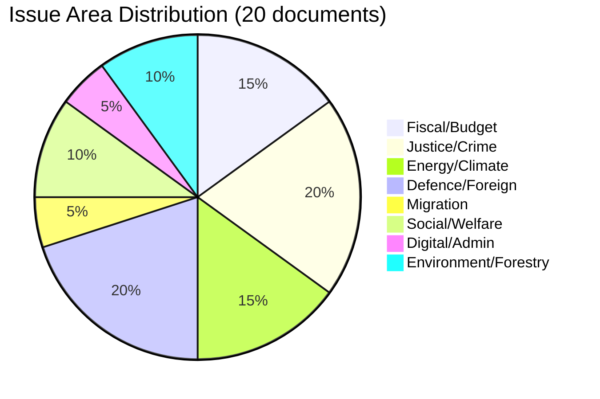
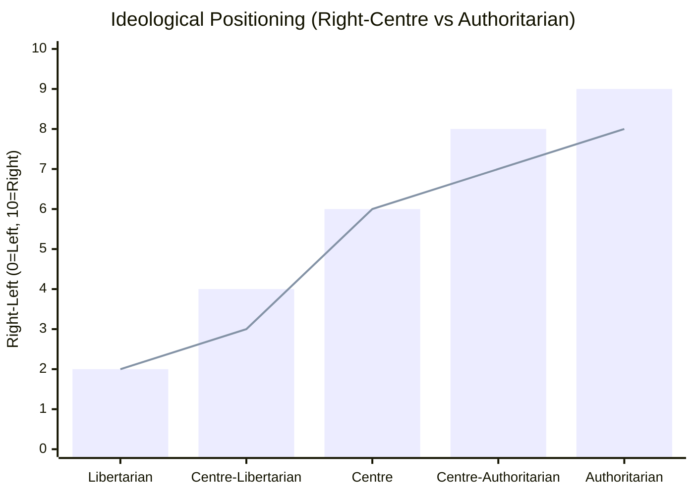

# Classification Results — Month Ahead 2026-04-23

**Author**: James Pether Sörling | **Generated**: 2026-04-23
**Framework**: 7-dimension political classification per political-classification-guide.md

---

## Classification Dimensions

1. **Issue Area** (policy domain)
2. **Ideological Positioning** (left-right, libertarian-authoritarian)
3. **Legislative Stage** (initiation → committee → chamber → enacted)
4. **Urgency Class** (routine / time-sensitive / emergency)
5. **Partisan Alignment** (coalition-sponsored / bipartisan / contested)
6. **Constitutional Sensitivity** (ordinary law / framework law / constitutional)
7. **Public Salience** (elite / media / mass public)

---

## Per-Document Classification

| dok_id | Issue Area | Ideological Positioning | Legislative Stage | Urgency | Partisan Alignment | Constitutional | Public Salience | Admiralty |
|--------|-----------|------------------------|-------------------|---------|-------------------|----------------|-----------------|-----------|
| HD03100 | Macro-fiscal | Right-Centre (growth + fiscal responsibility) | Committee (FiU) | CRITICAL — spring fiscal deadline | Coalition-sponsored | Framework (budget) | Mass public | [A1] |
| HD0399 | Macro-fiscal supplementary | Right-Centre | Committee (FiU) | CRITICAL — immediate relief | Coalition-sponsored | Framework (budget) | Mass public | [A1] |
| HD03236 | Energy/fiscal | Right/libertarian (tax cut) | ENACTED 2026-04-21 (HD01FiU48) | ENACTED | Coalition + SD | Ordinary | Mass public | [A1] |
| HD03240 | Energy law | Centre-right (market reform) | Committee (NU) | HIGH — 2030 energy target | Coalition | Ordinary | Mass public | [A1] |
| HD03239 | Energy/local government | Centre (revenue sharing) | Committee (NU) | HIGH | Coalition + possible C | Ordinary | Moderate | [A2] |
| HD03238 | Environmental/institutional | Centre-right (permitting reform) | Committee (MJU) | HIGH — permits backlog | Coalition | Ordinary | Moderate | [A2] |
| HD03218 | Justice/criminal | Right/authoritarian (harsher sentences) | Committee (JuU) | HIGH — election priority | Coalition + SD | Ordinary | High (crime) |[A1] |
| HD03246 | Justice/youth | Right/authoritarian | Committee (JuU) | HIGH | Coalition + SD | Ordinary | Moderate | [A2] |
| HD03217 | Justice/public service | Right/authoritarian (accountability) | Committee (KU) | MEDIUM | Coalition | Ordinary | Low-Moderate | [A2] |
| HD03235 | Migration | Far-right adjacent (mass deportation) | Committee (SfU) | HIGH | Coalition + SD, C opposition | Ordinary | High (immigration) | [A1] |
| HD03220 | Defence/NATO | Centre-right (international obligations) | Committee (FöU) | HIGH — NATO Article 5 | Coalition + possible S | Ordinary | Moderate | [B2] |
| HD03228 | Defence/exports | Centre-right (rule-based) | Committee (UU) | MEDIUM | Coalition; MP/V opposition | Ordinary | Low-Moderate | [A1] |
| HD03232 | Foreign/Ukraine tribunal | Cross-partisan (human rights) | Committee (UU) | MEDIUM | Potentially bipartisan | Ordinary | Low-Moderate | [A1] |
| HD03231 | Foreign/Ukraine compensation | Cross-partisan | Committee (UU) | MEDIUM | Potentially bipartisan | Ordinary | Low | [A2] |
| HD03245 | Gender equality / welfare | Centre | Committee (AU) | MEDIUM | Coalition; concerns re implementation | Ordinary | Moderate | [A2] |
| HD03242 | Forestry/environment | Centre-right (industry balance) | Committee (MJU) | MEDIUM | Coalition; environmental NGO opposition | Ordinary | Low-Moderate | [A2] |
| HD03237 | Justice/policing | Centre (institutional) | Committee (JuU) | MEDIUM | Coalition | Ordinary | Low | [A2] |
| HD03244 | Digital/government | Centre (modernisation) | Committee (TU) | LOW | Bipartisan | Ordinary | Low | [B2] |
| HD03233 | Social welfare | Centre-left (accessibility) | Committee (SoU) | MEDIUM | Coalition + possible bipartisan | Ordinary | Moderate | [A2] |
| HD03243 | Taxation | Centre-right | Committee (SkU) | MEDIUM | Coalition | Ordinary | Low | [A2] |

---

## Issue Area Clustering

---

## Ideological Spectrum Map

**Key pattern**: The 2025/26 spring package is distinctively right-of-centre on economic policy AND authoritarian-leaning on justice/migration — consistent with Tidöavtalet's SD-influenced agenda.

---

## Constitutional Sensitivity Summary

| Category | Count | Examples |
|----------|-------|---------|
| Constitutional (ch. 8 RF) | 1 | HD01KU33 (digital seizure — requires second reading post-election) |
| Framework law (budget) | 2 | HD03100, HD0399 |
| Ordinary law | 17 | All others |
