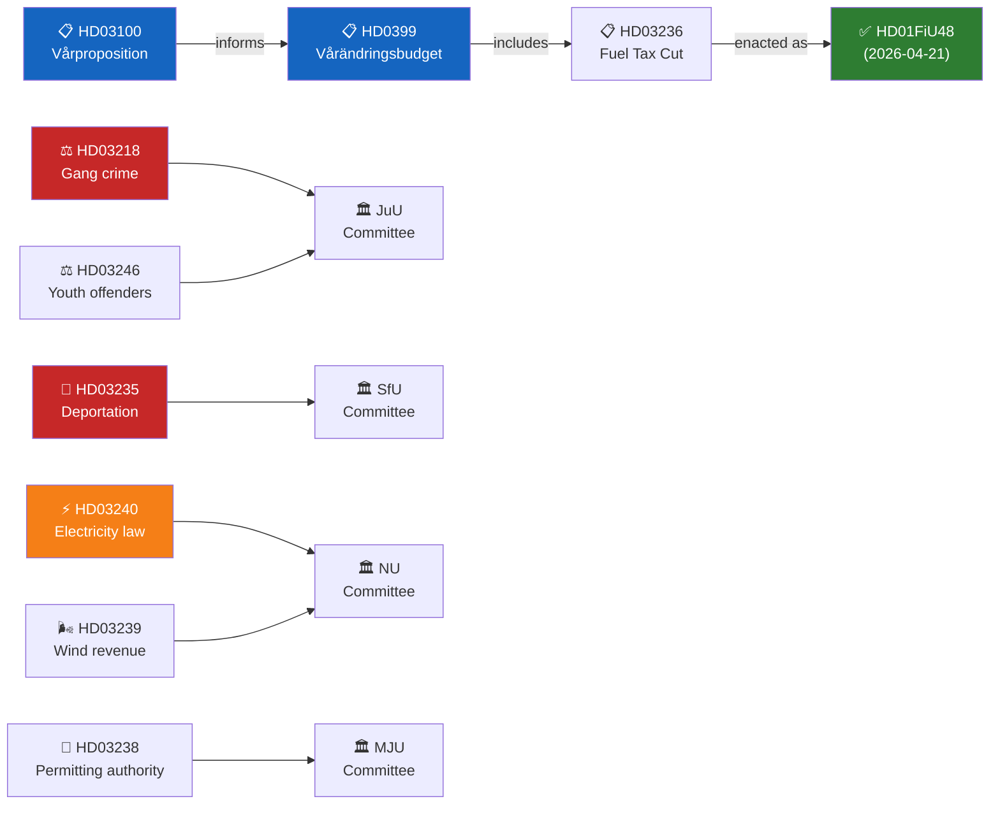

# Cross-Reference Map — Month Ahead 2026-04-23

**Author**: James Pether Sörling | **Generated**: 2026-04-23
**Framework**: structural-metadata-methodology.md

---

## Policy Clusters

### Cluster A — Spring Fiscal Package

| dok_id | Title summary | Link |
|--------|--------------|------|
| HD03100 | Vårproposition 2026 | Primary budget framework |
| HD0399 | Supplementary budget (vårändringsbudget) | Implements HD03100 |
| HD03236 | Extra ändringsbudget — fuel tax | Enacted via HD01FiU48 2026-04-21 |
| HD01FiU48 | Finance Committee report — passed | Enacted outcome |

**Legislative chain**: HD03100 → HD0399 → HD03236 → HD01FiU48 (enacted)

---

### Cluster B — Law & Order Package

| dok_id | Title summary | Link |
|--------|--------------|------|
| HD03218 | Double gang crime sentences | Core measure |
| HD03246 | Youth offenders — stricter penalties | Supplementary |
| HD03217 | Civil servant criminal liability | Institutional accountability |
| HD03235 | Deportation for criminal convictions | Migration × justice nexus |
| HD03237 | Paid police training | Enforcement capacity |

**Opposition motions against cluster**: HD024090 (V), HD024095 (C), HD024097 (MP) vs HD03235

---

### Cluster C — Energy Transition Package

| dok_id | Title summary | Link |
|--------|--------------|------|
| HD03240 | New electricity law | Market framework |
| HD03239 | Wind power municipal revenue sharing | Local government incentive |
| HD03238 | Environmental permitting authority (new agency) | Permit reform |
| HD03242 | Forestry environmental rules | Adjacent environmental reform |

**Tension**: HD03236 (fossil fuel tax cut) ↔ HD03240/HD03239 (renewable transition) — internal policy tension within coalition.

---

### Cluster D — Defence & Foreign Affairs

| dok_id | Title summary | Link |
|--------|--------------|------|
| HD03220 | Sweden military forward presence in Finland | NATO Article 5 |
| HD03228 | Modernised arms export rules | Defence exports |
| HD03232 | International tribunal for Ukraine | Legal accountability |
| HD03231 | Compensation commission for Ukraine | Reparations mechanism |

---

### Cluster E — Social & Welfare

| dok_id | Title summary | Link |
|--------|--------------|------|
| HD03245 | Women's rights strategy | Gender equality framework |
| HD03233 | Medical technology accessibility | Healthcare equity |
| HD01SfU20 | Simplified parental benefit | Social insurance reform |

---

## Legislative Chain Diagram

---

## Cross-Reference to Sibling Analysis Folders

**Tier-C Aggregation Note**: This is the first run of 2026-04-23. No prior-cycle sibling analysis folders exist under `analysis/daily/2026-04-23/` at time of writing. When parallel workflows run (propositions, committee-reports, interpellations, evening-analysis), this cross-reference map should be updated to link:
- `analysis/daily/2026-04-23/propositions/` — single-type proposition analysis
- `analysis/daily/2026-04-23/committeeReports/` — committee report analysis
- `analysis/daily/2026-04-23/interpellations/` — interpellation analysis

For PIR continuity, carry-forward from prior monthly analysis:
- PIR-1 (Budget/fiscal): Active — vårproposition central intelligence requirement
- PIR-2 (Justice/gang crime): Active — package delivered
- PIR-3 (Energy transition): Active — electricity law pending committee
- PIR-4 (NATO/defence): Active — Finland forward presence under review
- PIR-7 (Election 2026): Active — all packages interpreted through election lens

---

## Interpellation → Minister Mapping

| Interpellation | Filed by | Target Minister | Policy Cluster |
|----------------|----------|-----------------|----------------|
| HD10444 | S | Finance (Svantesson) | Fiscal — employer contributions |
| HD10443 | S | Finance (Svantesson) | Fiscal — SME |
| HD10442 | S | Finance (Svantesson) | Fiscal — family debt |
| HD10441 | S | Justice (Strömmer) | Justice — cybercrime |
| HD10439 | S | Justice (Strömmer) | Justice — police gaps |
| HD10438 | S | Equality | Social — women's shelters |
| HD10437 | S | Labour | Social — pay transparency |
| HD10434 | S | Infrastructure (Carlson) | Housing — construction shortfall |
| HD10433 | S | Finance (Svantesson) | Fiscal — SME |
| HD10429 | S | Energy | Energy — district heating |
| HD10428 | M | Infrastructure | Transport — emergency airport |

---

## Opposing Motions → Proposition Mapping

| Motion | Filed by | Against | Policy Cluster |
|--------|----------|---------|----------------|
| HD024082 | S | HD03236 fuel tax | Fiscal/Climate |
| HD024087 | MP | HD03229 | Environment |
| HD024090 | V | HD03235 deportation | Migration/Justice |
| HD024091 | V | HD03228 arms | Defence |
| HD024092 | V | HD03236 fuel tax | Fiscal/Climate |
| HD024095 | C | HD03235 deportation | Migration |
| HD024096 | MP | HD03228 arms | Defence |
| HD024097 | MP | HD03235 deportation | Migration |
| HD024098 | MP | HD03236 fuel tax | Climate |
