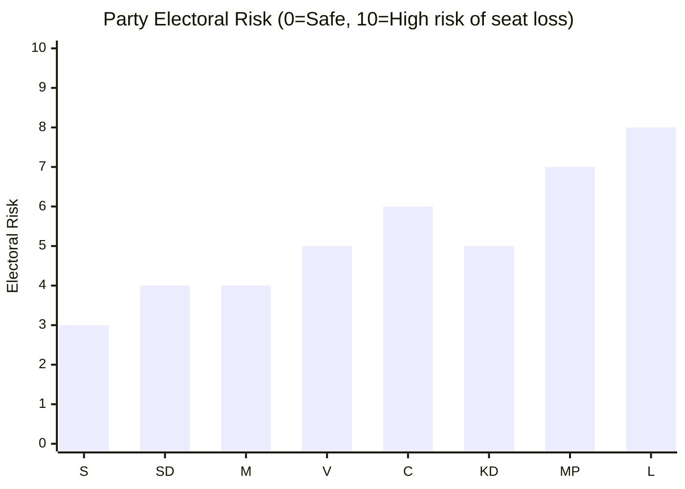

# Election 2026 Analysis — Month Ahead 2026-04-23

**Author**: James Pether Sörling | **Generated**: 2026-04-23
**Framework**: electoral-domain-methodology.md

---

## Election Context

**Election date**: 2026-09-13 (Sunday)
**Days remaining**: ~143 days from 2026-04-23
**Key session milestone**: Riksmöte 2025/26 ends ~June 2026

---

## Current Parliamentary Composition (Approximate — 2022 Election Result)

| Party | Bloc | Seats (2022) | Status |
|-------|------|-------------|--------|
| Socialdemokraterna (S) | Opposition | 107 | Main opposition |
| Sverigedemokraterna (SD) | Government support | 73 | Confidence-and-supply |
| Moderaterna (M) | Government | 68 | PM Kristersson |
| Vänsterpartiet (V) | Opposition | 24 | Left opposition |
| Centerpartiet (C) | Opposition | 24 | Centrist opposition |
| Kristdemokraterna (KD) | Government | 19 | Coalition partner |
| Miljöpartiet (MP) | Opposition | 18 | Green opposition |
| Liberalerna (L) | Government | 16 | Coalition partner |
| **Total** | | **349** | |

**Coalition** (M+KD+L): 68+19+16 = **103 seats**
**SD support** (confidence-and-supply): **73 seats**
**Government bloc total**: **176 seats** (bare majority = 175)

**Opposition** (S+V+C+MP): 107+24+24+18 = **173 seats**

*Note: Approximate 2022 election results used; actual current composition may vary by 1–3 seats due to departures/by-elections. See Methodology Improvement 3.*

---

## Spring 2026 Package Electoral Implications

| Package | Electoral target group | Expected impact |
|---------|----------------------|-----------------|
| Fuel tax cut (HD03236) | Rural/suburban commuters | Short-term relief narrative — returns credit to M/SD |
| Law & Order (HD03218, HD03246, HD03235) | Crime-concerned suburban voters | Core SD+M voter consolidation |
| Energy Transition (HD03240) | Energy-sector workers; liberal voters | Positions government as "investment-ready" |
| Women's rights strategy (HD03245) | Suburban women voters | Attempts to counter S framing on gender equality |

---

## Coalition Viability Scenarios (September 2026)

### Scenario A: Tidökoalitionen continues (requires ~175+ seats)
- Current estimated seats: 176 (bare majority)
- If M gains 3–5 seats from delivering on fiscal promises: +3 seats
- If SD holds: stays at 73
- If L holds (currently fragile at 16 seats — 4% threshold): critical
- **Risk**: L polling near 4% threshold — loss of L would drop bloc to 160 seats

### Scenario B: S-led bloc majority
- Current: 173 seats
- If MP survives 4% threshold: stays at 18 seats
- If V holds at 24: bloc stays at 173
- If C swings back toward centre-left: potentially +10–15 seats
- **Key swing factor**: C — if C moves toward S collaboration, S-led bloc reaches 175+

### Scenario C: Cross-bloc grand coalition
- Only if A and B both fail to reach 175
- Historical precedent: Sweden has managed minority configurations but not grand coalitions in modern era
- Probability: Remote [D4]

---

## Electoral Risk Assessment

**Highest risk parties**: L (threshold risk), MP (threshold risk), C (swing potential)
