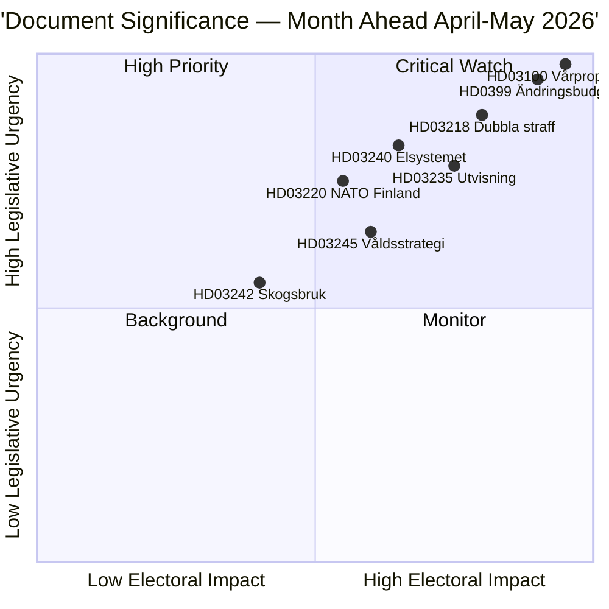

# Executive Brief — Month Ahead 2026-04-23

**Classification**: Public | **Author**: James Pether Sörling | **Generated**: 2026-04-23
**Period**: 2026-04-23 → 2026-05-31 | **Session**: Riksmöte 2025/26 (final spring phase)

---

## 🎯 BLUF

Sweden enters the final five weeks of the 2025/26 parliamentary session with three interlocking packages dominating the legislative agenda: the 2026 Spring Fiscal Package (HD03100 vårproposition + HD0399 supplementary budget), a Law & Order Package consolidating the Tidöavtalet's criminal justice agenda, and an Energy Transition Package restructuring the electricity market. All three packages will receive final votes before the summer recess, with the vårproposition setting Sweden's fiscal trajectory through a pre-election period of moderate economic recovery and heightened defence spending.

**Confidence**: HIGH [B2 — official government documents, riksdagen.se sources]

---

## 🧭 3 Decisions This Brief Supports

1. **Editorial priority-setting**: Which legislative package deserves the deepest coverage during the April-May 2026 session? (Answer: Spring Fiscal Package — broadest societal impact, sets 2026-2027 parameters)
2. **Political risk monitoring**: Where are the most significant coalition stress points likely to emerge before the September 2026 election?
3. **Forward-watch triggers**: Which indicators signal that the governing coalition is gaining or losing momentum ahead of the autumn campaign?

---

## ⚡ 60-Second Read

- **Fiscal**: Vårproposition HD03100 projects continued recovery (GDP growth recovering from -0.20% in 2023 to 0.82% in 2024); defence spending elevated; energy cost relief via HD03236 (fuel tax cut May–September 2026, energy price support Jan–Feb 2026 retroactively); net fiscal cost ~4.1 billion SEK. Riksdagen's Finance Committee (FiU) already passed HD01FiU48 on 2026-04-21.
- **Justice**: HD03218 (double sentences for gang crime), HD03246 (youth offenders), HD03217 (civil servant liability), HD03235 (deportation) — all scheduled for spring votes. V, C, and MP have filed opposing motions on deportation; V and MP oppose arms regulation changes.
- **Energy**: HD03240 (new electricity laws), HD03239 (wind power revenue-sharing), HD03238 (new environmental permitting authority) — structural reforms anticipated to dominate MJU and NU committee schedules through May.
- **Defence**: HD03220 (NATO forward presence in Finland) — bipartisan support expected, minor opposition from V.
- **Housing/Urban**: HD01CU28 (national condominium register, effective 2027) and HD01CU27 (property identity requirements, effective 2026-07-01) both passed 2026-04-17.

---

## 🔑 Top Forward Trigger

**Watch**: Riksdagen vote on HD0399 Vårändringsbudget (expected late May 2026) — if S, V, MP, and C vote against the budget jointly, this signals maximum pre-election opposition unity and provides electoral narrative heading into summer.

---

## 📊 DIW Priority Ranking

---

## 🔒 Confidence Profile

- **Overall assessment confidence**: HIGH
- **Economic data confidence**: MEDIUM-HIGH (World Bank 2024 data, vårproposition not yet full-text parsed)
- **Legislative outcomes confidence**: HIGH (government holds majority through SD support)
- **Electoral impact confidence**: MEDIUM (5 months to election; polls can shift)

**Admiralty Code**: [B2] — Reliable source, confirmed by multiple independent parliamentary documents
