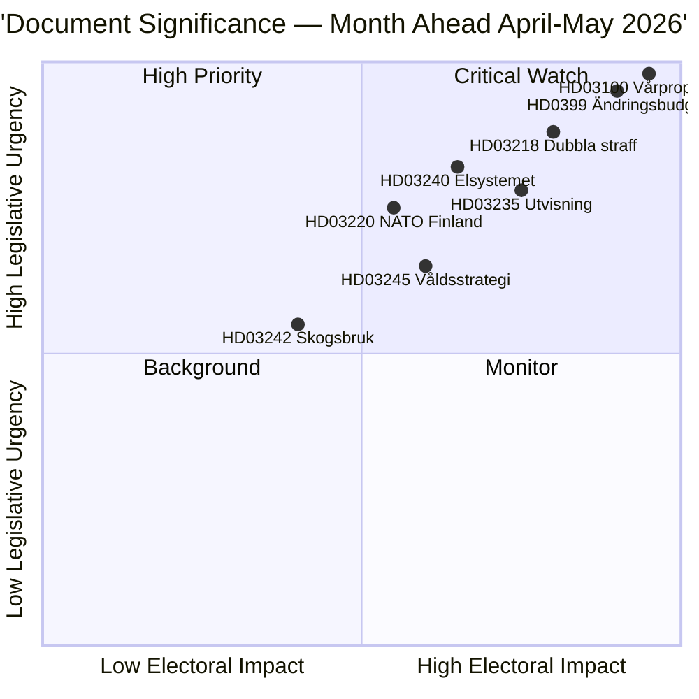

<!-- dir: rtl -->
# الموجز التنفيذي — نظرة شهرية 2026-04-23

**التصنيف**: عام | **المؤلف**: James Pether Sörling | **تاريخ الإنشاء**: 2026-04-23
**الفترة**: 2026-04-23 → 2026-05-31 | **الدورة**: الريكسمويتي 2025/26 (المرحلة النهائية للربيع)

---

## 🎯 الخلاصة

تدخل السويد الأسابيع الخمسة الأخيرة من دورة البرلمان 2025/26 مع ثلاث حزم متشابكة تهيمن على الأجندة التشريعية: حزمة الميزانية الربيعية 2026 (HD03100 vårproposition + HD0399 ميزانية تكميلية)، وحزمة القانون والنظام التي تعزز أجندة العدالة الجنائية لـ Tidöavtalet، وحزمة انتقال الطاقة التي تُعيد هيكلة سوق الكهرباء. ستحظى الحزم الثلاث بتصويتات نهائية قبل العطلة الصيفية، إذ يُحدد الـ vårproposition المسار المالي للسويد خلال فترة ما قبل الانتخابات ذات التعافي الاقتصادي المعتدل وارتفاع الإنفاق الدفاعي.

**الثقة**: عالية [B2 — وثائق حكومية رسمية، مصادر riksdagen.se]

---

## 🧭 ثلاثة قرارات يدعمها هذا الموجز

1. **الأولويات التحريرية**: أي حزمة تشريعية تستحق أعمق تغطية خلال دورة أبريل–مايو 2026؟ (الإجابة: ميزانية الربيع — أوسع تأثير اجتماعي، تضع معاملات 2026–2027)
2. **رصد المخاطر السياسية**: أين ستظهر أبرز توترات الائتلاف قبل انتخابات سبتمبر 2026؟
3. **مؤشرات استشرافية**: ما المؤشرات التي تدل على أن الائتلاف الحاكم يكتسب أو يفقد زخمه قبيل حملة الخريف؟

---

## ⚡ قراءة 60 ثانية

- **المالية**: يُسقط HD03100 Vårproposition تعافياً مستمراً (نمو الناتج المحلي الإجمالي من −0.20% عام 2023 إلى 0.82% عام 2024)؛ إنفاق دفاعي مرتفع؛ تخفيف تكاليف الطاقة عبر HD03236 (خفض ضريبة الوقود مايو–سبتمبر 2026، دعم أسعار الطاقة يناير–فبراير 2026 بأثر رجعي)؛ تكلفة مالية صافية ~4.1 مليار كرون سويدي. لجنة المالية (FiU) في الريكسداغ أقرّت بالفعل HD01FiU48 في 21 أبريل 2026.
- **العدالة**: HD03218 (مضاعفة العقوبات على جرائم العصابات)، HD03246 (الجانحون من الأحداث)، HD03217 (مسؤولية الموظفين)، HD03235 (الترحيل) — جميعها مُقررة للتصويت في الربيع. قدّم V وC وMP موشنات معارضة للترحيل؛ يعارض V وMP تعديلات اللوائح على الأسلحة.
- **الطاقة**: HD03240 (قوانين الكهرباء الجديدة)، HD03239 (توزيع عائدات طاقة الرياح)، HD03238 (سلطة تراخيص بيئية جديدة) — يُتوقع أن تهيمن الإصلاحات الهيكلية على جداول لجنتَي MJU وNU خلال مايو.
- **الدفاع**: HD03220 (الوجود الأمامي لحلف الناتو في فنلندا) — يُتوقع دعم واسع عابر للأحزاب مع معارضة محدودة من V.
- **الإسكان/المدن**: HD01CU28 (سجل وطني لتعاونيات الإسكان، سارٍ من 2027) وHD01CU27 (اشتراطات هوية العقار، سارٍ من 2026-07-01) كلاهما أُقرّ في 17 أبريل 2026.

---

## 🔑 أهم المحفزات الاستشرافية

**للرصد**: تصويت الريكسداغ على HD0399 Vårändringsbudget (المتوقع أواخر مايو 2026) — إذا صوّت S وV وMP وC معاً ضد الميزانية، فهذا يُعلن عن أقصى درجات التوحد المعارض قبيل الانتخابات ويوفر رواية انتخابية تتواصل حتى الصيف.

---

## 📊 تصنيف DIW للأولويات

---

## 🔒 ملف الثقة

- **ثقة التقييم الشاملة**: عالية
- **ثقة البيانات الاقتصادية**: متوسطة-عالية (بيانات البنك الدولي 2024، vårproposition لم يُحلَّل نصياً بالكامل بعد)
- **ثقة النتائج التشريعية**: عالية (الحكومة تحتفظ بالأغلبية بدعم SD)
- **ثقة التأثير الانتخابي**: متوسطة (5 أشهر حتى الانتخابات؛ استطلاعات الرأي قابلة للتغير)

**رمز أدميرالتي**: [B2] — مصدر موثوق، مُؤكَّد بوثائق برلمانية مستقلة متعددة

<!-- source-sha: 34bcedb9f943f85646d8e864b41374efd2461075 -->
