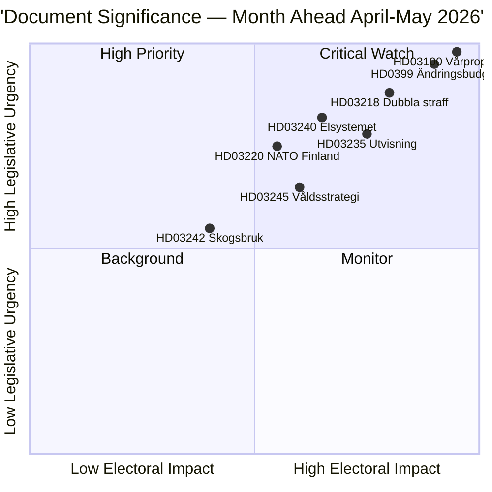

# Månedsresumé — Månedsoverblik 2026-04-23

**Klassificering**: Offentlig | **Forfatter**: James Pether Sörling | **Genereret**: 2026-04-23
**Periode**: 2026-04-23 → 2026-05-31 | **Session**: Riksmøde 2025/26 (slutfase for forår)

---

## 🎯 Konklusion

Sverige går ind i de sidste fem uger af parlamentssessionen 2025/26 med tre sammenhængende pakker, der dominerer den lovgivningsmæssige dagsorden: 2026 Forårets finansielle pakke (HD03100 vårproposition + HD0399 tillægsbudget), en lov-og-orden-pakke, der konsoliderer Tidöavtalets kriminalpolitiske dagsorden, og en energiomstillingspakke, der omstrukturerer elmarkedet. Alle tre pakker vil modtage endelige afstemninger inden sommerferien, idet vårproposition fastlægger Sveriges finanspolitiske kurs i en periode med moderat økonomisk genopretning og forhøjede forsvarsudgifter inden valget.

**Sikkerhed**: HØJ [B2 — officielle regeringsdokumenter, riksdagen.se-kilder]

---

## 🧭 3 Beslutninger denne briefing understøtter

1. **Redaktionel prioritering**: Hvilken lovgivningspakke fortjener den dybeste dækning i april–maj 2026? (Svar: Forårsfinansplanen — bredest samfundsmæssig indvirkning, fastlægger parametre for 2026–2027)
2. **Politisk risikoovervågning**: Hvor er de mest betydningsfulde koalitionsspændinger sandsynlige inden valget i september 2026?
3. **Fremadrettede indikatorer**: Hvilke indikatorer signalerer, at den siddende koalition vinder eller taber fremdrift inden efterårskampagnen?

---

## ⚡ 60-sekunders læsning

- **Finanser**: Vårproposition HD03100 projicerer fortsat genopretning (BNP-vækst fra −0,20% i 2023 til 0,82% i 2024); forhøjede forsvarsudgifter; energiomkostningslettelse via HD03236 (brændstofafgiftsnedsættelse maj–september 2026, energiprisstøtte jan–feb 2026 med tilbagevirkende kraft); netto finansiel omkostning ~4,1 mia. SEK. Riksdagens finansudvalg (FiU) godkendte allerede HD01FiU48 den 21. april 2026.
- **Retsvæsen**: HD03218 (dobbelt straf for bandekriminalitet), HD03246 (unge lovovertrædere), HD03217 (tjenestemænds ansvar), HD03235 (udvisning) — alle planlagt til forårsafstemninger. V, C og MP har indgivet modgående motioner om udvisning; V og MP modsætter sig ændringer i våbenlovgivningen.
- **Energi**: HD03240 (nye ellove), HD03239 (vindkraftindtægtsdeling), HD03238 (ny miljøtilladelsesmyndighed) — strukturelle reformer forventes at dominere MJU- og NU-udvalgsplanerne i maj.
- **Forsvar**: HD03220 (NATOs fremskudte tilstedeværelse i Finland) — bredt tværpolitisk støtte forventet, begrænset modstand fra V.
- **Bolig/by**: HD01CU28 (nationalt andelsboligregister, gælder fra 2027) og HD01CU27 (krav til ejendomsidentitet, gælder fra 2026-07-01) begge vedtaget den 17. april 2026.

---

## 🔑 Vigtigste fremadrettede indikator

**Hold øje med**: Riksdagens afstemning om HD0399 Vårändringsbudget (forventet i slutningen af maj 2026) — hvis S, V, MP og C stemmer samlet imod budgettet, signalerer dette maksimal oppositionsenhed inden valget og giver et valgfortælling ind i sommeren.

---

## 📊 DIW-prioriteringsrangering

---

## 🔒 Sikkerhedsprofil

- **Overordnet vurderingssikkerhed**: HØJ
- **Sikkerhed for økonomiske data**: MIDDEL-HØJ (Verdensbanksdata 2024, vårproposition ikke endnu fuldt tekstparsed)
- **Lovgivningsmæssige udfalds sikkerhed**: HØJ (regeringen holder flertal via SD-støtte)
- **Valgpåvirkningssikkerhed**: MIDDEL (5 måneder til valget; meningsmålinger kan skifte)

**Admiralty-kode**: [B2] — Pålidelig kilde, bekræftet af flere uafhængige parlamentariske dokumenter

<!-- source-sha: 34bcedb9f943f85646d8e864b41374efd2461075 -->
