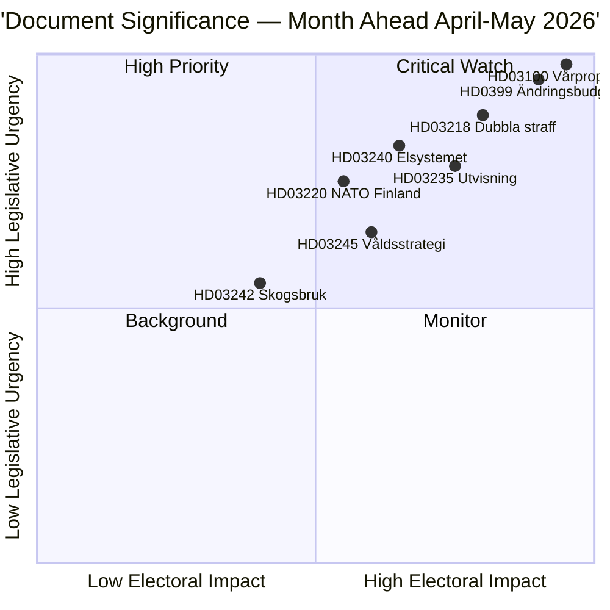

# Kurzbericht — Monatsvorschau 2026-04-23

**Klassifizierung**: Öffentlich | **Autor**: James Pether Sörling | **Erstellt**: 2026-04-23
**Zeitraum**: 2026-04-23 → 2026-05-31 | **Sitzung**: Riksmöte 2025/26 (letzte Frühjahrsphase)

---

## 🎯 Fazit

Schweden tritt in die letzten fünf Wochen der Parlamentssitzung 2025/26 ein, wobei drei miteinander verknüpfte Pakete die Gesetzgebungsagenda dominieren: das Frühjahrsfinanzpaket 2026 (HD03100 vårproposition + HD0399 Nachtragshaushalt), ein Recht-und-Ordnung-Paket zur Konsolidierung der kriminalpolitischen Agenda des Tidöavtalet und ein Energiewendepaket zur Neustrukturierung des Strommarkts. Alle drei Pakete erhalten vor der Sommerpause ihre abschließenden Abstimmungen, wobei die Vårproposition Schwedens finanzpolitischen Kurs in einer Vorwahlperiode mit moderater wirtschaftlicher Erholung und erhöhten Verteidigungsausgaben vorgibt.

**Vertrauen**: HOCH [B2 — offizielle Regierungsdokumente, riksdagen.se-Quellen]

---

## 🧭 3 Entscheidungen, die dieser Bericht unterstützt

1. **Redaktionelle Priorisierung**: Welches Gesetzgebungspaket verdient die tiefste Berichterstattung im April–Mai 2026? (Antwort: Frühjahrsfinanzplan — breiteste gesellschaftliche Wirkung, legt Parameter für 2026–2027 fest)
2. **Politisches Risikomonitoring**: Wo entstehen die bedeutendsten Koalitionsspannungen vor der Wahl im September 2026?
3. **Vorausschauende Indikatoren**: Welche Indikatoren signalisieren, dass die Regierungskoalition vor der Herbstkampagne an Dynamik gewinnt oder verliert?

---

## ⚡ 60-Sekunden-Lektüre

- **Finanzen**: Vårproposition HD03100 projiziert anhaltende Erholung (BIP-Wachstum von −0,20% 2023 auf 0,82% 2024); erhöhte Verteidigungsausgaben; Energiekostenentlastung über HD03236 (Kraftstoffsteuersenkung Mai–September 2026, Energiepreisunterstützung Jan–Feb 2026 rückwirkend); Nettokosten ~4,1 Mrd. SEK. Der Finanzausschuss (FiU) des Riksdag verabschiedete HD01FiU48 bereits am 21. April 2026.
- **Justiz**: HD03218 (doppelte Strafen für Bandenkriminalität), HD03246 (jugendliche Straftäter), HD03217 (Beamtenhaftung), HD03235 (Ausweisung) — alle für Frühjahrsabstimmungen geplant. V, C und MP haben Gegenmotionen zur Ausweisung eingereicht; V und MP lehnen Änderungen der Waffenregulierung ab.
- **Energie**: HD03240 (neue Stromgesetze), HD03239 (Windkrafteinnahmenteilung), HD03238 (neue Umweltgenehmigungsbehörde) — strukturelle Reformen werden voraussichtlich bis Mai die MJU- und NU-Ausschussagenden dominieren.
- **Verteidigung**: HD03220 (NATOs Vorpräsenz in Finnland) — breite parteiübergreifende Unterstützung erwartet, geringer Widerstand von V.
- **Wohnen/Stadt**: HD01CU28 (nationales Wohnungsgenossenschaftsregister, ab 2027 gültig) und HD01CU27 (Anforderungen an die Grundstücksidentität, ab 2026-07-01 gültig) beide am 17. April 2026 verabschiedet.

---

## 🔑 Wichtigster Vorwärts-Auslöser

**Beobachten**: Riksdagen-Abstimmung über HD0399 Vårändringsbudget (Ende Mai 2026 erwartet) — wenn S, V, MP und C gemeinsam gegen das Budget stimmen, signalisiert dies maximale Oppositionseinheit vor der Wahl und liefert eine Wahlerzählung in den Sommer.

---

## 📊 DIW-Prioritätsranking

---

## 🔒 Vertrauensprofil

- **Gesamtbewertungsvertrauen**: HOCH
- **Vertrauen in Wirtschaftsdaten**: MITTEL-HOCH (Weltbankdaten 2024, Vårproposition noch nicht vollständig textverarbeitet)
- **Vertrauen in Gesetzgebungsergebnisse**: HOCH (Regierung hält Mehrheit durch SD-Unterstützung)
- **Vertrauen in Wahlwirkung**: MITTEL (5 Monate bis zur Wahl; Umfragen können sich ändern)

**Admiralty-Code**: [B2] — Verlässliche Quelle, durch mehrere unabhängige parlamentarische Dokumente bestätigt

<!-- source-sha: 34bcedb9f943f85646d8e864b41374efd2461075 -->
