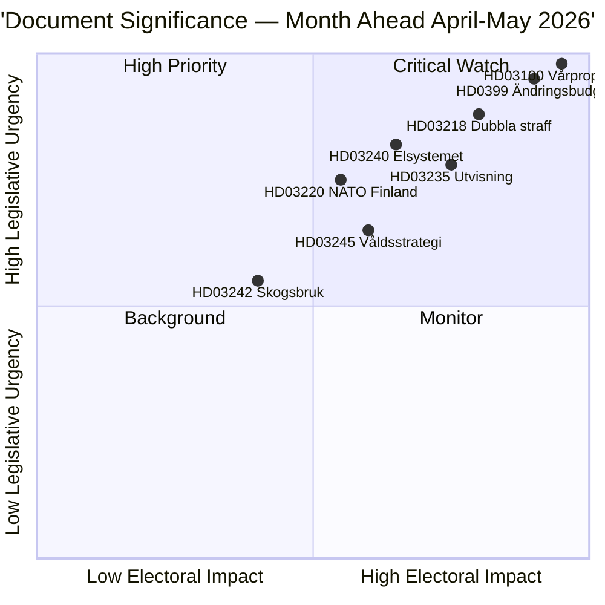

# Nota Ejecutiva — Perspectiva Mensual 2026-04-23

**Clasificación**: Pública | **Autor**: James Pether Sörling | **Generada**: 2026-04-23
**Período**: 2026-04-23 → 2026-05-31 | **Sesión**: Riksmöte 2025/26 (fase final de primavera)

---

## 🎯 Conclusión

Suecia entra en las últimas cinco semanas de la sesión parlamentaria 2025/26 con tres paquetes interconectados dominando la agenda legislativa: el Paquete Fiscal de Primavera 2026 (HD03100 vårproposition + HD0399 presupuesto suplementario), un Paquete de Ley y Orden que consolida la agenda de justicia penal del Tidöavtalet, y un Paquete de Transición Energética que reestructura el mercado eléctrico. Los tres paquetes recibirán sus votos finales antes del receso de verano, con la vårproposition estableciendo la trayectoria fiscal de Suecia a través de un período preelectoral de recuperación económica moderada y mayor gasto en defensa.

**Confianza**: ALTA [B2 — documentos gubernamentales oficiales, fuentes riksdagen.se]

---

## 🧭 3 Decisiones que esta nota apoya

1. **Priorización editorial**: ¿Qué paquete legislativo merece la cobertura más profunda durante la sesión de abril–mayo 2026? (Respuesta: Presupuesto de primavera — mayor impacto social, establece parámetros 2026–2027)
2. **Monitoreo de riesgo político**: ¿Dónde son más probables las tensiones significativas de la coalición antes de las elecciones de septiembre de 2026?
3. **Indicadores prospectivos**: ¿Qué indicadores señalan que la coalición gobernante está ganando o perdiendo impulso antes de la campaña de otoño?

---

## ⚡ Lectura de 60 segundos

- **Fiscal**: La Vårproposition HD03100 proyecta recuperación continuada (crecimiento del PIB desde −0,20% en 2023 hasta 0,82% en 2024); gastos de defensa elevados; alivio del costo energético vía HD03236 (reducción del impuesto al combustible mayo–septiembre 2026, apoyo al precio de la energía ene.–feb. 2026 de forma retroactiva); costo fiscal neto ~4,1 mil mill. SEK. El Comité de Finanzas (FiU) del Riksdag ya aprobó HD01FiU48 el 21 de abril de 2026.
- **Justicia**: HD03218 (penas dobles por crimen organizado), HD03246 (delincuentes juveniles), HD03217 (responsabilidad de funcionarios), HD03235 (deportación) — todos programados para votaciones de primavera. V, C y MP han presentado mociones opuestas sobre deportación; V y MP se oponen a cambios en la regulación de armas.
- **Energía**: HD03240 (nuevas leyes eléctricas), HD03239 (reparto de ingresos de energía eólica), HD03238 (nueva autoridad de permisos ambientales) — las reformas estructurales se espera que dominen los calendarios de los comités MJU y NU hasta mayo.
- **Defensa**: HD03220 (presencia avanzada de la OTAN en Finlandia) — apoyo bipartidista amplio esperado, oposición menor de V.
- **Vivienda/Urbano**: HD01CU28 (registro nacional de cooperativas de vivienda, aplicable desde 2027) y HD01CU27 (requisitos de identidad de propiedad, aplicables desde 2026-07-01) ambos aprobados el 17 de abril de 2026.

---

## 🔑 Indicador prospectivo principal

**Vigilar**: Votación del Riksdag sobre HD0399 Vårändringsbudget (esperada a finales de mayo de 2026) — si S, V, MP y C votan conjuntamente en contra del presupuesto, esto señala unidad máxima de la oposición antes de las elecciones y proporciona una narrativa electoral de cara al verano.

---

## 📊 Clasificación de prioridades DIW

---

## 🔒 Perfil de confianza

- **Confianza general de la evaluación**: ALTA
- **Confianza en datos económicos**: MEDIA-ALTA (datos del Banco Mundial 2024, vårproposition aún no completamente analizada)
- **Confianza en resultados legislativos**: ALTA (el gobierno mantiene mayoría con apoyo del SD)
- **Confianza en impacto electoral**: MEDIA (5 meses para las elecciones; las encuestas pueden cambiar)

**Código Admiralty**: [B2] — Fuente confiable, confirmada por múltiples documentos parlamentarios independientes

<!-- source-sha: 34bcedb9f943f85646d8e864b41374efd2461075 -->
