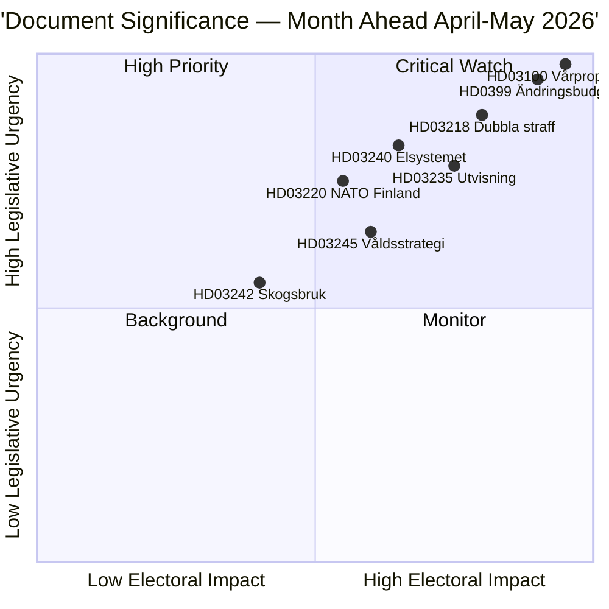

# Yhteenveto — Kuukausikatsaus 2026-04-23

**Luokitus**: Julkinen | **Tekijä**: James Pether Sörling | **Luotu**: 2026-04-23
**Ajanjakso**: 2026-04-23 → 2026-05-31 | **Istunto**: Valtiopäivät 2025/26 (kevätkauden loppuvaihe)

---

## 🎯 Johtopäätös

Ruotsi aloittaa valtiopäivien 2025/26 viimeiset viisi viikkoa kolmen toisiinsa kytkeytyvän paketin hallitessa lainsäädäntöagendaa: vuoden 2026 keväinen talouspaketti (HD03100 vårproposition + HD0399 lisätalousarvio), laki ja järjestys -paketti, joka vahvistaa Tidöavtaletin rikospoliittisen ohjelman, sekä energiasiirtymäpaketti, joka uudelleenjärjestelee sähkömarkkinat. Kaikki kolme pakettia saavat lopulliset äänestykset ennen kesätaukoa, ja vårproposition asettaa Ruotsin talouspolitiikan suunnan kohtuullisen taloudellisen elpymisen ja kohonneiden puolustusmenojen esivaalijaksolle.

**Luotettavuus**: KORKEA [B2 — viralliset hallituksen asiakirjat, riksdagen.se-lähteet]

---

## 🧭 3 Päätöstä, joita tämä katsaus tukee

1. **Toimituksellinen priorisointi**: Mikä lakipaketti ansaitsee syvimmän uutisoinnin huhti–toukokuussa 2026? (Vastaus: Vårproposition — laajin yhteiskunnallinen vaikutus, asettaa parametrit 2026–2027)
2. **Poliittisen riskin seuranta**: Missä kohtaa koalitiolle todennäköisimmin syntyy merkittäviä jännitteitä ennen syyskuun 2026 vaaleja?
3. **Eteenpäin katsovat indikaattorit**: Mitkä indikaattorit kertovat, että hallituskoalitio vahvistuu tai heikkenee syksyn kampanjaan mennessä?

---

## ⚡ 60 sekunnin lukeminen

- **Talous**: Vårproposition HD03100 ennustaa jatkuvaa elpymistä (BKT-kasvu −0,20%:sta 2023 → 0,82%:iin 2024); kohonneet puolustusmenot; energiakustannushelpotus HD03236 kautta (polttoaineveroleikkaus touko–syyskuu 2026, energian hintatuki tammi–helmi 2026 takautuvasti); nettokustannus ~4,1 miljardia SEK. Valtiopäivien valtiovarainvaliokunta (FiU) hyväksyi jo HD01FiU48:n 21.4.2026.
- **Oikeus**: HD03218 (kaksinkertaiset rangaistukset jengirikollisuudesta), HD03246 (nuoret rikoksentekijät), HD03217 (virkamiehen vastuu), HD03235 (karkottaminen) — kaikki suunniteltu kevään äänestyksiin. V, C ja MP ovat jättäneet vastakkaisia liikkeitä karkottamisesta; V ja MP vastustavat asesääntelymuutoksia.
- **Energia**: HD03240 (uudet sähkölait), HD03239 (tuulivoiman tulonjako), HD03238 (uusi ympäristölupaviranomainen) — rakenteellisten uudistusten odotetaan hallitsevan MJU- ja NU-valiokuntien aikatauluja toukokuun läpi.
- **Puolustus**: HD03220 (NATOn eteentyönnetty läsnäolo Suomessa) — laaja puolueiden välinen tuki odotettavissa, pieni vastustus V:ltä.
- **Asuminen/kaupunki**: HD01CU28 (kansallinen asunto-osuuskunnan rekisteri, voimassa 2027) ja HD01CU27 (kiinteistöidentiteettivaatimukset, voimassa 2026-07-01) molemmat hyväksytty 17.4.2026.

---

## 🔑 Tärkein eteenpäin katsova indikaattori

**Seuraa**: Valtiopäivien äänestys HD0399 Vårändringsbudgetista (odotettavissa toukokuun lopussa 2026) — jos S, V, MP ja C äänestävät yhdessä budjettia vastaan, se merkitsee maksimaalista oppositioyhtenäisyyttä ennen vaaleja ja tuottaa vaalinarratiivin kesäksi.

---

## 📊 DIW-prioriteettijärjestys

---

## 🔒 Luotettavuusprofiili

- **Kokonaisarvioinnin luotettavuus**: KORKEA
- **Taloudellisten tietojen luotettavuus**: KOHTALAINEN-KORKEA (Maailmanpankin 2024 tiedot, vårpropositiota ei vielä täysin tekstijäsennetty)
- **Lainsäädännöllisen tuloksen luotettavuus**: KORKEA (hallitus pitää enemmistön SD:n tuella)
- **Vaikutuksen vaaleissa luotettavuus**: KOHTALAINEN (5 kuukautta vaaleihin; mielipidekyselyt voivat muuttua)

**Admiralty-koodi**: [B2] — Luotettava lähde, vahvistettu useilla riippumattomilla parlamenttiasiakirjoilla

<!-- source-sha: 34bcedb9f943f85646d8e864b41374efd2461075 -->
