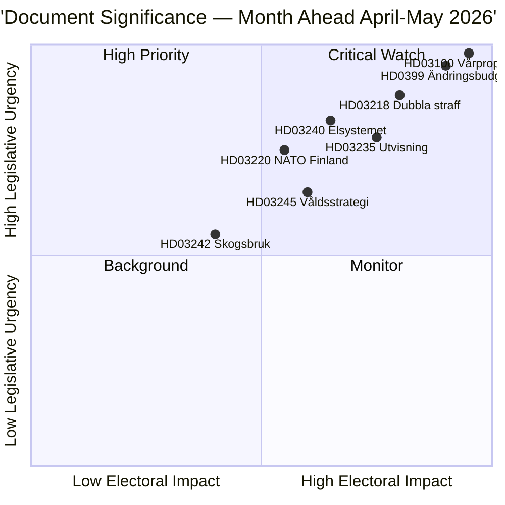

# Note de synthèse — Aperçu mensuel 2026-04-23

**Classification** : Publique | **Auteur** : James Pether Sörling | **Générée** : 2026-04-23
**Période** : 2026-04-23 → 2026-05-31 | **Session** : Riksmöte 2025/26 (phase finale du printemps)

---

## 🎯 Conclusion

La Suède entre dans les cinq dernières semaines de la session parlementaire 2025/26 avec trois ensembles interconnectés dominant l'agenda législatif : le Budget de printemps 2026 (HD03100 vårproposition + HD0399 budget supplémentaire), un ensemble Loi et Ordre consolidant l'agenda de justice pénale du Tidöavtalet, et un ensemble de Transition énergétique restructurant le marché de l'électricité. Les trois ensembles recevront leurs votes finaux avant la pause estivale, la vårproposition définissant la trajectoire budgétaire de la Suède pour une période pré-électorale de reprise économique modérée et de dépenses de défense accrues.

**Confiance** : HAUTE [B2 — documents gouvernementaux officiels, sources riksdagen.se]

---

## 🧭 3 Décisions que cette note soutient

1. **Priorisation éditoriale** : Quel ensemble législatif mérite la couverture la plus approfondie durant la session d'avril–mai 2026 ? (Réponse : Budget de printemps — impact sociétal le plus large, définit les paramètres 2026–2027)
2. **Surveillance des risques politiques** : Où les tensions de coalition les plus significatives sont-elles susceptibles d'émerger avant les élections de septembre 2026 ?
3. **Indicateurs prospectifs** : Quels indicateurs signalent que la coalition gouvernante gagne ou perd de l'élan avant la campagne d'automne ?

---

## ⚡ Lecture en 60 secondes

- **Finances** : La Vårproposition HD03100 projette une reprise continue (croissance du PIB passant de −0,20 % en 2023 à 0,82 % en 2024) ; dépenses de défense élevées ; allègement des coûts énergétiques via HD03236 (réduction de la taxe sur les carburants mai–septembre 2026, soutien aux prix de l'énergie jan.–fév. 2026 rétroactivement) ; coût financier net ~4,1 mds SEK. Le comité des finances (FiU) du Riksdag a déjà adopté HD01FiU48 le 21 avril 2026.
- **Justice** : HD03218 (doubles peines pour la criminalité des gangs), HD03246 (jeunes délinquants), HD03217 (responsabilité des fonctionnaires), HD03235 (expulsion) — tous prévus pour des votes au printemps. V, C et MP ont déposé des motions contraires sur l'expulsion ; V et MP s'opposent aux modifications de la réglementation sur les armes.
- **Énergie** : HD03240 (nouvelles lois électriques), HD03239 (partage des revenus de l'éolien), HD03238 (nouvelle autorité d'autorisation environnementale) — des réformes structurelles devraient dominer les agendas des commissions MJU et NU jusqu'en mai.
- **Défense** : HD03220 (présence avancée de l'OTAN en Finlande) — soutien bipartisan large attendu, opposition mineure de V.
- **Logement/Urbain** : HD01CU28 (registre national des copropriétés, applicable à partir de 2027) et HD01CU27 (exigences d'identité foncière, applicables à partir du 01/07/2026) tous deux adoptés le 17 avril 2026.

---

## 🔑 Principal indicateur prospectif

**Surveiller** : Le vote du Riksdag sur HD0399 Vårändringsbudget (attendu fin mai 2026) — si S, V, MP et C votent conjointement contre le budget, cela signale une unité maximale de l'opposition avant les élections et fournit un récit électoral pour l'été.

---

## 📊 Classement DIW des priorités

---

## 🔒 Profil de confiance

- **Confiance globale de l'évaluation** : HAUTE
- **Confiance dans les données économiques** : MOYENNE-HAUTE (données Banque mondiale 2024, vårproposition pas encore entièrement analysée)
- **Confiance dans les résultats législatifs** : HAUTE (le gouvernement maintient la majorité grâce au soutien du SD)
- **Confiance dans l'impact électoral** : MOYENNE (5 mois avant les élections ; les sondages peuvent évoluer)

**Code Admiralty** : [B2] — Source fiable, confirmée par plusieurs documents parlementaires indépendants

<!-- source-sha: 34bcedb9f943f85646d8e864b41374efd2461075 -->
