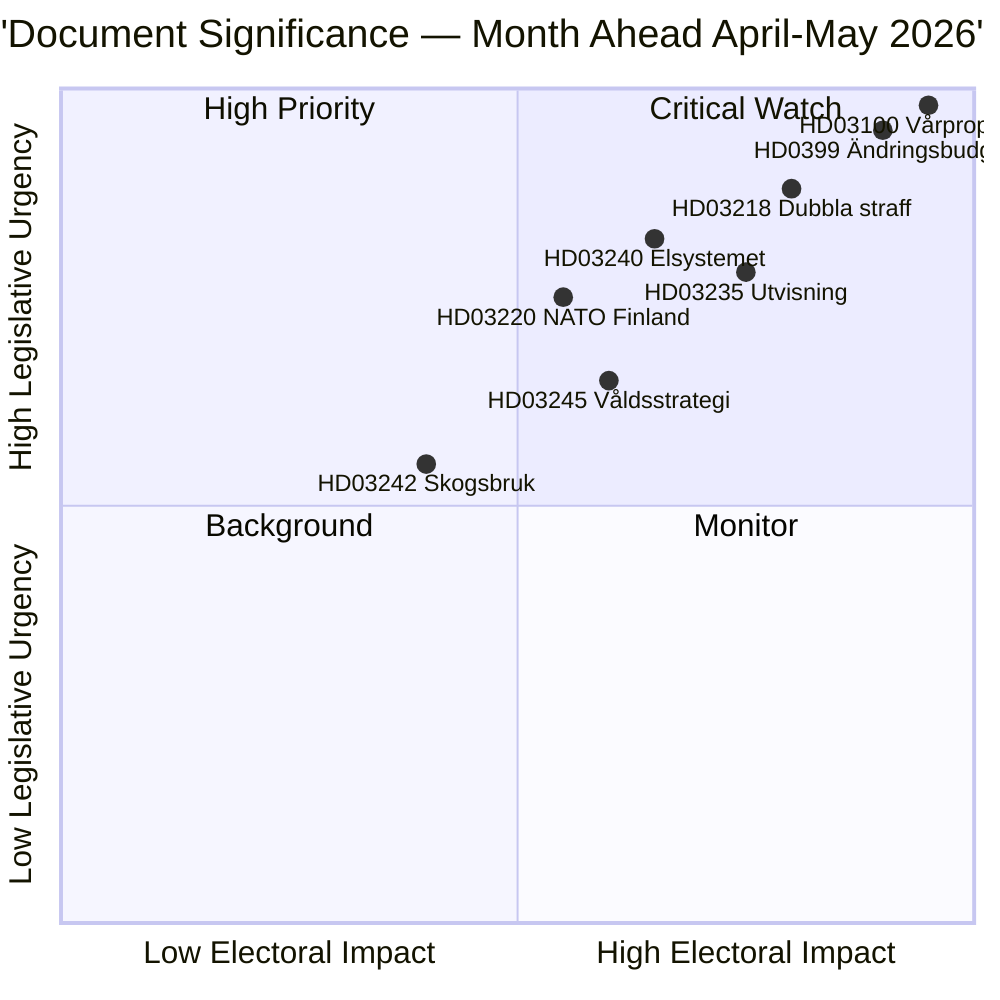

<!-- dir: rtl -->
# תמצית מנהלים — תחזית חודשית 2026-04-23

**סיווג**: ציבורי | **מחבר**: James Pether Sörling | **נוצר**: 2026-04-23
**תקופה**: 2026-04-23 → 2026-05-31 | **מושב**: ריקסמויטי 2025/26 (השלב האחרון של האביב)

---

## 🎯 מסקנה עיקרית

שוודיה נכנסת לחמשת השבועות האחרונים של מושב הפרלמנט 2025/26 עם שלושה חבילות קשורות זו בזו שקובעות את לוח הזמנים החקיקתי: חבילת התקציב האביבי 2026 (HD03100 vårproposition + HD0399 תקציב משלים), חבילת חוק וסדר המגבשת את אג'נדת הצדק הפלילי של Tidöavtalet, וחבילת מעבר האנרגיה שמשנה את מבנה שוק החשמל. שלושת החבילות יקבלו הצבעות סופיות לפני הפסקת הקיץ, כאשר הـ vårproposition קובעת את מסלול המדיניות הפיסקלית של שוודיה דרך תקופה לפני הבחירות של התאוששות כלכלית מתונה והוצאות ביטחוניות גבוהות.

**אמינות**: גבוהה [B2 — מסמכים ממשלתיים רשמיים, מקורות riksdagen.se]

---

## 🧭 3 החלטות שמסמך זה תומך בהן

1. **קביעת עדיפויות עריכתיות**: איזו חבילה חקיקתית ראויה לסיקור המעמיק ביותר בדורת אפריל–מאי 2026? (תשובה: תקציב האביב — השפעה חברתית הרחבה ביותר, קובעת פרמטרים ל-2026–2027)
2. **ניטור סיכונים פוליטיים**: היכן עשויות לצוץ מתחים משמעותיים בקואליציה לפני בחירות ספטמבר 2026?
3. **אינדיקטורים צופי פני עתיד**: אילו אינדיקטורים מסמנים שהקואליציה הממשלתית צוברת או מאבדת תנופה לפני מסע הבחירות?

---

## ⚡ קריאת 60 שניות

- **כספים**: HD03100 Vårproposition מקרין התאוששות מתמשכת (צמיחת תוצר מ−0.20% ב-2023 ל-0.82% ב-2024); הוצאות ביטחוניות גבוהות; הקלה בעלויות אנרגיה דרך HD03236 (הפחתת מס דלק מאי–ספטמבר 2026, תמיכה במחיר האנרגיה ינואר–פברואר 2026 רטרואקטיבית); עלות פיסקלית נטו ~4.1 מיליארד כרונות שוודיות. ועדת האוצר (FiU) של הריקסדאג כבר אישרה את HD01FiU48 ב-21 באפריל 2026.
- **צדק**: HD03218 (עונשים כפולים לפשיעת כנופיות), HD03246 (עבריינים צעירים), HD03217 (אחריות עובד ציבור), HD03235 (גירוש) — כולם מתוכננים להצבעות אביב. V, C ו-MP הגישו מוצעות נגדיות בנוגע לגירוש; V ו-MP מתנגדים לשינויים בתקנות הנשק.
- **אנרגיה**: HD03240 (חוקי חשמל חדשים), HD03239 (חלוקת הכנסות ממאגרי רוח), HD03238 (רשות אישורים סביבתיים חדשה) — צפוי שהרפורמות המבניות ישלטו על לוח הזמנים של ועדות MJU ו-NU עד מאי.
- **ביטחון**: HD03220 (נוכחות קדמית של נאט"ו בפינלנד) — תמיכה דו-מפלגתית רחבה צפויה, עם אופוזיציה קלה מ-V.
- **דיור/עירוני**: HD01CU28 (מרשם לאומי לדירות שיתופיות, בתוקף מ-2027) ו-HD01CU27 (דרישות זהות נכס, בתוקף מ-2026-07-01) שניהם אושרו ב-17 באפריל 2026.

---

## 🔑 האינדיקטור הצופה פני עתיד החשוב ביותר

**לעקוב**: הצבעת הריקסדאג על HD0399 Vårändringsbudget (צפויה בסוף מאי 2026) — אם S, V, MP ו-C מצביעים יחד נגד התקציב, זה מסמן אחדות אופוזיציה מרבית לפני הבחירות ומספק נרטיב בחירות לקראת הקיץ.

---

## 📊 דירוג עדיפויות DIW

---

## 🔒 פרופיל האמינות

- **אמינות הערכה כוללת**: גבוהה
- **אמינות נתונים כלכליים**: בינונית-גבוהה (נתוני הבנק העולמי 2024, vårproposition טרם נותח במלואו)
- **אמינות תוצאות חקיקתיות**: גבוהה (הממשלה שומרת על רוב בתמיכת SD)
- **אמינות ההשפעה הבחירותית**: בינונית (5 חודשים עד הבחירות; סקרים יכולים להשתנות)

**קוד אדמירלטי**: [B2] — מקור אמין, מאושר על ידי מסמכים פרלמנטריים עצמאיים מרובים

<!-- source-sha: 34bcedb9f943f85646d8e864b41374efd2461075 -->
