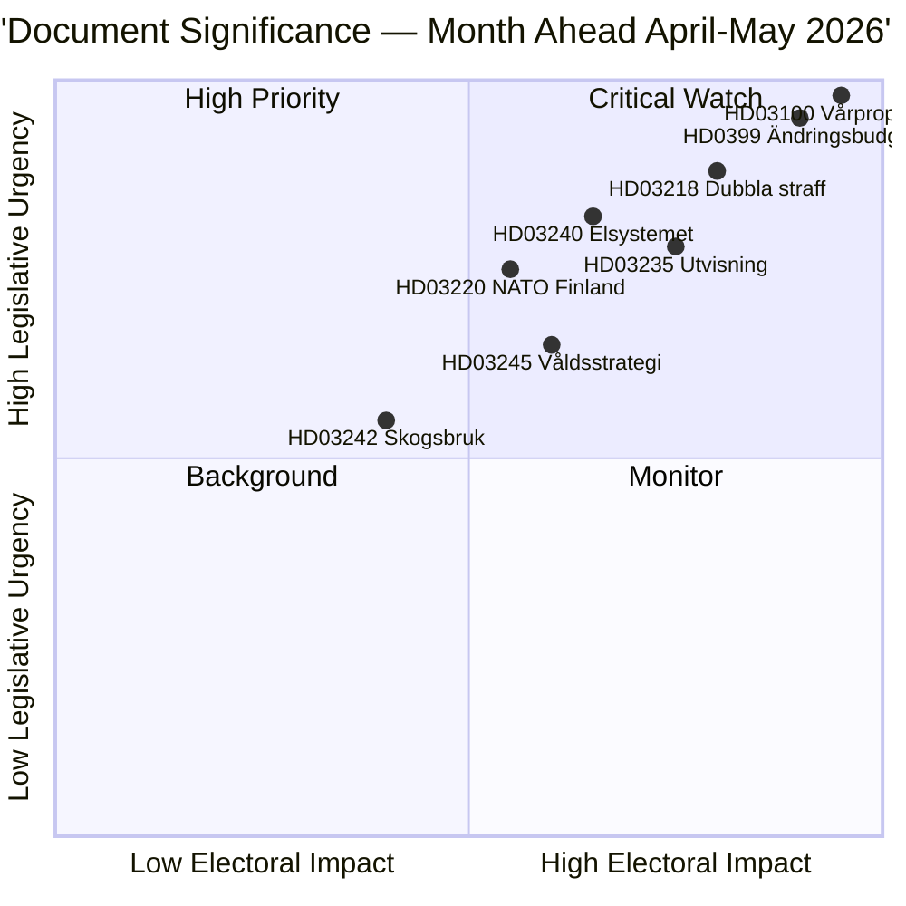

# エグゼクティブブリーフ — 月間展望 2026-04-23

**分類**: 公開 | **著者**: James Pether Sörling | **作成日**: 2026-04-23
**期間**: 2026-04-23 → 2026-05-31 | **会期**: Riksmöte 2025/26（春季最終段階）

---

## 🎯 結論

スウェーデンは議会会期 2025/26 の最後の5週間に入り、三つの相互に連携したパッケージが立法アジェンダを支配しています：2026年春季財政パッケージ（HD03100 vårproposition + HD0399 補正予算）、Tidöavtaletの刑事司法アジェンダを統合する法と秩序パッケージ、および電力市場を再構築するエネルギー転換パッケージ。三つのパッケージすべてが夏季休会前に最終採決を受け、vårpropositionが中程度の経済回復と高まった防衛支出という選挙前期間を通じてスウェーデンの財政軌道を設定します。

**信頼度**: 高 [B2 — 公式政府文書、riksdagen.se情報源]

---

## 🧭 本ブリーフが支援する3つの意思決定

1. **編集上の優先順位設定**: 2026年4月〜5月の会期中に最も深い報道を受けるべき立法パッケージはどれか？（回答：春季財政計画 — 最も広い社会的影響、2026〜2027年のパラメータを設定）
2. **政治的リスク監視**: 2026年9月の選挙前にどこで最も重大な連立の緊張が生じる可能性があるか？
3. **前向き指標**: 秋の選挙運動に向けて与党連立が勢いを得ているか失っているかを示す指標は何か？

---

## ⚡ 60秒読み

- **財政**: Vårproposition HD03100は持続的な回復を予測（GDP成長率が2023年の−0.20%から2024年の0.82%へ）；防衛費高騰；HD03236による光熱費軽減（燃料税引き下げ2026年5月〜9月、エネルギー価格支援2026年1〜2月遡及的）；純財政コスト〜41億スウェーデンクローナ。リクスダーグの財政委員会（FiU）は既に2026年4月21日にHD01FiU48を採択。
- **司法**: HD03218（暴力団犯罪への2倍の刑罰）、HD03246（少年犯罪者）、HD03217（公務員の責任）、HD03235（強制送還）— 全て春の採決予定。V、C、MPが強制送還に反対する動議を提出；V、MPは武器規制変更に反対。
- **エネルギー**: HD03240（新電力法）、HD03239（風力発電収益分配）、HD03238（新環境許可機関）— 構造改革が5月を通じてMJU・NU委員会のスケジュールを支配する見通し。
- **防衛**: HD03220（フィンランドにおけるNATO前方駐留）— 幅広い超党派支持が期待、Vからの小さな反対。
- **住宅/都市**: HD01CU28（全国住宅組合登録、2027年から有効）とHD01CU27（不動産識別要件、2026-07-01から有効）両方とも2026年4月17日に採択。

---

## 🔑 最重要の前向き指標

**監視**: リクスダーグのHD0399 Vårändringsbudgetへの採決（2026年5月末予定）— S、V、MP、Cが連携して予算に反対票を投じた場合、選挙前の最大野党一致を示し、夏に向けた選挙上の物語を提供します。

---

## 📊 DIW優先順位ランキング

---

## 🔒 信頼度プロファイル

- **全体評価の信頼度**: 高
- **経済データの信頼度**: 中〜高（世界銀行2024年データ、vårpropositionは未だ全文解析されていない）
- **立法結果の信頼度**: 高（政府はSDの支持により多数派を維持）
- **選挙への影響の信頼度**: 中（選挙まで5ヶ月；世論調査は変動する可能性あり）

**アドミラルティコード**: [B2] — 信頼できる情報源、複数の独立した議会文書によって確認済み

<!-- source-sha: 34bcedb9f943f85646d8e864b41374efd2461075 -->
