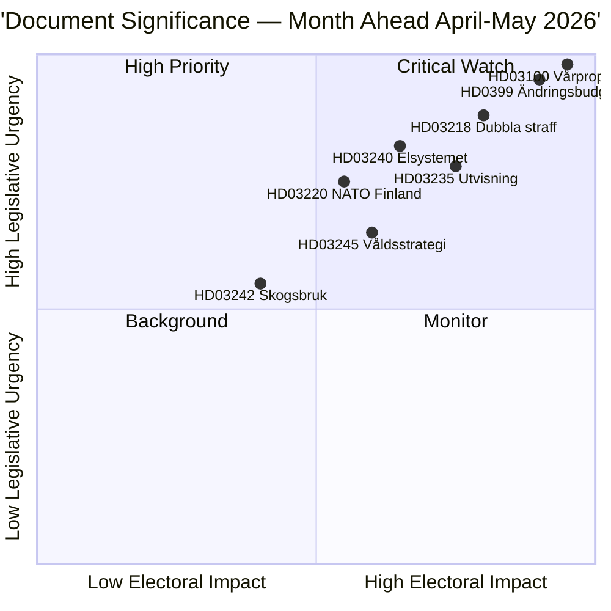

# 집행 요약 — 월간 전망 2026-04-23

**분류**: 공개 | **저자**: James Pether Sörling | **작성일**: 2026-04-23
**기간**: 2026-04-23 → 2026-05-31 | **회기**: 릭스뫼테 2025/26 (봄철 최종 단계)

---

## 🎯 핵심 결론

스웨덴은 의회 회기 2025/26의 마지막 5주에 접어들며 세 가지 상호 연결된 패키지가 입법 의제를 지배하고 있습니다: 2026년 봄 재정 패키지 (HD03100 vårproposition + HD0399 추경 예산), Tidöavtalet의 형사 사법 의제를 통합하는 법과 질서 패키지, 전력 시장을 재구축하는 에너지 전환 패키지. 세 패키지 모두 여름 휴회 전 최종 투표를 받게 되며, vårproposition이 완만한 경제 회복과 높아진 국방비 지출의 선거 전 기간을 통한 스웨덴의 재정 궤적을 설정합니다.

**신뢰도**: 높음 [B2 — 공식 정부 문서, riksdagen.se 출처]

---

## 🧭 이 브리프가 지원하는 3가지 의사결정

1. **편집 우선순위 설정**: 2026년 4월~5월 회기 동안 가장 심층적인 보도가 필요한 입법 패키지는? (답: 봄 재정 계획 — 가장 광범위한 사회적 영향, 2026~2027년 매개변수 설정)
2. **정치적 위험 모니터링**: 2026년 9월 선거 전 연립에서 가장 중요한 긴장이 나타날 가능성이 높은 곳은?
3. **전향적 지표**: 가을 선거 운동을 앞두고 집권 연립이 탄력을 얻거나 잃고 있음을 알리는 지표는?

---

## ⚡ 60초 읽기

- **재정**: Vårproposition HD03100은 지속적인 회복을 예측 (GDP 성장률 2023년 −0.20%에서 2024년 0.82%로 회복); 국방비 증가; HD03236을 통한 에너지 비용 경감 (연료세 인하 2026년 5월~9월, 에너지 가격 지원 2026년 1~2월 소급 적용); 순 재정 비용 ~41억 SEK. 릭스다그 재정위원회 (FiU)는 이미 2026년 4월 21일 HD01FiU48 통과.
- **사법**: HD03218 (갱단 범죄 이중 처벌), HD03246 (청소년 범죄자), HD03217 (공무원 책임), HD03235 (추방) — 모두 봄 투표 예정. V, C, MP는 추방에 반대하는 동의를 제출; V와 MP는 무기 규제 변경에 반대.
- **에너지**: HD03240 (새로운 전력법), HD03239 (풍력 에너지 수익 공유), HD03238 (새로운 환경 허가 기관) — 구조적 개혁이 5월까지 MJU 및 NU 위원회 일정을 지배할 것으로 예상.
- **국방**: HD03220 (핀란드에서의 NATO 전진 주둔) — 광범위한 초당파적 지지 예상, V의 소규모 반대.
- **주택/도시**: HD01CU28 (전국 주택 협동조합 등록부, 2027년부터 유효)와 HD01CU27 (부동산 신원 요건, 2026-07-01부터 유효) 둘 다 2026년 4월 17일 채택.

---

## 🔑 가장 중요한 전향적 지표

**주시**: 릭스다그의 HD0399 Vårändringsbudget 투표 (2026년 5월 말 예상) — S, V, MP, C가 공동으로 예산에 반대 투표하면 선거 전 최대 야당 통합을 신호하고 여름까지 선거 서사를 제공합니다.

---

## 📊 DIW 우선순위 순위

---

## 🔒 신뢰도 프로파일

- **전체 평가 신뢰도**: 높음
- **경제 데이터 신뢰도**: 중~높음 (세계은행 2024년 데이터, vårproposition 아직 전체 텍스트 분석 전)
- **입법 결과 신뢰도**: 높음 (정부는 SD 지원으로 다수 유지)
- **선거 영향 신뢰도**: 중간 (선거까지 5개월; 여론조사는 변동 가능)

**애드미럴티 코드**: [B2] — 신뢰할 수 있는 출처, 여러 독립적인 의회 문서에 의해 확인됨

<!-- source-sha: 34bcedb9f943f85646d8e864b41374efd2461075 -->
