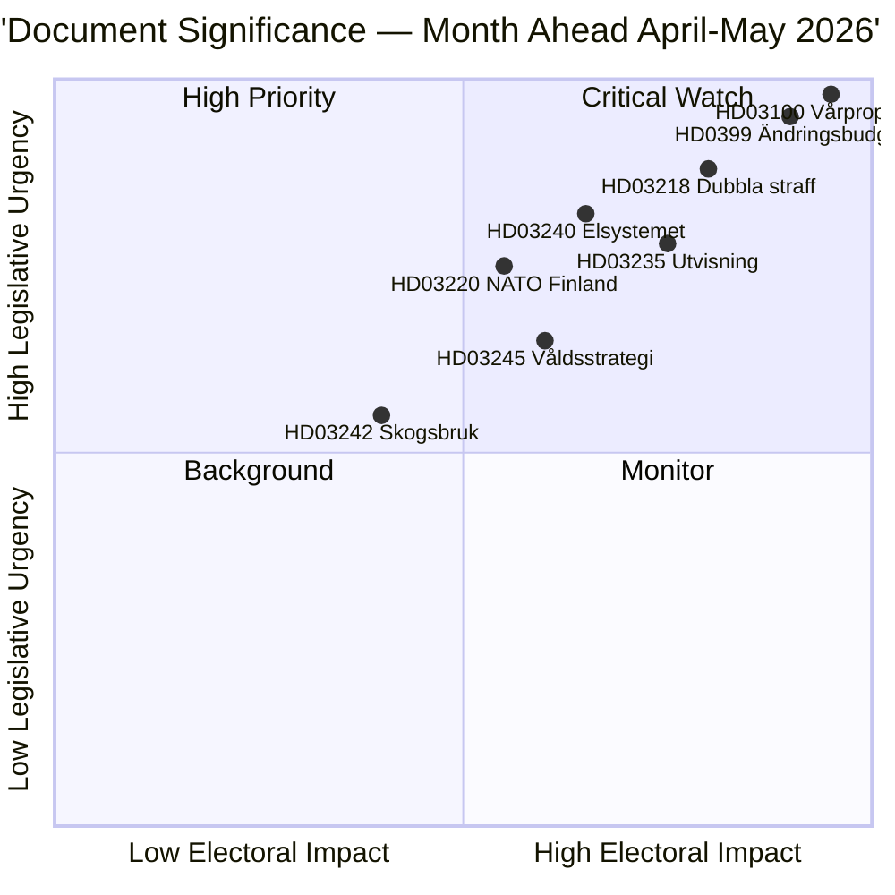

# Uitvoerend Overzicht — Maandoverzicht 2026-04-23

**Classificatie**: Openbaar | **Auteur**: James Pether Sörling | **Gegenereerd**: 2026-04-23
**Periode**: 2026-04-23 → 2026-05-31 | **Sessie**: Riksmöte 2025/26 (eindfase lente)

---

## 🎯 Conclusie

Zweden gaat de laatste vijf weken van de parlementaire sessie 2025/26 in met drie onderling verbonden pakketten die de wetgevingsagenda domineren: het Lente Fiscaal Pakket 2026 (HD03100 vårproposition + HD0399 aanvullend budget), een Wet en Orde Pakket dat de strafrechtelijke agenda van het Tidöavtalet consolideert, en een Energietransitiepakket dat de elektriciteitsmarkt herstructureert. Alle drie pakketten krijgen hun definitieve stemmen voor het zomerreces, waarbij de vårproposition Zweden's fiscale koers bepaalt door een pre-electorale periode van matige economische herstel en verhoogde defensie-uitgaven.

**Betrouwbaarheid**: HOOG [B2 — officiële overheidsdocumenten, riksdagen.se-bronnen]

---

## 🧭 3 Beslissingen die deze nota ondersteunt

1. **Redactionele prioritering**: Welk wetgevingspakket verdient de diepste dekking tijdens de sessie van april–mei 2026? (Antwoord: Lentebudget — breedste maatschappelijke impact, stelt parameters 2026–2027 in)
2. **Politieke risicomonitoring**: Waar zijn de meest significante coalitie-spanningen te verwachten voor de verkiezingen van september 2026?
3. **Vooruitblikkende indicatoren**: Welke indicatoren signaleren dat de regerende coalitie voor of achter raakt richting de herfstcampagne?

---

## ⚡ 60-seconden lezing

- **Financiën**: Vårproposition HD03100 projecteert voortgezet herstel (bbp-groei van −0,20% in 2023 naar 0,82% in 2024); verhoogde defensie-uitgaven; verlaging energiekosten via HD03236 (brandstofbelastingkorting mei–september 2026, energieprijssteun jan.–feb. 2026 retroactief); netto fiscale kosten ~4,1 mrd. SEK. Het Financiëel Comité (FiU) van het Riksdag keurde HD01FiU48 al goed op 21 april 2026.
- **Justitie**: HD03218 (dubbele straffen voor bendecrimi naliteit), HD03246 (jeugdige delinquenten), HD03217 (aansprakelijkheid ambtenaren), HD03235 (uitzetting) — allemaal gepland voor voorjaarsstemmen. V, C en MP hebben tegenmotions ingediend over uitzetting; V en MP zijn tegen wijzigingen in wapenregulering.
- **Energie**: HD03240 (nieuwe elektriciteitswetten), HD03239 (windenergie-inkomstenverdeling), HD03238 (nieuwe milieu-vergunningsautoriteit) — structurele hervormingen worden verwacht de MJU- en NU-commissieagenda's tot mei te domineren.
- **Defensie**: HD03220 (NAVO's vooruitgeschoven aanwezigheid in Finland) — breed partijoverschrijdend steun verwacht, kleine tegenstand van V.
- **Woning/Stedelijk**: HD01CU28 (nationaal woningcoöperatieregister, van kracht per 2027) en HD01CU27 (vereisten vastgoedidentiteit, van kracht per 2026-07-01) beide aangenomen op 17 april 2026.

---

## 🔑 Belangrijkste vooruitblikkende indicator

**Monitoren**: Riksdag-stemming over HD0399 Vårändringsbudget (verwacht eind mei 2026) — als S, V, MP en C gezamenlijk tegen het budget stemmen, signaleert dit maximale oppositionele eenheid voor de verkiezingen en biedt een electoraal narratief richting de zomer.

---

## 📊 DIW-prioriteitsrangschikking

---

## 🔒 Betrouwbaarheidsprofiel

- **Algehele beoordelingsbetrouwbaarheid**: HOOG
- **Betrouwbaarheid economische gegevens**: GEMIDDELD-HOOG (Wereldbankdata 2024, vårproposition nog niet volledig tekstgeparsed)
- **Betrouwbaarheid wetgevingsuitkomsten**: HOOG (regering houdt meerderheid via SD-steun)
- **Betrouwbaarheid electorale impact**: GEMIDDELD (5 maanden tot verkiezingen; peilingen kunnen verschuiven)

**Admiralty-code**: [B2] — Betrouwbare bron, bevestigd door meerdere onafhankelijke parlementaire documenten

<!-- source-sha: 34bcedb9f943f85646d8e864b41374efd2461075 -->
