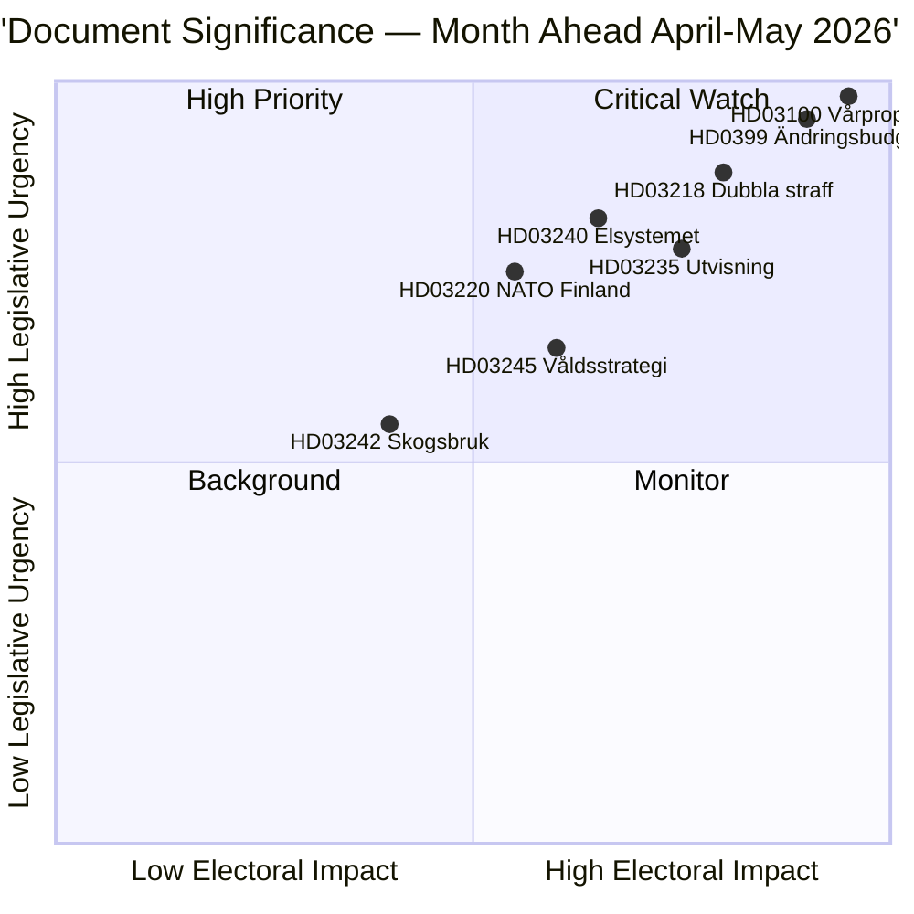

# Sammendrag — Månedsoversikt 2026-04-23

**Klassifisering**: Offentlig | **Forfatter**: James Pether Sörling | **Generert**: 2026-04-23
**Periode**: 2026-04-23 → 2026-05-31 | **Sesjon**: Riksmøtet 2025/26 (sluttfase for vår)

---

## 🎯 Konklusjon

Sverige går inn i de siste fem ukene av parlamentssesjonen 2025/26 med tre sammenkoblede pakker som dominerer den lovgivende agendaen: 2026 Vårfinansielt pakke (HD03100 vårproposition + HD0399 tilleggsbudsjett), en lov-og-orden-pakke som konsoliderer Tidöavtalets kriminalpolitiske agenda, og en energiomstillingspakke som omstrukturerer elektrisitetsmarkedet. Alle tre pakker vil motta endelige avstemninger før sommerferien, der vårproposition setter Sveriges finanspolitiske kurs i en periode med moderat økonomisk gjeninnhenting og økte forsvarsutgifter.

**Sikkerhet**: HØY [B2 — offisielle regjeringsdokumenter, riksdagen.se-kilder]

---

## 🧭 3 Beslutninger dette sammendraget støtter

1. **Redaksjonell prioritering**: Hvilken lovgivningspakke fortjener den dypeste dekningen i april–mai 2026? (Svar: Vårfinansplanen — bredest samfunnsmessig innvirkning, setter parametere for 2026–2027)
2. **Politisk risikoovervåking**: Hvor er de mest betydningsfulle koalisjonsspenningene sannsynlige før valget i september 2026?
3. **Fremadrettede indikatorer**: Hvilke indikatorer signaliserer at den sittende koalisjonen vinner eller taper momentum mot høstkampanjen?

---

## ⚡ 60-sekunders lesning

- **Økonomi**: Vårproposition HD03100 projiserer fortsatt gjeninnhenting (BNP-vekst fra −0,20% i 2023 til 0,82% i 2024); forhøyede forsvarsutgifter; energikostnadslettelse via HD03236 (drivstoffavgiftskutt mai–september 2026, energiprisstøtte jan–feb 2026 retroaktivt); netto finansiell kostnad ~4,1 mrd. SEK. Riksdagens finanskomité (FiU) godkjente allerede HD01FiU48 den 21. april 2026.
- **Justis**: HD03218 (dobbel straff for gjengkriminalitet), HD03246 (unge lovbrytere), HD03217 (tjenestemenns ansvar), HD03235 (utvisning) — alle planlagt til vårens avstemninger. V, C og MP har innlevert motstridende motioner om utvisning; V og MP er imot endringer i våpenlovgivningen.
- **Energi**: HD03240 (nye elektrisitetslover), HD03239 (vindkraftinntektsdeling), HD03238 (ny miljøtillatelsesmyndighet) — strukturelle reformer forventes å dominere MJU- og NU-komiteens planer gjennom mai.
- **Forsvar**: HD03220 (NATOs fremskutte tilstedeværelse i Finland) — bred tverrpolitisk støtte forventet, begrenset motstand fra V.
- **Bolig/by**: HD01CU28 (nasjonalt andelsboligregister, gjelder fra 2027) og HD01CU27 (krav til eiendomsidentitet, gjelder fra 2026-07-01) begge vedtatt 17. april 2026.

---

## 🔑 Viktigste fremadrettede indikator

**Følg med**: Riksdagens avstemning om HD0399 Vårändringsbudget (forventet i slutten av mai 2026) — hvis S, V, MP og C stemmer samlet mot budsjettet, signaliserer dette maksimal opposisjonsenhet inn mot valget og gir en valgfortelling mot sommeren.

---

## 📊 DIW-prioriteringsrangering

---

## 🔒 Sikkerhetsprofil

- **Overordnet vurderingssikkerhet**: HØY
- **Sikkerhet for økonomiske data**: MIDDELS-HØY (Verdensbanksdata 2024, vårproposition ikke ennå fullt tekstparsed)
- **Lovgivningsmessig utfallssikkerhet**: HØY (regjeringen holder flertall via SD-støtte)
- **Valgpåvirkningssikkerhet**: MIDDELS (5 måneder til valget; meningsmålinger kan skifte)

**Admiralty-kode**: [B2] — Pålitelig kilde, bekreftet av flere uavhengige parlamentariske dokumenter

<!-- source-sha: 34bcedb9f943f85646d8e864b41374efd2461075 -->
