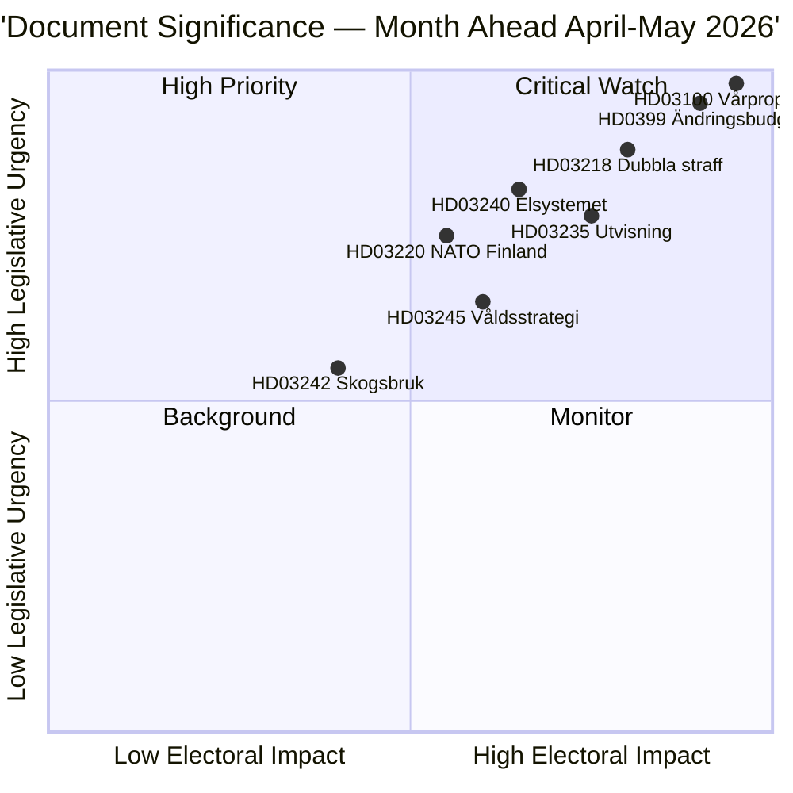

# Verksamhetsöversikt — Månadsöversikt 2026-04-23

**Klassificering**: Offentlig | **Författare**: James Pether Sörling | **Genererad**: 2026-04-23
**Period**: 2026-04-23 → 2026-05-31 | **Session**: Riksmöte 2025/26 (slutet av vårfasen)

---

## 🎯 Slutsats

Sverige inleder de sista fem veckorna av riksmötet 2025/26 med tre sammanlänkade paket som dominerar den lagstiftande agendan: 2026 års vårproposition (HD03100 vårproposition + HD0399 tilläggsbudget), ett lag-och-ordningspaket som konsoliderar Tidöavtalets kriminalpolitiska agenda, samt ett energiomställningspaket som omstrukturerar elmarknaden. Alla tre paketen ska få sina slutliga omröstningar före sommaruppehållet, med vårpropositionen som fastställer Sveriges finanspolitiska bana under en förvalperiod med måttlig ekonomisk återhämtning och förhöjda försvarsutgifter.

**Konfidens**: HÖG [B2 — officiella regeringsdokument, riksdagen.se-källor]

---

## 🧭 3 Beslut som detta briefing stöder

1. **Redaktionell prioritering**: Vilket lagstiftningspaket förtjänar den djupaste bevakningen under april–maj 2026? (Svar: Vårpropositionen — bredast samhällspåverkan, fastställer parametrar för 2026–2027)
2. **Politisk riskbevakning**: Var uppstår de mest betydande koalitionspänningarna inför valet i september 2026?
3. **Framåtblickande indikatorer**: Vilka indikatorer signalerar att regeringskoalitionen vinner eller förlorar momentum inför höstkampanjen?

---

## ⚡ 60-sekundersläsning

- **Finans**: Vårproposition HD03100 projicerar fortsatt återhämtning (BNP-tillväxt från −0,20% 2023 till 0,82% 2024); förhöjda försvarsutgifter; energikostnadslindring via HD03236 (bränsleskattesänkning maj–september 2026, energiprisstöd jan–feb 2026 retroaktivt); nettokostnad ~4,1 miljarder SEK. Riksdagens finansutskott (FiU) passerade redan HD01FiU48 den 21 april 2026.
- **Rättsväsende**: HD03218 (dubbla straff för gängbrottslighet), HD03246 (unga lagöverträdare), HD03217 (tjänstemäns ansvar), HD03235 (utvisning) — alla planerade för vårens omröstningar. V, C och MP har lämnat in motioner mot utvisning; V och MP motsätter sig ändringar i vapenregleringen.
- **Energi**: HD03240 (nya ellagar), HD03239 (vindkraftens intäktsdelning), HD03238 (ny miljöprövningsmyndighet) — strukturella reformer förväntas dominera MJU- och NU-utskottens scheman under maj.
- **Försvar**: HD03220 (NATOs framskjutna närvaro i Finland) — brett partiöverskridande stöd förväntas, visst motstånd från V.
- **Bostad/stadsutveckling**: HD01CU28 (nationellt bostadsrättsregister, gäller från 2027) och HD01CU27 (krav på fastighetsidentitet, gäller från 2026-07-01) passerade båda den 17 april 2026.

---

## 🔑 Viktigaste framåtblickande indikator

**Bevaka**: Riksdagens omröstning om HD0399 Vårändringsbudget (förväntad i slutet av maj 2026) — om S, V, MP och C gemensamt röstar mot budgeten signalerar detta maximal oppositionsenhet inför valet och ger en politisk berättelse inför sommaren.

---

## 📊 DIW-prioriteringsrankning

---

## 🔒 Konfidensprofil

- **Övergripande bedömningskonfidens**: HÖG
- **Ekonomisk datakonfidens**: MEDEL-HÖG (Världsbankdata 2024, vårproposition ej ännu fulltextparsad)
- **Konfidens för lagstiftningsutfall**: HÖG (regeringen har majoritet med SD-stöd)
- **Konfidens för valeffekt**: MEDEL (5 månader till val; opinionen kan förändras)

**Admiralty-kod**: [B2] — Tillförlitlig källa, bekräftad av flera oberoende parlamentariska dokument

<!-- source-sha: 34bcedb9f943f85646d8e864b41374efd2461075 -->
