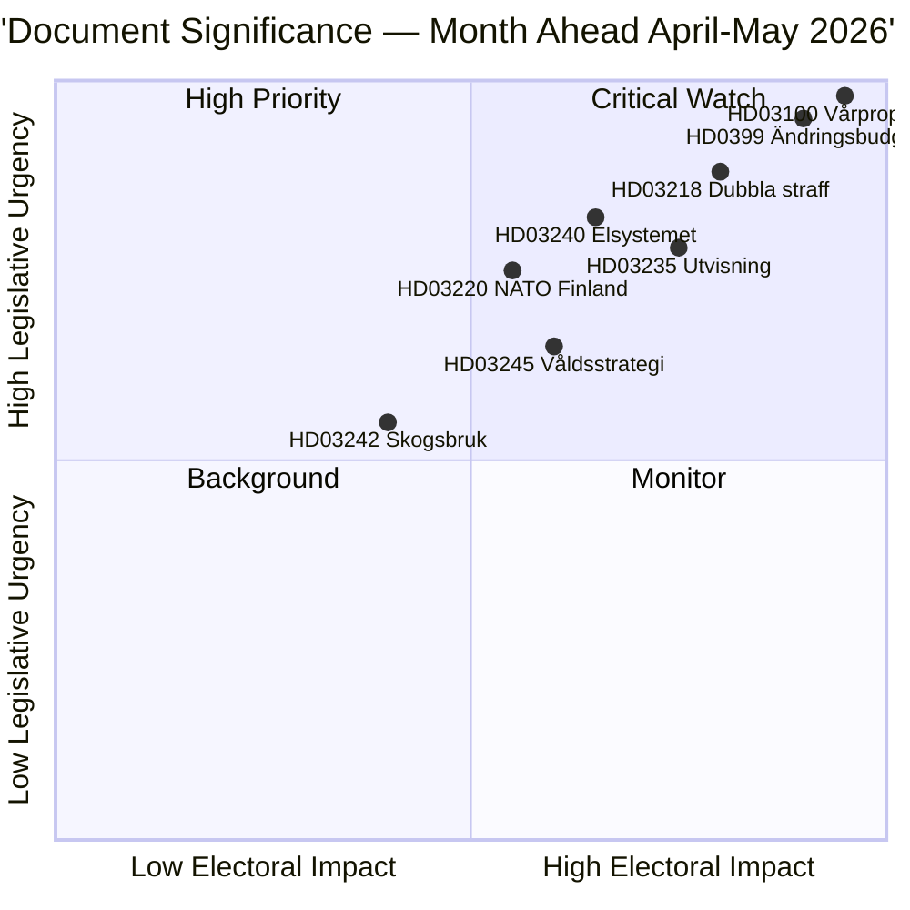

# 执行摘要 — 月度展望 2026-04-23

**分类**: 公开 | **作者**: James Pether Sörling | **生成日期**: 2026-04-23
**时期**: 2026-04-23 → 2026-05-31 | **会期**: Riksmöte 2025/26（春季最终阶段）

---

## 🎯 核心结论

瑞典进入2025/26议会会期的最后五周，三个相互交织的一揽子方案主导着立法议程：2026年春季财政一揽子计划（HD03100 vårproposition + HD0399补充预算）、整合Tidöavtalet刑事司法议程的法律与秩序一揽子计划，以及重组电力市场的能源转型一揽子计划。三个方案将在暑假休会前接受最终表决，vårproposition将在经济温和复苏、国防支出增加的选前时期确立瑞典的财政轨迹。

**可信度**: 高 [B2 — 官方政府文件，riksdagen.se来源]

---

## 🧭 本摘要支持的3项决策

1. **编辑优先级设定**: 2026年4–5月会期内哪个立法包最值得深度报道？（答案：春季财政计划——社会影响最广，设定2026–2027年参数）
2. **政治风险监测**: 2026年9月大选前，联合政府最有可能在哪些领域出现重大分歧？
3. **前瞻性指标**: 哪些指标表明执政联盟在秋季竞选前正获得或失去动力？

---

## ⚡ 60秒速读

- **财政**: Vårproposition HD03100预测持续复苏（GDP增长率从2023年的−0.20%升至2024年的0.82%）；国防开支增加；通过HD03236降低能源成本（2026年5月至9月削减燃油税，2026年1–2月能源价格补贴追溯适用）；净财政成本约41亿克朗。议会财政委员会（FiU）已于2026年4月21日通过HD01FiU48。
- **司法**: HD03218（团伙犯罪双倍刑罚）、HD03246（青少年犯罪者）、HD03217（公务员责任）、HD03235（驱逐出境）——均计划春季表决。V、C和MP就驱逐问题提交了反对动议；V和MP反对武器法规修改。
- **能源**: HD03240（新电力法）、HD03239（风电收益分配）、HD03238（新环境许可机构）——结构性改革预计将主导MJU和NU委员会5月份的日程安排。
- **防务**: HD03220（北约在芬兰的前进部署）——预计获得广泛的跨党派支持，V有轻微反对。
- **住房/城市**: HD01CU28（全国共管公寓登记册，2027年起生效）和HD01CU27（房产身份要求，2026-07-01起生效）均于2026年4月17日通过。

---

## 🔑 最重要的前瞻性触发因素

**关注**: 议会对HD0399 Vårändringsbudget的表决（预计2026年5月底）——若S、V、MP和C联合反对预算，意味着选前反对派团结达到顶峰，并为夏季提供选举叙事。

---

## 📊 DIW优先级排名

---

## 🔒 可信度概况

- **总体评估可信度**: 高
- **经济数据可信度**: 中等偏高（世界银行2024年数据，vårproposition尚未完整解析）
- **立法结果可信度**: 高（政府通过SD支持维持多数）
- **选举影响可信度**: 中等（距选举还有5个月；民调可能变动）

**海军部代码**: [B2] — 可靠来源，已由多个独立议会文件确认

<!-- source-sha: 34bcedb9f943f85646d8e864b41374efd2461075 -->
