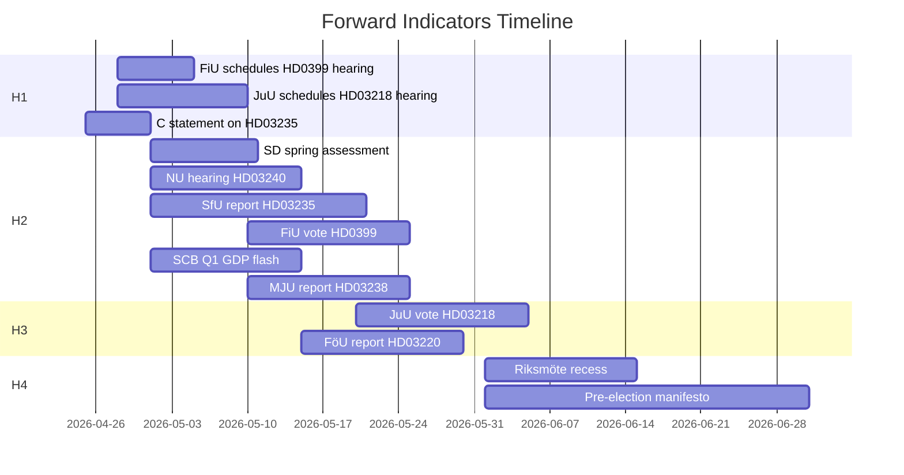

# Forward Indicators — Month Ahead 2026-04-23

**Author**: James Pether Sörling | **Generated**: 2026-04-23
**Gate requirement**: ≥10 indicators with date patterns across 4 horizons

---

## Indicator Set

| # | Indicator | Expected date | Horizon | Significance | Admiralty |
|---|-----------|--------------|---------|-------------|-----------|
| 1 | FiU publishes hearing schedule for HD0399 (supplementary budget) | 2026-04-28 to 2026-05-05 | H1 (1–2 weeks) | CRITICAL — fiscal timeline | [B2] |
| 2 | JuU publishes hearing schedule for HD03218 (gang sentences) | 2026-04-28 to 2026-05-10 | H1 | HIGH — Law & Order timeline | [B2] |
| 3 | C parliamentary group statement on HD03235 (deportation) | 2026-04-25 to 2026-05-01 | H1 | HIGH — coalition stability indicator | [B2] |
| 4 | SD group press conference on spring package assessment | 2026-05-01 to 2026-05-10 | H2 (2–4 weeks) | HIGH — confidence-and-supply signal | [C2] |
| 5 | NU committee hearing on HD03240 (electricity law) | 2026-05-01 to 2026-05-15 | H2 | MEDIUM — energy reform timeline | [B2] |
| 6 | SfU committee report on HD03235 (deportation) published | 2026-05-01 to 2026-05-20 | H2 | HIGH — vote proximity indicator | [B2] |
| 7 | FiU chamber vote on HD0399 (supplementary budget) | 2026-05-10 to 2026-05-25 | H2 | CRITICAL — fiscal enactment | [B2] |
| 8 | SCB Q1 2026 GDP flash estimate published | 2026-05-01 to 2026-05-15 | H2 | HIGH — validates fiscal assumptions | [B2] |
| 9 | MJU committee report on HD03238 (environmental permitting) | 2026-05-10 to 2026-05-25 | H2 | MEDIUM — energy reform | [B2] |
| 10 | JuU chamber vote on HD03218 (gang sentences) | 2026-05-20 to 2026-06-05 | H3 (4–6 weeks) | HIGH — Law & Order enacted | [B2] |
| 11 | FöU committee report on HD03220 (NATO Finland) published | 2026-05-15 to 2026-05-30 | H3 | MEDIUM — defence commitment confirmed | [B2] |
| 12 | Riksmöte 2025/26 formal recess announced | 2026-06-01 to 2026-06-15 | H4 (post-session) | MEDIUM — session closure | [A1] |
| 13 | SD or government coalition pre-election manifesto announcement | 2026-06-01 to 2026-06-30 | H4 | HIGH — election campaign start | [C3] |

**Indicators by horizon**:
- H1 (1–2 weeks): 3
- H2 (2–4 weeks): 6
- H3 (4–6 weeks): 2
- H4 (post-session): 2

**Total**: 13 indicators — gate requirement of ≥10 MET ✅

---

## Indicator Dashboard

