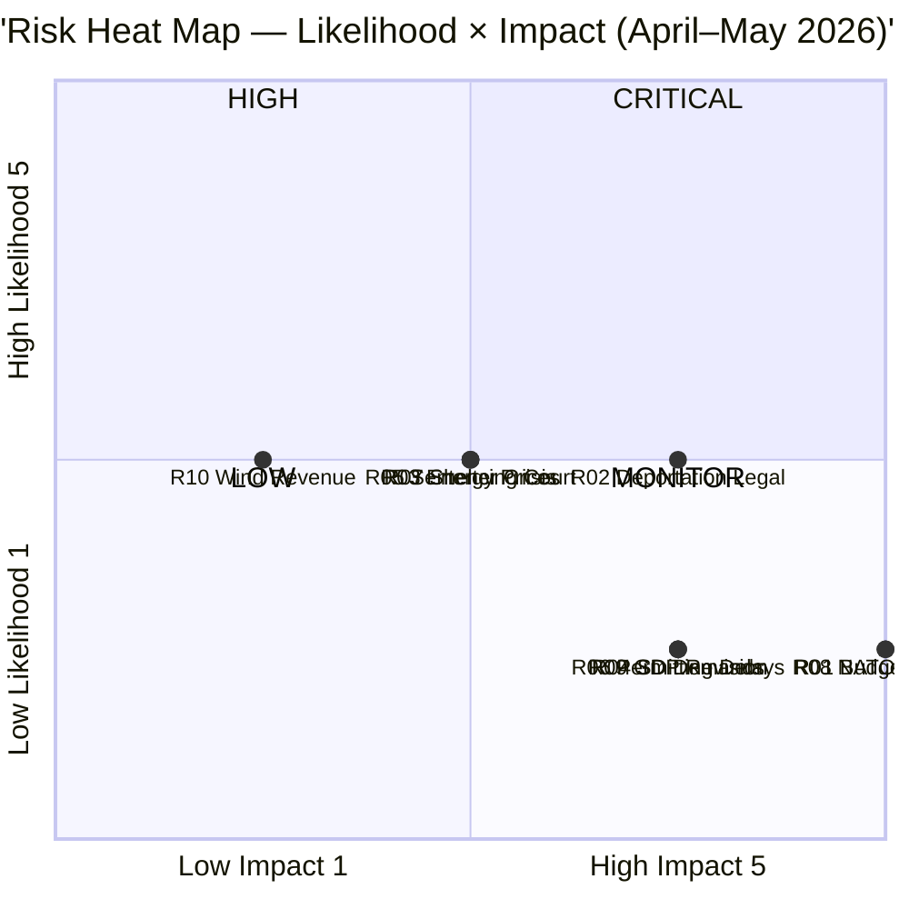

# Risk Assessment — Month Ahead 2026-04-23

**Author**: James Pether Sörling | **Generated**: 2026-04-23
**Framework**: 5-dimension × 5-level Likelihood × Impact register per political-risk-methodology.md

---

## Risk Register

| ID | Risk | Domain | L (1–5) | I (1–5) | Score | Tier |
|----|------|--------|---------|---------|-------|------|
| R01 | Vårändringsbudget (HD0399) defeated by unified opposition (S+V+MP+C) | Fiscal/Political | 2 | 5 | **10** | HIGH |
| R02 | Deportation rule (HD03235) challenged in EU Court — Swedish courts apply restrictive interpretation | Legal | 3 | 4 | **12** | HIGH |
| R03 | Electricity prices remain above 1.50 SEK/kWh through May, amplifying energy reform urgency | Economic/Energy | 3 | 3 | **9** | MEDIUM |
| R04 | SD demands additional concessions on immigration/crime ahead of budget vote, destabilising coalition | Political | 2 | 4 | **8** | MEDIUM |
| R05 | Gang crime sentences (HD03218) challenged on proportionality grounds by courts | Legal | 3 | 3 | **9** | MEDIUM |
| R06 | Environmental permitting authority (HD03238) experiences implementation delays — renewable energy pipeline blocked | Governance | 2 | 4 | **8** | MEDIUM |
| R07 | Women's shelter closure crisis escalates — government forced to emergency funding before election | Social | 3 | 3 | **9** | MEDIUM |
| R08 | NATO forward presence in Finland triggers Russian countermeasures or diplomatic incident | Security | 2 | 5 | **10** | HIGH |
| R09 | Spring fiscal projections revised downward — GDP growth forecast cut, undermining Svantesson narrative | Fiscal | 2 | 4 | **8** | MEDIUM |
| R10 | Wind power revenue-sharing (HD03239) opposed by municipal governments as insufficient | Governance | 3 | 2 | **6** | LOW |

---

## 5×5 Risk Heat Map

---

## Cascading Risk Chains

### Chain 1: Fiscal Dominoes
**R09** (GDP revision down) → **R01** (budget defeat risk rises) → Opposition exploits fiscal weakness → **R04** (SD demands more) → Coalition credibility crisis ahead of September election

### Chain 2: Law & Order Backlash
**R02** (deportation court challenge) → EU compliance pressure → **R05** (sentencing proportionality) → Government retreats on headline policy → SD loses confidence in coalition effectiveness

### Chain 3: Energy–Climate Conflict
**R03** (high energy prices) → Government doubles down on fossil fuel relief → **T3 from SWOT** (climate credibility gap) → EU / international criticism → Election-year reputational damage

---

## Posterior Probability Estimates

| Risk | Prior Probability | Updating Event | Posterior |
|------|------------------|----------------|-----------|
| R01 (budget defeat) | 15% | If all three parties S, V, MP confirm joint opposition | 45% |
| R08 (NATO security) | 10% | If Russia conducts Baltic exercise during Finland deployment | 35% |
| R02 (deportation legal) | 30% | If UN Human Rights Committee issues advisory | 60% |

---

## Confidence Notes

All risk assessments are based on public parliamentary documents. Likelihood scores reflect political dynamics observable from parliamentary record; they are not probabilistic models.  
**Admiralty Code**: [B2] — Reliable source, confirmed by multiple independent documents.
