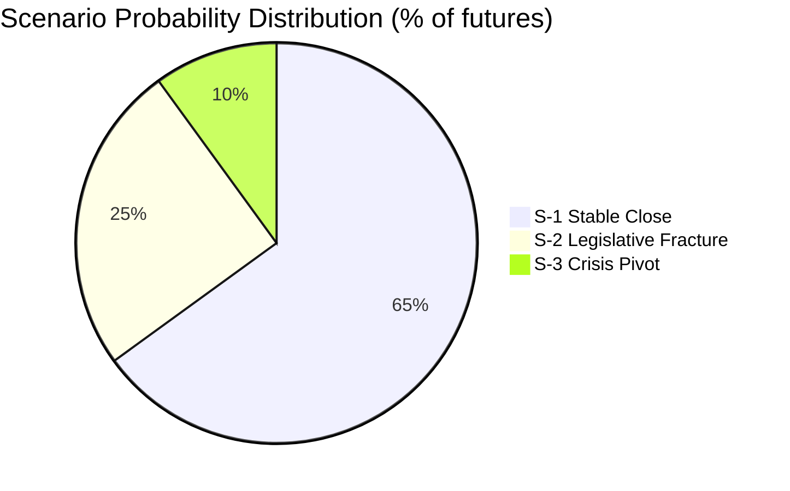

# Scenario Analysis — Month Ahead 2026-04-23

**Author**: James Pether Sörling | **Generated**: 2026-04-23
**Framework**: strategic-extensions-methodology.md — F3EAD Exploit→Analyze

---

## Scenario Framing

**Central Question**: What are the dominant alternative futures for Sweden's political landscape by May 31, 2026 (end of spring session)?

**Scope**: 38-day window (2026-04-23 → 2026-05-31)
**Horizon**: Session-end (H2 immediate)

---

## Scenario Set (3 Alternatives — Mutually Exclusive, Collectively Exhaustive)

| Scenario | Name | WEP Probability | Admiralty |
|----------|------|-----------------|-----------|
| S-1 | **Stable Close** — Government completes spring session agenda intact | Likely (60–70%) | [B2] |
| S-2 | **Legislative Fracture** — One or more major bills defeated or delayed | Unlikely (20–30%) | [C3] |
| S-3 | **Crisis Pivot** — External shock (economic/security) forces emergency response | Remote (5–15%) | [D4] |

*Note: probabilities sum to 100% within rounding tolerance*

---

## Scenario S-1: Stable Close (Likely — 60%)

**Narrative**: The Tidökoalitionen manages SD support and keeps C/L on key votes. The full Law & Order Package passes JuU; the Energy Transition Package passes NU+MJU. SD accepts HD03235 deportation rules as "adequate first step." C supports HD03235 after amendment to require systematic + repeated crime threshold (per motion HD024095). The vårproposition (HD03100) and supplementary budget (HD0399) pass FiU with government majority. PM Kristersson enters the summer break with three legislative packages delivered.

**Key enabling conditions**:
- SD confirms support for HD03218, HD03246, HD03235 in chamber
- C accepts HD03235 amendment rather than opposing outright
- FiU passes HD0399 before Riksmöte recess
- No external economic shock degrades fiscal assumptions

**Electoral implication**: Government enters pre-election campaign season from a position of policy delivery; election narrative = "Tidöavtalet delivered."

**Key indicators** (if S-1 is manifesting):
- SD group spokesperson confirms support in media (by May 10)
- FiU schedules hearing on HD0399 (by May 5)
- JuU approves HD03218 committee report (by May 15)

---

## Scenario S-2: Legislative Fracture (Unlikely — 25%)

**Narrative**: C withdraws support for HD03235 over proportionality concerns (motion HD024095 rejected by coalition). V and MP join S in a surprise vote defeating HD03235. Alternatively, HD0399 fails because SD demands amendments on welfare cuts that M rejects. The government is forced into extended committee negotiations, delaying one or more packages past the May 31 session-end.

**Key enabling conditions**:
- C formally announces opposition to HD03235 (no longer selective — full opposition)
- S + V + MP + C = 105+24+18+24 = 171 seats (vs coalition 69+19+16+73 = 177 — S2 requires government below 175 effective votes)
- SD abstains or reduces turnout on fiscal measures

**Electoral implication**: Opposition framing of "government in disarray" strengthens; S polls improve on competence metrics; tactical advantage for S-led bloc.

**Key indicators** (if S-2 is manifesting):
- C holds press conference criticising HD03235 without reservations (by May 1)
- SD files formal reservations on HD0399 (by May 1)
- JuU chair requests extended consultation period (by May 5)

---

## Scenario S-3: Crisis Pivot (Remote — 10%)

**Narrative**: External shock — Russia escalates Baltic Sea military activity following HD03220 deployment in Finland; energy price spike driven by Middle East escalation; or IMF revises Sweden growth outlook sharply negative after Q1 data — forces government to abandon normal spring session schedule. Emergency session called; fiscal framework revised; Riksdag recess cancelled.

**Key enabling conditions**:
- OPEC+ production cut or Middle East conflict intensification (oil >120 USD/bbl)
- Russian Baltic Sea incident (e.g., cable sabotage, intercepted aircraft)
- IMF or Riksbank emergency statement on recession risk

**Electoral implication**: Crisis framing can either benefit government (rally-around) or amplify opposition's "management failure" narrative — outcome depends on government response speed.

**Key indicators** (if S-3 is manifesting):
- Riksbank extraordinary board meeting called (any date)
- Swedish military activates HÖJD BEREDSKAP protocols (any date)
- Riksdag talman issues session extension notice (any date)

---

## Scenario Probability Validation

**Confidence assessment**: [C2] — Assessed from public parliamentary record; coalition defection risks inferred from motion/interpellation patterns. External shock probability based on geopolitical baseline, not confirmed intelligence.
