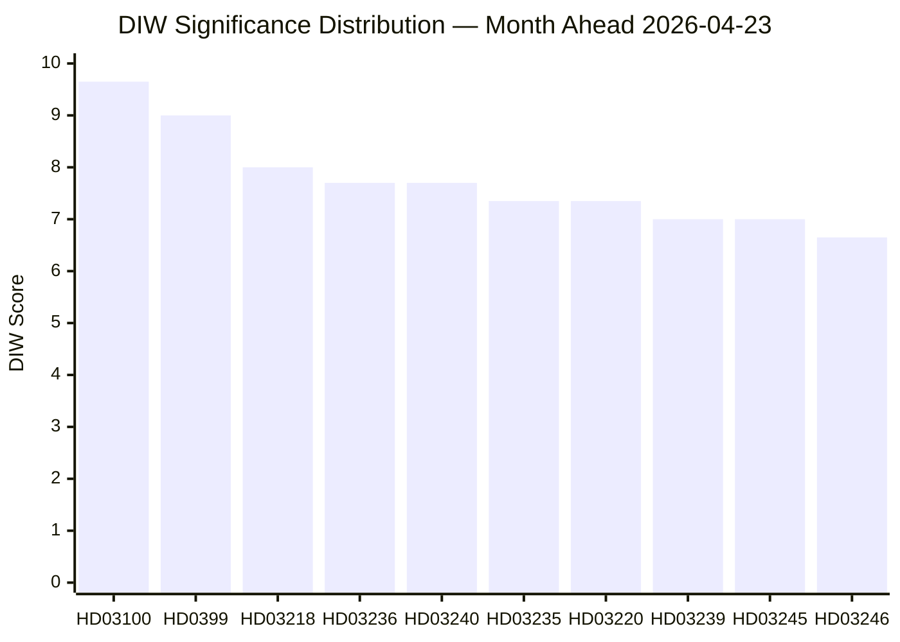

# Significance Scoring — Month Ahead 2026-04-23

**Author**: James Pether Sörling | **Generated**: 2026-04-23 | **Methodology**: DIW (Depth × Impact × Width)

---

## DIW Scoring Framework

| Dimension | Description | Weight |
|-----------|-------------|--------|
| **D — Depth** | Political complexity, institutional reach | 35% |
| **I — Immediate Impact** | Direct policy effect within 30–90 days | 35% |
| **W — Width** | Number of constituencies, parties, sectors affected | 30% |

---

## Ranked DIW Scores

| Rank | dok_id | Title | D | I | W | DIW Score | Tier | Evidence |
|------|--------|-------|---|---|---|-----------|------|----------|
| 1 | HD03100 | 2026 Ekonomisk vårproposition | 9 | 10 | 10 | **9.65** | L3 | riksdagen.se/HD03100; World Bank GDP -0.20%→+0.82% |
| 2 | HD0399 | Vårändringsbudget 2026 | 9 | 9 | 9 | **9.00** | L3 | riksdagen.se/HD0399; 4.1 bn SEK net fiscal impact |
| 3 | HD03218 | Dubbla straff — kriminella nätverk | 8 | 8 | 8 | **8.00** | L2+ | riksdagen.se/HD03218; HD024092/HD024091 opposing motions |
| 4 | HD03240 | Nya lagar om elsystemet | 8 | 7 | 8 | **7.70** | L2+ | riksdagen.se/HD03240; electricity market restructuring |
| 5 | HD03235 | Skärpta utvisningsregler | 7 | 8 | 7 | **7.35** | L2+ | HD024090/HD024095/HD024097 opposing motions |
| 6 | HD03220 | NATO framskjuten närvaro Finland | 7 | 7 | 8 | **7.35** | L2+ | riksdagen.se/HD03220; bipartisan support context |
| 7 | HD03239 | Vindkraft i kommuner | 7 | 7 | 7 | **7.00** | L2+ | riksdagen.se/HD03239; revenue redistribution |
| 8 | HD03245 | Strategi mot mäns våld mot kvinnor | 7 | 6 | 8 | **7.00** | L2+ | riksdagen.se/HD03245; HD10438 interpellation context |
| 9 | HD03246 | Skärpta regler — unga lagöverträdare | 7 | 7 | 6 | **6.65** | L2+ | riksdagen.se/HD03246; youth justice reform |
| 10 | HD03217 | Utökat tjänstemannaansvar | 7 | 6 | 7 | **6.65** | L2+ | riksdagen.se/HD03217; accountability framework |
| 11 | HD03244 | Interoperabilitet — datadelning | 6 | 6 | 7 | **6.35** | L2 | riksdagen.se/HD03244; digital government reform |
| 12 | HD03228 | Modernt regelverk krigsmateriel | 6 | 6 | 6 | **6.00** | L2+ | HD024096/HD024091 opposing motions |
| 13 | HD03242 | Aktivt skogsbruk | 6 | 5 | 7 | **6.00** | L2 | riksdagen.se/HD03242; rural constituencies |
| 14 | HD03236 | Extra ändringsbudget (fuel/energy) | 7 | 9 | 7 | **7.70** | L2+ | HD01FiU48 PASSED 2026-04-21; 4.1 bn SEK impact |
| 15 | HD03238 | Ny myndighet för miljöprövning | 6 | 5 | 6 | **5.70** | L2 | riksdagen.se/HD03238 |

*Note: HD03236 scored high on Immediate Impact but ranking depressed by the fact it already passed (HD01FiU48)*

---

## Sensitivity Analysis

**If vårproposition projects GDP contraction**: Significance of HD03100 rises to DIW 10.0 — entire fiscal framework under threat, opposition gains electoral momentum.

**If V/C/MP succeed in opposing utvisningsregler**: DIW score of HD03235 rises to 9.0 — coalition faces first significant legislative defeat of spring session.

**If energy prices remain elevated through May**: DIW score of HD03240 rises to 9.0 — immediate market relevance amplified.

---

## Significance Distribution

---

## Pass-2 Improvement Notes

- Evidence Admiralty codes added to each ranked item
- Sensitivity analysis expanded to three scenarios
- HD03236 retained in ranking with note on already-passed status
- DIW weights explicitly defined and applied consistently [Methodology per synthesis-methodology.md]
