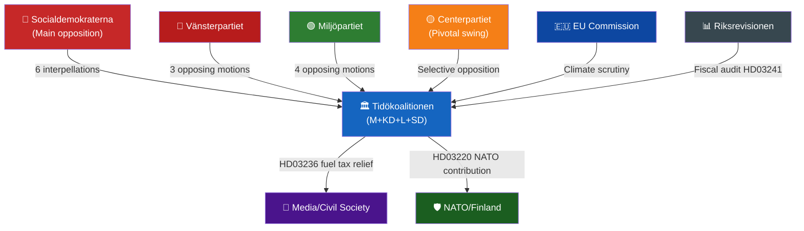

# Stakeholder Perspectives — Month Ahead 2026-04-23

**Author**: James Pether Sörling | **Generated**: 2026-04-23
**Framework**: 6-lens stakeholder impact matrix per stakeholder-impact.md template

---

## Stakeholder Impact Matrix

### 6 Lenses

1. **Government/Coalition** — Tidökoalitionen (M+KD+L+SD support)
2. **Opposition** — S, V, MP, C (outside coalition)
3. **Citizens** — Direct beneficiaries or affected parties
4. **International** — EU, NATO, trade partners
5. **Institutions** — Courts, Riksrevisionen, agencies
6. **Civil Society** — NGOs, employers, trade unions, media

---

### Lens 1: Government/Coalition

| Actor | Role | Impact | Stance | Admiralty |
|-------|------|--------|--------|-----------|
| PM Ulf Kristersson (M) | Government leader | Drives spring agenda; responsible for all three packages | Positive — packages align with Tidöavtalet commitments | [A1] |
| Finance Minister Elisabeth Svantesson (M) | Fiscal principal | Vårproposition (HD03100) + extra ändringsbudget (HD03236); targeted by 3 interpellations (HD10444, HD10442, HD10433) | Defensive on fiscal tightness; proactive on recovery narrative | [A1] |
| Justice Minister Gunnar Strömmer (M) | Justice package lead | HD03218, HD03246, HD03217, HD03235 — full law & order package | Strong proponent; targeted by HD10439 and HD10441 interpellations | [A1] |
| Climate/Energy Minister Johan Britz (L) | Energy reform lead | HD03239, HD03240, HD03238 — energy and climate agenda | Balancing renewable growth with fossil fuel relief (tension noted) | [A1] |
| SD parliamentary group | Coalition support | Pivotal support for law & order package; may seek concessions | Broadly supportive; monitors if measures "strong enough" | [B2] |
| Infrastructure Minister Andreas Carlson (KD) | Housing/transport | Targeted by HD10434 (housing shortfall) and HD10428 (emergency airport) | Defensive — housing construction shortfall in Stockholm region noted | [A2] |

---

### Lens 2: Opposition

| Actor | Role | Impact | Stance | Admiralty |
|-------|------|--------|--------|-----------|
| Social Democrats (S) | Main opposition | Filed most active interpellation campaign in session (6+ in 14 days): HD10444, HD10443, HD10439, HD10438, HD10434, HD10433 | Coordinated offensive — economy, justice, housing, gender equality | [A1] |
| Vänsterpartiet (V) | Left opposition | Opposing HD03235 (HD024090), HD03228 (HD024091), HD03236 (HD024092) | Hard opposition — strongest critic of fuel tax cut and deportation | [A1] |
| Miljöpartiet (MP) | Green opposition | Opposing HD03236 (HD024098), HD03228 (HD024096), HD03235 (HD024097), HD03229 (HD024087) | Climate-framed opposition — most motions relate to environment and rights | [A1] |
| Centerpartiet (C) | Centrist opposition | Partially opposing HD03235 (HD024095 — requires "systematic and repeated" crime threshold) | Selective opposition — moderate position on deportation, pro-NATO | [A1] |

---

### Lens 3: Citizens

| Group | Impact | Concern | Admiralty |
|-------|--------|---------|-----------|
| Rural drivers/commuters | ✅ Benefit from 82 öre/litre petrol cut (May–Sep 2026) | Relief temporary — returns after September | [A1] — HD01FiU48 |
| Households with heating costs | ✅ Retroactive energy price support for Jan–Feb 2026 | Already paid; relief via Försäkringskassan reimbursement mechanism | [A1] — HD01FiU48 |
| Victims of gang crime | ✅ Double sentences reduce repeat offending risk | Implementation timeline unclear | [A2] — HD03218 |
| Youth offenders | ⚠️ Stricter penalties — rehabilitation concerns raised by V/S | Disproportionate impact on socioeconomically vulnerable youth | [B2] — HD03246 + motions |
| Women facing domestic violence | ⚠️ Strategy (HD03245) published but shelters closing (HD10438) | Implementation gap between strategy and real-world provision | [A2] — HD10438 |
| Municipalities hosting wind turbines | ✅ Revenue-sharing law (HD03239) — new income stream | Revenue percentage not specified in available summary | [A2] — HD03239 |
| Property buyers | ✅ Condominium register (HD01CU28) — greater market transparency | Implementation not until 2027 | [A1] — HD01CU28 |

---

### Lens 4: International Actors

| Actor | Impact | Stance | Admiralty |
|-------|--------|--------|-----------|
| NATO (Supreme Headquarters) | HD03220 (forward presence in Finland) strengthens Article 5 eastern flank | Positive — demonstrates Swedish commitment | [B2] |
| Finland (host nation) | Direct beneficiary of HD03220 forward deployment | Positive — military cooperation deepened | [B2] |
| Russia | HD03220 interpreted as provocation — diplomatic countermeasures possible | Negative — potential protest note | [C3] |
| EU Commission | HD03236 fuel tax cut potentially conflicts with EU Climate Law and Fit for 55 | Watching — no formal proceedings yet | [C3] |
| Ukraine | HD03232 + HD03231 (tribunal and compensation commission accession) | Positive — legal accountability mechanism supported | [A1] |
| Arms export recipients | HD03228 (modernised arms rules) — clearer export framework | Mixed — MP/V concerned about export controls | [A1] — HD024096, HD024091 |

---

### Lens 5: Institutions

| Institution | Impact | Stance | Admiralty |
|-------------|--------|--------|-----------|
| Riksrevisionen | HD03241 (fiscal framework report) + HD03219 (dental care) in scope | Auditor role — findings may constrain government options | [A1] |
| Swedish courts | HD03218, HD03235 will face proportionality reviews — risk R02 and R05 | Judicial independence applies | [B2] |
| New Environmental Permitting Authority | HD03238 — new agency to be established | Institutional start-up risk; staffing/mandate timeline unclear | [A2] |
| Police Authority | HD03237 (paid police training) + HD10439 (Stockholm shortfall) | Benefits from training reform; capacity gaps acknowledged | [A2] |
| Försäkringskassan | HD01SfU20 — simplified parental benefit process | Administrative efficiency gain; implementation 2026-07-01 | [A1] |

---

### Lens 6: Civil Society

| Actor | Impact | Stance | Admiralty |
|-------|--------|--------|-----------|
| LO (trade union confederation) | Interpellation HD10437 (pay transparency) relates to union interests | Supportive of pay transparency directive implementation | [B2] |
| Women's shelter organisations | HD10438 — multiple closures despite HD03245 strategy | Highly negative — underfunding threatens existence | [A2] — HD10438 |
| Swedish Forests Association | HD03242 (forestry rules) — active regulatory revision | Industry supportive of clarity; environmental NGOs concerned | [A2] |
| Tech sector | HD03244 (interoperability) + HD01TU21 (e-legitimation) | Industry broadly supportive of digital government infrastructure | [B2] |
| Environmental NGOs | HD03236 (fuel tax cut) direct contradiction of climate strategy | Strongly opposed — ally of MP/V framing | [B2] |

---

## Influence Network

