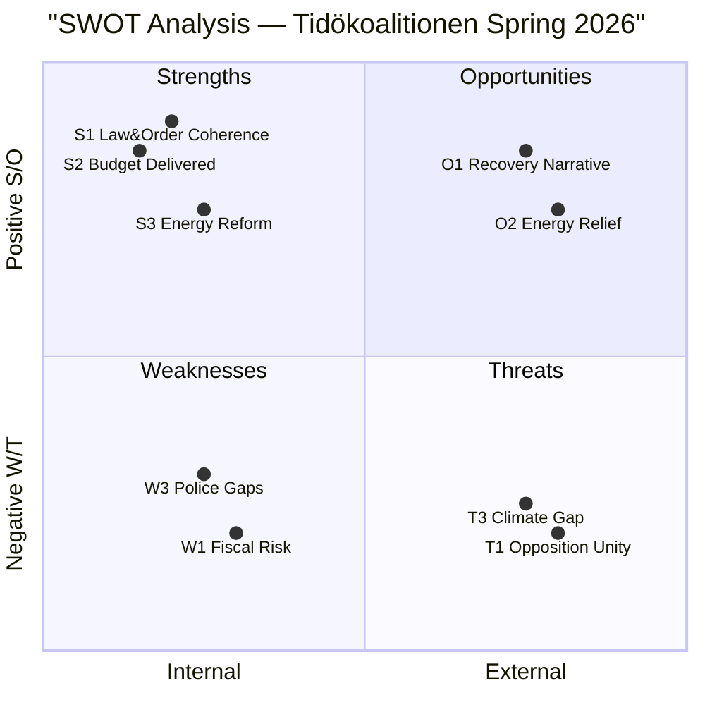

# SWOT Analysis — Month Ahead 2026-04-23

**Author**: James Pether Sörling | **Generated**: 2026-04-23
**Scope**: Tidökoalitionen's legislative agenda, April 23 – May 31, 2026
**Framework**: Political SWOT per political-swot-framework.md + TOWS matrix

---

## SWOT Matrix

### Strengths

| # | Strength | Evidence | Admiralty |
|---|----------|----------|-----------|
| S1 | Coherent legislative package in law & order — double penalties (HD03218), youth rules (HD03246), civil servant liability (HD03217), deportation (HD03235) form a unified electoral narrative | HD03218 submitted 2026-04-09; HD03246 submitted 2026-04-16; riksdagen.se primary sources | [A2] |
| S2 | Spring Fiscal Package already partially implemented — extra ändringsbudget (HD03236) passed via HD01FiU48 on 2026-04-21, delivering visible fuel tax relief before summer | HD01FiU48 committee report confirmed passed; 82 öre/litre petrol reduction, 319 SEK/m³ diesel | [A1] |
| S3 | Energy policy package (HD03240, HD03239, HD03238) positions Sweden as European electricity market leader — new laws consolidate grid architecture, create dedicated permitting authority | riksdagen.se/HD03240; HD03239 introduces mandatory revenue-sharing for hosting municipalities | [A2] |
| S4 | NATO integration (HD03220) enjoys broad cross-party support — even S voted for NATO accession in 2022; Finnish forward presence strengthens Nordic-Baltic deterrence | riksdagen.se/HD03220; cross-party context from 2022 NATO vote | [B2] |
| S5 | Strong institutional capacity — Finance Committee (FiU) processed extra ändringsbudget within 8 days of submission; committee system functioning effectively | HD01FiU48 dated 2026-04-21 vs HD03236 dated 2026-04-13 | [A1] |

### Weaknesses

| # | Weakness | Evidence | Admiralty |
|---|----------|----------|-----------|
| W1 | Fiscal credibility risk — extra ändringsbudget deteriorates fiscal balance by 4.1 billion SEK in 2026 at a time when the government's own fiscal framework targets surplus | HD01FiU48 summary: statens inkomster minskar ~1.56 bn SEK, utgifter ökar ~2.4 bn SEK | [A1] |
| W2 | Law & order package lacks S/V/MP/C consensus — HD024090 (V), HD024095 (C), HD024097 (MP) all oppose key provisions of deportation rules, widening the legislative divide | HD024090, HD024095, HD024097 all filed 2026-04-16 against HD03235 | [A1] |
| W3 | Police shortage undermines law & order narrative — interpellation HD10439 (Mattias Vepsä, S) highlights persistent regional gaps despite achievement of 10,000 police recruitment target | HD10439 filed 2026-04-20: BRÅ evaluation noted gaps in Stockholm deployment | [A2] |
| W4 | Women's shelters closures contradict gender equality strategy — interpellation HD10438 documents closure of multiple shelters while HD03245 positions government as champion of women's safety | HD10438 (Sofia Amloh, S → Nina Larsson, L) filed 2026-04-17 | [A2] |

### Opportunities

| # | Opportunity | Evidence | Admiralty |
|---|-------------|----------|-----------|
| O1 | Economic recovery narrative — GDP growth recovering from -0.20% (2023) to 0.82% (2024) allows Finance Minister Svantesson to campaign on stability and recovery ahead of September election | World Bank Sweden GDP data 2023–2024 | [B1] |
| O2 | Energy crisis exploited for political advantage — high electricity prices in early 2026 justified extra ändringsbudget; if energy remains elevated through May, government can amplify relief narrative | HD01FiU48 summary cites conflict in Mellanöstern and harsh winter 2026 as justifications | [A2] |
| O3 | Condominium register (HD01CU28) + identity requirements (HD01CU27) address housing market opacity — government can position these as anti-crime/anti-money-laundering measures | HD01CU28 passed 2026-04-17; HD01CU27 effective 2026-07-01 | [A1] |
| O4 | Interoperability proposal (HD03244) builds digital government credentials — data-sharing modernisation positions Sweden at EU NIS2/data-act frontier | riksdagen.se/HD03244; EU regulatory alignment context | [B2] |

### Threats

| # | Threat | Evidence | Admiralty |
|---|--------|----------|-----------|
| T1 | Opposition unity risk — if S, V, MP, and C coordinate against the vårändringsbudget (HD0399), the government faces a dramatic budget defeat in the final session week before election campaign | HD024082 (S), HD024092 (V), HD024098 (MP) all oppose fuel tax cut; C ambiguous | [B2] |
| T2 | SD credibility risk — SD MPs' relationship with the Tidö agenda may be tested if gang crime measures are perceived as insufficient; SD could seek to outbid M/KD/L on punitiveness | HD03218 context; SD's crime narrative history | [C3] |
| T3 | Environmental credibility gap — fuel tax cut (HD03236, passed) directly contradicts Sweden's own climate targets; risk of EU infringement proceedings or diplomatic embarrassment at COP32 | HD01FiU48 passed; MP motion HD024098 and V motion HD024092 explicitly cite climate impacts | [B2] |
| T4 | Healthcare investment gap — interpellation HD10432 (Robert Olesen, S → Health Minister Elisabet Lann, KD) exposes ageing hospital infrastructure with massive capital requirements | HD10432 filed 2026-04-15; many Swedish hospitals built in 1960s | [B2] |

---

## TOWS Matrix

| | **Strengths (S1–S5)** | **Weaknesses (W1–W4)** |
|---|----------------------|----------------------|
| **Opportunities (O1–O4)** | **SO Strategies**: Use S2+O2 (fuel tax relief + energy narrative) to build pre-election credibility; use S3+O3 (energy reform + housing transparency) as digital governance platform | **WO Strategies**: Address W4 (shelters) via O1 (recovery dividend) — fund women's shelters through fiscal surplus; address W3 (police gaps) via O1 — deploy incremental policing resources |
| **Threats (T1–T4)** | **ST Strategies**: Use S4 (NATO bipartisan support) to counter T2 (SD outbidding); use S1 (coherent L&O narrative) to pre-empt T1 (opposition unity) | **WT Strategies**: Address W1+T3 (fiscal-climate gap) — announce a phased return of fuel tax from October 2026 to restore climate credentials without losing summer voter support |

---

## Cross-SWOT Interference

- S2 (extra budget passed) **amplifies** T3 (climate credibility gap) — the fastest legislative win is simultaneously the most environmentally damaging symbol
- W4 (shelter closures) **directly contradicts** S1 (law & order coherence) — the government's own social safety net strategy undermines its gender equality narrative
- O1 (recovery narrative) **partially mitigates** W1 (fiscal risk) — if growth accelerates to 2%+, the 4.1 bn SEK deterioration appears manageable in debt/GDP terms

---

## SWOT Visualisation

