# Synthesis Summary — Month Ahead 2026-04-23

**Author**: James Pether Sörling | **Generated**: 2026-04-23 | **Period**: Apr 23 – May 31, 2026

---

## Lead Story: Spring Fiscal Package Sets Pre-Election Economic Narrative

The Tidökoalition's 2026 Spring Fiscal Package — comprising HD03100 (vårproposition), HD0399 (vårändringsbudget), and HD03236 (extra ändringsbudget, already passed 2026-04-21 via HD01FiU48) — is the most consequential legislative cluster of the spring session. Sweden's GDP growth recovered from -0.20% in 2023 to 0.82% in 2024 (World Bank), and Finance Minister Elisabeth Svantesson's vårproposition charts a course toward continued but cautious recovery. The extra ändringsbudget cuts energy tax on petrol and diesel by 82 öre/litre and 319 SEK/m³ respectively for May–September 2026, costing approximately 1.56 billion SEK in lost revenue while providing ~2.4 billion SEK in energy price support — net fiscal deterioration of ~4.1 billion SEK in 2026. The Middle East conflict and high electricity prices in early 2026 are cited as justification [HD01FiU48, B2].

**DIW Score**: L3 (highest priority) [A1 — primary government documents, parliamentary confirmed]

---

## Integrated Intelligence Picture

```mermaid
graph TB
    subgraph PKG1["💰 Spring Fiscal Package (L3)"]
        FP["HD03100 Vårproposition<br/>Economic policy framework 2026-27"]
        SB["HD0399 Vårändringsbudget<br/>Net +4.1 bn SEK spending"]
        EB["HD03236 Extra ändringsbudget<br/>Fuel tax cut + energy support<br/>PASSED 2026-04-21"]
    end

    subgraph PKG2["⚖️ Law & Order Package (L2+)"]
        DS["HD03218 Dubbla straff<br/>Gang crime double penalties"]
        YO["HD03246 Unga lagöverträdare<br/>Youth offender rules"]
        CA["HD03217 Tjänstemannaansvar<br/>Expanded civil servant liability"]
        DP["HD03235 Utvisningsregler<br/>Stricter deportation"]
    end

    subgraph PKG3["⚡ Energy Transition Package (L2+)"]
        EL["HD03240 Nya elsystemlagar<br/>Electricity market reform"]
        WP["HD03239 Vindkraft i kommuner<br/>Revenue-sharing for wind"]
        EP["HD03238 Miljöprövning<br/>New permitting authority"]
    end

    subgraph PKG4["🛡️ Defence Package (L2+)"]
        NA["HD03220 NATO Finland<br/>Forward presence contribution"]
        KM["HD03228 Krigsmateriel<br/>Updated arms regulation"]
    end

    FP --> SB
    SB --> EB
    DS --> YO
    EL --> WP
    WP --> EP
    NA --> KM

    style PKG1 fill:#B71C1C,color:#FFFFFF
    style PKG2 fill:#E65100,color:#FFFFFF
    style PKG3 fill:#1565C0,color:#FFFFFF
    style PKG4 fill:#1B5E20,color:#FFFFFF
    style FP fill:#C62828,color:#FFFFFF
    style SB fill:#C62828,color:#FFFFFF
    style EB fill:#4CAF50,color:#FFFFFF
    style DS fill:#EF6C00,color:#FFFFFF
    style YO fill:#EF6C00,color:#FFFFFF
    style CA fill:#EF6C00,color:#FFFFFF
    style DP fill:#EF6C00,color:#FFFFFF
    style EL fill:#1976D2,color:#FFFFFF
    style WP fill:#1976D2,color:#FFFFFF
    style EP fill:#1976D2,color:#FFFFFF
    style NA fill:#2E7D32,color:#FFFFFF
    style KM fill:#2E7D32,color:#FFFFFF
```

---

## DIW-Weighted Document Ranking

| Rank | dok_id | Title | DIW Tier | Priority Rationale |
|------|--------|-------|----------|--------------------|
| 1 | HD03100 | 2026 Ekonomisk vårproposition | L3 | Sets entire fiscal framework through election |
| 2 | HD0399 | Vårändringsbudget 2026 | L3 | Modifies spending structure for 2026 |
| 3 | HD03218 | Dubbla straff — kriminella nätverk | L2+ | High political salience, election-year flagship |
| 4 | HD03240 | Nya lagar om elsystemet | L2+ | Structural reform of electricity market |
| 5 | HD03235 | Skärpta utvisningsregler | L2+ | Contested — V/C/MP opposition motions filed |
| 6 | HD03220 | NATO framskjuten närvaro Finland | L2+ | Security significance, bipartisan support |
| 7 | HD03239 | Vindkraft i kommuner | L2+ | Revenue redistribution, rural–urban impact |
| 8 | HD03245 | Strategi mot mäns våld mot kvinnor | L2+ | Pre-election gender equality commitment |
| 9 | HD03246 | Unga lagöverträdare | L2+ | Juvenile justice reform, politically salient |
| 10 | HD03217 | Utökat tjänstemannaansvar | L2+ | Rule of law reform, broad support expected |

---

## Thematic Synthesis

### Theme 1: Pre-Election Fiscal Management
The government faces a classic pre-election dilemma: demonstrate competent stewardship while providing voter-visible relief. The fuel tax cut (82 öre/litre on petrol) directly targets working-class and rural voters who depend on private transport. Critics from S, V, and MP argue this contradicts climate commitments and is fiscally irresponsible. The vårproposition must balance defence spending growth (NATO commitments) with popular relief measures amid a fiscal framework whose surplus target becomes politically relevant if overshoot signals austerity.

### Theme 2: Law & Order Election Platform
The Tidöavtalet's criminal justice agenda achieves its most concentrated legislative expression in May 2026. Double sentences for gang crime, stricter youth offender rules, expanded public servant accountability, and tighter deportation rules collectively form the government's most politically coherent package. With SD's support secured, these measures will pass — but V, C (partially), and MP opposition creates a clear left-right cleavage the Social Democrats can exploit.

### Theme 3: Energy Market Transformation
The electricity laws package (HD03240) represents the most structurally significant legislation of the session. New market architecture, a dedicated environmental permitting authority (replacing regional boards for large projects), and mandatory revenue-sharing for wind power municipalities alter the investment landscape for both renewable energy and fossil fuel alternatives.

---

## AI-Recommended Article Metadata

- **Suggested SEO title**: "Sweden's Parliament: Five Weeks of Budget, Crime, and Energy Votes Before Summer Recess"
- **Meta description (158 chars)**: "Swedish parliament votes on the spring fiscal package, gang crime double penalties, and electricity market reform in the final five weeks before the 2026 election campaign."
- **Primary keyword**: Swedish parliament spring 2026
- **Secondary keywords**: vårproposition 2026, Swedish election 2026, Swedish energy reform
