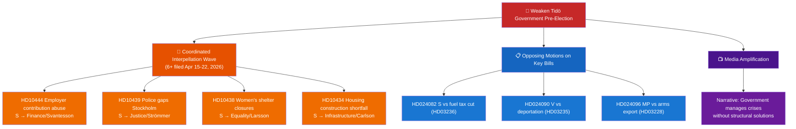

# Threat Analysis — Month Ahead 2026-04-23

**Author**: James Pether Sörling | **Generated**: 2026-04-23
**Framework**: Political Threat Taxonomy per political-threat-framework.md

---

## Political Threat Taxonomy

### Category I: Legislative Threats

| Threat ID | Threat | Actor | Vector | Severity |
|-----------|--------|-------|--------|----------|
| LT-01 | Unified opposition vote defeats vårändringsbudget HD0399 | S+V+MP | Formal parliamentary vote | CRITICAL |
| LT-02 | Constitutional amendment (HD01KU33 — digital seizure) requires second reading after 2026 election | KU process | Constitutional procedural constraint | MEDIUM |
| LT-03 | V/C/MP jointly amend or defeat HD03235 deportation rules | V+C+MP | Opposition motions HD024090, HD024095, HD024097 | HIGH |

### Category II: Institutional Threats

| Threat ID | Threat | Actor | Vector | Severity |
|-----------|--------|-------|--------|----------|
| IT-01 | New environmental permitting authority (HD03238) faces delay — conflicts with existing Naturvårdsverket authority | Bureaucratic | Implementation gap | MEDIUM |
| IT-02 | Riksrevisionen (National Audit Office) broadens fiscal scrutiny scope — second report (HD03241) triggers parliamentary accountability hearings | Riksrevisionen | Audit findings | MEDIUM |

### Category III: Electoral Threats

| Threat ID | Threat | Actor | Vector | Severity |
|-----------|--------|-------|--------|----------|
| ET-01 | Social Democrats consolidate opposition narrative around government's "crisis management incompetence" — 6 interpellations filed in one week signal coordinated offensive | S | Interpellation campaign (HD10444, HD10443, HD10439, HD10438, HD10434, HD10433) | HIGH |
| ET-02 | SD outbids M/KD/L on crime/immigration hardness, eroding coalition right flank | SD | Media positioning | MEDIUM |
| ET-03 | MP and V campaign on climate rollback (HD03236 fuel tax cut) — younger urban voters shift | MP+V | Campaign framing | MEDIUM |

### Category IV: External/Security Threats

| Threat ID | Threat | Actor | Vector | Severity |
|-----------|--------|-------|--------|----------|
| XT-01 | Russian diplomatic reaction to NATO forward presence (HD03220) | Russia | Diplomatic protest / military signalling | MEDIUM |
| XT-02 | EU Commission examines Swedish fuel tax cut against Climate Law | EU Commission | Infringement proceedings risk | LOW |
| XT-03 | Middle East conflict escalates — energy prices spike, further fiscal pressure on HD0399 | External | Market forces | MEDIUM |

---

## Attack Tree — ET-01 (Opposition Coordinated Interpellation Campaign)

---

## Kill Chain Analysis — LT-01 (Budget Defeat)

| Phase | Description | Current State |
|-------|-------------|---------------|
| Reconnaissance | Opposition assess government vulnerability on fiscal policy | ACTIVE — S, V, MP filed motions |
| Weaponisation | Fuel tax cut framed as climate betrayal + fiscal irresponsibility | ACTIVE — MP motion HD024098 |
| Delivery | Joint parliamentary motion and whipping | POTENTIAL — C position unclear |
| Exploitation | Budget vote fails — government loses fiscal credibility | NOT YET |
| C&C | S leads narrative; V/MP flank on climate; C holds pivotal votes | POTENTIAL |
| Persistence | Electoral damage extends through summer campaign | PROJECTED IF SUCCESSFUL |

---

## MITRE-Style TTP Mapping (Political Context)

| TTP-ID | Technique | Example |
|--------|-----------|---------|
| PT-001 | Interpellation bombardment | 6 S interpellations filed Apr 15–22, 2026 |
| PT-002 | Opposing motions to neutralise bills | HD024090/HD024095/HD024097 on HD03235 |
| PT-003 | Frame as government contradiction | W4 (shelters) vs HD03245 (strategy) |
| PT-004 | Coalition wedge exploitation | C ambiguity on deportation rules |

**Confidence**: MEDIUM [C2 — assessed from public documents; opposition intent inferred from parliamentary record]
