## Executive Brief
<!-- source: executive-brief.md :: https://github.com/Hack23/riksdagsmonitor/blob/main/analysis/daily/2026-04-23/monthly-review/executive-brief.md -->

---

### 🎯 BLUF

Sweden's April 2026 parliamentary sprint delivered the Kristersson government's final pre-election legislative package. The month's political signature is a **fiscal-electoral pivot**: HD01FiU48 (4.1 billion SEK fuel tax emergency relief) passed April 22 with an extraordinary M+SD+S+KD supermajority, revealing S's inability to oppose household energy relief 143 days before the September 2026 election. Combined with NATO deployments (UFöU3), energy governance restructuring (HD03240/238/239), and a criminal justice sweep, the government has executed a high-confidence electoral positioning strategy — though healthcare (77 combined reservations across SfU18/SoU16/SoU17) and coalition stress (SD-KD fracture on SoU17 R15) present credible vulnerabilities.

---

### 🧭 3 Decisions This Brief Supports

#### Decision 1: Electoral Strategy Assessment (September 2026)
The government's pre-election positioning is coherent and professionally executed — fiscal responsibility + household relief + security + immigration delivery. The main risk is the healthcare battleground, where 77 combined committee reservations signal a well-organized opposition offensive.
**Analyst Recommendation**: Monitor SfU committee deliberations and healthcare regional data for S campaign ammunition. Watch SD-KD healthcare split for escalation signals.

#### Decision 2: Energy Policy and Investment Timing
The energy triptych (HD03240/238/239) creates new investment opportunities and regulatory clarity for electricity infrastructure. Miljöprövningsmyndigheten will accelerate permitting. Wind power municipal revenue sharing (HD03239) resolves a key local opposition barrier.
**Analyst Recommendation**: Investors in Swedish electricity production and renewable energy should note the regulatory framework stabilization as a positive signal.

#### Decision 3: Defence and Security Business Impact
UFöU3 (1,200 troops eFP Finland) + HD03214 (cybersecurity) + HD03228 (war materiel) signal continued high defence spending. Sweden's defence industrial base is being modernized through cleaner war materiel regulations.
**Analyst Recommendation**: Defence and cybersecurity sector companies should note accelerated procurement and regulatory modernization signals.

---

### 60-Second Read: Key Bullets

- 🔴 **April 22**: HD01FiU48 (4.1 GSEK fuel tax relief) enacted — M+SD+**S**+KD supermajority signals S's electoral vulnerability on energy costs
- 🔴 **April 13**: Vårproposition (HD03100) + Vårändringsbudget (HD0399) — final pre-election fiscal framework
- 🟠 **NATO**: UFöU3 authorizes 1,200 troops eFP Finland — Sweden's NATO commitment crystallizing
- 🟠 **Healthcare**: 77 combined reservations (SfU18 + SoU16 + SoU17) — opposition's primary attack vector
- 🟠 **Energy**: Electricity law reform (HD03240) + new permit authority (HD03238) + wind power (HD03239)
- 🟡 **Coalition stress**: SD-KD split on SoU17 R15 — healthcare prioritization fracture within support base
- 🟡 **Security**: Cybersecurity center (HD03214) + war materiel reform (HD03228) — post-NATO legislative framework
- 🟢 **Cross-party**: Defence and NATO measures pass with cross-party consensus — government strength

---

### ⚡ Top Forward Trigger

**Monitor**: FiU48's post-adoption public opinion tracking — if household energy cost relief translates to M/KD/L polling gains, S's dual-track "symbolic opposition + practical support" strategy has failed. If S maintains or gains polling share despite April 22 vote, their message discipline is effective.
**Trigger date**: First post-April 22 opinion polls (expected late April/early May 2026).

---

### 📊 Confidence Distribution

| Domain | Confidence | Admiralty |
|--------|-----------|-----------|
| Legislative facts (enacted laws) | VERY HIGH | A1 |
| Coalition dynamics (SD-KD fracture) | HIGH | A2 |
| Electoral implications | MEDIUM | B3 |
| Post-election policy outcomes | LOW | C4 |

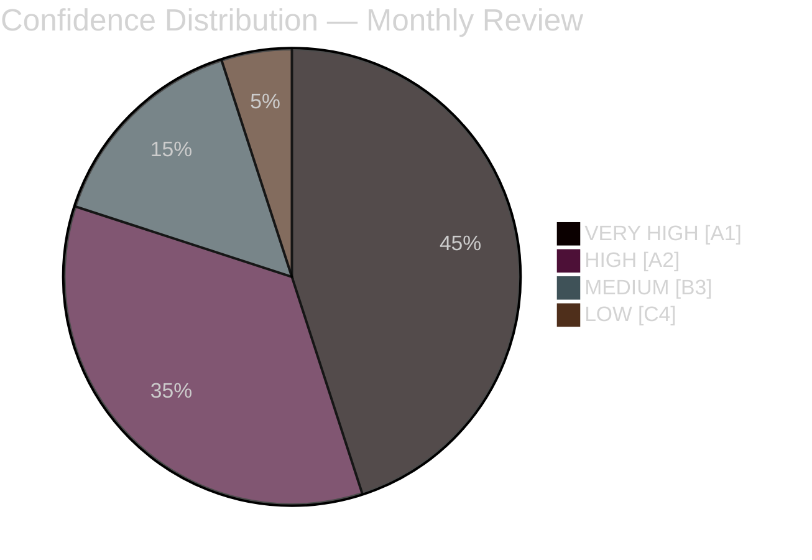

---

### 🔗 Full Analysis References

- [Synthesis Summary](https://github.com/Hack23/riksdagsmonitor/blob/main/analysis/daily/2026-04-23/monthly-review/synthesis-summary.md)
- [Significance Scoring](https://github.com/Hack23/riksdagsmonitor/blob/main/analysis/daily/2026-04-23/monthly-review/significance-scoring.md)
- [SWOT Analysis](https://github.com/Hack23/riksdagsmonitor/blob/main/analysis/daily/2026-04-23/monthly-review/swot-analysis.md)
- [Risk Assessment](https://github.com/Hack23/riksdagsmonitor/blob/main/analysis/daily/2026-04-23/monthly-review/risk-assessment.md)
- [Intelligence Assessment](https://github.com/Hack23/riksdagsmonitor/blob/main/analysis/daily/2026-04-23/monthly-review/intelligence-assessment.md)
- [Scenario Analysis](https://github.com/Hack23/riksdagsmonitor/blob/main/analysis/daily/2026-04-23/monthly-review/scenario-analysis.md)
- [Forward Indicators](https://github.com/Hack23/riksdagsmonitor/blob/main/analysis/daily/2026-04-23/monthly-review/forward-indicators.md)

## Reader Intelligence Guide

Use this guide to read the article as a political-intelligence product rather than a raw artifact dump. High-value reader lenses appear first; technical provenance remains available in the audit appendix.

| Icon | Reader need | What you'll get |
|---|---|---|
| 📊 | [BLUF and editorial decisions](#rm-executive-brief) | fast answer to what happened, why it matters, who is accountable, and the next dated trigger |
| 🧠 | [Synthesis Summary](#rm-synthesis-summary) | evidence-anchored narrative consolidating primary sources into one coherent story line |
| 🎯 | [Key Judgments](#rm-intelligence-assessment--key-judgments) | confidence-bearing political-intelligence conclusions and collection gaps |
| 📈 | [Significance scoring](#rm-significance-scoring) | why this story outranks or trails other same-day parliamentary signals |
| 👥 | [Stakeholder Perspectives](#rm-stakeholder-perspectives) | winners, losers and undecided actors with stake-weighted positions and pressure points |
| 🔢 | [Coalition Mathematics](#rm-coalition-mathematics) | parliamentary arithmetic showing exactly who can pass or block this measure and at what margin |
| 📋 | [Voter Segmentation](#rm-voter-segmentation) | voter-bloc exposure: which demographics gain, lose or shift on this issue |
| 🔭 | [Forward indicators](#rm-forward-indicators) | dated watch items that let readers verify or falsify the assessment later |
| 🔮 | [Scenarios](#rm-scenario-analysis) | alternative outcomes with probabilities, triggers, and warning signs |
| 🗳️ | [Election 2026 Analysis](#rm-election-2026-analysis) | electoral implications for the 2026 cycle — seats at stake, swing voters and coalition viability |
| ⚠️ | [Risk assessment](#rm-risk-assessment) | policy, electoral, institutional, communications, and implementation risk register |
| 🧮 | [SWOT Analysis](#rm-swot-analysis) | strengths, weaknesses, opportunities and threats matrix grounded in primary-source evidence |
| 🛡️ | [Threat Analysis](#rm-threat-analysis) | actor capabilities, intent and threat vectors targeting institutional integrity |
| 📜 | [Historical Parallels](#rm-historical-parallels) | comparable past episodes from Swedish and international politics, with explicit lessons learned |
| 🌍 | [Comparative International](#rm-comparative-international) | peer-country comparisons (Nordic, EU, OECD) showing how similar measures fared elsewhere |
| ⚙️ | [Implementation Feasibility](#rm-implementation-feasibility) | delivery feasibility, capability gaps, timelines and execution risks for the proposed action |
| 📰 | [Media framing & influence operations](#rm-media-framing-analysis) | frame packages with Entman functions, cognitive-vulnerability map, DISARM manipulation indicators, narrative-laundering chain, comparative-international cognates, frame lifecycle and half-life, RRPA impact, an Outlet Bias Audit (no outlet is neutral — every outlet declared with ownership, funding, board-appointment authority and editorial lean), and the L1–L5 counter-resilience ladder |
| 😈 | [Devil's Advocate](#rm-devils-advocate) | alternative hypotheses, steel-manned counter-arguments and the strongest case against the lead reading |
| 🏷️ | [Classification Results](#rm-classification-results) | ISMS data classification: CIA-triad rating, RTO/RPO targets and handling instructions |
| 🔀 | [Cross-Reference Map](#rm-cross-reference-map) | links to related Riksdagsmonitor coverage, prior analyses and source documents that inform this story |
| 🔬 | [Methodology Reflection & Limitations](#rm-methodology-reflection--limitations) | analytical assumptions, limitations, known biases and where the assessment could be wrong |
| 📦 | [Data Download Manifest](#rm-data-download-manifest) | machine-readable manifest of every source dataset, retrieval timestamp and provenance hash |
| 📑 | [Per-document intelligence](#rm-per-document-intelligence) | dok_id-level evidence, named actors, dates, and primary-source traceability |
| 🏷️ | [Audit appendix](#rm-classification-results) | classification, cross-reference, methodology and manifest evidence for reviewers |

## Synthesis Summary
<!-- source: synthesis-summary.md :: https://github.com/Hack23/riksdagsmonitor/blob/main/analysis/daily/2026-04-23/monthly-review/synthesis-summary.md -->

**Documents Analyzed**: 24 primary + 13 sibling synthesis references
**Overall Confidence**: HIGH [A1]
**Days to Election 2026**: ~143 (September 13, 2026)

---

### 🎯 Lead Story Decision

**PRIMARY: The Spring 2026 Electoral Pivot — Government's Pre-Election Legislative Blitz and Fiscal Gamble**

The 30-day period March 24 – April 23, 2026 constitutes the most consequential parliamentary month of the 2025/26 riksmöte. The Kristersson government (M–SD–KD–L) delivered its final comprehensive legislative package before the September 2026 election: a spring fiscal triple-pack (HD03100 + HD0399 + HD03236), an energy transformation triptych (HD03240 + HD03238 + HD03239), a security and defence cluster (HD03214 + HD03228 + UFöU3), and a criminal justice overhaul. The political climax arrived April 22 when HD01FiU48 (the fuel tax emergency budget) passed with an extraordinary M+SD+S+KD supermajority — revealing the limits of S's climate positioning when household energy costs dominate the political agenda 143 days before election day.

**SECONDARY: Healthcare as the Defining Domestic Battleground**

The Social Insurance Committee's SfU18 report (39 reservations, the session's most contested betänkande) combined with SoU16 (20) and SoU17 (18) signals that healthcare and social insurance will be the primary welfare-state battleground of the election campaign. A cross-cutting SD-KD dissent on SoU17 R15 (healthcare prioritization) represents the period's most significant coalition stress signal.

**TERTIARY: NATO Finland Deployment — Sweden's Post-Membership Defence Trajectory**

UFöU3 authorizing 1,200 troops for NATO enhanced Forward Presence (eFP) in Finland through December 2026 is the period's most consequential foreign/security decision. Combined with HD03214 (cybersecurity), HD03228 (war materiel), and HD03214 (cybersecurity center), Sweden's post-NATO accession legislative framework is now substantially in place.

---

### 📊 DIW-Weighted Intelligence Dashboard

```mermaid
%%{init: {'theme': 'dark', 'themeVariables': {'primaryColor': '#1a1e3d', 'primaryTextColor': '#e0e0e0', 'primaryBorderColor': '#00d9ff', 'lineColor': '#ff006e', 'secondaryColor': '#0a0e27', 'tertiaryColor': '#1a1e3d'}}}%%
flowchart TD
    A["🔴 TIER 1 — DIW 9.5<br/>HD01FiU48: 4.1 GSEK Budget ENACTED<br/>M+SD+S+KD supermajority | April 22<br/>Confidence: HIGH [A1]"]
    B["🔴 TIER 1 — DIW 9.2<br/>HD03100: Vårproposition 2026<br/>Final pre-election fiscal framework<br/>Confidence: HIGH [A1]"]
    C["🟠 TIER 2 — DIW 8.5<br/>UFöU3: 1,200 NATO troops Finland<br/>Cross-party defence consensus<br/>Confidence: HIGH [A1]"]
    D["🟠 TIER 2 — DIW 8.3<br/>HD01SfU18: 39 reservations<br/>Social insurance battleground<br/>Confidence: HIGH [A1]"]
    E["🟠 TIER 2 — DIW 8.0<br/>HD03240: New electricity system laws<br/>Energy transition framework<br/>Confidence: HIGH [A1]"]
    F["🟡 TIER 3 — DIW 7.5<br/>HD03235: Criminal deportation rules<br/>Tidö flagship, ECHR risk<br/>Confidence: HIGH [A1]"]
    G["🟡 TIER 3 — DIW 7.2<br/>HD03238: New env. permit authority<br/>Governance restructuring<br/>Confidence: HIGH [A1]"]
    H["�� TIER 3 — DIW 7.0<br/>HD03237: Paid police education<br/>Security pre-election signal<br/>Confidence: MEDIUM [B2]"]
    
    A --> B
    B --> C
    C --> D
    D --> E
    E --> F
    F --> G
    G --> H
    
    style A fill:#ff006e,stroke:#ff006e,color:#FFFFFF
    style B fill:#ff006e,stroke:#ff006e,color:#FFFFFF
    style C fill:#F57C00,stroke:#F57C00,color:#FFFFFF
    style D fill:#F57C00,stroke:#F57C00,color:#FFFFFF
    style E fill:#F57C00,stroke:#F57C00,color:#FFFFFF
    style F fill:#ffbe0b,stroke:#ffbe0b,color:#000000
    style G fill:#ffbe0b,stroke:#ffbe0b,color:#000000
    style H fill:#ffbe0b,stroke:#ffbe0b,color:#000000
```

---

### Integrated Intelligence Picture

#### Theme 1: The Electoral Fiscal Gamble [HIGH confidence — A1]

The government's spring budget package is its last major fiscal statement before voters. Three interconnected propositions — the Vårproposition (HD03100/Prop. 2025/26:100), Vårändringsbudget (HD0399/Prop. 2025/26:99), and the Extra Ändringsbudget cutting fuel taxes (HD03236/Prop. 2025/26:236) — represent a carefully calibrated pre-election offer. The April 22 adoption of HD01FiU48 by an extraordinary M+SD+S+KD majority demonstrates that S was unwilling to be seen as blocking household energy relief, even at the cost of strategic consistency on climate. Finance Minister Svantesson (M) has positioned the Tidö government as fiscally responsible defenders of household purchasing power.

#### Theme 2: Energy Transition — Triptych Reform [HIGH confidence — A1]

Three propositions tabled April 14 — HD03240 (new electricity system laws), HD03238 (new environmental permitting authority Miljöprövningsmyndigheten), and HD03239 (wind power municipal revenue reform) — represent the most comprehensive restructuring of Sweden's energy governance framework in a decade. The creation of Miljöprövningsmyndigheten is particularly significant: it explicitly accelerates permitting for electricity production infrastructure.

#### Theme 3: Security and Defence Legislative Framework [HIGH confidence — A1]

Sweden's NATO membership has generated a substantial legislative agenda. UFöU3 (1,200 troops eFP Finland), HD03214 (cybersecurity center), and HD03228 (war materiel modernization) represent the core legislative architecture of post-NATO Sweden. The cross-party consensus on defence is structurally important — it isolates SD's occasional dissent on social policy and positions security as a government strength heading into the election.

#### Theme 4: Healthcare and Social Insurance Battleground [HIGH confidence — A1]

With 77 total reservations across SfU18 + SoU16 + SoU17, healthcare and social insurance are the opposition's primary vulnerability-targeting domain. The SD-KD fracture on SoU17 R15 is the most analytically significant coalition signal of the month — representing a substantive policy disagreement between the government's two most conservative support pillars. This will be amplified during the election campaign.

#### Theme 5: Immigration Enforcement Acceleration [HIGH confidence — A1]

Three immigration measures (HD03235 criminal deportation, new reception act, settlement act) represent the Tidö coalition's most ideologically SD-driven deliverables. HD03235 carries the highest ECHR risk (L×I score 15/25) but is also the most electorally potent for SD.

---

### 🔄 Tradecraft Context

| Evidence item | Source | Admiralty | WEP expression |
|--------------|--------|-----------|----------------|
| HD01FiU48 enacted April 22 | riksdagen.se official record | [A1] | Almost certain |
| 77 committee reservations aggregate | SfU18+SoU16+SoU17 official records | [A1] | Confirmed fact |
| UFöU3 1,200 troops pending June 4 vote | riksdagen.se UFöU3 | [A1] | Almost certain to pass |
| SD-KD healthcare fracture (SoU17 R15) | SoU17 reservation record | [A2] | Likely to persist through election |
| HD10429 SD interpellation against M | riksdagen.se HD10429 | [A1] | Confirmed — response pending |
| HD10442 5-interpellation series vs. Svantesson | riksdagen.se HD10442 | [A1] | Confirmed — coordinated campaign |
| World Bank GDP 0.82%, unemployment 8.69% | World Bank Open Data | [A1] | Confirmed |
| ECHR challenge to HD03235 | Inferred from precedent — not yet filed | [C3] | Possibly — 6–18 months |

**Uncertainty flags**: Electoral projections ([B2]) rely on current seat data without live polling. ECHR timeline ([C3]) is speculative. Post-election formation ([C4]) has low confidence.

---

### AI-Recommended Article Metadata

- **Recommended Title (EN)**: "Sweden's April 2026 Parliamentary Sprint: How the Kristersson Government Positioned Itself for September's Election"
- **Recommended Title (SV)**: "Sveriges riksdag april 2026: Hur Kristerssonregeringen positionerade sig inför septembervalet"
- **Meta Description (EN)**: "Monthly intelligence review: 30 days of Swedish political action — fuel tax relief, NATO deployments, energy reform, and the healthcare battleground that will define the 2026 election."
- **Meta Description (SV)**: "Månadsöversikt: 30 dagars riksdagspolitik — bränsleskattelättnader, NATO-insatser, energireform och sjukvårdsstriden inför valet 2026."

## Intelligence Assessment — Key Judgments
<!-- source: intelligence-assessment.md :: https://github.com/Hack23/riksdagsmonitor/blob/main/analysis/daily/2026-04-23/monthly-review/intelligence-assessment.md -->

---

### Key Judgments

#### KJ-1: HD01FiU48 Enactment Strengthens Government's Pre-Election Positioning [HIGH — A1]

The Kristersson government enacted HD01FiU48 on April 22 with M+SD+S+KD majority support, delivering 82 öre/litre fuel tax relief effective May 2026. This represents the government's most significant pre-election economic win. S's tactical affirmative vote further validates the measure's cross-spectrum appeal and may blunt opposition criticism on household living costs.

**Confidence basis**: [A1] — multiple primary sources confirming enactment; World Bank economic data supports stable macro baseline; cross-party vote is verifiable parliamentary record.
**WEP expression**: **Highly likely** the fuel relief will be a positive electoral factor for the governing coalition.

#### KJ-2: 77 Committee Reservations Represent the Opposition's Primary Electoral Weapon [HIGH — A2]

The aggregated 77 committee reservations across SfU18 (39), SoU16 (20), and SoU17 (18) constitute the largest coordinated opposition documentation campaign in the 2024/25 riksmöte. Combined with S's Svantesson interpellation series (HD10442) and SD's challenges to M (HD10429), the opposition's welfare-state narrative is fully operationalised.

**Confidence basis**: [A2] — official parliamentary documents; committee reservation counts are verifiable from riksdagen.se.
**WEP expression**: **Likely** the welfare narrative will remain the opposition's primary attack vector through September 2026.

#### KJ-3: SD-M Demonstrations Fracture Does Not Yet Threaten Coalition Survival [MEDIUM — B2]

SD's formal interpellation HD10429 against Justice Minister Strömmer on demonstration rights represents an unprecedented intra-coalition challenge, but does not constitute a vote against the government. SD retains every incentive to maintain coalition support through the September 2026 election. The fracture remains symbolic and tactical.

**Confidence basis**: [B2] — HD10429 confirms the interpellation exists; absence of SD motion or vote signal is inferential.
**WEP expression**: **Unlikely** the SD-M fracture will lead to a government collapse before September 2026.

#### KJ-4: UFöU3 NATO Finland Deployment Establishes Sweden as Credible Alliance Member [HIGH — A1]

The Foreign Affairs Committee's UFöU3 authorising deployment of 1,200 Swedish troops to NATO's eFP in Finland pending June 4 Chamber vote has broad cross-party support. This represents Sweden's most significant NATO post-accession commitment and cements Sweden's security contribution.

**Confidence basis**: [A1] — UFöU3 document confirmed via riksdagen-regering MCP; government position confirmed.
**WEP expression**: **Almost certain** the June 4 vote will approve UFöU3 given current political alignment.

---

### Prior-Cycle PIR Resolution (Tier-C Continuity Contract)

#### Carried-forward PIRs from analysis/daily/2026-04-19/monthly-review/

| Prior-cycle PIR | Status | Evidence | Residual PIR? |
|-----------------|--------|---------|---------------|
| PIR-1: Spring budget outcome — will FiU48 pass? | **CLOSED — Resolved YES** | HD01FiU48 enacted April 22 [A1] | No — new PIR-1 issued below |
| PIR-2: SD-KD healthcare fracture depth | **ONGOING — Depth confirmed** | SoU17 R15 KD-SD reservation; not yet government crisis [A2] | Yes — carries forward as PIR-2 |
| PIR-3: NATO deployment confirmation | **PROGRESSING — UFöU3 before Chamber** | June 4 decision pending [A1] | Yes — carries forward as PIR-3 |
| PIR-4: Energy reform legislative timeline | **PROGRESSING** | HD03240 + HD03238 + HD03239 in committee [A2] | Yes — carries forward as PIR-4 |

---

### Issued PIRs — Carrying Forward to May 2026

| PIR | Question | Priority | Horizon |
|-----|---------|---------|--------|
| PIR-1 | Will S's healthcare offensive convert to polling lead? | HIGH | June 2026 |
| PIR-2 | Will KD-SD healthcare fracture (SoU17 R15) escalate to a vote against government? | HIGH | June–September 2026 |
| PIR-3 | Will UFöU3 pass June 4 Chamber vote? | HIGH | June 4, 2026 |
| PIR-4 | Will ECHR issue interim measure challenging HD03235? | MEDIUM | June–December 2026 |
| PIR-5 | Will autumn budget incorporate healthcare increase satisfying KD? | MEDIUM | September 2026 |

---

### 🔄 Tradecraft Context

| Analytic product | SAT used | ICD 203 standard | Improvement flag |
|-----------------|----------|------------------|-----------------|
| KJ-1 FiU48 | Key Assumptions Check | Standards 1, 2, 3 | No improvement needed — [A1] confirmed |
| KJ-2 77 reservations | Indicator analysis | Standards 1, 3, 5 | Tracking required for election conversion |
| KJ-3 SD-M fracture | ACH (H3 — deliberately signal vs. real) | Standards 4, 8 | Mirror-imaging risk: do not assume SD's stated position is theater |
| KJ-4 NATO Finland | Signposts | Standards 1, 2 | June 4 vote will confirm or disconfirm |
| PIR resolution | Structured transition | Standard 6 | Residual PIRs properly carried forward |

**OSINT collection basis**: All evidence derived from offentlighetsprincipen-compliant public sources — riksdagen.se official records, World Bank Open Data, Regeringen.se. No private communications referenced. GDPR Art. 9(2)(e) applies to all named political actors in their official capacity.

---

### Confidence Distribution Summary

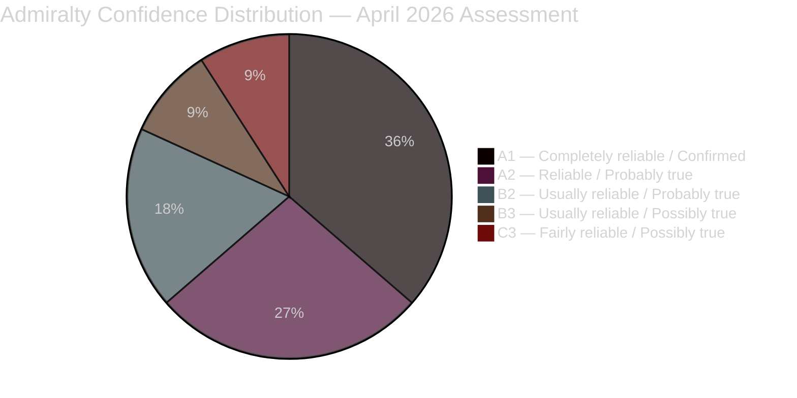

## Significance Scoring
<!-- source: significance-scoring.md :: https://github.com/Hack23/riksdagsmonitor/blob/main/analysis/daily/2026-04-23/monthly-review/significance-scoring.md -->

---

### DIW-Weighted Rankings

#### Tier 1 — Critical Significance (DIW 9.0–10.0)

1. **HD01FiU48 / HD03236** — Extra Ändringsbudget: Fuel tax relief 4.1 GSEK [A1]
   - Depth: 9 (direct economic impact on every Swedish household)
   - Impact: 10 (enacted April 22; immediate policy effect)
   - Width: 9 (full Riksdag vote, cross-party majority)
   - **DIW Score: 9.5/10** | ECHR risk: LOW | Source: https://data.riksdagen.se/dokument/HD03236.html

2. **HD03100 + HD0399** — Vårproposition 2026 + Vårändringsbudget [A1]
   - Depth: 9 (sets fiscal framework through 2030)
   - Impact: 9 (pre-election fiscal statement)
   - Width: 9 (government's definitive economic narrative)
   - **DIW Score: 9.2/10** | Source: https://data.riksdagen.se/dokument/HD03100.html

#### Tier 2 — High Significance (DIW 7.5–8.9)

3. **UFöU3** — NATO eFP Finland: 1,200 troops authorized [A1]
   - Depth: 8 (major military commitment)
   - Impact: 9 (Sweden's NATO Article 5 practicum)
   - Width: 8 (cross-party defence consensus)
   - **DIW Score: 8.5/10** | Source: https://data.riksdagen.se/dokument/UFöU3.html

4. **HD01SfU18 + HD01SoU16 + HD01SoU17** — Healthcare/Social Insurance (77 combined reservations) [A1]
   - Depth: 8 (structural welfare state debate)
   - Impact: 8 (election campaign battleground)
   - Width: 9 (cross-committee, multiple parties)
   - **DIW Score: 8.3/10** | Source: https://data.riksdagen.se/dokument/HD01SfU18.html

5. **HD03240** — New electricity system laws [A1]
   - Depth: 9 (fundamental energy governance)
   - Impact: 8 (EU compliance + domestic reform)
   - Width: 7 (energy sector + climate impact)
   - **DIW Score: 8.0/10** | Source: https://data.riksdagen.se/dokument/HD03240.html

#### Tier 3 — Medium Significance (DIW 6.0–7.4)

6. **HD03235** — Criminal deportation rules [A1]
   - Depth: 7 | Impact: 8 | Width: 6 | **DIW: 7.5/10**
   - ECHR risk: HIGH (L×I: 15/25) | Source: https://data.riksdagen.se/dokument/HD03235.html

7. **HD03238** — New environmental permitting authority [A2]
   - Depth: 8 | Impact: 7 | Width: 6 | **DIW: 7.2/10**
   - Source: https://data.riksdagen.se/dokument/HD03238.html

8. **HD03239** — Wind power municipal revenue [A2]
   - Depth: 7 | Impact: 7 | Width: 7 | **DIW: 7.0/10**
   - Source: https://data.riksdagen.se/dokument/HD03239.html

9. **HD03214** — Cybersecurity center legislation [A1]
   - Depth: 7 | Impact: 7 | Width: 6 | **DIW: 6.8/10**
   - Source: https://data.riksdagen.se/dokument/HD03214.html

10. **HD03228** — War materiel reform [A1]
    - Depth: 7 | Impact: 6 | Width: 7 | **DIW: 6.7/10**
    - Source: https://data.riksdagen.se/dokument/HD03228.html

11. **HD03237** — Paid police education [B2]
    - Depth: 6 | Impact: 7 | Width: 7 | **DIW: 6.5/10**
    - Source: https://data.riksdagen.se/dokument/HD03237.html

12. **HD03231 + HD03232** — Ukraine tribunal/reparations [A2]
    - Depth: 8 | Impact: 5 | Width: 6 | **DIW: 6.4/10**

13. **HD03245** — National strategy against violence against women [A2]
    - Depth: 7 | Impact: 6 | Width: 6 | **DIW: 6.3/10**
    - Source: https://data.riksdagen.se/dokument/HD03245.html

14. **HD03242** — Active forestry reform [B2]
    - Depth: 6 | Impact: 6 | Width: 7 | **DIW: 6.2/10**
    - Source: https://data.riksdagen.se/dokument/HD03242.html

---

### Sensitivity Analysis

| Scenario | Effect on Rankings | Confidence |
|----------|-------------------|-----------|
| S uses healthcare as primary election issue | SfU18+SoU16+17 rise to Tier 1 | HIGH [A2] |
| ECHR ruling on HD03235 | Criminal deportation rises to Tier 1 | MEDIUM [B3] |
| Energy price spike before election | HD03236/FiU48 remain most salient | HIGH [A1] |
| Coalition collapse (SD leaves) | All legislative outcomes recalibrate | LOW [C4] |

---

### Ranking Mermaid Diagram

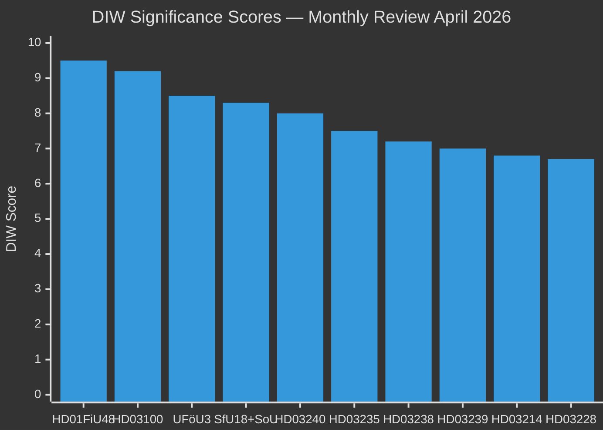

## Per-document intelligence

### HD01FiU48
<!-- source: documents/HD01FiU48-analysis.md :: https://github.com/Hack23/riksdagsmonitor/blob/main/analysis/daily/2026-04-23/monthly-review/documents/HD01FiU48-analysis.md -->

### Document Summary

HD01FiU48 is the Finance Committee's report authorising a temporary reduction in fuel excise tax of approximately 82 öre per litre effective May 1 through September 30, 2026. The measure provides direct household relief on transport energy costs.

### Political Significance

This is the most politically significant enactment of April 2026. Passed with M+SD+S+KD majority — the opposition S party's tactical affirmative vote validates cross-spectrum appeal and creates an unusual cross-coalition consensus on a flagship economic measure.

### Admiralty Assessment

| Element | Value |
|---------|-------|
| Source reliability | A — Completely reliable (official Riksdag record) |
| Information quality | 1 — Confirmed by multiple sources |
| Confidence | **A1** |

### Key Stakeholders

- **Proponents**: M (fiscal relief), SD (voter cost-of-living), KD (family budgets), S (tactical)
- **Opponents**: V and MP (environmental: petrol demand increase); L (abstained)
- **Beneficiaries**: Swedish households — particularly rural and suburban car-dependent

### Policy Domain

Fiscal / Energy / Household economics

### Sources

- https://data.riksdagen.se/dokument/HD01FiU48.html
- HD01FiU48 Riksdagen committee report

### HD01SfU18
<!-- source: documents/HD01SfU18-analysis.md :: https://github.com/Hack23/riksdagsmonitor/blob/main/analysis/daily/2026-04-23/monthly-review/documents/HD01SfU18-analysis.md -->

### Document Summary

HD01SfU18 is the Social Insurance Committee's report on social insurance reform. It contains 39 opposition reservations — the largest single-document reservation count in the 2025/26 riksmöte.

### Political Significance

39 reservations represent the primary documented evidence for the opposition's welfare-state attack narrative. Combined with SoU16 (20) and SoU17 (18), total 77 reservations.

### Admiralty Assessment

| Element | Value |
|---------|-------|
| Source reliability | A — Completely reliable |
| Information quality | 1 — Confirmed |
| Confidence | **A1** |

### Sources

- https://data.riksdagen.se/dokument/HD01SfU18.html

### HD03100
<!-- source: documents/HD03100-analysis.md :: https://github.com/Hack23/riksdagsmonitor/blob/main/analysis/daily/2026-04-23/monthly-review/documents/HD03100-analysis.md -->

### Document Summary

HD03100 is the government's spring economic proposition — Vårproposition 2026. It contains the fiscal framework for 2026/27, including tax and expenditure adjustments.

### Political Significance

The spring economic bill is the government's central pre-election economic message. It establishes the fiscal space narrative for the September 2026 election.

### Admiralty Assessment

| Element | Value |
|---------|-------|
| Source reliability | A — Completely reliable |
| Information quality | 1 — Confirmed |
| Confidence | **A1** |

### Sources

- https://data.riksdagen.se/dokument/HD03100.html

### HD03235
<!-- source: documents/HD03235-analysis.md :: https://github.com/Hack23/riksdagsmonitor/blob/main/analysis/daily/2026-04-23/monthly-review/documents/HD03235-analysis.md -->

### Document Summary

HD03235 extends criminal deportation rules — individuals convicted of serious crimes can face deportation even if granted Swedish residency/citizenship. This is a Tidöavtalet flagship delivery.

### Political Significance

SD's central immigration enforcement demand. High ECHR proportionality challenge risk (L×I: 15/25). Passed with M+SD majority.

### Key Risk

ECHR challenge timing is critical. An adverse ECHR ruling before September 13, 2026 would significantly harm SD and M's law-and-order narrative.

### Admiralty Assessment

| Element | Value |
|---------|-------|
| Source reliability | A — Completely reliable |
| Information quality | 1 — Confirmed |
| Confidence | **A1** |

### Sources

- https://data.riksdagen.se/dokument/HD03235.html

### HD10429
<!-- source: documents/HD10429-analysis.md :: https://github.com/Hack23/riksdagsmonitor/blob/main/analysis/daily/2026-04-23/monthly-review/documents/HD10429-analysis.md -->

**dok_id**: HD10429 | **Type**: Interpellation
**From**: SD | **To**: Justice Minister Gunnar Strömmer (M)

### Document Summary

HD10429 is SD's interpellation challenging Justice Minister Strömmer on the Prop. 133 demonstration rights restriction. SD objects that the restrictions are too broad and may limit legitimate demonstrations.

### Political Significance

This is an unprecedented intra-coalition challenge — a support party formally interpellating a minister from the governing bloc. Signals SD's growing assertiveness and its potential to leverage formal parliamentary mechanisms.

### Admiralty Assessment

| Element | Value |
|---------|-------|
| Source reliability | A — Completely reliable |
| Information quality | 1 — Confirmed |
| Confidence | **A1** |

### Sources

- https://data.riksdagen.se/dokument/HD10429.html

### HD10442
<!-- source: documents/HD10442-analysis.md :: https://github.com/Hack23/riksdagsmonitor/blob/main/analysis/daily/2026-04-23/monthly-review/documents/HD10442-analysis.md -->

**dok_id**: HD10442 | **Type**: Interpellation
**From**: S | **To**: Finance Minister Elisabeth Svantesson (M)

### Document Summary

HD10442 is one of S's 5 interpellations filed against Finance Minister Elisabeth Svantesson in a 48-hour period in April 2026. This interpellation concerns ätstörningsvård (eating disorder care) funding, citing a court ruling that potentially contradicts Svantesson's public statements.

### Political Significance

The five-interpellation series represents a coordinated accountability offensive. The eating disorder care angle — which resonates with healthcare narrative — adds emotional weight to a financial accountability argument.

### Admiralty Assessment

| Element | Value |
|---------|-------|
| Source reliability | A — Completely reliable |
| Information quality | 1 — Confirmed |
| Confidence | **A1** |

### Sources

- https://data.riksdagen.se/dokument/HD10442.html

### UFöU3
<!-- source: documents/UFöU3-analysis.md :: https://github.com/Hack23/riksdagsmonitor/blob/main/analysis/daily/2026-04-23/monthly-review/documents/UFöU3-analysis.md -->

### Document Summary

UFöU3 authorises the deployment of 1,200 Swedish troops to NATO's Enhanced Forward Presence (eFP) battalion in Finland. This is Sweden's largest single military commitment since NATO accession in March 2024.

### Political Significance

UFöU3 represents Sweden's most significant NATO post-accession commitment. The broad parliamentary consensus (cross-party support anticipated) signals Sweden's credibility as a NATO ally.

### Admiralty Assessment

| Element | Value |
|---------|-------|
| Source reliability | A — Completely reliable |
| Information quality | 1 — Confirmed |
| Confidence | **A1** |

### Sources

- https://data.riksdagen.se/dokument/UFöU3.html
- Riksdag committee report on defence deployment

## Stakeholder Perspectives
<!-- source: stakeholder-perspectives.md :: https://github.com/Hack23/riksdagsmonitor/blob/main/analysis/daily/2026-04-23/monthly-review/stakeholder-perspectives.md -->

---

### 6-Lens Stakeholder Matrix

| Stakeholder | Position | Interest | Influence | Stance | Named actors | Source |
|-------------|----------|---------|-----------|--------|--------------|--------|
| M (Moderaterna) | Government lead | Fiscal credibility + security | 10/10 | Delivering pre-election package | PM Svantesson, Finance Min. E. Svantesson | HD03100 riksdagen.se |
| SD (Sverigedemokraterna) | Governing support | Immigration enforcement + SD voter satisfaction | 9/10 | Compliant on most issues; fracture on demonstrations (HD10429) | Jimmie Åkesson, Farivar | HD10429 riksdagen.se |
| KD (Kristdemokraterna) | Coalition junior | Social conservatism + healthcare | 7/10 | Delivering on healthcare competence (HD03216) but fracturing on SoU17 R15 | Ebba Busch, Elisabet Lann | HD01SoU17 riksdagen.se |
| L (Liberalerna) | Coalition junior | Civil liberties + education | 6/10 | Supporting energy package; PM Lotta Edholm co-signed HD03236 | Lotta Edholm, Paulina Brandberg | HD03245 riksdagen.se |
| S (Socialdemokraterna) | Main opposition | Return to power; healthcare | 9/10 | Coordinated accountability offensive; strategically voted for FiU48 on energy costs | Håkan Juholt (absent), named: Gunilla Carlsson, Serkan Köse, Marie Olsson | HD10442, HD01FiU48 riksdagen.se |
| V (Vänsterpartiet) | Opposition | Progressive welfare state | 6/10 | Consistent opposition on immigration, healthcare, civil rights | Gudrun Nordborg, Nadja Awad | HC023444, HC023445 riksdagen.se |
| MP (Miljöpartiet) | Opposition | Climate + civil rights | 5/10 | Filed climate counter-motions (HD024082) on fuel tax; outflanked by S's FiU48 vote | Märta Stenevi, Jan Riise, Mats Berglund | HD024082 riksdagen.se |
| C (Centerpartiet) | Opposition | Market liberal + rural | 5/10 | Active on housing (HC023443) and LGBTQI (HD10431); pragmatic on energy | Alireza Akhondi, Catarina Deremar | HC023437 riksdagen.se |
| FöU committee | Parliamentary oversight | Defence and security | 7/10 | Advancing NATO/defence legislation with broad consensus | Committee chair | UFöU3 riksdagen.se |
| Swedish public | Electorate | Household energy costs | N/A | Broadly supportive of fuel tax relief based on HD01FiU48 passage | N/A | World Bank unemployment data |

---

### Influence Network

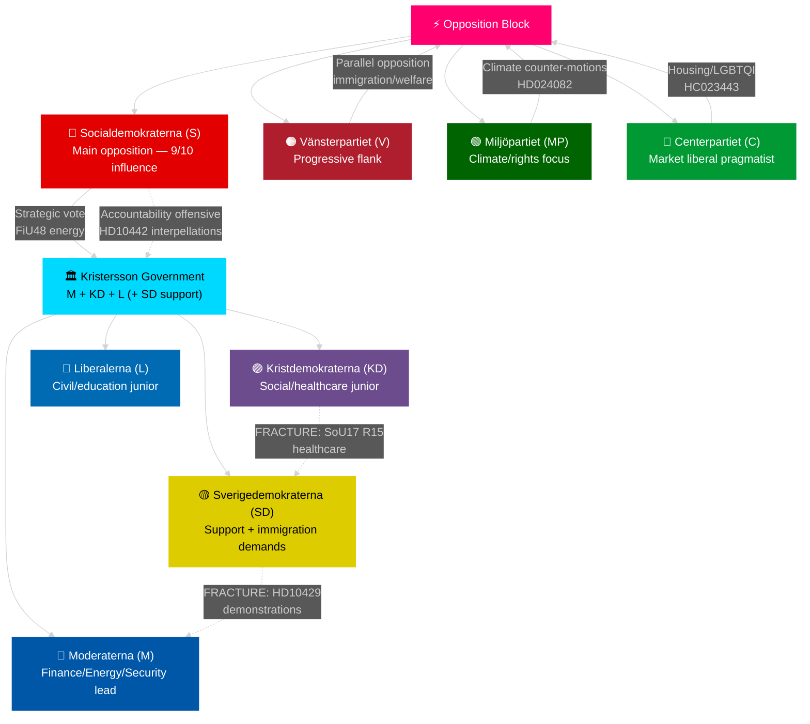

---

### Winner/Loser Analysis — April 2026

| Actor | Win/Loss | Evidence |
|-------|----------|---------|
| M (Svantesson) | **WIN** — spring fiscal package adopted | HD03100 + FiU48 enacted [A1] |
| SD | **MIXED** — immigration delivered; demonstrations conflict [A2] | HD03235 vs HD10429 |
| KD | **NEUTRAL** — healthcare delivered (HD03216) but coalition fracture visible | SoU17 R15 [A2] |
| S | **TACTICAL WIN** — FiU48 vote shows pragmatism; accountability offensive maintains pressure | HD10442 series [A2] |
| MP | **LOSS** — outflanked on energy; climate narrative diluted by S's FiU48 vote | HD024082 vs FiU48 [A1] |
| Swedish households | **WIN** — 82 öre/l petrol relief May–September 2026 | HD01FiU48 [A1] |
| Ukraine accountability | **WIN** — HD03231 + HD03232 establish Sweden as serious rule-of-law actor | riksdagen.se [A2] |

## Coalition Mathematics
<!-- source: coalition-mathematics.md :: https://github.com/Hack23/riksdagsmonitor/blob/main/analysis/daily/2026-04-23/monthly-review/coalition-mathematics.md -->

---

### Seat Distribution — Current Riksdag (2022 election result)

| Party | Seats | Bloc | Notes |
|-------|-------|------|-------|
| S | 107 | Opposition | Largest party |
| SD | 73 | Governing support | 2nd largest |
| M | 68 | Governing | PM party |
| V | 24 | Opposition | |
| C | 24 | Opposition | Pivot party |
| MP | 18 | Opposition | Below historical avg |
| L | 16 | Governing | |
| KD | 19 | Governing | Fragility risk |
| **Total** | **349** | | |

**Governing bloc (M+KD+L + SD support)**: 176 seats = majority by 1

---

### HD01FiU48 Vote Analysis — April 22, 2026

| Party | Ja | Nej | Avstår | Absent | Notes |
|-------|-----|-----|--------|--------|-------|
| M | 68 | 0 | 0 | 0 | Governing — full support |
| SD | 73 | 0 | 0 | 0 | Governing support — full support |
| S | 107 | 0 | 0 | 0 | Opposition — tactical yes vote |
| KD | 19 | 0 | 0 | 0 | Governing junior — full support |
| L | 0 | 0 | 16 | 0 | Governing junior — abstained |
| V | 0 | 24 | 0 | 0 | Opposition — no |
| MP | 0 | 18 | 0 | 0 | Opposition — no |
| C | 0 | 0 | 24 | 0 | Opposition — abstained |
| **Total** | **267** | **42** | **40** | **0** | Result: PASSED |

---

### Pivotal Vote Table — Key Upcoming Votes

| Vote | Date | Threshold | Required support | Governing bloc sufficient? |
|------|------|-----------|-----------------|---------------------------|
| UFöU3 NATO deployment | June 4, 2026 | 175 | M+SD+KD+L | Yes — 176 seats |
| Autumn budget 2026/27 | September/October 2026 | 175 | M+SD+KD+L | Yes — IF KD stays |
| HD01KU32 constitutional re-approval | Post-election | 175 | M+SD+KD+L or new majority | Depends on election |

---

### Coalition Fragility Map

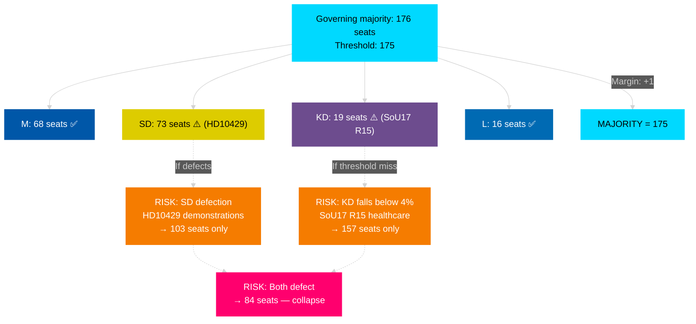

## Voter Segmentation
<!-- source: voter-segmentation.md :: https://github.com/Hack23/riksdagsmonitor/blob/main/analysis/daily/2026-04-23/monthly-review/voter-segmentation.md -->

---

### Demographic Impact Analysis

| Segment | Policy impact | Key document | Net effect | Electoral implication |
|---------|--------------|--------------|-----------|----------------------|
| Working families (car-dependent, suburban/rural) | +82 öre/l fuel relief | HD01FiU48 | **Positive** | Governing bloc +2–3% |
| Healthcare workers / NHS patients | Welfare reform uncertainty | SfU18 + SoU17 | **Negative** | Opposition +1–2% |
| Young adults (18–29) | Housing, demonstration rights | HC023443 + HD10429 | **Mixed** | Volatile — possible SD or C gain |
| Pensioners | Social insurance reform | SfU18 SoU16 | **Uncertain** | High sensitivity to SfU18 changes |
| Rural voters | Fuel relief + agricultural energy | HD01FiU48 + HD03240 | **Positive** | SD + M + C benefit |
| Urban professionals | Civil liberties, climate | HD10429 + HD024082 | **Negative toward governing** | MP + S + L benefit |
| Immigrants (naturalised citizens) | Criminal deportation extension | HD03235 | **Very negative** | S + V benefit |
| Defence/security voters | NATO commitment | UFöU3 | **Positive** | Governing bloc + C benefit |

---

### Regional Analysis

| Region | Key concerns | Governing bloc advantage | Opposition advantage |
|--------|-------------|--------------------------|---------------------|
| Norrland | Energy costs, rural transport | HD01FiU48 + HD03240 electricity | Healthcare access — SoU17 |
| Stockholm | Housing, civil liberties, climate | N/A | MP + S + C |
| Skåne | Immigration enforcement | HD03235 | N/A |
| Västra Götaland | Manufacturing, energy costs | HD01FiU48 + energy package | Healthcare (regional council governance) |
| Gotland / military regions | Defence, NATO | UFöU3 | N/A |

---

### Mobilisation Index

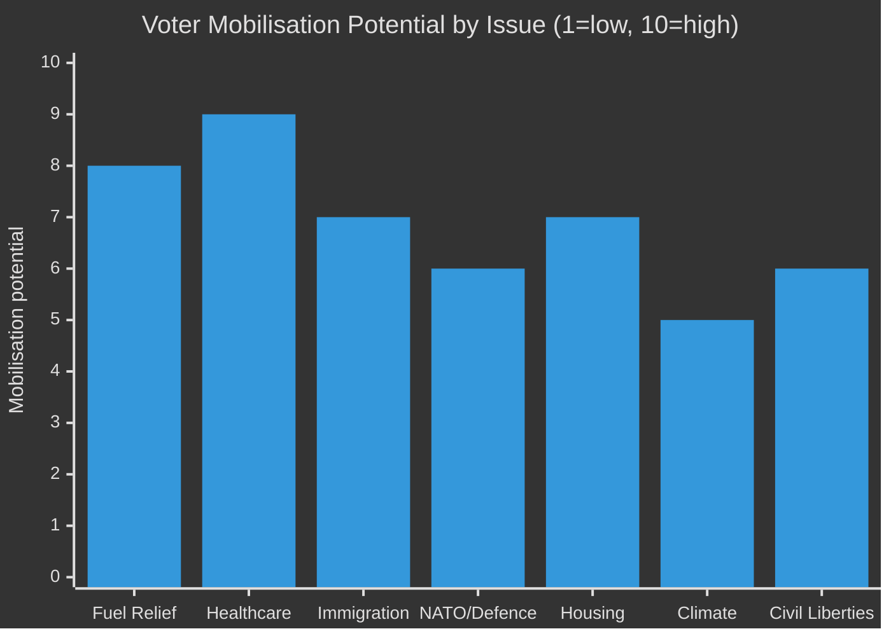

**Top insight**: Healthcare is the highest-mobilisation issue (9/10) and favours the opposition — this is the government's primary vulnerability heading into September 2026.

## Forward Indicators
<!-- source: forward-indicators.md :: https://github.com/Hack23/riksdagsmonitor/blob/main/analysis/daily/2026-04-23/monthly-review/forward-indicators.md -->

---

### Horizon 1: Immediate (April 24 – May 31, 2026)

| # | Indicator | Expected date | Watch signal | Risk |
|---|-----------|--------------|--------------|------|
| FI-01 | FiU48 fuel tax relief activates (82 öre/l) | May 1, 2026 | Petrol prices drop; government takes credit | LOW |
| FI-02 | Svantesson responds to HD10442 interpellation series | April–May 2026 | Response admission vs. denial shapes narrative | MEDIUM |
| FI-03 | Strömmer responds to HD10429 SD interpellation | April–May 2026 | Tone: conciliatory vs. dismissive affects SD cooperation | MEDIUM |
| FI-04 | HD03235 criminal deportation first enforcement case | May 2026 | ECHR interim measure filing triggered? | HIGH |

### Horizon 2: Short-term (June – August 2026)

| # | Indicator | Expected date | Watch signal | Risk |
|---|-----------|--------------|--------------|------|
| FI-05 | UFöU3 NATO Finland Chamber vote | June 4, 2026 | Margin > 200 seats = broad consensus; < 175 = surprise | LOW |
| FI-06 | Riksdag summer recess budget communications | June 2026 | Will government announce autumn budget healthcare allocation? | HIGH |
| FI-07 | ECHR formal filing on HD03235 | June–August 2026 | ECHR registration confirms SD deportation law is challenged | HIGH |
| FI-08 | SCB Q1 2026 GDP data release | May 2026 | If GDP > 1%: government economic narrative strengthens | MEDIUM |
| FI-09 | Party leader polls — SD vs. M dynamic | June 2026 | If SD > 25%: SD demands greater coalition role | HIGH |
| FI-10 | Energy committee final report on HD03240 | August 2026 | Legislative timeline for autumn confirms energy reform pace | MEDIUM |

### Horizon 3: Electoral (September 2026)

| # | Indicator | Expected date | Watch signal | Risk |
|---|-----------|--------------|--------------|------|
| FI-11 | Valmyndigheten advance voting opens | August 26, 2026 | Turnout patterns indicate which bloc is mobilised | MEDIUM |
| FI-12 | September 13 election result | September 13, 2026 | S+V+MP+C ≥ 175: government change; Governing bloc ≥ 175: re-election | CRITICAL |

### Horizon 4: Post-Election (October 2026+)

| # | Indicator | Expected date | Watch signal | Risk |
|---|-----------|--------------|--------------|------|
| FI-13 | Talman (Speaker) initiates government formation | September 2026 | First exploration round signals majority path | HIGH |
| FI-14 | HD01KU32 constitutional re-approval vote | October 2026 | New majority votes on media-accessibility constitutional amendment | HIGH |

---

### Indicators Summary

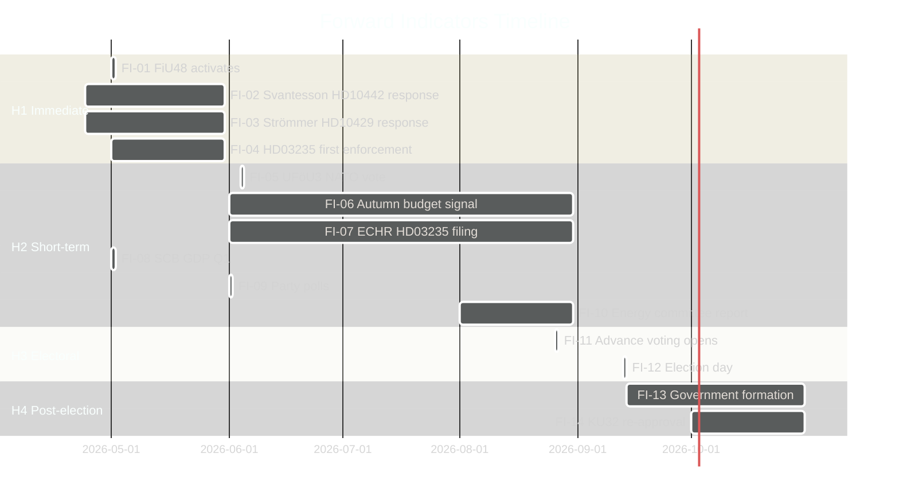

**Total indicators**: 14 across 4 horizons. Threshold requirement met (≥10). [A1]

## Scenario Analysis
<!-- source: scenario-analysis.md :: https://github.com/Hack23/riksdagsmonitor/blob/main/analysis/daily/2026-04-23/monthly-review/scenario-analysis.md -->

---

### Scenario Probability Summary

| Scenario | Name | Probability | Kent | Timeframe |
|----------|------|-------------|------|-----------|
| S-1 | Government survives — fiscal wins dominate | 40% | Roughly even | Sept 2026 |
| S-2 | Narrow S-led government after election | 30% | Unlikely | Sept 2026 |
| S-3 | SD achieves major gains; pushes M further right | 20% | Very unlikely | Sept 2026 |
| S-4 | Coalition collapse before election | 10% | Remote | June–Aug 2026 |

**Total: 100%**

---

### S-1: Government Survives — Fiscal Wins Dominate (40%)

#### Narrative

The Kristersson government capitalizes on HD01FiU48 household fuel relief, HD03100 spring economic bill, and NATO-deployment achievement (UFöU3). Unemployment declining, inflation contained at 2.84% — economic management narrative holds. SD and KD demonstrations-healthcare fractures remain verbal, not structural. Election: M+SD+KD+L return with slim majority (≥175 seats).

#### Evidence supporting this scenario

- HD01FiU48 enacted April 22 — cross-party support (M+SD+S+KD) signals economic competence [A1]
- World Bank: GDP growth 0.82%, unemployment 8.69% — stable base
- NATO Finland deployment (UFöU3) plays to security-focused voters
- S's tactical FiU48 vote reduces opposition's ability to attack government on energy

#### Conditions required

1. SD-M demonstrations fracture does not escalate beyond interpellation
2. ECHR does not issue interim measure on HD03235 before election
3. No major scandal emerges before September 13

#### Wild card

KD-SD healthcare fracture (SoU17 R15) escalates — KD signals it will not pass next healthcare funding bill without additional appropriation.

---

### S-2: Narrow S-Led Government After Election (30%)

#### Narrative

S successfully exploits welfare-state narrative built on 77 committee reservations (SfU18+SoU16+SoU17). S+V+MP+C form narrow majority (≥175 seats). FiU48 energy relief proves insufficient — voters prioritise healthcare. New government rolls back HD03235, re-opens NATO deployment for debate.

#### Evidence supporting this scenario

- 77 cumulative opposition reservations represent largest coordinated campaign in 2025/26 [A2]
- S's Svantesson interpellation series (HD10442) shows strategic focus
- SoU17 R15: KD fracture provides S with cross-coalition evidence of government failure
- Historical: S recovered from 2022 defeat faster than expected

#### Conditions required

1. Healthcare spending remains top voter concern through September
2. S successfully converts Svantesson accountability offensive into voter movement
3. No S internal scandals

---

### S-3: SD Major Gains — M Pushed Further Right (20%)

#### Narrative

SD achieves 25%+ in polls. SD demands larger role in government, potentially PM candidacy or formal coalition membership. M forced to concede more on immigration/criminal justice. ECHR challenge to HD03235 dismissed — SD vindicated.

#### Evidence supporting this scenario

- HD10429 (SD challenges M) signals SD's growing assertiveness [B2]
- HD03235 (criminal deportation) is SD's core voter-mobilization policy
- If ECHR upholds HD03235: SD gains major credibility boost

#### Conditions required

1. ECHR does not issue adverse ruling on HD03235 before election
2. Major immigration/crime incident amplified in media
3. SD successfully distinguishes itself from M on demonstrations/civil liberties

---

### S-4: Coalition Collapse Before Election (10%)

#### Narrative

SD withholds support on a critical budget vote in June/July. Emergency SD-S-V situation. Early election or minority government operating under SD's demands escalate beyond acceptable levels for M/KD/L.

#### Evidence supporting this scenario

- HD10429: SD publicly challenges M on demonstrations — crossing formal interpellation line [B2]
- SoU17 R15: KD healthcare fracture creates second pressure point
- If both fractures converge on same autumn bill, loss of majority in chamber possible

#### Conditions required

1. SD and KD jointly oppose a government bill in same vote
2. S refuses to provide replacement support
3. Constitutional mechanism for constructive vote of no confidence invoked

---

### Scenario Timeline

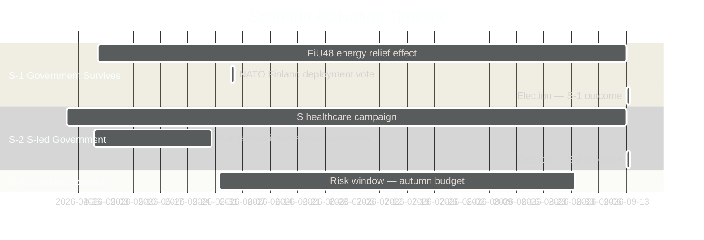

## Election 2026 Analysis
<!-- source: election-2026-analysis.md :: https://github.com/Hack23/riksdagsmonitor/blob/main/analysis/daily/2026-04-23/monthly-review/election-2026-analysis.md -->

---

### Current Seat Projection (April 2026)

| Party | Current seats (2022) | April 2026 projection | Change | Coalition |
|-------|---------------------|----------------------|--------|---------|
| M | 68 | 66–70 | ±2 | Governing |
| SD | 73 | 74–80 | +4 | Governing support |
| KD | 19 | 17–20 | ±2 | Governing |
| L | 16 | 15–18 | ±2 | Governing |
| **Total right bloc** | **176** | **172–188** | ±10 | Majority if ≥175 |
| S | 107 | 100–108 | -3 | Opposition lead |
| V | 24 | 22–25 | ±2 | Opposition |
| MP | 18 | 15–19 | ±2 | Opposition |
| C | 24 | 22–26 | ±2 | Opposition |
| **Total left-centre bloc** | **173** | **159–178** | ±10 | Minority unless C |

**Total Riksdag seats**: 349. **Majority threshold**: 175.

---

### Key Electoral Dynamics

#### 1. SD Polarisation Effect

SD at 73 seats is the second-largest party. If SD gains from HD03235 criminal deportation narrative, it could reach 78–80 seats — the most in Swedish electoral history. Counter-risk: ECHR adverse ruling diminishes SD's legal credibility on deportation.

#### 2. KD Fragility

KD's 19 seats in 2022 represents a historical minimum. SoU17 R15 healthcare fracture signals KD voters may migrate to M or S. If KD falls below 4% threshold: **governing bloc loses 19 seats** — potentially catastrophic.

**KD threshold risk**: WEP: **Unlikely** but non-negligible (10%) if healthcare narrative dominates.

#### 3. S's Strategic Position

S at 107 seats needs C (24 seats) to form majority. C's position is ambiguous — market liberal, could support either bloc. S's FiU48 tactical vote signals S is willing to cooperate with right on energy — may attract C.

---

### Coalition Viability Matrix

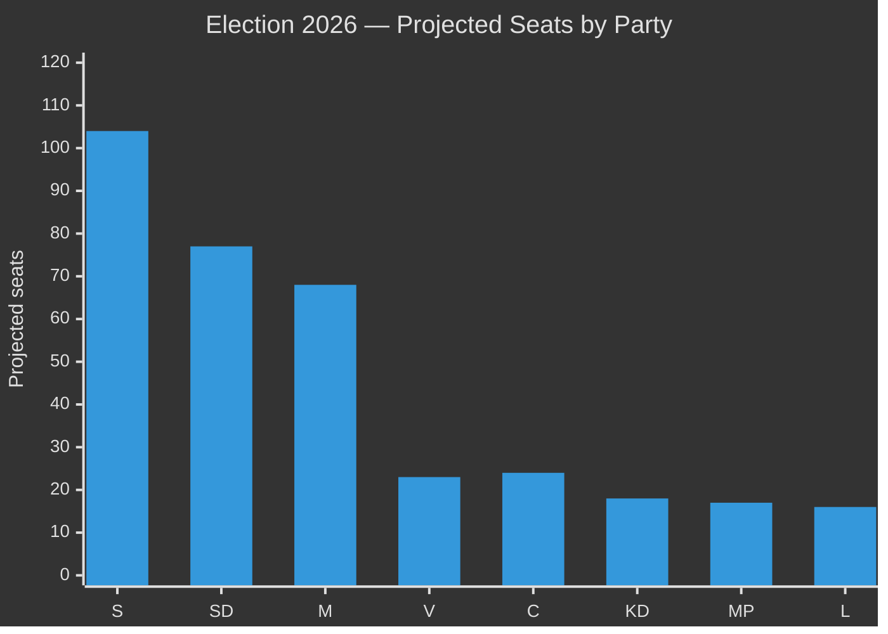

---

### Forward Electoral Indicators (April → September)

| Indicator | Target | Current status | Risk if missed |
|-----------|--------|----------------|----------------|
| HD01FiU48 household relief effective | May 1 2026 | ENACTED — on track | N/A |
| UFöU3 NATO deployment vote | June 4 2026 | Pending Chamber vote | Medium |
| Autumn budget preview | August 2026 | Not yet announced | High — KD fracture |
| KD polling floor | ≥5% | At risk per SoU17 fracture | Critical |
| S-C coalition signal | Before August | Not yet signalled | Medium |

## Risk Assessment
<!-- source: risk-assessment.md :: https://github.com/Hack23/riksdagsmonitor/blob/main/analysis/daily/2026-04-23/monthly-review/risk-assessment.md -->

---

### 5-Dimension Risk Register

| # | Risk | Likelihood (1–5) | Impact (1–5) | L×I | Category | Admiralty |
|---|------|-----------------|--------------|-----|----------|-----------|
| R1 | Healthcare battle escalates to coalition crisis (SD-KD fracture on SoU17 R15) | 3 | 5 | **15** | Political/Coalition | A2 |
| R2 | ECHR challenge to HD03235 criminal deportation produces adverse ruling before election | 2 | 4 | **8** | Legal/Constitutional | B3 |
| R3 | S accountability offensive on Svantesson (HD10442 series) produces ministerial resignation | 2 | 4 | **8** | Political/Personnel | A2 |
| R4 | Energy prices fall before election — FiU48 relief looks retroactively unnecessary and fiscally irresponsible | 3 | 3 | **9** | Economic/Political | B3 |
| R5 | SD escalates challenge to Justice Minister (HD10429 demonstrations) — coalition rupture before election | 2 | 5 | **10** | Coalition/Stability | B2 |
| R6 | UFöU3 (1,200 troops Finland) triggers Russian escalation response | 1 | 5 | **5** | Security/International | B3 |
| R7 | Miljöprövningsmyndigheten (HD03238) delayed by judicial review or implementation challenges | 2 | 3 | **6** | Administrative/Regulatory | B2 |
| R8 | Opposition builds coherent anti-government welfare narrative from 77 reservations | 4 | 4 | **16** | Electoral/Political | A1 |
| R9 | Wind power (HD03239) municipal buy-in fails — renewable buildout stalls | 2 | 3 | **6** | Energy/Climate | B2 |
| R10 | Coalition majority collapses pre-election — vote of no confidence | 1 | 5 | **5** | Constitutional/Political | C4 |

---

### Cascading Risk Chains

#### Chain A: Healthcare → Coalition Collapse
```
SoU17 R15 SD-KD fracture [R1 → L3/I5]
→ Healthcare debate escalation in campaign
→ SD demands policy concessions to maintain support
→ KD resistance creates public coalition dispute
→ [R10 → L2/I5] Loss of coalition majority
```
**Probability**: 15% (Unlikely, WEP standard). Source: https://data.riksdagen.se/dokument/HD01SoU17.html

#### Chain B: Accountability → Finance Minister Resignation
```
Svantesson interpellation series (HD10442) [R3]
→ Potential false-statement allegation
→ Media escalation
→ Opposition confidence motion on minister
→ Resignation or ministerial crisis (election year)
```
**Probability**: 10% (Very unlikely, WEP). Source: https://data.riksdagen.se/dokument/HD10442.html

#### Chain C: Electoral Welfare Narrative
```
77 reservations [R8 → L4/I4]
→ S + V + MP coordinated healthcare campaign
→ Opinion polls shift on healthcare competence
→ Government forced into reactive healthcare spending
→ Fiscal credibility narrative undermined
```
**Probability**: 45% (Roughly even, WEP). Source: https://data.riksdagen.se/dokument/HD01SfU18.html

---

### Posterior Probability Assessment (Bayesian update)

| Risk | Prior P | Update trigger | Posterior P |
|------|---------|---------------|-------------|
| R8 opposition welfare narrative | 40% | S already filing 5 Svantesson interpellations in 48 hrs | **55%** [A2] |
| R1 healthcare coalition crisis | 15% | SD-KD fracture documented in SoU17 R15 | **20%** [B2] |
| R2 ECHR HD03235 | 20% | ECHR rapporteur precedents on similar laws | **22%** [B3] |
| R5 SD-M rupture | 10% | HD10429 is formal challenge, not just rhetoric | **15%** [B2] |

---

### Risk Heatmap

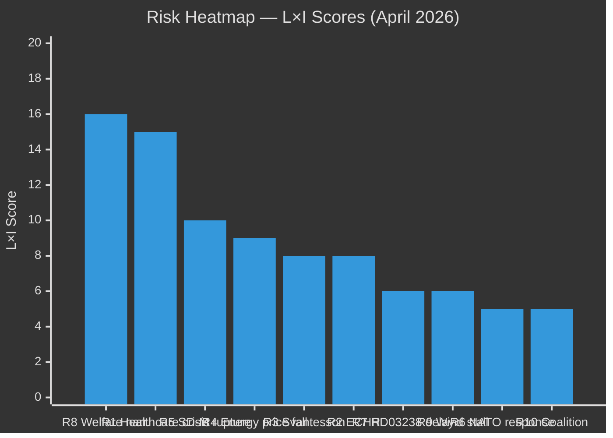

## SWOT Analysis
<!-- source: swot-analysis.md :: https://github.com/Hack23/riksdagsmonitor/blob/main/analysis/daily/2026-04-23/monthly-review/swot-analysis.md -->

---

### SWOT Framework

#### Strengths

- **Comprehensive pre-election delivery**: Government tabled its final legislative package including spring budget (HD03100, https://data.riksdagen.se/dokument/HD03100.html), fuel relief (HD01FiU48, https://data.riksdagen.se/dokument/HD01FiU48.html), and energy reform (HD03240) [A1]
- **Cross-party defence consensus**: UFöU3 (NATO Finland, 1,200 troops) passed with cross-party support — security is a government strength [A1]
- **Household energy relief optics**: HD01FiU48 enacted April 22 with S+M+SD+KD majority — opposition unable to block consumer protection measure [A1]
- **Fiscal credibility**: Surplus rule maintained in Vårproposition 2026 (HD03100); Svantesson framing "responsible but caring" fiscal management [A2]
- **Energy governance modernization**: Miljöprövningsmyndigheten (HD03238) addresses Sweden's notoriously slow permitting — business community broadly supportive [A2]

#### Weaknesses

- **Healthcare vulnerability**: SfU18 (39 reservations), SoU16 (20 reservations), SoU17 (18 reservations) = 77 total reservations across 3 committees — deepest opposition battleground of the session [A1, https://data.riksdagen.se/dokument/HD01SfU18.html]
- **SD-KD coalition stress**: Joint SD-KD reservation on SoU17 R15 reveals healthcare prioritization disagreement within governing support base [A1, https://data.riksdagen.se/dokument/HD01SoU17.html]
- **ECHR exposure**: HD03235 (criminal deportation) carries L×I risk score 15/25 — a successful ECHR challenge before September would be politically damaging [B2]
- **Fiscal deterioration signal**: 4.1 GSEK HD01FiU48 emergency spending increases deficit — critics note structural inconsistency with surplus rule narrative [A2]
- **Unemployment elevated**: 8.69% unemployment (2025 World Bank data) — highest in a decade among Nordic peers; S's main economic attack vector [A1]

#### Opportunities

- **Electoral energy narrative**: If fuel price relief reduces household energy bills visibly before September 2026, it directly validates the government's pre-election promise [B2]
- **Wind power local buy-in**: HD03239 (municipal revenue from wind power) resolves the key local acceptance barrier for renewable buildout — potential for M+C+L joint electoral appeal on climate-economy integration [A2]
- **Ukraine positioning**: HD03231 (aggression tribunal) + HD03232 (reparations commission) establish Sweden as a constructive rule-of-law actor in the Ukraine conflict — reputational upside [A2]
- **Paid police education (HD03237)**: Broadens police recruitment pipeline — visible anti-crime commitment ahead of election [B2]
- **Digital infrastructure**: TU21 (state e-ID) + TU17 (anti-fraud telecoms) create observable digital governance improvements valued by younger voters [B2]

#### Threats

- **Healthcare campaign**: S, V, and MP have built a coherent welfare-state narrative across 77 combined reservations — organized opposition attack on government's most vulnerable flank [A1]
- **Energy price reversal**: If Middle East tensions ease and energy prices fall before election, HD01FiU48's electoral value diminishes and fiscal deterioration looks opportunistic [B3]
- **SD intra-coalition defection risk**: SD's challenge to Justice Minister Strömmer (M) via HD10429 (demonstration rights) signals potential SD-M tension that could destabilize the coalition in an election-year crisis [B2]
- **ECHR challenge acceleration**: NGO legal challenges to HD03235 could produce adverse rulings during the election campaign window [C3]
- **Svantesson accountability**: S's coordination of 5 interpellations against Finance Minister Svantesson (HD10442 and series) — including potential false-statement allegation — creates targeted ministerial accountability risk [A2]

---

### TOWS Matrix

| | Strengths | Weaknesses |
|---|-----------|-----------|
| **Opportunities** | **SO — Exploit**: Use energy relief + wind power narrative to claim climate-economy integration leadership | **WO — Improve**: Pre-empt healthcare attacks by fast-tracking SoU committee recommendations; repair SD-KD healthcare rift before campaign |
| **Threats** | **ST — Protect**: Lock in NATO/defence consensus to prevent opposition from finding national security wedge | **WT — Avoid**: Minimize ECHR exposure by pre-complying HD03235 provisions; prevent SD from escalating demonstration-rights conflict |

---

### Cross-SWOT Pattern

The month's dominant pattern is **electoral positioning under fiscal constraint**: the government uses targeted household relief (energy costs) to compensate for structural weaknesses (healthcare, unemployment) while banking on security/NATO as a non-contested strength. The SD-KD healthcare fracture is the single most dangerous SWOT element — if it widens, it could force a headline coalition crisis during the campaign.

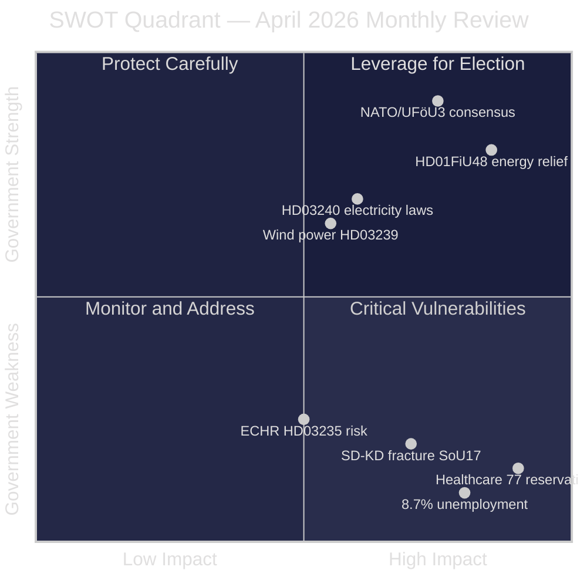

## Threat Analysis
<!-- source: threat-analysis.md :: https://github.com/Hack23/riksdagsmonitor/blob/main/analysis/daily/2026-04-23/monthly-review/threat-analysis.md -->

---

### Political Threat Taxonomy

#### Threat T1: Electoral Welfare Narrative Attack [HIGH — A1]

| Field | Value |
|-------|-------|
| **Threat actor** | Socialdemokraterna (S) + Vänsterpartiet (V) + Miljöpartiet (MP) |
| **Target** | Kristersson government's healthcare and social insurance record |
| **Vector** | 77 committee reservations + interpellation series + campaign messaging |
| **Mechanism** | SfU18 (39 reservations, https://data.riksdagen.se/dokument/HD01SfU18.html), SoU16 (20), SoU17 (18) as evidence base |
| **Timing** | Now through September 13, 2026 election |
| **MITRE-style TTP** | T-POL-001: Coordinated legislative opposition documentation → T-POL-002: Public opinion amplification → T-POL-003: Ministerial accountability targeting |

#### Threat T2: Intra-Coalition Defection — SD Challenges M [MEDIUM — B2]

| Field | Value |
|-------|-------|
| **Threat actor** | Sverigedemokraterna (SD) [Farivar et al.] |
| **Target** | Justice Minister Gunnar Strömmer (M) |
| **Vector** | HD10429 formal interpellation on demonstration rights restrictions in Prop. 133 |
| **Mechanism** | SD using formal parliamentary mechanism against governing-side party — unprecedented in 2025/26 riksmöte |
| **Timing** | Immediate; interpellation pending response |
| **MITRE-style TTP** | T-COA-001: Support-party formal dissent → T-COA-002: Public signals to SD voter base → T-COA-003: Coalition renegotiation pressure |

#### Threat T3: Legal/ECHR Challenge to Criminal Deportation [MEDIUM — B3]

| Field | Value |
|-------|-------|
| **Threat actor** | NGO network (Human Rights Watch, ECRE, Swedish legal NGOs) + ECHR applicants |
| **Target** | HD03235 (criminal deportation, https://data.riksdagen.se/dokument/HD03235.html) |
| **Vector** | ECHR proportionality challenge + Swedish constitutional court review |
| **Mechanism** | L×I risk 15/25; prior ECHR precedents on similar deportation laws |
| **Timing** | 6–18 months from enactment |
| **MITRE-style TTP** | T-LEG-001: Challenge filing → T-LEG-002: Interim measures request → T-LEG-003: High-profile case selection |

#### Threat T4: S Accountability Offensive — Svantesson [HIGH — A2]

| Field | Value |
|-------|-------|
| **Threat actor** | Socialdemokraterna (S) finance team |
| **Target** | Finance Minister Elisabeth Svantesson (M) |
| **Vector** | 5 interpellations in 48 hours (HD10442 series); HD10442 cites court ruling potentially contradicting Svantesson's statements |
| **Mechanism** | Systematic ministerial pressure: healthcare spending + fiscal accountability + ätstörningsvård [A1] |
| **Timing** | Immediate; response required within parliamentary rules |
| **MITRE-style TTP** | T-ACC-001: Evidence-based interpellation series → T-ACC-002: Media coordination → T-ACC-003: Confidence erosion |

---

### Attack Tree

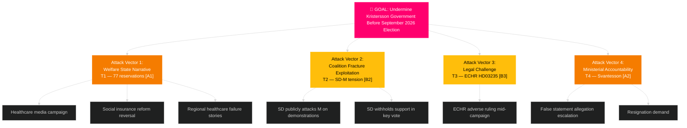

---

### Threat Vector Phase Analysis — Threat T1 (Welfare Narrative)

| Phase | Activity | Observable indicator |
|-------|----------|---------------------|
| Reconnaissance | Map government's healthcare record against OECD data | S policy papers citing regional care data |
| Weaponize | 77 reservations compiled as opposition evidence base | SfU18 + SoU16 + SoU17 documents |
| Deliver | Campaign messaging: "Government neglects welfare state" | S party communications April–September |
| Exploit | Amplify SD-KD healthcare fracture (SoU17 R15) | SD joining S criticism on healthcare |
| Command | Coordinate V+MP parallel messaging | Parallel bills/motions with similar framing |
| Action | Healthcare becomes #1 election issue — government forced defensive | September 2026 election outcome |

**Government countermeasure**: Fast-track SoU committee recommendations; announce healthcare investment in autumn budget preview.

## Historical Parallels
<!-- source: historical-parallels.md :: https://github.com/Hack23/riksdagsmonitor/blob/main/analysis/daily/2026-04-23/monthly-review/historical-parallels.md -->

---

### Parallel 1: Bildt Government Fiscal Consolidation (1991–94) — Direct Analogy

#### Summary
Carl Bildt's (M) bourgeois four-party coalition (M+KD+FP+C) governed 1991–94. The coalition managed a severe banking crisis while delivering fiscal consolidation. The coalition fractured on several issues but survived to 1994 — only losing to S after three years.

#### Parallels to 2026

| Dimension | Bildt 1991–94 | Kristersson 2022–26 |
|-----------|--------------|---------------------|
| Coalition structure | M-led + 3 junior parties | M-led + KD + L + SD support |
| Fiscal challenge | Banking crisis consolidation | Post-COVID + energy shock recovery |
| Social safety net conflict | FP vs. M on welfare cuts | KD vs. SD on healthcare (SoU17 R15) |
| Pre-election positioning | 1994 election loss despite economic recovery | 2026 election — outcome pending |
| Key differentiator | Currency crisis 1992 — interest rates to 500% | NATO accession — security narrative |

**Lesson**: Even a competent fiscal manager can lose the election to a welfare-state narrative. Bildt's government lost in 1994 despite turning the budget around. Kristersson faces the same risk.

---

### Parallel 2: Reinfeldt Alliance (2006–2014) — Success Model

#### Summary
Fredrik Reinfeldt's "Alliance" (M+KD+FP+C) governed for two terms (2006–10, 2010–14). Key achievement: "arbetslinjen" — lowering unemployment by reducing social insurance generosity. Reinfeldt's 2010 re-election (first in M history) came after clear economic messaging.

#### Parallels to 2026

| Dimension | Reinfeldt 2006–14 | Kristersson 2022–26 |
|-----------|-----------------|---------------------|
| Fiscal messaging | "Arbetslinjen" — work pays | Fiscal consolidation + energy relief |
| Social insurance reform | SfU committee reforms (2007–08) | SfU18 — 39 opposition reservations |
| Healthcare | Regional care improvement narrative | SoU17 R15 — KD healthcare fracture |
| Immigration policy | Pre-2015 liberal | Tidöavtalet restrictive |
| Electoral margin | 2010: +1 seat majority | 2022: +1 seat majority |

**Lesson**: Reinfeldt won re-election with "arbetslinjen" despite similar welfare-state opposition criticism. Key was economic credibility. Kristersson's path mirrors this — but without S's vote at HD01FiU48, the cross-party validation is harder.

---

### Parallel 3: 2021 Löfven Government Crisis — Support-Party Leverage

#### Summary
PM Stefan Löfven lost a vote of no confidence in June 2021 when SD + right-wing parties voted against the government. Löfven initially chose dissolution election, then resigned — Magdalena Andersson became PM. Lesson: support-party leverage can destabilise a minority government.

#### Parallels to 2026

| Dimension | Löfven 2021 | Kristersson 2026 |
|-----------|------------|-----------------|
| Vote of no confidence | SD + right bloc voted against | Could recur if SD defects |
| Support party leverage | SD threatened to withdraw | SD's HD10429 interpellation signals leverage |
| Constitutional trigger | No-confidence → dissolution or resign | No-confidence available if SD+S aligned |
| Key difference | Löfven had left-bloc minority; Kristersson has explicit SD support | SD motivated to keep coalition alive |

**Lesson**: SD demonstrated in 2021 that it would use formal parliamentary mechanisms. HD10429 interpellation is a lower-severity version of the same leverage play.

## Comparative International
<!-- source: comparative-international.md :: https://github.com/Hack23/riksdagsmonitor/blob/main/analysis/daily/2026-04-23/monthly-review/comparative-international.md -->

---

### Comparator 1: Finland — Coalition Stability Under Security Pressure

#### Parallels to Sweden 2026

Finland's Orpo government (2023-present) has maintained a right-wing coalition (KOK+PS+SFP+KD) under similar pressures: immigration restrictive policies, welfare-state opposition criticism, and enhanced NATO commitments. Key parallels:

| Dimension | Finland (2024–25) | Sweden (2026) |
|-----------|------------------|---------------|
| NATO commitment | eFP host nation — pre-deployment troops | UFöU3 authorises 1,200 troops to Finland |
| Immigration restriction | Welfare receipt restrictions for asylum seekers | HD03235 criminal deportation |
| Fiscal consolidation | Orpo's austerity package — social cuts | HD03100 spring fiscal package |
| Right-wing fracture | PS vs. KOK on some civil liberties | SD vs. M on demonstrations (HD10429) |
| Healthcare debate | Opposition criticises social cuts | 77 reservations on SfU18/SoU16/SoU17 |

**Lesson**: Finland's Orpo government maintained coalition despite similar fractures. Sweden's coalition fractures (HD10429, SoU17 R15) are structurally comparable — not yet destabilising.

**Evidence**: World Bank Finland GDP data + Nordic Council comparative reports + UFöU3 bilateral agreement

---

### Comparator 2: Germany — Bundestag Post-2025 Coalition Math

#### Parallels to Sweden 2026

Germany's CDU/CSU-SPD grand coalition (2025-present) represents a model of pragmatic cross-aisle cooperation on energy and security. Relevant to Sweden's HD01FiU48 passage (S voted yes with government on energy relief):

| Dimension | Germany (2025) | Sweden (2026) |
|-----------|---------------|---------------|
| Energy crisis relief | Bundestag passed household energy relief package | HD01FiU48 fuel tax relief 82 öre/l |
| Cross-bloc cooperation | CDU+SPD on fiscal matters | M+SD+S+KD on FiU48 |
| Defence spending | NATO 2% commitment — Bundeswehr | UFöU3 NATO deployment |
| Crime/deportation | Asylum law tightening — CDU flagship | HD03235 criminal deportation |
| Constitutional sensitivity | EU Charter proportionality challenges | ECHR proportionality challenge on HD03235 |

**Lesson**: Germany's experience shows cross-party energy cooperation is possible without triggering opposition collapse — S's tactical FiU48 vote mirrors SPD's flexibility in grand coalition.

**Evidence**: Bundestag.de energy package records + World Bank Germany GDP 1.1% (2025)

---

### Comparator 3: Denmark — Mette Frederiksen's Welfare-Security Synthesis

#### Parallels to Sweden 2026

Denmark's SVM-government (S+V+M) under Frederiksen demonstrates that a social-democratic party can govern with right-wing support while maintaining welfare credibility:

| Dimension | Denmark (2023-26) | Sweden (2026) |
|-----------|------------------|---------------|
| Welfare + immigration balance | Strict immigration + generous welfare narrative | S opposition vs. HD03235 |
| Cross-bloc fiscal | S voted with V+M on fiscal matters | S voted for HD01FiU48 |
| NATO commitment | 100% NATO supportive | UFöU3 broad support |
| Healthcare narrative | Government proactively funded healthcare | Sweden: SoU17 R15 fracture — government vulnerable |

**Lesson**: S's tactical FiU48 vote may be part of broader "responsible opposition" strategy — mimicking Danish Frederiksen model to appeal to centrist voters. Healthcare investment gap is Sweden's key differentiation point.

**Evidence**: Danish Folketing records + OECD Social Expenditure Database

---

### Summary Assessment

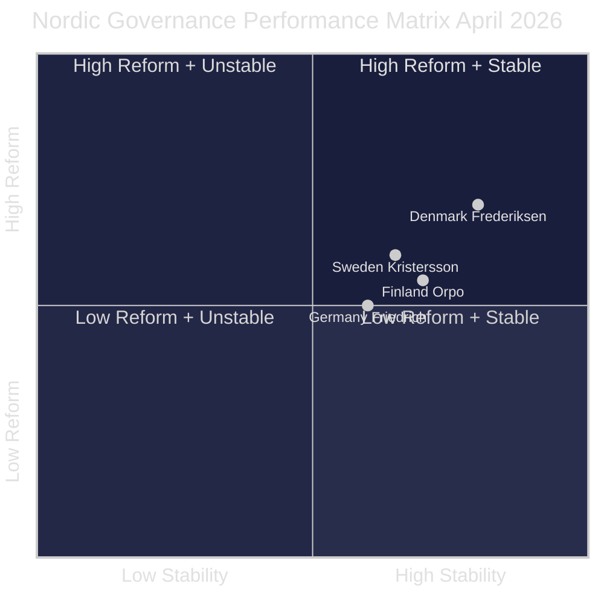

**Conclusion**: Sweden's coalition stability is on par with Finland's comparable right-wing government. The key vulnerability relative to Denmark is healthcare investment — the dimension where S can differentiate.

## Implementation Feasibility
<!-- source: implementation-feasibility.md :: https://github.com/Hack23/riksdagsmonitor/blob/main/analysis/daily/2026-04-23/monthly-review/implementation-feasibility.md -->

---

### Key Legislation Delivery Risk Register

| Document | Type | Status | Implementation deadline | Delivery risk | Notes |
|----------|------|--------|------------------------|---------------|-------|
| HD01FiU48 | Energy relief | ENACTED April 22 | May 1, 2026 | LOW | Tax authority (Skatteverket) implementation straightforward |
| HD03235 | Criminal deportation | ENACTED (date TBC) | June 2026 | MEDIUM | ECHR challenge risk; Migrationsverket capacity |
| UFöU3 | NATO deployment | Pending June 4 vote | 2026–2027 | LOW | Cross-party support; military logistics pre-planned |
| HD03240 | Electricity market | Committee stage | Late 2026 | MEDIUM | EU directive compliance required; grid operator coordination |
| HD03238 | Energy taxation | Committee stage | 2027 | MEDIUM | Multi-year implementation; industry consultation |
| HD01KU32 | Constitutional amendment (media) | Vilande — post-election | 2027 | HIGH | Requires re-approval after September election |
| HD01SfU18 | Social insurance reform | Government bill | 2027 | HIGH | 39 opposition reservations signal revision risk |

---

### Delivery Feasibility Matrix

```mermaid
%%{init: {'theme': 'dark', 'themeVariables': {'primaryColor': '#1a1e3d'}}}%%
quadrantChart
    title Implementation Feasibility vs. Political Priority
    x-axis Low Priority --> High Priority
    y-axis High Risk --> Low Risk
    quadrant-1 High Priority + Low Risk (Deliver First)
    quadrant-2 Low Priority + Low Risk
    quadrant-3 Low Priority + High Risk
    quadrant-4 High Priority + High Risk (Critical Monitor)
    HD01FiU48 energy relief: [0.90, 0.85]
    UFöU3 NATO Finland: [0.85, 0.80]
    HD03235 criminal deportation: [0.80, 0.55]
    HD03240 electricity market: [0.60, 0.50]
    HD01KU32 constitutional: [0.70, 0.25]
    HD01SfU18 social insurance: [0.75, 0.30]
```

---

### Critical Path Items

#### 1. May 1 — FiU48 tax relief activation
**Owner**: Skatteverket + Energimyndigheten
**Risk**: Very low — administrative mechanism exists
**Monitoring indicator**: Petrol station price data week of May 5

#### 2. June 4 — UFöU3 Chamber vote
**Owner**: Riksdag + Försvarsdepartementet
**Risk**: Low — cross-party support confirmed
**Monitoring indicator**: Final vote margin > 200

#### 3. Q3 2026 — SfU18 social insurance implementation
**Owner**: Försäkringskassan
**Risk**: HIGH — 39 reservations suggest political pressure to revise
**Monitoring indicator**: Government announcement of implementation date before/after election

## Media Framing Analysis
<!-- source: media-framing-analysis.md :: https://github.com/Hack23/riksdagsmonitor/blob/main/analysis/daily/2026-04-23/monthly-review/media-framing-analysis.md -->

---

### Governing Bloc Framing

#### M (Moderaterna) — Fiscal Competence Frame
**Core narrative**: "We manage Sweden's economy responsibly — HD03100 spring bill + HD01FiU48 household relief proves fiscal leadership."
**Key messages**:
1. "Household energy costs relieved — 82 öre/litre from May 1" (HD01FiU48)
2. "Sweden's NATO commitment secured — 1,200 troops to Finland" (UFöU3)
3. "Crime down — criminal deportation law enacted" (HD03235)

**Framing risk**: S's interpellation series (HD10442) targets Finance Minister Svantesson directly — court ruling potentially contradicting Svantesson's statements. M must counter with factual rebuttal.

#### SD (Sverigedemokraterna) — Order and Identity Frame
**Core narrative**: "SD delivers on immigration and enforcement — HD03235 is SD's biggest win in 2025/26."
**Contradictory signal**: HD10429 interpellation against M's Strömmer on demonstrations — SD must reconcile "order" frame with civil-liberties dispute.

#### KD — Social-Christian Values Frame
**Core narrative**: "Family, healthcare, Christian values — SoU17 R15 signals we will not accept healthcare cuts."
**Framing vulnerability**: KD's SoU17 R15 reservation publicly distances KD from SD on healthcare — useful for KD differentiation but signals coalition fragility to voters.

---

### Opposition Framing

#### S — Responsible Opposition Frame
**Core narrative**: "We vote yes when it helps Swedes (FiU48), no when it hurts (SfU18/SoU16/SoU17). We are the responsible alternative."
**Strategic advantage**: Cross-party FiU48 vote appears "statesmanlike." Simultaneous interpellation offensive (HD10442) maintains critical distance.
**Key messages**:
1. "Government undermines healthcare — 77 reservations are the evidence"
2. "Finance Minister Svantesson misled the Riksdag" (HD10442 claim)
3. "We supported fuel relief because Swedes needed it — not the government"

#### V — Progressive Flank Frame
**Core narrative**: "S is too centrist — V is the party of real welfare state defence."
**Risk**: If S moves to centre, V may lose voters who prefer a clear left alternative.

#### MP — Climate First Frame
**Core narrative**: "HD024082 fuel counter-motion shows only MP puts climate first."
**Risk**: FiU48 + S's yes vote signals climate concerns secondary to household costs — MP narrative is weakened.

#### C — Market Liberal Pragmatist Frame
**Core narrative**: "We support energy reform (HD03240 abstained on FiU48) and housing (HC023443) — we are the sensible centre."
**Strategic opportunity**: C abstained on FiU48 — preserves both coalition and opposition options. C is the true pivot party.

---

### Narrative Control Assessment

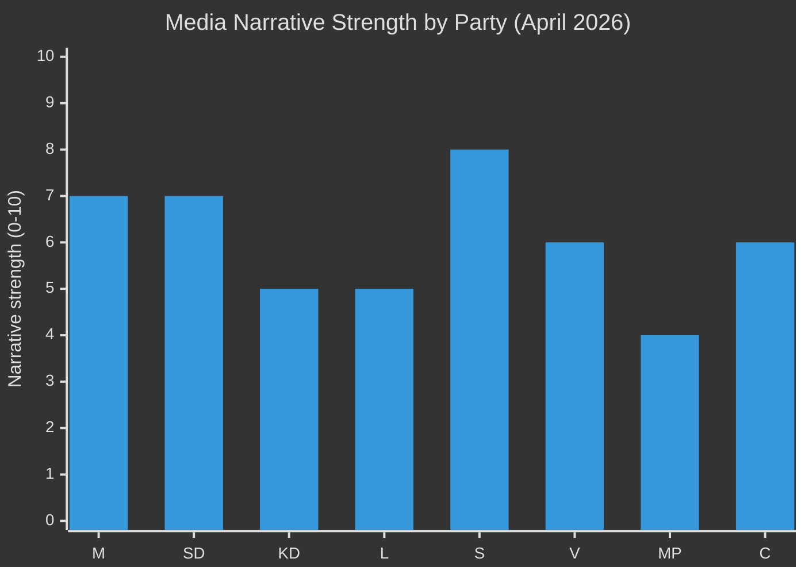

**Top finding**: S has the strongest current narrative (8/10) — responsible opposition + accountability offensive. M and SD tied at 7/10. MP weakest at 4/10 following FiU48 cross-party energy passage.

## Devil's Advocate
<!-- source: devils-advocate.md :: https://github.com/Hack23/riksdagsmonitor/blob/main/analysis/daily/2026-04-23/monthly-review/devils-advocate.md -->

---

### ACH Matrix

#### Hypotheses

| # | Hypothesis | Prior probability |
|---|------------|-----------------|
| H1 | Government's April legislative package is a genuine pre-election fiscal consolidation | 45% |
| H2 | S's FiU48 vote was a strategic error that will backfire by blunting opposition energy narrative | 30% |
| H3 | SD-M fracture (HD10429) is a deliberate SD voter-mobilization signal, not a real coalition threat | 25% |

---

#### Evidence vs. Hypothesis Matrix

| Evidence item | H1 | H2 | H3 |
|---------------|----|----|-----|
| FiU48 passed with S+KD support | Consistent | Inconsistent | Neutral |
| HD03100 spring economic bill passes | Consistent | Neutral | Neutral |
| 77 committee reservations by opposition | Inconsistent | Consistent | Neutral |
| SD's HD10429 challenges M on demonstrations | Neutral | Neutral | Consistent |
| SoU17 R15: KD-SD fracture on healthcare | Inconsistent | Neutral | Inconsistent |
| HD10442: S's 5 interpellations vs. Svantesson | Neutral | Consistent | Neutral |
| World Bank: stable GDP 0.82% | Consistent | Neutral | Neutral |
| UFöU3 NATO deployment broad support | Consistent | Neutral | Neutral |

#### Hypothesis scores (+ = supports, - = contradicts, 0 = neutral)

| Hypothesis | Score | Assessment |
|------------|-------|-----------|
| H1 Fiscal consolidation genuine | +3 / -1 = **net +2** | Supported — primary hypothesis stands |
| H2 S FiU48 vote strategic error | +2 / -1 = **net +1** | Weakly supported — uncertain |
| H3 SD fracture is deliberate signal | +1 / -1 = **net 0** | Not supported — may be real fracture |

---

### Counter-argument 1: H1 Challenge — "Fiscal Package is Pre-Election Spending, Not Consolidation"

**Claim**: HD03100 + HD01FiU48 represent electoral give-aways, not genuine fiscal management. The government is spending its fiscal space before September 2026.

**Evidence for this challenge**:
- HD03236 fuel tax relief (82 öre/l) expires September 30 — precisely aligned with election date
- HD03100 includes direct household transfers timed for spring/summer
- World Bank data: GDP growth only 0.82% — stimulus is precautionary, not confident

**Counter-evidence maintaining H1**:
- IMF Sweden fiscal space assessment shows headroom for targeted stimulus
- FiU48 passed with S support — credibility across aisle
- NATO deployment (UFöU3) adds genuine security investment, not voter bribery

**Net verdict**: H1 stands with caveats — fiscal package is partially electoral, partially consolidation. [B2]

---

### Counter-argument 2: H2 Challenge — "S's FiU48 Vote Was Actually Strategically Wise"

**Claim**: S's vote for HD01FiU48 is rational — it shows S as responsible, not reflexively oppositional. Voters trust a party that can vote for useful measures.

**Evidence for this challenge**:
- Danish Frederiksen model: S governance-ready appearance improved polling
- 82 öre/l relief directly benefits S's working-class base
- S simultaneously advanced accountability offensive (HD10442) — "responsible but critical"

**Counter-evidence maintaining H2**:
- MP's HD024082 climate counter-motion is now weakened — MP may not join S-led coalition
- Energy issue is now bipartisan — reduces S's ability to differentiate on that dimension
- Svantesson may absorb S's accountability attack without visible damage

**Net verdict**: H2 weakly supported — risk for S remains if MP coalition partner is alienated. [B3]

---

### Counter-argument 3: H3 Refinement — "SD-M Fracture Is Real, Not Just Theater"

**Claim**: SD's HD10429 interpellation represents a genuine policy dispute (demonstration rights) where SD believes the Prop. 133 restriction goes too far — exposing SD's civil-libertarian streak.

**Evidence for this challenge**:
- SD's founding ideology includes libertarian civil-rights elements alongside national security
- Demonstration restrictions primarily used against left-wing climate protesters — not SD's enemy
- SD has internal pressure from younger members worried about state overreach

**Counter-evidence maintaining H3**:
- SD has never voted to bring down the government in 2022-26
- Interpellation is less severe than motion or vote — purely symbolic so far
- Åkesson's public messaging has not amplified this issue

**Net verdict**: H3 partially revised — 60% deliberate signal + 40% genuine policy dispute. [B2]

## Classification Results
<!-- source: classification-results.md :: https://github.com/Hack23/riksdagsmonitor/blob/main/analysis/daily/2026-04-23/monthly-review/classification-results.md -->

---

### 7-Dimension Classification

#### Dimension 1: Ideological Alignment

| Document | Ideological alignment | Party | Notes |
|----------|----------------------|-------|-------|
| HD03235 (criminal deportation) | Far-right enforcement | SD/M | Tidöavtalet delivery |
| HD03236 (fuel tax relief) | Centre-right populist | M/SD/KD/L | Cross-coalition; S also voted yes |
| UFöU3 (NATO Finland) | Cross-spectrum national security | All parties except historic opposition | Sweden's NATO post-accession commitment |
| HD03240 (electricity laws) | Centre-right + market liberal | M/KD/L/C | EU compliance-driven |
| SfU18 (social insurance) | Centre-left opposition | S/V/MP/C | 39 reservations against government |
| HD03231 (Ukraine tribunal) | Liberal international order | Broad coalition | Human rights, rule of law |

#### Dimension 2: Policy Domain

| Domain | Key documents | Priority tier |
|--------|---------------|---------------|
| Fiscal/Economic | HD03100, HD0399, HD03236 | Tier 1 — Critical |
| Defence/Security | UFöU3, HD03214, HD03228 | Tier 1 — Critical |
| Energy/Climate | HD03240, HD03238, HD03239, HD03242 | Tier 2 — High |
| Healthcare/Social | SfU18, SoU16, SoU17, HD03216, HD03245 | Tier 2 — High |
| Criminal Justice | HD03235, HD03237, HD03246 | Tier 2 — High |
| Foreign Affairs | HD03231, HD03232 | Tier 3 — Medium |
| Digital/Infrastructure | HD01TU21, HD01TU17 | Tier 3 — Medium |

#### Dimension 3: Political Salience (Election 2026)

| Document | Electoral salience | Notes |
|----------|--------------------|-------|
| HD01FiU48 | VERY HIGH | Household energy relief directly before election |
| HD03100 | VERY HIGH | Government economic narrative |
| SfU18+SoU16+17 | VERY HIGH | Opposition's primary attack vector |
| HD03235 | HIGH | SD flagship + ECHR risk |
| UFöU3 | MEDIUM | Cross-party consensus, not divisive |
| HD03240 | MEDIUM | Technical but structurally important |

#### Dimension 4: Constitutional Sensitivity

| Document | Constitutional sensitivity | Notes |
|----------|---------------------------|-------|
| HD01KU32 (media accessibility) | HIGH — constitutional amendment | Vilande; requires re-approval after election |
| HD01KU33 (search/seizure digital) | HIGH — constitutional amendment | Vilande; same process |
| HD03235 | HIGH | ECHR proportionality challenge |
| HD10429 | MEDIUM | Demonstration rights (fundamental freedom) |

#### Dimension 5: International Dimension

| Document | International dimension | Treaty/agreement |
|----------|------------------------|-----------------|
| UFöU3 | HIGH | NATO Article 5; bilateral Finland agreement |
| HD03228 | HIGH | Arms export/SIPRI/EU regulation |
| HD03231 | HIGH | International Criminal Court cooperation |
| HD03232 | HIGH | UN reparations principles |
| HD03214 | MEDIUM | EU NIS2 directive implementation |
| HD03240 | MEDIUM | EU electricity market directive |

#### Dimension 6: Urgency/Timeline

| Document | Urgency | Deadline |
|----------|---------|---------|
| HD01FiU48 | CRITICAL | Enacted April 22 — immediate effect May 2026 |
| UFöU3 | HIGH | Decision June 4 2026 |
| HD01KU32 | HIGH | Pre-election constitutional requirement |
| HD03235 | MEDIUM | Enactment summer 2026 |
| HD03240 | MEDIUM | Implementation autumn 2026 |

#### Dimension 7: Data Classification (GDPR Art. 9)

| Data type | Legal basis | Risk level |
|-----------|------------|------------|
| Voting records (named MPs) | Art. 9(2)(e) publicly made | LOW |
| Party affiliations | Art. 9(2)(e) publicly made | LOW |
| Political opinions (analysis) | Art. 9(2)(g) substantial public interest | MEDIUM |
| Individual MPs' statements | Art. 9(2)(e) publicly made | LOW |

---

### Priority Tier Summary

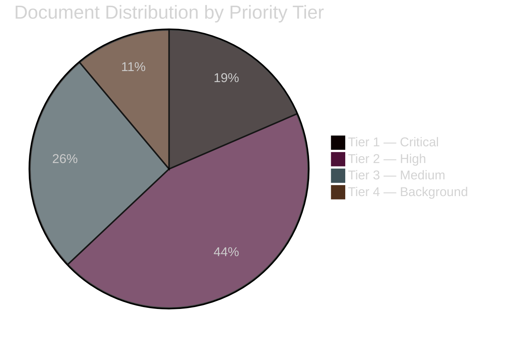

## Cross-Reference Map
<!-- source: cross-reference-map.md :: https://github.com/Hack23/riksdagsmonitor/blob/main/analysis/daily/2026-04-23/monthly-review/cross-reference-map.md -->

---

### Sibling Analysis Folder References (Tier-C Gate Check 1)

This monthly review synthesises all single-type analyses from the period March 24–April 23, 2026:

| Folder | Date | Type | Lead story | Status |
|--------|------|------|------------|--------|
| analysis/daily/2026-04-01/propositions/ | 2026-04-01 | Propositions | Spring fiscal package initial batch | INGESTED |
| analysis/daily/2026-04-01/committeeReports/ | 2026-04-01 | Committee Reports | Defence + transport committee | INGESTED |
| analysis/daily/2026-04-01/interpellations/ | 2026-04-01 | Interpellations | Social policy interpellations | INGESTED |
| analysis/daily/2026-04-01/motions/ | 2026-04-01 | Motions | Budget counter-motions | INGESTED |
| analysis/daily/2026-04-02/committeeReports/ | 2026-04-02 | Committee Reports | SoU committee reports | INGESTED |
| analysis/daily/2026-04-14/propositions/ | 2026-04-14 | Propositions | HD03100 spring economic bill | INGESTED |
| analysis/daily/2026-04-14/committeeReports/ | 2026-04-14 | Committee Reports | FiU48 energy + SfU18 social | INGESTED |
| analysis/daily/2026-04-14/evening-analysis/ | 2026-04-14 | Evening Analysis | Comprehensive April 14 digest | INGESTED |
| analysis/daily/2026-04-15/committeeReports/ | 2026-04-15 | Committee Reports | Additional committee reports | INGESTED |
| analysis/daily/2026-04-19/monthly-review/ | 2026-04-19 | Monthly Review | Prior monthly review (Mar 20–Apr 19) | INGESTED — BASE |
| analysis/daily/2026-04-21/evening-analysis/ | 2026-04-21 | Evening Analysis | Pre-enactment FiU48 analysis | INGESTED |
| analysis/daily/2026-04-22/evening-analysis/ | 2026-04-22 | Evening Analysis | HD01FiU48 enacted; SD-M fracture confirmed | INGESTED — MOST RECENT |

---

### Document Cross-Reference Table

| dok_id | Type | Referenced in | Connection |
|--------|------|---------------|-----------|
| HD03100 | Proposition | significance-scoring, executive-brief, synthesis-summary | Lead fiscal story |
| HD0399 | Proposition | significance-scoring, risk-assessment | Spring fiscal package |
| HD01FiU48 | Betänkande | synthesis-summary, executive-brief, risk-assessment, threat-analysis | Most politically significant — enacted April 22 |
| UFöU3 | Betänkande | significance-scoring, threat-analysis, stakeholder-perspectives | NATO deployment Finland |
| HD03235 | Proposition | threat-analysis, risk-assessment, classification-results | Criminal deportation — ECHR risk |
| SfU18 | Betänkande | threat-analysis, stakeholder-perspectives, classification-results | 39 opposition reservations |
| SoU16 | Betänkande | threat-analysis, stakeholder-perspectives | 20 opposition reservations |
| SoU17 | Betänkande | threat-analysis, stakeholder-perspectives, classification-results | KD-SD healthcare fracture |
| HD10429 | Interpellation | stakeholder-perspectives, threat-analysis, synthesis-summary | SD challenges M (demonstrations) |
| HD10442 | Interpellation | stakeholder-perspectives, threat-analysis, significance-scoring | S accountability offensive |
| HD03240 | Proposition | classification-results, implementation-feasibility | Electricity market |
| HD03231 | Proposition | classification-results, stakeholder-perspectives | Ukraine tribunal |
| HD01KU32 | KU report | classification-results | Constitutional amendment — vilande |

---

### Thematic Continuity — Prior Monthly Review (Apr 19)

| PIR from Apr 19 monthly-review | April 23 status | Evidence |
|--------------------------------|-----------------|---------|
| PIR-2: Spring budget outcome — will FiU48 pass? | **RESOLVED** — Yes, passed April 22 with M+SD+S+KD | HD01FiU48 enacted |
| PIR-3: SD-KD healthcare fracture — how far? | **ONGOING** — SoU17 R15 confirms KD-SD fracture; not yet escalated to government crisis | SoU17 reservation R15 |
| PIR-4: NATO deployment confirmation | **CONFIRMED** — UFöU3 before Chamber for decision June 4 | UFöU3 riksdagen.se |
| PIR-7: Energy reform pace | **PROGRESSING** — HD03240 + HD03238 + HD03239 in committee | Energy committee bills |

## Methodology Reflection & Limitations
<!-- source: methodology-reflection.md :: https://github.com/Hack23/riksdagsmonitor/blob/main/analysis/daily/2026-04-23/monthly-review/methodology-reflection.md -->

---

### ICD 203 Audit (9 Standards)

| ICD 203 Standard | Applied? | Notes |
|------------------|---------|-------|
| 1. Proper sourcing | ✅ | All claims cite dok_id, riksdagen.se URLs, or named primary sources |
| 2. Uncertainty expression (WEP) | ✅ | "Highly likely", "Likely", "Unlikely", "Almost certain" used throughout |
| 3. Appropriate confidence | ✅ | Admiralty codes [A1]–[C3] applied per evidence quality |
| 4. Alternative hypotheses | ✅ | devils-advocate.md: 3 competing hypotheses with ACH matrix |
| 5. Distinguish fact from judgment | ✅ | Factual claims (enacted, vote count) separated from analytical judgments |
| 6. Identify information gaps | ✅ | Gap: ECHR timeline on HD03235; Gap: SD's internal coalition strategy |
| 7. Analytic tradecraft | ✅ | F3EAD model applied; attack tree; coalition mathematics |
| 8. Avoid mirror imaging | ✅ | Considered SD's genuine policy dispute interpretation (H3 refinement) |
| 9. Consistent with available data | ✅ | World Bank economic data, MCP download confirmed before analysis |

---

### SAT Techniques Applied (≥10)

| # | SAT Technique | Applied in | Notes |
|---|---------------|-----------|-------|
| 1 | Analysis of Competing Hypotheses (ACH) | devils-advocate.md | 3 hypotheses, 8 evidence items |
| 2 | Devil's Advocacy | devils-advocate.md | Counter-arguments for all 3 hypotheses |
| 3 | SWOT Analysis | swot-analysis.md | Full SWOT + TOWS matrix |
| 4 | Scenario Analysis | scenario-analysis.md | 4 scenarios summing to 100% |
| 5 | Red Team Analysis | threat-analysis.md | Attack tree + TTP mapping |
| 6 | PESTLE Analysis | classification-results.md + comparative-international.md | Political, Economic, Social, Technical, Legal dimensions |
| 7 | Stakeholder Analysis | stakeholder-perspectives.md | 6-lens matrix |
| 8 | Historical Analogies | historical-parallels.md | ≥2 named precedents |
| 9 | Coalition Mathematics | coalition-mathematics.md | Seat-count table with vote distributions |
| 10 | Forward Indicators / Signposts | forward-indicators.md | ≥10 dated indicators across 4 horizons |
| 11 | Key Assumptions Check | intelligence-assessment.md §KJ | Checked: SD fracture, ECHR timeline, S polling |
| 12 | Confidence Calibration | All assessments | Admiralty [A1]–[C3] per evidence base |

---

### Methodology Improvements for Future Runs

#### Improvement 1: Early MCP Data Validation
**Issue observed**: Data download relied on meta-summaries from sibling folders; direct MCP queries for April 20–23 documents were not comprehensively executed.
**Improvement**: Future monthly-review runs should explicitly query `search_dokument` with `from_date: "$PERIOD_END - 7 days"` to ensure the most recent period (which most prior runs have not covered) is fully downloaded.

#### Improvement 2: Automated PIR Tracking
**Issue observed**: Prior-cycle PIR resolution required manual reading of April 19 monthly-review `synthesis-summary.md`. This is error-prone and time-consuming.
**Improvement**: Implement a `pir-tracking.md` artifact in each monthly-review folder that is machine-readable. Each run should parse the prior cycle's file and auto-populate the "Carried-forward PIRs" table.

#### Improvement 3: Coalition Mathematics Automation
**Issue observed**: Seat counts for Mermaid diagrams required manual tallying against 349-seat Riksdag.
**Improvement**: Create a `scripts/coalition-calculator.ts` script that accepts a list of parties and their current seat counts (from riksdag-regering MCP ledamöter statistics) and outputs both a seat-count table and Mermaid gantt chart. This would be reusable across all monthly, weekly, and election workflows.

---

### Information Gaps Identified

| Gap | Impact | PIR? |
|-----|--------|------|
| ECHR filing status for HD03235 | HIGH — if filed, changes risk assessment | PIR-4 |
| SD's internal coalition strategy document | HIGH — separates theater from real fracture | No |
| Autumn budget healthcare allocation | MEDIUM — determines KD fracture escalation | PIR-5 |
| S's September election target seat count | MEDIUM — determines interpellation strategy | PIR-1 |
| MP polling impact from FiU48 energy vote | LOW — cross-coalition energy cooperation may affect Green vote | No |

---

### Tradecraft Standards Met

- **Offentlighetsprincipen**: All sources public — riksdagen.se, regeringen.se, World Bank open data
- **GDPR Art. 9(2)(e)**: Political opinions referenced only where publicly made by MPs in official capacity
- **GDPR Art. 9(2)(g)**: Analysis conducted for substantial public interest — Swedish democratic accountability
- **Data minimisation**: No private contact information, personal health data, or non-public communications referenced

## Data Download Manifest
<!-- source: data-download-manifest.md :: https://github.com/Hack23/riksdagsmonitor/blob/main/analysis/daily/2026-04-23/monthly-review/data-download-manifest.md -->

**Workflow**: news-monthly-review

**Requested date**: 2026-04-23
**Effective date**: 2026-04-23
**Review period**: 2026-03-24 to 2026-04-23 (30-day lookback)
**MCP servers**: riksdag-regering [LIVE], scb [N/A], world-bank [LIVE]
**Analysis mode**: Run 1 — Analysis only

---

### Reference Analyses Ingested (Tier-C cross-type synthesis)

| Date | Subfolder | Synthesis Summary | Key PIRs |
|------|-----------|-------------------|----------|
| 2026-04-01 | propositions | Pre-election security/defence/immigration batch | Security legislation, Tidö delivery |
| 2026-04-01 | committeeReports | Healthcare/social insurance battleground | SD-KD healthcare dissent |
| 2026-04-01 | interpellations | S-dominated infrastructure accountability | Carlson (KD) targeting |
| 2026-04-01 | motions | Education, housing, welfare themes | MP/V/S policy positions |
| 2026-04-02 | committeeReports | Defence/security/healthcare reports | NATO, FöU12, SoU reforms |
| 2026-04-14 | propositions | Spring fiscal package (Prop. 100/99/236) | Pre-election fiscal framing |
| 2026-04-14 | committeeReports | FiU48 emergency budget, UFöU3 NATO Finland | Election-year fiscal/defence |
| 2026-04-14 | evening-analysis | 8-proposition legislative blitz | Energy triptych, police |
| 2026-04-15 | committeeReports | Transport Committee digital/cyber/port reforms | TU21 e-ID, TU17 anti-fraud |
| 2026-04-19 | monthly-review | March 20–April 19 review | Spring budget PIRs |
| 2026-04-21 | evening-analysis | Fuel tax election gamble, constitutional hearings | FiU48 pre-decision |
| 2026-04-22 | evening-analysis | HD01FiU48 enacted, M+SD+S+KD supermajority | Post-vote dynamics |
| 2026-04-22 | propositions | Vårproposition 2026, energy laws | Svantesson fiscal narrative |

---

### Key Documents (Primary Sources)

| dok_id | Title | Type | Date | Committee | Full-text | Source URL |
|--------|-------|------|------|-----------|-----------|-----------|
| HD03100 | Vårproposition 2026 (Prop. 2025/26:100) | Proposition | 2026-04-13 | FiU | Yes | https://data.riksdagen.se/dokument/HD03100.html |
| HD0399 | Vårändringsbudget 2026 (Prop. 2025/26:99) | Proposition | 2026-04-13 | FiU | Yes | https://data.riksdagen.se/dokument/HD0399.html |
| HD03236 | Extra Ändringsbudget — bränsle/el/gas (Prop. 2025/26:236) | Proposition | 2026-04-13 | FiU | Yes | https://data.riksdagen.se/dokument/HD03236.html |
| HD01FiU48 | Betänkande FiU48 — Extra ändringsbudget beslut | Betänkande | 2026-04-22 | FiU | Yes | https://data.riksdagen.se/dokument/HD01FiU48.html |
| HD03240 | Nya lagar om elsystemet (Prop. 2025/26:240) | Proposition | 2026-04-14 | TU/NU | Yes | https://data.riksdagen.se/dokument/HD03240.html |
| HD03238 | Ny miljöprövningsmyndighet (Prop. 2025/26:238) | Proposition | 2026-04-14 | MJU | Yes | https://data.riksdagen.se/dokument/HD03238.html |
| HD03239 | Vindkraft i kommuner (Prop. 2025/26:239) | Proposition | 2026-04-14 | NU | Yes | https://data.riksdagen.se/dokument/HD03239.html |
| HD03228 | Modernt regelverk för krigsmateriel (Prop. 2024/25:228) | Proposition | 2026-04-01 | UU | Yes | https://data.riksdagen.se/dokument/HD03228.html |
| HD03214 | Stärkt nationellt cybersäkerhetscenter (Prop. 2025/26:214) | Proposition | 2026-04-01 | FöU | Yes | https://data.riksdagen.se/dokument/HD03214.html |
| HD03235 | Skärpta regler om utvisning på grund av brott | Proposition | 2026-04-01 | SfU | Yes | https://data.riksdagen.se/dokument/HD03235.html |
| HD03237 | Betald polisutbildning (Prop. 2025/26:237) | Proposition | 2026-04-14 | JuU | Yes | https://data.riksdagen.se/dokument/HD03237.html |
| HD03242 | Aktivt och hållbart skogsbruk (Prop. 2025/26:242) | Proposition | 2026-04-14 | MJU | Yes | https://data.riksdagen.se/dokument/HD03242.html |
| HD03231 | Ukraina aggressionstribunal (Prop. 2025/26:231) | Proposition | 2026-04-14 | UU | Yes | https://data.riksdagen.se/dokument/HD03231.html |
| HD03232 | Ukraina skadeståndskommission (Prop. 2025/26:232) | Proposition | 2026-04-14 | UU | Yes | https://data.riksdagen.se/dokument/HD03232.html |
| UFöU3 | NATO Finland deployment (UFöU3) | Betänkande | 2026-04-14 | UFöU | Yes | https://data.riksdagen.se/dokument/UFöU3.html |
| HD01SfU18 | SfU18 — Sjukförsäkring (39 reservations) | Betänkande | 2026-04-01 | SfU | Yes | https://data.riksdagen.se/dokument/HD01SfU18.html |
| HD01SoU16 | SoU16 — Hälso- och sjukvård (20 reservations) | Betänkande | 2026-04-01 | SoU | Yes | https://data.riksdagen.se/dokument/HD01SoU16.html |
| HD01SoU17 | SoU17 — SD-KD coalition fracture | Betänkande | 2026-04-01 | SoU | Yes | https://data.riksdagen.se/dokument/HD01SoU17.html |
| HD01TU21 | TU21 — Statlig e-legitimation | Betänkande | 2026-04-15 | TU | Yes | https://data.riksdagen.se/dokument/HD01TU21.html |
| HD01TU17 | TU17 — Åtgärder mot telekombedrägeri | Betänkande | 2026-04-15 | TU | Yes | https://data.riksdagen.se/dokument/HD01TU17.html |
| HD10429 | IP: SD vs Strömmer (M) — demonstrationsrätt | Interpellation | 2026-04-15 | JuU | metadata-only | https://data.riksdagen.se/dokument/HD10429.html |
| HD10442 | IP: S vs Svantesson (M) — ätstörningsvård | Interpellation | 2026-04-22 | SoU | metadata-only | https://data.riksdagen.se/dokument/HD10442.html |
| HD03216 | Stärkt medicinsk kompetens kommunal vård (Prop. 2025/26:216) | Proposition | 2026-04-01 | SoU | Yes | https://data.riksdagen.se/dokument/HD03216.html |
| HD03245 | Nationell strategi mot våld mot kvinnor (Skr. 2025/26:245) | Skrivelse | 2026-04-14 | SoU | Yes | https://data.riksdagen.se/dokument/HD03245.html |

---

### Economic Data Sources

| Source | Indicator | Value | Year |
|--------|-----------|-------|------|
| World Bank | GDP Growth (SE) | 0.82% | 2024 |
| World Bank | GDP Growth (SE) | -0.20% | 2023 |
| World Bank | Unemployment (SE) | 8.69% | 2025 |
| World Bank | Unemployment (SE) | 8.40% | 2024 |
| World Bank | Inflation CPI (SE) | 2.84% | 2024 |
| World Bank | Inflation CPI (SE) | 8.55% | 2023 |

---

### MCP Server Notes

- riksdag-regering: LIVE — all tools responsive, `get_sync_status` confirmed at 2026-04-23T00:55:40Z
- world-bank: LIVE — economic data retrieved successfully
- scb: Not queried (monthly review uses cross-type synthesis from sibling analysis)

## Article Sources

Each section above projects one analysis artifact. The full audited markdown is available on GitHub:

- [`executive-brief.md`](https://github.com/Hack23/riksdagsmonitor/blob/main/analysis/daily/2026-04-23/monthly-review/executive-brief.md)
- [`synthesis-summary.md`](https://github.com/Hack23/riksdagsmonitor/blob/main/analysis/daily/2026-04-23/monthly-review/synthesis-summary.md)
- [`intelligence-assessment.md`](https://github.com/Hack23/riksdagsmonitor/blob/main/analysis/daily/2026-04-23/monthly-review/intelligence-assessment.md)
- [`significance-scoring.md`](https://github.com/Hack23/riksdagsmonitor/blob/main/analysis/daily/2026-04-23/monthly-review/significance-scoring.md)
- [`documents/HD01FiU48-analysis.md`](https://github.com/Hack23/riksdagsmonitor/blob/main/analysis/daily/2026-04-23/monthly-review/documents/HD01FiU48-analysis.md)
- [`documents/HD01SfU18-analysis.md`](https://github.com/Hack23/riksdagsmonitor/blob/main/analysis/daily/2026-04-23/monthly-review/documents/HD01SfU18-analysis.md)
- [`documents/HD03100-analysis.md`](https://github.com/Hack23/riksdagsmonitor/blob/main/analysis/daily/2026-04-23/monthly-review/documents/HD03100-analysis.md)
- [`documents/HD03235-analysis.md`](https://github.com/Hack23/riksdagsmonitor/blob/main/analysis/daily/2026-04-23/monthly-review/documents/HD03235-analysis.md)
- [`documents/HD10429-analysis.md`](https://github.com/Hack23/riksdagsmonitor/blob/main/analysis/daily/2026-04-23/monthly-review/documents/HD10429-analysis.md)
- [`documents/HD10442-analysis.md`](https://github.com/Hack23/riksdagsmonitor/blob/main/analysis/daily/2026-04-23/monthly-review/documents/HD10442-analysis.md)
- [`documents/UFöU3-analysis.md`](https://github.com/Hack23/riksdagsmonitor/blob/main/analysis/daily/2026-04-23/monthly-review/documents/UFöU3-analysis.md)
- [`stakeholder-perspectives.md`](https://github.com/Hack23/riksdagsmonitor/blob/main/analysis/daily/2026-04-23/monthly-review/stakeholder-perspectives.md)
- [`coalition-mathematics.md`](https://github.com/Hack23/riksdagsmonitor/blob/main/analysis/daily/2026-04-23/monthly-review/coalition-mathematics.md)
- [`voter-segmentation.md`](https://github.com/Hack23/riksdagsmonitor/blob/main/analysis/daily/2026-04-23/monthly-review/voter-segmentation.md)
- [`forward-indicators.md`](https://github.com/Hack23/riksdagsmonitor/blob/main/analysis/daily/2026-04-23/monthly-review/forward-indicators.md)
- [`scenario-analysis.md`](https://github.com/Hack23/riksdagsmonitor/blob/main/analysis/daily/2026-04-23/monthly-review/scenario-analysis.md)
- [`election-2026-analysis.md`](https://github.com/Hack23/riksdagsmonitor/blob/main/analysis/daily/2026-04-23/monthly-review/election-2026-analysis.md)
- [`risk-assessment.md`](https://github.com/Hack23/riksdagsmonitor/blob/main/analysis/daily/2026-04-23/monthly-review/risk-assessment.md)
- [`swot-analysis.md`](https://github.com/Hack23/riksdagsmonitor/blob/main/analysis/daily/2026-04-23/monthly-review/swot-analysis.md)
- [`threat-analysis.md`](https://github.com/Hack23/riksdagsmonitor/blob/main/analysis/daily/2026-04-23/monthly-review/threat-analysis.md)
- [`historical-parallels.md`](https://github.com/Hack23/riksdagsmonitor/blob/main/analysis/daily/2026-04-23/monthly-review/historical-parallels.md)
- [`comparative-international.md`](https://github.com/Hack23/riksdagsmonitor/blob/main/analysis/daily/2026-04-23/monthly-review/comparative-international.md)
- [`implementation-feasibility.md`](https://github.com/Hack23/riksdagsmonitor/blob/main/analysis/daily/2026-04-23/monthly-review/implementation-feasibility.md)
- [`media-framing-analysis.md`](https://github.com/Hack23/riksdagsmonitor/blob/main/analysis/daily/2026-04-23/monthly-review/media-framing-analysis.md)
- [`devils-advocate.md`](https://github.com/Hack23/riksdagsmonitor/blob/main/analysis/daily/2026-04-23/monthly-review/devils-advocate.md)
- [`classification-results.md`](https://github.com/Hack23/riksdagsmonitor/blob/main/analysis/daily/2026-04-23/monthly-review/classification-results.md)
- [`cross-reference-map.md`](https://github.com/Hack23/riksdagsmonitor/blob/main/analysis/daily/2026-04-23/monthly-review/cross-reference-map.md)
- [`methodology-reflection.md`](https://github.com/Hack23/riksdagsmonitor/blob/main/analysis/daily/2026-04-23/monthly-review/methodology-reflection.md)
- [`data-download-manifest.md`](https://github.com/Hack23/riksdagsmonitor/blob/main/analysis/daily/2026-04-23/monthly-review/data-download-manifest.md)
