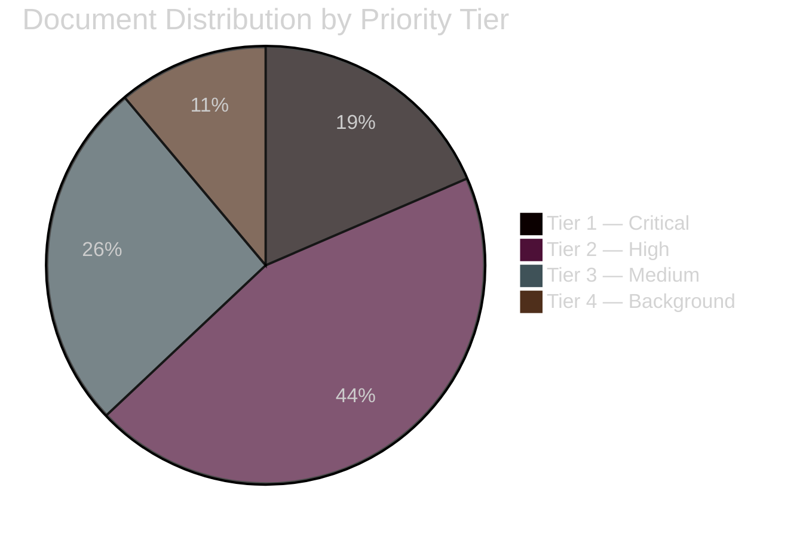

# Classification Results — Monthly Review April 2026

**Analyst**: James Pether Sörling | **Date**: 2026-04-23
**Framework**: 7-dimension political classification
**Confidence**: HIGH [A1]

---

## 7-Dimension Classification

### Dimension 1: Ideological Alignment

| Document | Ideological alignment | Party | Notes |
|----------|----------------------|-------|-------|
| HD03235 (criminal deportation) | Far-right enforcement | SD/M | Tidöavtalet delivery |
| HD03236 (fuel tax relief) | Centre-right populist | M/SD/KD/L | Cross-coalition; S also voted yes |
| UFöU3 (NATO Finland) | Cross-spectrum national security | All parties except historic opposition | Sweden's NATO post-accession commitment |
| HD03240 (electricity laws) | Centre-right + market liberal | M/KD/L/C | EU compliance-driven |
| SfU18 (social insurance) | Centre-left opposition | S/V/MP/C | 39 reservations against government |
| HD03231 (Ukraine tribunal) | Liberal international order | Broad coalition | Human rights, rule of law |

### Dimension 2: Policy Domain

| Domain | Key documents | Priority tier |
|--------|---------------|---------------|
| Fiscal/Economic | HD03100, HD0399, HD03236 | Tier 1 — Critical |
| Defence/Security | UFöU3, HD03214, HD03228 | Tier 1 — Critical |
| Energy/Climate | HD03240, HD03238, HD03239, HD03242 | Tier 2 — High |
| Healthcare/Social | SfU18, SoU16, SoU17, HD03216, HD03245 | Tier 2 — High |
| Criminal Justice | HD03235, HD03237, HD03246 | Tier 2 — High |
| Foreign Affairs | HD03231, HD03232 | Tier 3 — Medium |
| Digital/Infrastructure | HD01TU21, HD01TU17 | Tier 3 — Medium |

### Dimension 3: Political Salience (Election 2026)

| Document | Electoral salience | Notes |
|----------|--------------------|-------|
| HD01FiU48 | VERY HIGH | Household energy relief directly before election |
| HD03100 | VERY HIGH | Government economic narrative |
| SfU18+SoU16+17 | VERY HIGH | Opposition's primary attack vector |
| HD03235 | HIGH | SD flagship + ECHR risk |
| UFöU3 | MEDIUM | Cross-party consensus, not divisive |
| HD03240 | MEDIUM | Technical but structurally important |

### Dimension 4: Constitutional Sensitivity

| Document | Constitutional sensitivity | Notes |
|----------|---------------------------|-------|
| HD01KU32 (media accessibility) | HIGH — constitutional amendment | Vilande; requires re-approval after election |
| HD01KU33 (search/seizure digital) | HIGH — constitutional amendment | Vilande; same process |
| HD03235 | HIGH | ECHR proportionality challenge |
| HD10429 | MEDIUM | Demonstration rights (fundamental freedom) |

### Dimension 5: International Dimension

| Document | International dimension | Treaty/agreement |
|----------|------------------------|-----------------|
| UFöU3 | HIGH | NATO Article 5; bilateral Finland agreement |
| HD03228 | HIGH | Arms export/SIPRI/EU regulation |
| HD03231 | HIGH | International Criminal Court cooperation |
| HD03232 | HIGH | UN reparations principles |
| HD03214 | MEDIUM | EU NIS2 directive implementation |
| HD03240 | MEDIUM | EU electricity market directive |

### Dimension 6: Urgency/Timeline

| Document | Urgency | Deadline |
|----------|---------|---------|
| HD01FiU48 | CRITICAL | Enacted April 22 — immediate effect May 2026 |
| UFöU3 | HIGH | Decision June 4 2026 |
| HD01KU32 | HIGH | Pre-election constitutional requirement |
| HD03235 | MEDIUM | Enactment summer 2026 |
| HD03240 | MEDIUM | Implementation autumn 2026 |

### Dimension 7: Data Classification (GDPR Art. 9)

| Data type | Legal basis | Risk level |
|-----------|------------|------------|
| Voting records (named MPs) | Art. 9(2)(e) publicly made | LOW |
| Party affiliations | Art. 9(2)(e) publicly made | LOW |
| Political opinions (analysis) | Art. 9(2)(g) substantial public interest | MEDIUM |
| Individual MPs' statements | Art. 9(2)(e) publicly made | LOW |

---

## Priority Tier Summary

