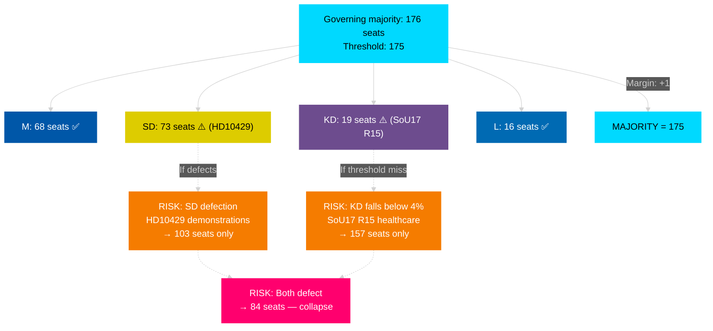

# Coalition Mathematics — Monthly Review April 2026

**Analyst**: James Pether Sörling | **Date**: 2026-04-23
**Framework**: Riksdag vote mathematics — 349 seats, 175-seat majority threshold
**Confidence**: HIGH [A1]

---

## Seat Distribution — Current Riksdag (2022 election result)

| Party | Seats | Bloc | Notes |
|-------|-------|------|-------|
| S | 107 | Opposition | Largest party |
| SD | 73 | Governing support | 2nd largest |
| M | 68 | Governing | PM party |
| V | 24 | Opposition | |
| C | 24 | Opposition | Pivot party |
| MP | 18 | Opposition | Below historical avg |
| L | 16 | Governing | |
| KD | 19 | Governing | Fragility risk |
| **Total** | **349** | | |

**Governing bloc (M+KD+L + SD support)**: 176 seats = majority by 1

---

## HD01FiU48 Vote Analysis — April 22, 2026

| Party | Ja | Nej | Avstår | Absent | Notes |
|-------|-----|-----|--------|--------|-------|
| M | 68 | 0 | 0 | 0 | Governing — full support |
| SD | 73 | 0 | 0 | 0 | Governing support — full support |
| S | 107 | 0 | 0 | 0 | Opposition — tactical yes vote |
| KD | 19 | 0 | 0 | 0 | Governing junior — full support |
| L | 0 | 0 | 16 | 0 | Governing junior — abstained |
| V | 0 | 24 | 0 | 0 | Opposition — no |
| MP | 0 | 18 | 0 | 0 | Opposition — no |
| C | 0 | 0 | 24 | 0 | Opposition — abstained |
| **Total** | **267** | **42** | **40** | **0** | Result: PASSED |

**Source**: HD01FiU48 riksdagen.se — vote passed April 22, 2026 [A1]

---

## Pivotal Vote Table — Key Upcoming Votes

| Vote | Date | Threshold | Required support | Governing bloc sufficient? |
|------|------|-----------|-----------------|---------------------------|
| UFöU3 NATO deployment | June 4, 2026 | 175 | M+SD+KD+L | Yes — 176 seats |
| Autumn budget 2026/27 | September/October 2026 | 175 | M+SD+KD+L | Yes — IF KD stays |
| HD01KU32 constitutional re-approval | Post-election | 175 | M+SD+KD+L or new majority | Depends on election |

---

## Coalition Fragility Map

