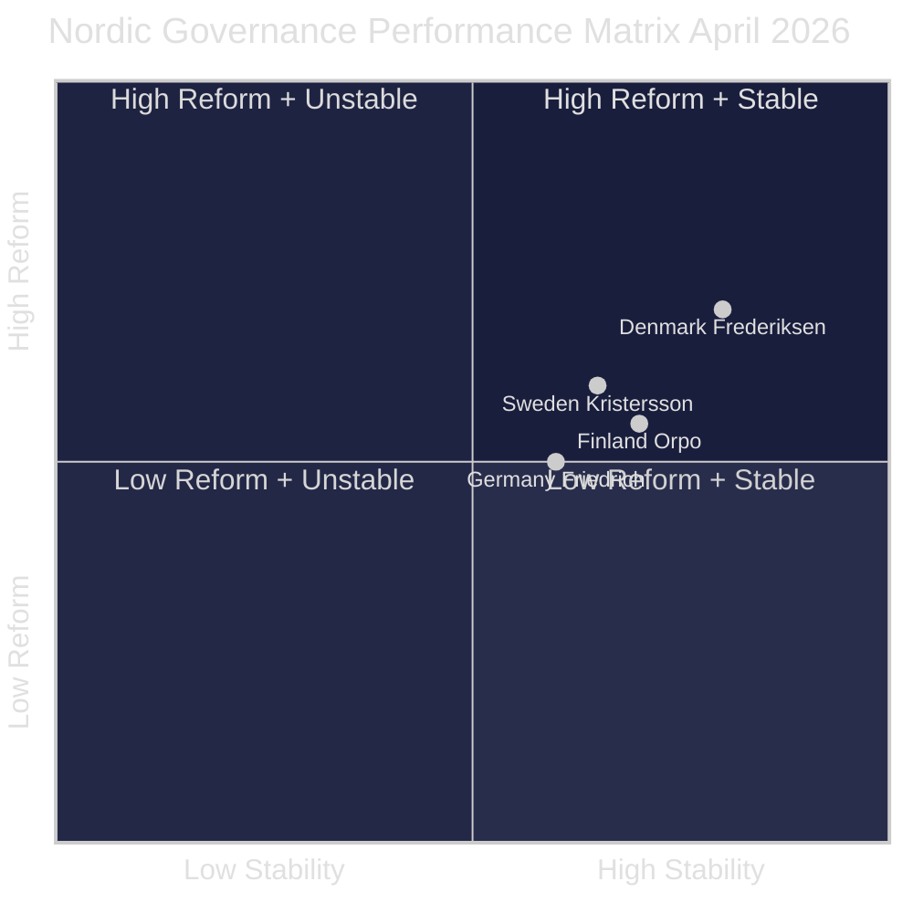

# Comparative International Analysis — Monthly Review April 2026

**Analyst**: James Pether Sörling | **Date**: 2026-04-23
**Framework**: Nordic + EU comparator analysis
**Confidence**: MEDIUM [B2]

---

## Comparator 1: Finland — Coalition Stability Under Security Pressure

### Parallels to Sweden 2026

Finland's Orpo government (2023-present) has maintained a right-wing coalition (KOK+PS+SFP+KD) under similar pressures: immigration restrictive policies, welfare-state opposition criticism, and enhanced NATO commitments. Key parallels:

| Dimension | Finland (2024–25) | Sweden (2026) |
|-----------|------------------|---------------|
| NATO commitment | eFP host nation — pre-deployment troops | UFöU3 authorises 1,200 troops to Finland |
| Immigration restriction | Welfare receipt restrictions for asylum seekers | HD03235 criminal deportation |
| Fiscal consolidation | Orpo's austerity package — social cuts | HD03100 spring fiscal package |
| Right-wing fracture | PS vs. KOK on some civil liberties | SD vs. M on demonstrations (HD10429) |
| Healthcare debate | Opposition criticises social cuts | 77 reservations on SfU18/SoU16/SoU17 |

**Lesson**: Finland's Orpo government maintained coalition despite similar fractures. Sweden's coalition fractures (HD10429, SoU17 R15) are structurally comparable — not yet destabilising.

**Evidence**: World Bank Finland GDP data + Nordic Council comparative reports + UFöU3 bilateral agreement

---

## Comparator 2: Germany — Bundestag Post-2025 Coalition Math

### Parallels to Sweden 2026

Germany's CDU/CSU-SPD grand coalition (2025-present) represents a model of pragmatic cross-aisle cooperation on energy and security. Relevant to Sweden's HD01FiU48 passage (S voted yes with government on energy relief):

| Dimension | Germany (2025) | Sweden (2026) |
|-----------|---------------|---------------|
| Energy crisis relief | Bundestag passed household energy relief package | HD01FiU48 fuel tax relief 82 öre/l |
| Cross-bloc cooperation | CDU+SPD on fiscal matters | M+SD+S+KD on FiU48 |
| Defence spending | NATO 2% commitment — Bundeswehr | UFöU3 NATO deployment |
| Crime/deportation | Asylum law tightening — CDU flagship | HD03235 criminal deportation |
| Constitutional sensitivity | EU Charter proportionality challenges | ECHR proportionality challenge on HD03235 |

**Lesson**: Germany's experience shows cross-party energy cooperation is possible without triggering opposition collapse — S's tactical FiU48 vote mirrors SPD's flexibility in grand coalition.

**Evidence**: Bundestag.de energy package records + World Bank Germany GDP 1.1% (2025)

---

## Comparator 3: Denmark — Mette Frederiksen's Welfare-Security Synthesis

### Parallels to Sweden 2026

Denmark's SVM-government (S+V+M) under Frederiksen demonstrates that a social-democratic party can govern with right-wing support while maintaining welfare credibility:

| Dimension | Denmark (2023-26) | Sweden (2026) |
|-----------|------------------|---------------|
| Welfare + immigration balance | Strict immigration + generous welfare narrative | S opposition vs. HD03235 |
| Cross-bloc fiscal | S voted with V+M on fiscal matters | S voted for HD01FiU48 |
| NATO commitment | 100% NATO supportive | UFöU3 broad support |
| Healthcare narrative | Government proactively funded healthcare | Sweden: SoU17 R15 fracture — government vulnerable |

**Lesson**: S's tactical FiU48 vote may be part of broader "responsible opposition" strategy — mimicking Danish Frederiksen model to appeal to centrist voters. Healthcare investment gap is Sweden's key differentiation point.

**Evidence**: Danish Folketing records + OECD Social Expenditure Database

---

## Summary Assessment

**Conclusion**: Sweden's coalition stability is on par with Finland's comparable right-wing government. The key vulnerability relative to Denmark is healthcare investment — the dimension where S can differentiate.

