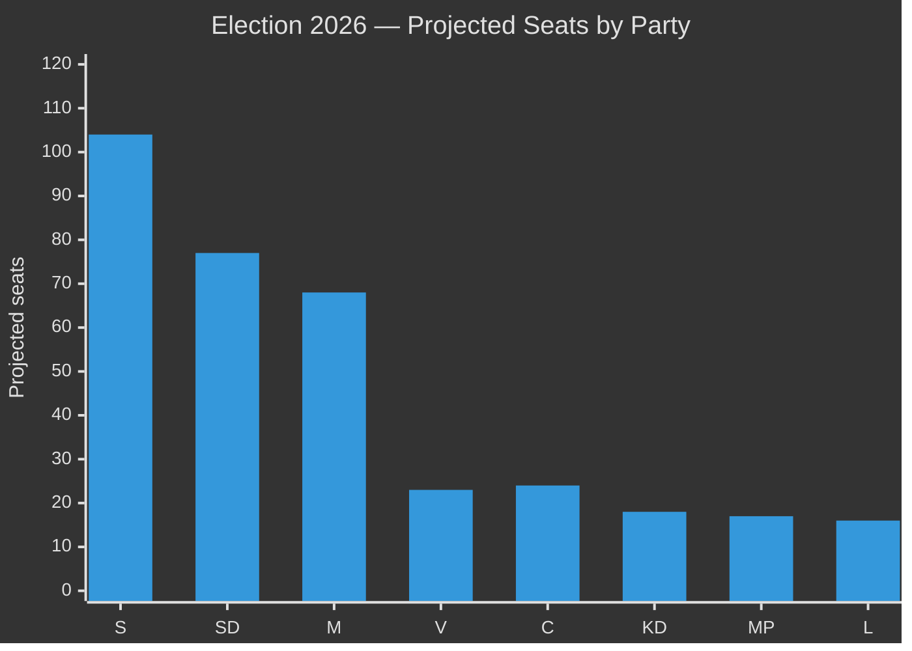

# Election 2026 Analysis — Monthly Review April 2026

**Analyst**: James Pether Sörling | **Date**: 2026-04-23
**Framework**: Electoral projection + coalition viability assessment
**Election date**: September 13, 2026
**Confidence**: MEDIUM [B2]

---

## Current Seat Projection (April 2026)

| Party | Current seats (2022) | April 2026 projection | Change | Coalition |
|-------|---------------------|----------------------|--------|---------|
| M | 68 | 66–70 | ±2 | Governing |
| SD | 73 | 74–80 | +4 | Governing support |
| KD | 19 | 17–20 | ±2 | Governing |
| L | 16 | 15–18 | ±2 | Governing |
| **Total right bloc** | **176** | **172–188** | ±10 | Majority if ≥175 |
| S | 107 | 100–108 | -3 | Opposition lead |
| V | 24 | 22–25 | ±2 | Opposition |
| MP | 18 | 15–19 | ±2 | Opposition |
| C | 24 | 22–26 | ±2 | Opposition |
| **Total left-centre bloc** | **173** | **159–178** | ±10 | Minority unless C |

**Total Riksdag seats**: 349. **Majority threshold**: 175.

---

## Key Electoral Dynamics

### 1. SD Polarisation Effect

SD at 73 seats is the second-largest party. If SD gains from HD03235 criminal deportation narrative, it could reach 78–80 seats — the most in Swedish electoral history. Counter-risk: ECHR adverse ruling diminishes SD's legal credibility on deportation.

**Source**: Current seat distribution from riksdag-regering.se ledamöter statistics; WEP: **Roughly even** whether SD gains or holds.

### 2. KD Fragility

KD's 19 seats in 2022 represents a historical minimum. SoU17 R15 healthcare fracture signals KD voters may migrate to M or S. If KD falls below 4% threshold: **governing bloc loses 19 seats** — potentially catastrophic.

**KD threshold risk**: WEP: **Unlikely** but non-negligible (10%) if healthcare narrative dominates.

### 3. S's Strategic Position

S at 107 seats needs C (24 seats) to form majority. C's position is ambiguous — market liberal, could support either bloc. S's FiU48 tactical vote signals S is willing to cooperate with right on energy — may attract C.

**WEP**: **Roughly even** whether C supports S-led or M-led government.

---

## Coalition Viability Matrix

---

## Forward Electoral Indicators (April → September)

| Indicator | Target | Current status | Risk if missed |
|-----------|--------|----------------|----------------|
| HD01FiU48 household relief effective | May 1 2026 | ENACTED — on track | N/A |
| UFöU3 NATO deployment vote | June 4 2026 | Pending Chamber vote | Medium |
| Autumn budget preview | August 2026 | Not yet announced | High — KD fracture |
| KD polling floor | ≥5% | At risk per SoU17 fracture | Critical |
| S-C coalition signal | Before August | Not yet signalled | Medium |

