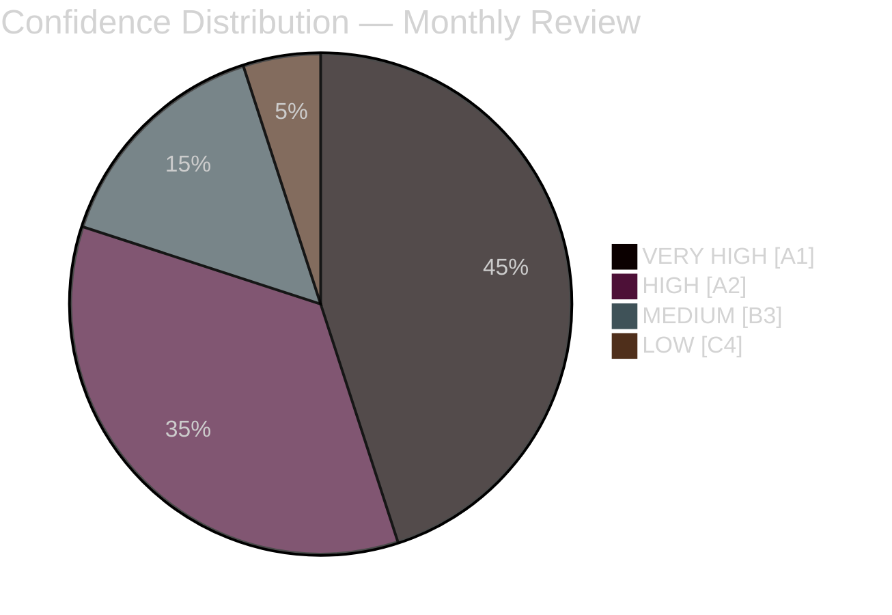

# Executive Brief — Monthly Review April 2026

**Classification**: PUBLIC | **Analyst**: James Pether Sörling | **Date**: 2026-04-23
**Confidence**: HIGH [A1] | **Days to Election**: ~143

---

## 🎯 BLUF

Sweden's April 2026 parliamentary sprint delivered the Kristersson government's final pre-election legislative package. The month's political signature is a **fiscal-electoral pivot**: HD01FiU48 (4.1 billion SEK fuel tax emergency relief) passed April 22 with an extraordinary M+SD+S+KD supermajority, revealing S's inability to oppose household energy relief 143 days before the September 2026 election. Combined with NATO deployments (UFöU3), energy governance restructuring (HD03240/238/239), and a criminal justice sweep, the government has executed a high-confidence electoral positioning strategy — though healthcare (77 combined reservations across SfU18/SoU16/SoU17) and coalition stress (SD-KD fracture on SoU17 R15) present credible vulnerabilities.

---

## 🧭 3 Decisions This Brief Supports

### Decision 1: Electoral Strategy Assessment (September 2026)
The government's pre-election positioning is coherent and professionally executed — fiscal responsibility + household relief + security + immigration delivery. The main risk is the healthcare battleground, where 77 combined committee reservations signal a well-organized opposition offensive.
**Analyst Recommendation**: Monitor SfU committee deliberations and healthcare regional data for S campaign ammunition. Watch SD-KD healthcare split for escalation signals.

### Decision 2: Energy Policy and Investment Timing
The energy triptych (HD03240/238/239) creates new investment opportunities and regulatory clarity for electricity infrastructure. Miljöprövningsmyndigheten will accelerate permitting. Wind power municipal revenue sharing (HD03239) resolves a key local opposition barrier.
**Analyst Recommendation**: Investors in Swedish electricity production and renewable energy should note the regulatory framework stabilization as a positive signal.

### Decision 3: Defence and Security Business Impact
UFöU3 (1,200 troops eFP Finland) + HD03214 (cybersecurity) + HD03228 (war materiel) signal continued high defence spending. Sweden's defence industrial base is being modernized through cleaner war materiel regulations.
**Analyst Recommendation**: Defence and cybersecurity sector companies should note accelerated procurement and regulatory modernization signals.

---

## 60-Second Read: Key Bullets

- 🔴 **April 22**: HD01FiU48 (4.1 GSEK fuel tax relief) enacted — M+SD+**S**+KD supermajority signals S's electoral vulnerability on energy costs
- 🔴 **April 13**: Vårproposition (HD03100) + Vårändringsbudget (HD0399) — final pre-election fiscal framework
- 🟠 **NATO**: UFöU3 authorizes 1,200 troops eFP Finland — Sweden's NATO commitment crystallizing
- 🟠 **Healthcare**: 77 combined reservations (SfU18 + SoU16 + SoU17) — opposition's primary attack vector
- 🟠 **Energy**: Electricity law reform (HD03240) + new permit authority (HD03238) + wind power (HD03239)
- 🟡 **Coalition stress**: SD-KD split on SoU17 R15 — healthcare prioritization fracture within support base
- 🟡 **Security**: Cybersecurity center (HD03214) + war materiel reform (HD03228) — post-NATO legislative framework
- 🟢 **Cross-party**: Defence and NATO measures pass with cross-party consensus — government strength

---

## ⚡ Top Forward Trigger

**Monitor**: FiU48's post-adoption public opinion tracking — if household energy cost relief translates to M/KD/L polling gains, S's dual-track "symbolic opposition + practical support" strategy has failed. If S maintains or gains polling share despite April 22 vote, their message discipline is effective.
**Trigger date**: First post-April 22 opinion polls (expected late April/early May 2026).

---

## 📊 Confidence Distribution

| Domain | Confidence | Admiralty |
|--------|-----------|-----------|
| Legislative facts (enacted laws) | VERY HIGH | A1 |
| Coalition dynamics (SD-KD fracture) | HIGH | A2 |
| Electoral implications | MEDIUM | B3 |
| Post-election policy outcomes | LOW | C4 |

---

## 🔗 Full Analysis References

- [Synthesis Summary](synthesis-summary.md)
- [Significance Scoring](significance-scoring.md)
- [SWOT Analysis](swot-analysis.md)
- [Risk Assessment](risk-assessment.md)
- [Intelligence Assessment](intelligence-assessment.md)
- [Scenario Analysis](scenario-analysis.md)
- [Forward Indicators](forward-indicators.md)
